<div align="center">
 

# UNIVERSIDAD PERUANA DE CIENCIAS APLICADAS
**Facultad de Ingeniería**  
***Carrera de Ingeniería de Software***  
*5to ciclo*  
**1ASI0729**  
**Desarrollo de Aplicaciones Open Source**  
NRC: 7753  
Docente: Bautista Ubillús, Efrain Ricardo
## **"Informe del Trabajo Final"**
#### *InnovaCorp*
#### *Reliant*

**Integrantes**

| Código     | Apellidos         | Nombres          |
|------------|-------------------|------------------| 
| u20241b962 | Navarro Aldoradin | Carolina Celeste |
| u20241f577 | Rivera Aguilar    | Scarlet Josefina |
|            |                   |                  |
|            |                   |                  |
|            |                   |                  |


*Setiembre, 2026*

</div>


<div style="page-break-after: always"></div>

# Registro de Versiones del Informe
| Versión | Fecha | Autor | Descripción de modificación |
|---------|-------|-------|-----------------------------|
|         |       |       |                             |


# Project Report Collaboration Insights

El URL del repositorio para el Project Report en la organización de github es el siguiente:
[https://github.com/upc-pre-202620-1asi0729-7753-innovacorp/reliant-report](https://github.com/upc-pre-202620-1asi0729-7753-innovacorp/reliant-report)

# Contenido
- [Registro de Versiones del Informe](#registro-de-versiones-del-informe)
- [Project Report Collaboration Insights](#project-report-collaboration-insights)
- [Contenido](#contenido)
- [Student Outcome](#student-outcome)
- [Capítulo I: Introducción](#capítulo-i-introducción)
- [1.1. Startup Profile](#11-startup-profile)
- [1.1.1. Descripción de la Startup](#111-descripción-de-la-startup)
- [1.1.2. Perfiles de integrantes del equipo](#112-perfiles-de-integrantes-del-equipo)
- [1.2. Solution Profile](#12-solution-profile)
- [1.2.1 Antecedentes y problemática](#121-antecedentes-y-problemática)
- [1.2.2 Lean UX Process.](#122-lean-ux-process)
- [1.2.2.1. Lean UX Problem Statements.](#1221-lean-ux-problem-statements)
- [1.2.2.2. Lean UX Assumptions.](#1222-lean-ux-assumptions)
- [1.2.2.3. Lean UX Hypothesis Statements.](#1223-lean-ux-hypothesis-statements)
- [1.2.2.4. Lean UX Canvas.](#1224-lean-ux-canvas)
- [1.3. Segmentos objetivo.](#13-segmentos-objetivo)

- [Capítulo II: Requirements Elicitation & Analysis](#capítulo-ii-requirements-elicitation--analysis)
- [2.1. Competidores.](#21-competidores)
- [2.1.1. Análisis competitivo.](#211-análisis-competitivo)
- [2.1.2. Estrategias y tácticas frente a competidores.](#212-estrategias-y-tácticas-frente-a-competidores)
- [2.2. Entrevistas.](#22-entrevistas)
- [2.2.1. Diseño de entrevistas.](#221-diseño-de-entrevistas)
- [2.2.2. Registro de entrevistas.](#222-registro-de-entrevistas)
- [2.2.3. Análisis de entrevistas.](#223-análisis-de-entrevistas)
- [2.3. Needfinding.](#23-needfinding)
- [2.3.1. User Personas.](#231-user-personas)
- [2.3.2. User Task Matrix.](#232-user-task-matrix)
- [2.3.3. User Journey Mapping.](#233-user-journey-mapping)
- [2.3.4. Empathy Mapping.](#234-empathy-mapping)
- [2.4. Big Picture Event Storming.](#24-big-picture-event-storming)
- [2.5. Ubiquitous Language.](#25-ubiquitous-language)

- [Capítulo III: Requirements Specification](#capítulo-iii-requirements-specification)
- [3.1. User Stories.](#31-user-stories)
- [3.2. Impact Mapping.](#32-impact-mapping)
- [3.3. Product Backlog](#33-product-backlog)

- [Capítulo IV: Product Design](#capítulo-iv-product-design)
- [4.1. Style Guidelines.](#41-style-guidelines)
- [4.1.1. General Style Guidelines.](#411-general-style-guidelines)
- [4.1.2. Web Style Guidelines.](#412-web-style-guidelines)
- [4.2. Information Architecture.](#42-information-architecture)
- [4.2.1. Organization Systems. ](#421-organization-systems)
- [4.2.2. Labeling Systems.](#422-labeling-systems)
- [4.2.3. SEO Tags and Meta Tags](#423-seo-tags-and-meta-tags)
- [4.2.4. Searching Systems.](#424-searching-systems)
- [4.2.5. Navigation Systems.](#425-navigation-systems)
- [4.3. Landing Page UI Design.](#43-landing-page-ui-design)
- [4.3.1. Landing Page Wireframe.](#431-landing-page-wireframe)
- [4.3.2. Landing Page Mock-up.](#432-landing-page-mock-up)
- [4.4. Web Applications UX/UI Design.](#44-web-applications-uxui-design)
- [4.4.1. Web Applications Wireframes.](#441-web-applications-wireframes)
- [4.4.2. Web Applications Wireflow Diagrams.](#442-web-applications-wireflow-diagrams)
- [4.4.2. Web Applications Mock-ups.](#442-web-applications-mock-ups)
- [4.4.3. Web Applications User Flow Diagrams.](#443-web-applications-user-flow-diagrams)
- [4.5. Web Applications Prototyping.](#45-web-applications-prototyping)
- [4.6. Domain-Driven Software Architecture.](#46-domain-driven-software-architecture)
- [4.6.1. Design-Level Event Storming.](#461-design-level-event-storming)
- [4.6.2. Software Architecture Context Diagram.](#462-software-architecture-context-diagram)
- [4.6.3. Software Architecture Container Diagrams.](#463-software-architecture-container-diagrams)
- [4.6.4. Software Architecture Components Diagrams.](#464-software-architecture-components-diagrams)
- [4.7. Software Object-Oriented Design.](#47-software-object-oriented-design)
- [4.7.1. Class Diagrams.](#471-class-diagrams)
- [4.8. Database Design.](#48-database-design)
- [4.8.1. Database Diagrams.](#481-database-diagrams)
- [Capítulo V: Product Implementation, Validation & Deployment](#capítulo-v-product-implementation-validation--deployment)
- [5.1. Software Configuration Management.](#51-software-configuration-management)
- [5.1.1. Software Development Environment Configuration.](#511-software-development-environment-configuration)
- [5.1.2. Source Code Management.](#512-source-code-management)
- [5.1.3. Source Code Style Guide & Conventions.](#513-source-code-style-guide--conventions)
- [5.1.4. Software Deployment Configuration.](#514-software-deployment-configuration)
- [5.2. Landing Page, Services & Applications Implementation.](#52-landing-page-services--applications-implementation)
- [5.2.X. Sprint n](#52x-sprint-n)
- [5.2.X.1. Sprint Planning n.](#52x1-sprint-planning-n)
- [5.2.X.2. Aspect Leaders and Collaborators.](#52x2-aspect-leaders-and-collaborators)
- [5.2.X.3. Sprint Backlog n.](#52x3-sprint-backlog-n)
- [5.2.X.4. Development Evidence for Sprint Review.](#52x4-development-evidence-for-sprint-review)
- [5.2.X.5. Execution Evidence for Sprint Review.](#52x5-execution-evidence-for-sprint-review)
- [5.2.X.6. Services Documentation Evidence for Sprint Review.](#52x6-services-documentation-evidence-for-sprint-review)
- [5.2.X.7. Software Deployment Evidence for Sprint Review.](#52x7-software-deployment-evidence-for-sprint-review)
- [5.2.X.8. Team Collaboration Insights during Sprint.](#52x8-team-collaboration-insights-during-sprint)
- [5.3. Validation Interviews.](#53-validation-interviews)
- [5.3.1. Diseño de Entrevistas.](#531-diseño-de-entrevistas)
- [5.3.2. Registro de Entrevistas.](#532-registro-de-entrevistas)
- [5.3.3. Evaluaciones según heurísticas.](#533-evaluaciones-según-heurísticas)
- [5.4. Video About-the-Product.](#54-video-about-the-product)
- [Conclusiones](#conclusiones)
- [Conclusiones y recomendaciones.](#conclusiones-y-recomendaciones)
- [Video About-the-Team.](#video-about-the-team)
- [Bibliografía](#bibliografía)
- [Anexos](#anexos)


# Student Outcome

El curso contribuye al cumplimiento del Student Outcome ABET: ABET – EAC - Student Outcome 5 Criterio: La capacidad de funcionar efectivamente en un equipo cuyos miembros juntos proporcionan liderazgo, crean un entorno de colaboración e inclusivo, establecen objetivos, planifican tareas y cumplen objetivos. En el siguiente cuadro se describe las acciones realizadas y enunciados de conclusiones por parte del grupo, que permiten sustentar el haber alcanzado el logro del ABET – EAC - Student Outcome 5.

| Criterio específico                                                                             | Acciones realizadas | Conclusiones |
|:-----------------------------------------------------------------------------------------------:|:-------------------:|:------------:|
| Trabaja en equipo para proporcionar liderazgo en forma conjunta                                 |                     |              |
| Crea un entorno colaborativo e inclusivo, establece metas, planifica tareas y cumple objetivos. |                     |              |


# Capítulo I: Introducción
## 1.1. Startup Profile
### 1.1.1. Descripción de la Startup
**InnovaCorp** es una startup tecnológica peruana enfocada en resolver problemas de grandes organizaciones, especialmente del sector Minero e Industrial, de manera ágil e innovadora. Nace de la experiencia directa en planta, donde identificamos que procesos críticos de alta especialización siguen operando con información dispersa, registros manuales y diagnósticos que dependen del conocimiento tácito de pocas personas. Combinamos conocimiento de procesos industriales con desarrollo de software moderno para convertir datos que hoy se pierden en decisiones que evitan fallas y paradas no programadas.

*Misión*
Nuestra misión es brindar a las empresas del sector minero e industrial soluciones tecnológicas que transformen los datos de sus procesos productivos en información accionable, permitiéndoles anticipar fallas, garantizar la trazabilidad de sus operaciones y sostener con evidencia la calidad que sus clientes exigen. Buscamos que ninguna organización dependa del conocimiento tácito ni de registros manuales para tomar decisiones críticas sobre sus procesos.

*Visión*
Ser la plataforma de referencia en Latinoamérica para el monitoreo y la trazabilidad de procesos industriales de alta especialización, reconocida por acercar la analítica de datos a operaciones que históricamente han quedado fuera de la transformación digital, y por convertir cada proceso ejecutado en conocimiento que mejora el siguiente.


### 1.1.2. Perfiles de integrantes del equipo
| Foto de participante                                                    | Nombres y apellidos                | Código de estudiante  | Descripción de carrera                                            | Principales conocimiento técnicos y habilidades                                                                                                                                           |
|:------------------------------------------------------------------------|------------------------------------|-----------------------|-------------------------------------------------------------------|-------------------------------------------------------------------------------------------------------------------------------------------------------------------------------------------|
|   | Carolina Celeste Navarro Aldoradin | u20241b962            | Ingeniería de Software, Universidad Peruana de Ciencias Aplicadas | Cuento con conocimiento del lenguaje Java, C#, C++, Javascript, Python y Ladder. Asimismo, cuento con experiencia en proyectos de integración, monitoreo e IoT en entornos industriales.  |
|  | Scarlet Josefina Rivera Aguilar    | u20241f577            | Ingeniería de Software, Universidad Peruana de Ciencias Aplicadas | Durante mi formación en Ingeniería de Software, actualmente en quinto ciclo, he desarrollado conocimientos en distintos lenguajes de programación, organización y planificación de proyectos. Asimismo, he participado en proyectos académicos relacionados con el desarrollo de aplicaciones web, diseño de interfaces y elaboración de prototipos. |

## 1.2. Solution Profile

### 1.2.1 Antecedentes y problemática
La minería constituye el principal motor exportador de la economía peruana. Según el Boletín Estadístico Minero del Ministerio de Energía y Minas, las exportaciones de productos mineros totalizaron US$ 62,848 millones durante 2025, un crecimiento de 27.2 % respecto al año anterior, y representaron alrededor del 67.5 % del valor total exportado por el país. Esta magnitud implica que cualquier interrupción en la cadena de operación minera tiene un impacto directo sobre la economía nacional.

Para sostener esa operación, las mineras dependen de componentes sometidos a desgaste abrasivo severo: ejes de bombas de lodo, rodillos, válvulas e impulsores. Una de las tecnologías más empleadas para extender la vida útil de estas piezas es el recubrimiento por proyección térmica de alta velocidad (HVOF, High Velocity Oxygen Fuel), que deposita capas metálicas de alta densidad y resistencia al desgaste. En el Perú, este servicio no lo ejecuta la minera directamente, sino empresas especializadas que operan como proveedores del sector.

La calidad del recubrimiento depende críticamente de los parámetros de proceso. Khan, Shah y Shamim (2019) establecieron que la calidad del recubrimiento HVOF depende en gran medida de las condiciones operativas seleccionadas durante la aplicación, y estudios posteriores confirman que variables como la tasa de alimentación de polvo, la distancia de proyección, la relación combustible-oxígeno y el flujo total de gases inciden directamente sobre propiedades clave como porosidad, dureza y resistencia al desgaste. Fabricantes de equipos advierten que estas variables deben tratarse como parámetros de proceso con valores y tolerancias formalmente definidos, ya que sin ese control la calidad del recubrimiento puede verse afectada de formas inesperadas y costosas.

Pese a ello, el monitoreo en tiempo real del proceso sigue siendo un desafío técnico. Malamousi, Delibasis y Kamnis (2024) señalan que la proyección térmica es difícil de monitorear en tiempo real debido a las altas velocidades y temperaturas involucradas y al movimiento continuo de la pistola o de la pieza, y que los equipos de monitoreo estáticos existentes no logran seguir la antorcha, lo que dificulta asegurar parámetros óptimos de proceso. En paralelo, la literatura reciente sobre Industria 4.0 aplicada a proyección térmica plantea la necesidad de implementar un control de proceso más inteligente que integre datos de sensores con parámetros de máquina, características del material de aporte y métricas de calidad posteriores a la deposición, para cumplir requisitos de confiabilidad y repetibilidad.

En el contexto peruano, los proveedores de recuperación y sus clientes mineros enfrentan cuatro problemas concurrentes.

Primero, pérdida de trazabilidad del proceso. Los parámetros de operación se generan en el PLC de la máquina, pero se conservan en registros locales o en formatos no consultables. Cuando el cliente exige evidencia de que un lote fue recubierto dentro de tolerancias, la empresa carece de un respaldo estructurado que vincule la orden de fabricación (OF) y la orden de trabajo (WO) con las condiciones reales de la sesión de rociado. Esta dependencia de registros dispersos es un problema documentado en la industria: los procesos basados en papel introducen riesgos de lectura errónea, registro inconsistente e información fragmentada, que retrasan la detección y resolución de incidencias.

Segundo, diagnóstico de fallas dependiente de conocimiento tácito. Cuando el equipo se detiene por una falla, como bloqueo del alimentador, sobrepresión de tolva, paro por temporizador, la identificación de la causa raíz depende de la experiencia de pocos técnicos y de la revisión manual de registros crudos. No existe un mecanismo que correlacione automáticamente la falla con el subsistema o parte del sistema HVOF responsable, lo que prolonga el tiempo de diagnóstico y dificulta detectar patrones recurrentes.

Tercero, imposibilidad de análisis retrospectivo contra el PCR. Las piezas recubiertas se entregan con una expectativa de vida útil formalizada en el Planned Component Replacement (PCR). Cuando una pieza retorna del campo antes de alcanzar ese objetivo, no es posible reconstruir con qué parámetros fue recubierta ni determinar si la falla prematura tuvo origen en el proceso de recubrimiento, en el material, o en las condiciones de operación en mina.

Cuarto, ausencia de una vista consolidada del desempeño de los componentes recuperados. Una empresa minera trabaja con varios proveedores de recuperación y recibe de cada uno la evidencia en su propio formato. No dispone de un medio para comparar, con datos, qué proveedor entrega componentes que alcanzan su PCR con mayor frecuencia, ni para registrar de forma estructurada el retorno de campo de cada pieza. Como resultado, las decisiones de renovación o cambio de proveedor se sustentan en percepción y no en evidencia, y el conocimiento sobre el desempeño real de los componentes se dispersa entre hojas de cálculo y correos.

El costo de esta brecha de información es significativo. El reporte True Cost of Downtime de Siemens estima que las 500 mayores empresas del mundo pierden alrededor del 11 % de sus ingresos por paradas no planificadas, equivalente a USD 1.4 billones anuales, y la falla de componentes críticos representa el 45 % de los casos reportados de downtime. En el sector minero específicamente, estimaciones de la industria sitúan el costo promedio de una parada de equipo en torno a US$ 180,000 por incidente.

En síntesis, existe una desconexión entre los datos que la máquina HVOF ya genera y la capacidad de la organización para convertirlos en trazabilidad verificable, diagnóstico oportuno y aprendizaje sobre el desempeño en campo. Reliant se propone cerrar esa brecha mediante una plataforma que capture la telemetría del proceso, la vincule a la orden de trabajo y a la pieza del cliente, con el subsistema o parte del sistema HVOF implicado, y ofrezca al propietario del activo una vista consolidada del cumplimiento de PCR por proveedor, modelo y tipo de componente.

A continuación, se muestra un árbol de problemas que ordena visualmente las causas y efectos del problema mencionados anteriormente.

```mermaid
flowchart BT

classDef efectoFinal fill:#C62828,stroke:#8E0000,stroke-width:2px,color:#FFFFFF
classDef efectoDirecto fill:#EF9A9A,stroke:#C62828,stroke-width:1px,color:#000000
classDef central fill:#FFB300,stroke:#E65100,stroke-width:3px,color:#000000
classDef causaDirecta fill:#90CAF9,stroke:#1565C0,stroke-width:1px,color:#000000
classDef causaRaiz fill:#C8E6C9,stroke:#2E7D32,stroke-width:1px,color:#000000

PC["<b>PROBLEMA CENTRAL</b><br/><br/>Las empresas de servicio de recubrimiento HVOF<br/>no logran convertir los datos que genera el proceso<br/>en trazabilidad verificable, diagnostico oportuno<br/>ni aprendizaje sobre el desempeno en campo"]

CR1["La telemetria del PLC se guarda<br/>en archivos locales no consultables"]
CR2["No existe vinculo entre el dato de proceso<br/>y la OF / WO / cliente / modelo"]
CR3["El registro de la sesion de rociado<br/>se lleva de forma manual o en papel"]

CR4["No hay catalogo formal de reglas<br/>causa-efecto para las fallas"]
CR5["La falla no se correlaciona<br/>con el subsistema o parte del sistema HVOF responsable"]
CR6["El diagnostico exige revision manual<br/>de logs crudos del PLC"]

CR7["El PCR comprometido no se registra<br/>de forma digital ni consultable"]
CR8["El retorno de la pieza desde mina<br/>no se vincula a su sesion de rociado"]

CR9["Las recetas del controlador definen umbrales<br/>de seguridad, pero no la banda de calidad<br/>que exige el cliente"]
CR10["El PLC solo alarma al cruzar el umbral de parada;<br/>una desviacion dentro de ese margen<br/>pasa inadvertida"]
CR11["Cada proveedor entrega su evidencia<br/>en su propio formato"]
CR12["El retorno de campo se registra en hojas<br/>de calculo, sin vinculo con la pieza"]

CD1["<b>C1.</b> Perdida de trazabilidad<br/>del proceso de rociado"]
CD2["<b>C2.</b> Diagnostico de fallas dependiente<br/>del conocimiento tacito de pocas personas"]
CD3["<b>C3.</b> Imposibilidad de analisis retrospectivo<br/>del desempeno en campo contra el PCR"]
CD4["<b>C4.</b> Deteccion tardia de desviaciones<br/>durante la operacion"]
CD5["<b>C5.</b> Sin vista consolidada del desempeno<br/>de componentes por proveedor"]

ED1["<b>E1.</b> Imposible emitir evidencia documentada<br/>de calidad al cliente minero"]
ED2["<b>E2.</b> Tiempo de diagnostico prolongado<br/>ante cada parada del equipo"]
ED3["<b>E3.</b> Fallas recurrentes no detectadas<br/>ni atribuidas a un componente"]
ED4["<b>E4.</b> Piezas recubiertas fuera de tolerancia<br/>sin que se advierta a tiempo"]
ED5["<b>E5.</b> No se puede determinar el origen<br/>de una falla prematura en campo"]
ED6["<b>E6.</b> Decisiones de contrato con proveedores<br/>basadas en percepcion, no en datos"]

EF1["<b>EF1.</b> Paradas no planificadas<br/>y sobrecosto operativo"]
EF2["<b>EF2.</b> Componentes que fallan<br/>antes de alcanzar su PCR"]
EF3["<b>EF3.</b> Perdida de confianza y de contratos<br/>con clientes del sector minero"]
EF4["<b>EF4.</b> El conocimiento del proceso no se acumula:<br/>cada falla se resuelve desde cero"]

CR1 --> CD1
CR2 --> CD1
CR3 --> CD1

CR4 --> CD2
CR5 --> CD2
CR6 --> CD2

CR7 --> CD3
CR8 --> CD3

CR9 --> CD4
CR10 --> CD4

CR11 --> CD5
CR12 --> CD5

PC --> ED6
ED6 --> EF3
ED6 --> EF4

CD1 --> PC
CD2 --> PC
CD3 --> PC
CD4 --> PC
CD5 --> PC

%% Main problem

PC --> ED1
PC --> ED2
PC --> ED3
PC --> ED4
PC --> ED5

ED1 --> EF3
ED2 --> EF1
ED3 --> EF1
ED3 --> EF4
ED4 --> EF2
ED5 --> EF2
ED5 --> EF4
ED4 --> EF3

%% Styles

class PC central
class CD1,CD2,CD3,CD4, CD5 causaDirecta
class CR1,CR2,CR3,CR4,CR5,CR6,CR7,CR8,CR9,CR10, CR11, CR12, causaRaiz
class ED1,ED2,ED3,ED4,ED5, ED6 efectoDirecto
class EF1,EF2,EF3,EF4 efectoFinal
```

### 1.2.2 Lean UX Process.

El Lean UX Process permite a InnovaCorp validar de forma temprana las creencias que sustentan Reliant, evitando construir funcionalidad sobre supuestos no verificados. El proceso parte de un enunciado único del problema para todo el proyecto, del cual se derivan los assumptions organizados en cinco categorías, y de estos, específicamente de los feature assumptions, se formulan los hypothesis statements que el equipo someterá a validación durante los sprints. Se aplica la versión del template Brand new initiative, dado que Reliant no constituye la evolución de un producto existente sino una iniciativa nueva.

#### 1.2.2.1. Lean UX Problem Statements.

Siguiendo la indicación del enunciado, se elabora un único Problem Statement para todo el proyecto, considerando en él ambos segmentos objetivo.

***The current state of*** *the industrial thermal spray coating market (HVOF) has focused mainly on delivering the coating as a physical service to mining and heavy-industry clients, on operator expertise as the primary mechanism for detecting process deviations, and on workflows where process parameters generated by the machine PLC remain in local logs that are never linked to the work order, the client component, or its expected service life.*

***What existing products/services fail to address is*** *the gap between the telemetry the HVOF equipment already produces and the organization's ability to turn it into verifiable traceability, timely fault diagnosis pointing to a specific HVOF subsystem or part involved, and retrospective learning about how coated components actually perform in the field against their Planned Component Replacement (PCR) target.*

***Our product/service will address this gap by*** *providing a web platform that ingests spray process telemetry in real time through a RESTful API, links every spray session to its manufacturing order (OF), work order (WO), client and component model, raises alerts when parameters leave the quality band defined in the recipe loaded for that component, even when the PLC has not triggered any alarm at its own warning or shutdown thresholds, applies a configurable cause-effect rule catalog to identify the suspect machine part, and records field service life to compare actual performance against the committed PCR.*

***Our initial focus will be*** specialized HVOF coating service providers (Recuperation Suppliers) operating in Peru that serve mining clients and are required to demonstrate process quality, and secondarily the mining companies themselves (Asset Owners), which receive the recovered components, know their actual performance in the field, and need a consolidated view of PCR compliance across all their coating suppliers.

***We'll know we are successful when we see*** *coating service providers issuing quality evidence generated by the platform for at least 80% of their delivered work orders, a reduction of at least 40% in the time required to determine the probable cause of an equipment stoppage, and at least 60% of returned components having their field service life recorded and compared against their PCR target within the platform.*


#### 1.2.2.2. Lean UX Assumptions.

A continuación se enumeran las creencias resultantes de la sesión de discusión del equipo, organizadas según los cinco tipos de assumptions establecidos en Lean UX. Estos enunciados constituyen creencias, no preguntas de discusión.

**Business Assumptions**

1. Creemos que existe en el Perú un número suficiente de empresas de servicio especializado en recubrimiento HVOF y de empresas mineras que reciben componentes recuperados de múltiples proveedores como para sostener un modelo de suscripción B2B con dos planes.
2. Creemos que la presión por trazabilidad proviene del cliente final (minera) y se transfiere contractualmente al proveedor de recubrimiento, lo que convierte la evidencia de proceso en un requisito comercial y no en una mejora opcional.
3. Creemos que los proveedores de recuperación están dispuestos a pagar una suscripción mensual por sistema HVOF monitoreado, y las mineras una suscripción por volumen de componentes bajo seguimiento, siempre que el costo sea marginal frente al de una parada no planificada o de una falla prematura en campo.
4. Creemos que Innovacorp puede construir y operar la plataforma con tecnologías open source (Spring Boot, Angular, PostgreSQL) sin incurrir en costos de licenciamiento que comprometan el margen.
5. Creemos que la integración con el equipo HVOF puede realizarse mediante un gateway que exponga la telemetría vía API REST, sin requerir modificar el PLC ni el software del fabricante del equipo.
6. Creemos que el conocimiento del dominio industrial que posee el equipo constituye una barrera de entrada frente a competidores de software genérico de mantenimiento.
7. Creemos que las mineras pagarán por una vista consolidada del desempeño de sus componentes recuperados porque ningún proveedor individual puede ofrecerles la comparación entre proveedores.

**Business Outcome Assumptions**
1. Creemos que el éxito se evidenciará en la cantidad de órdenes de trabajo cerradas en la plataforma con certificado de calidad emitido.
2. Creemos que el éxito se evidenciará en la reducción del tiempo promedio entre la ocurrencia de una falla y la identificación de su causa probable.
3. Creemos que el éxito se evidenciará en la tasa de renovación de la suscripción al término del primer año.
4. Creemos que el éxito se evidenciará en el número de componentes retornados de campo cuyo desempeño real fue registrado y contrastado contra su PCR.
5. Creemos que el éxito se evidenciará en la cantidad de sesiones de rociado registradas por mes y por sistema HVOF, como indicador de adopción sostenida.
6. Creemos que el éxito se evidenciará en la reducción del número de reclamos de clientes por fallas prematuras que no pudieron ser explicadas.
7. Creemos que el éxito se evidenciará en el número de organizaciones Asset Owner que consultan el reporte de cumplimiento de PCR por proveedor para sustentar una decisión contractual.

**User Assumptions**
1. Creemos que el usuario principal del segmento de empresas de servicio es el Ingeniero de Calidad o Jefe de Procesos, responsable de que el recubrimiento cumpla las especificaciones acordadas con el cliente.
2. Creemos que el usuario principal del segmento Asset Owner es el Ingeniero de Confiabilidad o Planner de Mantenimiento de la minera, responsable de la vida útil de los componentes en operación, con el Analista de Compras como usuario secundario para la evaluación de proveedores.
3. Creemos que el operador de la cabina de rociado es un usuario secundario que interactúa con la plataforma principalmente para iniciar y cerrar sesiones, y para atender alertas.
4. Creemos que los perfiles de ambos segmentos poseen alta competencia en el dominio industrial pero competencia media en herramientas de software, por lo que la curva de aprendizaje debe ser mínima.
5. Creemos que estos usuarios acceden a la plataforma principalmente desde computadores de escritorio en oficina o taller, y de forma secundaria desde dispositivos móviles para consultar alertas.
6. Creemos que el técnico de mantenimiento no requiere que el sistema le indique qué hacer, sino dónde mirar: qué subsistema o parte del sistema HVOF responsable está implicado en la falla.

**User Outcome and Benefit Assumptions**
1. Creemos que el Ingeniero de Calidad busca poder respaldar ante su cliente que un lote fue recubierto dentro de tolerancias, sin depender de reconstruir información desde registros dispersos.
2. Creemos que el Supervisor de Mantenimiento de máquina busca reducir el tiempo que dedica a determinar por qué se detuvo el sistema HVOF.
3. Creemos que ambos perfiles buscan anticipar fallas recurrentes antes de que impacten una ventana de producción comprometida.
4. Creemos que el usuario obtiene valor al poder responder, frente a una falla prematura en campo, si el origen estuvo en el proceso de recubrimiento o fue ajeno a él.
5. Creemos que el usuario valora que el conocimiento sobre fallas quede registrado en el sistema y no dependa de la permanencia de un especialista en la organización.
6. Creemos que el operador obtiene valor al ser advertido de una desviación mientras la sesión está en curso, y no al finalizarla.
7. Creemos que el Ingeniero de Confiabilidad de la minera obtiene valor al registrar el retorno de campo de cada componente en un solo lugar y saber de inmediato si alcanzó su PCR.
8. Creemos que el Analista de Compras obtiene valor al comparar proveedores con datos de cumplimiento de PCR en lugar de con percepción.

**Feature Assumptions**
1. Creemos que un endpoint REST de ingesta de telemetría que registre las lecturas de proceso durante la sesión de rociado permitirá conservar el dato que hoy se pierde.
2. Creemos que vincular cada sesión de rociado con su OF, WO, cliente y modelo de componente permitirá reconstruir la historia completa de cualquier pieza.
3. Creemos que definir recetas por sistema HVOF con setpoints y bandas de umbral (calidad, advertencia y parada), vinculadas a los tipos y modelos de componente a los que aplican, permitirá detectar desviaciones de calidad que el PLC no alarma y advertir cuando la receta cargada no corresponde al componente de la orden.
4. Creemos que un módulo de alertas en tiempo real notificará al responsable en el momento en que la desviación ocurre.
5. Creemos que un catálogo configurable de reglas causa-efecto que identifique el subsistema o parte del sistema HVOF sospechoso reducirá el tiempo de diagnóstico.
6. Creemos que la detección de patrones recurrentes de falla por subsistema o parte permitirá anticipar problemas antes de que provoquen una parada mayor.
7. Creemos que la generación exportable de certificados de calidad por orden de trabajo permitirá entregar evidencia documentada al cliente.
8. Creemos que el registro de vida útil en campo contrastado contra el PCR comprometido permitirá evaluar el desempeño real del recubrimiento a lo largo del tiempo.
9. Creemos que reportes de tasa de falla y cumplimiento de PCR agrupados por proveedor, cliente, modelo y tipo de componente revelarán patrones que hoy no son visibles para la organización.
10. Creemos que una vista consolidada de todos los componentes recuperados de una minera, sin importar qué proveedor los trabajó, eliminará el cruce manual de información entre formatos distintos.
11. Creemos que plantillas de reporte personalizables con logo, layout, variables, tipos de vista y unidades, compartibles dentro de la organización, harán que los reportes se adopten en lugar de rehacerse en Excel.

### 1.2.2.3. Lean UX Hypothesis Statements.

Se formula un hypothesis statement por cada feature assumption enunciado en la sección anterior, siguiendo el template establecido.

---
**Hypothesis Statement 01. Ingesta de telemetría de proceso**

**We believe we will achieve** an increase in the number of spray sessions with complete process records stored in the platform  
**If** Quality Engineers at Recuperation Suppliers and Reliability Engineers at Asset Owners  
**Attain** a permanent, queryable record of the conditions under which every spray session was executed  
**With** a RESTful telemetry ingestion endpoint that registers process readings throughout the spray session.

---
**Hypothesis Statement 02. Vinculación de la sesión con OF, WO, cliente y modelo**

**We believe we will achieve** an increase in the percentage of work orders that can be fully traced from client to process conditions  
**If** Quality Engineers at HVOF coating service providers  
**Attain** the ability to reconstruct the complete history of any coated component on demand  
**With** the linking of every spray session to its manufacturing order, work order, client and component model.
---
**Hypothesis Statement 03. Recetas y bandas de umbral**

**We believe we will achieve** a reduction in components coated outside the quality band without detection and in sessions run with the wrong recipe  
**If** Quality Engineers and spray booth Operators  
**Attain** automatic identification of out-of-tolerance conditions without depending on continuous manual supervision  
**With** per-system recipes that define setpoints and threshold bands linked to the applicable component types and models, with automatic band classification of every reading and recipe-mismatch warnings.
---
**Hypothesis Statement 04. Alertas en tiempo real**

**We believe we will achieve** a reduction in the average time between a process deviation and the response of the responsible person  
**If** spray booth Operators and Maintenance Supervisors  
**Attain** awareness of a deviation while the session is still running rather than after it ends  
**With** a real-time alerting module that notifies the responsible user when a deviation or fault is detected.
---
**Hypothesis Statement 05. Diagnóstico asistido por reglas causa-efecto**

**We believe we will achieve** a reduction of at least 40% in the time required to determine the probable cause of an equipment stoppage  
**If** Maintenance Supervisors and maintenance technicians  
**Attain** a diagnosis that points to the specific HVOF subsystem or part involved instead of a raw fault code  
**With** a configurable cause-effect rule catalog that correlates the fault with a suspect subsystem or part.
---
**Hypothesis Statement 06. Detección de patrones recurrentes de falla**

**We believe we will** achieve a reduction in unplanned stoppages during committed production windows    
**If** Maintenance Supervisors at Recuperation Suppliers  
**Attain** early visibility of HVOF parts that are failing repeatedly  
**With** automatic detection of recurring fault patterns grouped by subsystem, part and HVOF system.
---
**Hypothesis Statement 07. Certificados de calidad por orden de trabajo**

**We believe we will achieve** quality evidence generated by the platform for at least 80% of delivered work orders  
**If** Quality Engineers at HVOF coating service providers  
**Attain** the ability to hand their mining clients documented proof that the batch was coated within tolerance  
**With** exportable quality certificate generation per work order.
---
**Hypothesis Statement 08. Registro de vida útil contra PCR**

**We believe we will achieve** field service life recorded and compared against PCR for at least 60% of returned components  
**If** Reliability Engineers at Asset Owners and Quality Engineers at Recuperation Suppliers.  
**Attain** the ability to determine whether a premature field failure originated in the coating process or elsewhere  
**With** field service life recording contrasted against the committed Planned Component Replacement target.
--- 

**Hypothesis Statement 09. Reportes de tasa de falla por cliente y modelo**

**We believe we will achieve** an increase in the number of process improvement decisions supported by historical evidence  
**If** Reliability Engineers and Procurement Analysts at Asset Owners, and Quality Engineers at Recuperation Suppliers  
**Attain** visibility of failure patterns that are not observable from individual work orders  
**With** failure rate and PCR compliance reports grouped by supplier, client, machine model and component type.
---

**Hypothesis Statement 10. Vista consolidada multi-proveedor**

**We believe we will achieve** adoption of the Asset Owner plan by mining companies
**If** Reliability Engineers and Procurement Analysts at Asset Owners
**Attain** a single view of every recovered component in operation, regardless of which supplier recovered it
**With** a consolidated component view linked to each supplier's quality certificate and field-return record.
---

**Hypothesis Statement 11. Plantillas de reporte personalizables**

**We believe we will achieve** an increase in reports generated and shared from the platform instead of rebuilt in spreadsheets
**If** Quality Engineers and Reliability Engineers
**Attain** reports that carry their organization's branding and show only the variables, views and units they need
**With** customizable report templates that can be shared within the organization.

### 1.2.2.4. Lean UX Canvas.

A continuación se presenta el Lean UX Canvas (versión 2, Jeff Gothelf) elaborado por el equipo, el cual consolida en un solo artefacto el problema de negocio, los resultados esperados, los usuarios, las soluciones propuestas y las hipótesis derivadas de las secciones anteriores. Los cuadros 7 y 8 establecen la prioridad de aprendizaje del equipo para el primer ciclo de validación.

## 1.3. Segmentos objetivo.

Reliant se dirige a organizaciones que **operan** un proceso de recubrimiento térmico HVOF, no a quienes consumen sus resultados. Esta distinción es determinante: las empresas mineras son las que exigen la garantía de vida útil y las que sufren el costo de una falla prematura, pero no operan equipos HVOF ni serían las usuarias directas de la plataforma. Actúan como la fuente de presión contractual que motiva la adquisición del producto, no como segmento de usuario. En consecuencia, se han definido dos segmentos objetivo diferenciados por el **tipo de operación** que realizan y no por su tamaño, ya que es el tipo de operación—servicio a terceros frente a operación interna, el que genera necesidades y motivaciones de compra distintas.

### Contexto de mercado

La minería constituye el principal motor exportador de la economía peruana. Según el Boletín Estadístico Minero del Ministerio de Energía y Minas, las exportaciones de productos mineros totalizaron **US$ 62,848 millones durante 2025**, un crecimiento de **27.2 %** respecto al año anterior, y representaron alrededor del **67.5 %** del valor total exportado por el país (MINEM, 2026). A octubre de 2025 existían en el Perú **19,151 titulares mineros** con derechos sobre **55,783 concesiones** (CooperAcción, 2025), lo que dimensiona la escala de la actividad que demanda servicios de mantenimiento y recuperación de componentes.

El ecosistema de proveedores que atiende a este sector tiene además una trayectoria de crecimiento proyectada. De acuerdo con estimaciones de la Sociedad Nacional de Industrias, el aporte de los proveedores mineros al PBI nacional se sitúa actualmente entre **3.5 % y 3.8 %**, y podría alcanzar hasta el **12 % para 2030** si se ejecuta la cartera de proyectos mineros estimada en **US$ 52,000 millones** (Energiminas, 2025).

El costo del problema que Reliant atiende también está documentado. El reporte *True Cost of Downtime* de Siemens estima que las 500 mayores empresas del mundo pierden alrededor del **11 % de sus ingresos** por paradas no planificadas, y la falla de componentes críticos representa el **45 %** de los casos reportados de downtime. En el sector minero específicamente, estimaciones de la industria sitúan el costo promedio de una parada de equipo en torno a **US$ 180,000 por incidente** (Innovapptive, 2024).

---

### Segmento 1: Empresas de servicio especializado en recubrimiento HVOF

**Descripción**

Empresas que ofrecen recubrimiento térmico HVOF como servicio a terceros, operando una o más cabinas de rociado y atendiendo simultáneamente a varios clientes industriales, principalmente del sector minero. Su negocio depende de la capacidad de demostrar que el recubrimiento se ejecutó dentro de las especificaciones acordadas, ya que el cliente vincula la vida útil esperada de la pieza (PCR) a la calidad del proceso. En el mercado peruano este segmento es reducido y altamente especializado, lo que lo convierte en un nicho de alta concentración: pocos actores, contratos de alto valor y fuerte dependencia de la reputación técnica.

**Características demográficas y organizacionales**

| Variable | Descripción |
|---|---|
| Tipo de organización | Empresa de servicios industriales / metalmecánica especializada |
| Tamaño | Mediana empresa; entre 50 y 500 colaboradores |
| Ubicación | Lima Metropolitana y Callao (zonas industriales), con presencia comercial en regiones mineras (Arequipa, Cajamarca, Áncash, Junín) |
| Sector económico | Servicios de mantenimiento y recuperación de componentes industriales |
| Clientes principales | Empresas mineras de gran y mediana minería, oil & gas, generación eléctrica |
| Antigüedad | Organizaciones consolidadas, típicamente con más de 10 años de operación |
| Nivel de digitalización | Medio; cuentan con ERP administrativo, pero los datos de proceso permanecen en registros locales o en papel |

**Perfil del usuario dentro de la organización**

| Variable | Descripción |
|---|---|
| Rol principal | Ingeniero de Calidad / Jefe de Procesos |
| Rol secundario | Supervisor de Mantenimiento, Operador de cabina de rociado |
| Edad | 28 a 50 años |
| Formación | Ingeniería Mecánica, Metalúrgica, Industrial o de Materiales |
| Competencia en el dominio | Alta |
| Competencia digital | Media; usuario habitual de hojas de cálculo y ERP, no de herramientas analíticas |
| Dispositivo de preferencia | Computador de escritorio o laptop en oficina y taller; móvil para consulta de alertas |
| Idioma de trabajo | Español, con manejo de terminología técnica en inglés |

**Motivación de compra**

Este segmento adquiere Reliant porque **sin trazabilidad no puede sostener la garantía que sus clientes le exigen**. La presión es comercial antes que operativa: la incapacidad de entregar evidencia documentada del proceso compromete la renovación de contratos con clientes mineros que auditan a sus proveedores.

---

### Segmento 2: Plantas industriales con línea de recubrimiento in-house

**Descripción**

Organizaciones cuyo negocio principal no es el recubrimiento, pero que operan una cabina de thermal spray dentro de sus instalaciones para recuperar sus propios componentes críticos. El recubrimiento es para ellos un proceso de soporte al mantenimiento, no un producto. Su preocupación central es la disponibilidad del equipo: una falla de la cabina durante una ventana de parada programada compromete todo el cronograma de mantenimiento de la planta. En el Perú este segmento es menos frecuente que el primero y se concentra en operaciones de gran escala; su presencia es considerablemente mayor en mercados como Chile, Brasil, Estados Unidos y Europa, lo que lo posiciona como vía natural de expansión regional.

**Características demográficas y organizacionales**

| Variable | Descripción |
|---|---|
| Tipo de organización | Planta industrial de gran escala con taller de mantenimiento propio |
| Tamaño | Gran empresa; más de 500 colaboradores |
| Ubicación | Regiones mineras e industriales del Perú (Áncash, Arequipa, Cajamarca, Moquegua, Ica) y mercados regionales de expansión |
| Sector económico | Minería, oil & gas, generación eléctrica, cemento, siderurgia |
| Cliente del proceso | Interno (áreas de operación y mantenimiento de la propia planta) |
| Nivel de digitalización | Medio-alto; cuentan con CMMS o SAP PM para gestión de mantenimiento, sin integración con datos de proceso del equipo de spray |

**Perfil del usuario dentro de la organización**

| Variable | Descripción |
|---|---|
| Rol principal | Jefe o Supervisor de Mantenimiento |
| Rol secundario | Ingeniero de Confiabilidad, Técnico de mantenimiento, Planner |
| Edad | 30 a 55 años |
| Formación | Ingeniería Mecánica o Industrial; personal técnico con formación en institutos tecnológicos |
| Competencia en el dominio del spray | Media; son especialistas en mantenimiento general, no en thermal spray específicamente |
| Competencia digital | Media-alta; usuarios habituales de CMMS y sistemas de gestión de activos |
| Dispositivo de preferencia | Computador de escritorio en oficina de mantenimiento; móvil o tablet en planta |
| Idioma de trabajo | Español, con manejo de terminología técnica en inglés |

**Motivación de compra**

Este segmento adquiere Reliant porque **no puede permitirse que el equipo de recubrimiento falle durante una ventana crítica**. La presión es operativa: dado que sus técnicos no son especialistas en thermal spray, el diagnóstico asistido compensa la brecha de expertise y reduce la dependencia de asistencia técnica externa del fabricante del equipo.

---

### Síntesis comparativa

| Criterio | Segmento 1: Servicio especializado | Segmento 2: Línea in-house |
|---|---|---|
| Naturaleza del proceso | Negocio principal | Proceso de soporte |
| Quién decide la compra | Gerencia General / Gerencia Comercial | Jefatura de Planta / Gerencia de Mantenimiento |
| Dolor principal | Pérdida de contratos por falta de evidencia de calidad | Parada no programada durante ventana crítica |
| Usuario primario | Ingeniero de Calidad | Jefe de Mantenimiento |
| Prioridad de features | Trazabilidad OF/WO, certificados de calidad, análisis PCR | Alertas en tiempo real, diagnóstico por componente, patrones recurrentes |
| Presencia en Perú | Nicho concentrado, pocos actores | Reducida; mayor en mercados regionales |
| Rol en la estrategia | Segmento de foco inicial | Segmento de expansión |

Ambos segmentos comparten el núcleo funcional de la plataforma: ingesta de telemetría, detección de desviaciones y diagnóstico de fallas, pero difieren en el peso relativo que asignan a cada capacidad. Esta convergencia funcional con divergencia de prioridades permite a InnovaCorp sostener un único producto atendiendo a dos motivaciones de compra distintas, y justifica el enfoque inicial en el Segmento 1, cuyo dolor es más agudo y cuyo ciclo de venta es más corto en el mercado peruano.

# Capítulo II: Requirements Elicitation & Analysis
## 2.1. Competidores.

El dominio del monitoreo de procesos de recubrimiento térmico presenta una particularidad competitiva relevante: **no existe actualmente un producto de software SaaS que cubra de extremo a extremo la trazabilidad del proceso HVOF vinculada a la orden de trabajo y al desempeño en campo del componente**. La oferta existente se concentra en dos extremos del espectro. Por un lado, fabricantes de sensórica industrial especializada que resuelven la medición del proceso con hardware propietario de alto costo, sin capa de gestión ni trazabilidad documental. Por otro, plataformas genéricas de MES, QMS y CMMS que resuelven la trazabilidad y la gestión de mantenimiento, pero desconocen por completo el dominio del thermal spray y no interpretan sus parámetros ni sus modos de falla.

Reliant se ubica deliberadamente en el espacio intermedio. Por ello, el análisis considera dos competidores directos —empresas que ofrecen monitoreo específico de procesos de thermal spray, y un competidor indirecto, plataforma de trazabilidad industrial genérica con oferta parcialmente similar—, conforme a lo establecido en el enunciado del proyecto.

| # | Competidor | Tipo | Origen | Naturaleza de la oferta |
|---|---|---|---|---|
| C1 | **Tecnar Automation** (Accuraspray 4.0 / DPV evolution) | Directo | Canadá | Sensórica en línea para monitoreo de pluma y partículas en vuelo |
| C2 | **Oerlikon Metco** (sistemas de control de proceso) | Directo | Suiza | Fabricante de equipos HVOF con software de control y hojas de parámetros |
| C3 | **DELMIAWorks** (Dassault Systèmes) | Indirecto | Francia / EE. UU. | MES/QMS con trazabilidad de manufactura genérica |

### 2.1.1. Análisis competitivo.

#### Competitive Analysis Landscape

**¿Por qué llevar a cabo este análisis?**

> Determinar si existe en el mercado una solución que resuelva simultáneamente la trazabilidad del proceso HVOF vinculada a la orden de trabajo, el diagnóstico de fallas orientado al subsistema o parte del sistema HVOF responsable, el contraste del desempeño en campo contra el PCR y la comparación entre proveedores de recuperación desde el lado del propietario del activo; e identificar en qué medida las alternativas actuales resultan accesibles para empresas de recubrimiento peruanas de tamaño mediano y para sus clientes mineros. El objetivo es validar que existe un espacio no atendido y establecer sobre qué dimensiones Reliant puede sostener una ventaja competitiva defendible.

| | **InnovaCorp — Reliant** | **C1. Tecnar Automation** | **C2. Oerlikon Metco** | **C3. DELMIAWorks** |
|---|---|---|---|---|
| **PERFIL** | | | | |
| Overview | Startup peruana que ofrece una plataforma web SaaS para monitoreo, trazabilidad y diagnóstico de procesos HVOF, que conecta al proveedor de recuperación con el propietario del activo. Construida sobre tecnologías open source y desplegada en cloud. | Fabricante canadiense de sensores en línea para procesos de proyección térmica. Su producto Accuraspray 4.0 mide temperatura, velocidad, dimensión y estabilidad de la pluma de rociado. | Fabricante suizo líder mundial de equipos y consumibles para thermal spray. Provee pistolas, polvos y sistemas de control de proceso propietarios asociados a sus equipos. | División de Dassault Systèmes que ofrece un MES/ERP con módulos de gestión de calidad y trazabilidad de manufactura para industria discreta. |
| Ventaja competitiva / ¿Qué valor ofrece a los clientes? | Conecta el dato de proceso con la orden de trabajo, el cliente y el desempeño real de la pieza en campo, y es la única que sirve a ambos lados de la relación: el proveedor demuestra calidad y la minera compara proveedores con datos. Conocimiento profundo del dominio HVOF en contexto minero peruano. Costo de entrada bajo, sin hardware propietario y agnóstica al fabricante del equipo y del controlador. | Precisión metrológica certificada y calibración trazable a NIST. Es el estándar de facto para caracterización de pluma en investigación y desarrollo de parámetros. | Integración nativa con su propio equipo. Respaldo de marca global y soporte técnico especializado en toda la cadena (equipo, consumible, parámetro). | Cobertura funcional muy amplia: trazabilidad de lote, control de calidad, planificación y ejecución de manufactura en una sola plataforma. |
| **PERFIL DE MARKETING** | | | | |
| Mercado objetivo | Proveedores de recuperación de componentes mediante HVOF (Recuperation Suppliers) y empresas mineras propietarias de los componentes recuperados (Asset Owners), en Perú y Latinoamérica. | Talleres de thermal spray, centros de investigación y fabricantes aeroespaciales a nivel global. | Compradores de equipos HVOF a nivel global; industria aeroespacial, energía, automotriz y petróleo y gas. | Manufactura discreta de mediano y gran tamaño a nivel global; automotriz, plásticos, dispositivos médicos. |
| Estrategias de marketing | Venta consultiva directa al proveedor, apoyada en conocimiento de dominio y casos reales de diagnóstico de fallas; venta al propietario del activo apoyada en el cumplimiento de PCR por proveedor. Presencia en ferias del sector minero y de proveedores mineros. Landing Page con sección y call-to-action por segmento. | Marketing técnico basado en publicaciones científicas, presencia en conferencias internacionales de thermal spray y red de distribuidores por región. | Marketing de ecosistema: el software se posiciona como complemento del equipo. Fuerte inversión en contenido técnico y capacitación. | Marketing de plataforma empresarial: casos de éxito, webinars, red de partners e integradores. |
| **PERFIL DE PRODUCTO** | | | | |
| Productos y servicios | Plataforma web SaaS con Landing Page, Web Application y RESTful API. Ingesta de telemetría, recetas con bandas de umbral, alertas, diagnóstico asistido por subsistema y parte, certificados de calidad, análisis PCR, vista consolidada multi-proveedor para el propietario del activo y plantillas de reporte personalizables y compartibles. | Sensores de hardware (Accuraspray 4.0, DPV evolution, Shotmeter) con software de visualización asociado. | Equipos HVOF, consumibles, hojas de parámetros y sistemas de control de proceso. Servicios de ingeniería. | Suite MES/ERP modular con trazabilidad, QMS y APQP. Se despliega on-premise o en cloud. |
| Precios y costos | Dos planes de suscripción mensual: Operator, por sistema HVOF monitoreado, para proveedores; y Asset Owner, por volumen de componentes bajo seguimiento, para mineras. Sin costo de hardware propietario. Orientado a ser marginal frente al costo de una parada o de una falla prematura en campo. | Inversión de capital elevada por sensor, más mantenimiento y calibración periódica. Barrera de entrada alta para empresas medianas. | Costo elevado, generalmente asociado a la compra o actualización del equipo completo. | Licenciamiento empresarial de costo alto, con proyecto de implementación e integración prolongado. |
| Canales de distribución (Web y/o Móvil) | Web responsive (Landing Page + Web Application), accesible desde escritorio y móvil. Distribución 100 % digital. | Venta directa y distribuidores. El software opera localmente junto al sensor; sin experiencia web multiusuario. | Venta directa y red global de representantes. Software vinculado al equipo, sin acceso web abierto. | Venta directa y partners de implementación. Interfaz web y cliente de escritorio. |

### 2.1.2. Estrategias y tácticas frente a competidores.

A partir del análisis anterior, InnovaCorp establece cinco estrategias con sus tácticas asociadas, orientadas a aprovechar las debilidades identificadas en los competidores y a mitigar las amenazas sobre la propia posición.

- **Estrategia 1. Especialización de dominio frente a plataformas genéricas**
  Frente a la amplitud funcional de DELMIAWorks y otras plataformas MES/QMS, Reliant compite por profundidad y no por cobertura. La ventaja no consiste en tener más módulos, sino en que el sistema entiende qué significa un feedrate en cero, una sobrepresión de tolva o una receta cargada que no corresponde al componente.
  **Tácticas**: incorporar en el producto un catálogo de reglas causa-efecto construido a partir de fallas reales documentadas en operación; modelar el sistema HVOF por subsistemas y partes para que el diagnóstico señale dónde mirar; emplear en toda la interfaz el ubiquitous language del dominio (OF, WO, PCR, receta, sesión de rociado) en lugar de terminología genérica de manufactura; y sustentar la propuesta comercial mostrando un diagnóstico concreto que una plataforma genérica no podría producir.

- **Estrategia 2. Costo de entrada bajo frente a soluciones intensivas en hardware**
  Frente a Tecnar y Oerlikon Metco, cuyas soluciones exigen inversión de capital significativa, Reliant compite por accesibilidad, aprovechando la telemetría que el controlador del sistema HVOF ya genera.
  **Tácticas**: adoptar un modelo de suscripción mensual por sistema HVOF monitoreado, sin inversión inicial en hardware; ofrecer un periodo de prueba operando sobre datos históricos del propio cliente; e integrarse mediante un gateway con API REST que no requiere modificar el PLC ni el software del fabricante del equipo.

- **Estrategia 3. Neutralidad frente al fabricante del equipo y del controlador**
  Frente a Oerlikon Metco, cuyo software está vinculado a su propio parque de equipos, Reliant compite por independencia: los talleres de recuperación suelen operar sistemas de distintas marcas y generaciones, con controladores de distintos fabricantes.
  **Tácticas**: modelar cada sistema HVOF con sus subsistemas, partes y controladores de forma agnóstica a la marca; importar el catálogo de tags del controlador y proponer automáticamente su mapeo a subsistemas y parámetros, con confirmación del supervisor; normalizar los tipos de dato de Allen-Bradley, Siemens, Schneider, Mitsubishi, Delta y Omron a un modelo canónico; definir recetas con bandas de umbral por sistema en lugar de asumir un modelo único; y posicionar comercialmente la neutralidad como argumento frente a talleres con parque mixto.

- **Estrategia 4. Cierre del ciclo hacia el desempeño en campo**
  Ningún competidor identificado conecta el proceso de recubrimiento con lo que ocurre después con la pieza. Esta es la dimensión donde Reliant no tiene competencia directa y donde concentra su diferenciación.
  **Tácticas**: hacer del análisis PCR el eje del discurso comercial y del Landing Page; permitir que el propietario del activo registre el retorno de campo y que el sistema lo contraste automáticamente contra el PCR; construir reportes de cumplimiento de PCR por proveedor, cliente, modelo y tipo de componente que ningún otro actor puede ofrecer; y desarrollar casos documentados en los que la plataforma permita explicar el origen de una falla prematura en campo a partir de la sesión de rociado original.

- **Estrategia 5. Plataforma de dos segmentos con efecto de red**
  Ningún competidor atiende al comprador del servicio. Reliant convierte a la minera en usuario pagante mediante una vista consolidada que ningún proveedor individual puede ofrecer, y usa esa demanda para acelerar la adopción del lado proveedor.
  **Tácticas**: ofrecer el plan Asset Owner con vista consolidada de componentes recuperados sin importar qué proveedor los trabajó; vincular automáticamente al cliente registrado por un proveedor con la organización Asset Owner cuando esta se suscribe con el mismo RUC; entregar a la minera plantillas de reporte con su propia marca para que la evidencia circule internamente en su formato; y posicionar ante las mineras la exigencia de reportar por Reliant como estándar para todos sus proveedores de recuperación.

**Mitigación de amenazas identificadas**

Ante la falta de trayectoria de la startup, la táctica consiste en apoyarse en evidencia técnica verificable, casos reales de diagnóstico, en lugar de en referencias comerciales inexistentes. Ante la sensibilidad de las empresas respecto de sus parámetros de proceso, se incorporarán desde el inicio términos y condiciones explícitos sobre titularidad y confidencialidad de los datos, expuestos en el footer del Landing Page y de la aplicación, y una regla de visibilidad por la cual el propietario del activo accede al certificado y al cumplimiento por banda, nunca a los valores crudos de telemetría del proveedor. Ante la resistencia cultural al registro digital, el diseño priorizará una curva de aprendizaje mínima, la detección automática de pasadas de rociado desde los tags de estado para reducir la intervención del operador, y flujos con menos pasos que el registro manual actual.

## 2.2. Entrevistas.

Esta sección presenta el proceso de investigación primaria realizado con representantes de los dos segmentos objetivo definidos en la sección 1.3: Recuperation Supplier y Asset Owner. Las entrevistas constituyen la fuente de información a partir de la cual se construyen los User Personas, el User Task Matrix, los User Journey Maps y los Empathy Maps del proceso de Needfinding (sección 2.3), y permiten contrastar los assumptions e hypothesis statements formulados en el Lean UX Process (sección 1.2.2) con el comportamiento real de los segmentos.

### 2.2.1. Diseño de entrevistas.

#### Objetivos del diseño

El diseño de las entrevistas persigue dos propósitos simultáneos. El primero es recolectar la información objetiva y subjetiva necesaria para construir arquetipos verosímiles de cada segmento: características demográficas, personalidad, habilidades, marcas e influencias, dispositivos y canales digitales de preferencia, objetivos, frustraciones y trayectoria profesional. El segundo es comprender el estado actual del proceso de recuperación de componentes desde la perspectiva de cada segmento, sin condicionar las respuestas con la solución propuesta, a fin de validar o refutar las hipótesis de mayor riesgo identificadas en el Lean UX Canvas.

#### Buenas prácticas aplicadas

| Práctica | Aplicación en el diseño |
|---|---|
| Formato semiestructurado | Se definió un conjunto fijo de preguntas principales para garantizar comparabilidad entre entrevistados, con preguntas complementarias que permiten profundizar en hallazgos no anticipados. |
| Preguntas abiertas y no inductivas | Ninguna pregunta sugiere la respuesta esperada ni menciona la solución. Los términos "software", "plataforma" y "sistema" se evitan hasta el bloque de cierre. |
| Preguntas sobre episodios reales | Se privilegia la fórmula "cuénteme la última vez que…" sobre preguntas hipotéticas del tipo "¿usaría usted…?", dado que las declaraciones sobre conducta futura tienen bajo valor predictivo. |
| Orden de los bloques | El perfil personal se aborda primero, en tono conversacional, para establecer confianza antes de tratar temas operativos que pueden resultar sensibles (fallas, reclamos de clientes, auditorías). |
| Captura del lenguaje del dominio | El entrevistador anota los términos propios que utiliza el entrevistado (nombres de documentos, códigos, siglas, fallas), los cuales alimentan el Ubiquitous Language de la sección 2.5. |
| Consentimiento informado | Al inicio de cada sesión se informa al entrevistado sobre la grabación en video y su uso académico, y se solicita su consentimiento explícito. |
| Duración | Entre 20 y 25 minutos por entrevista, editadas posteriormente a segmentos de 3 a 5 minutos para el video consolidado de evidencia. |

#### Información a recolectar para la construcción de arquetipos

De acuerdo con lo requerido para la elaboración de User Personas, cada entrevista recolecta la siguiente información, común a ambos segmentos:

| Categoría | Información principal | Información complementaria |
|---|---|---|
| Demográfica | Nombre, edad, género, distrito de residencia | Régimen de trabajo (en el caso de personal de mina), modalidad de traslado |
| Familiar | Estado civil, personas con quienes vive | Familia a su cargo, impacto del horario laboral en la vida personal |
| Profesional | Formación, cargo actual, antigüedad, línea de reporte | Trayectoria hasta el puesto, certificaciones posteriores |
| Personalidad y habilidades | Estilo de trabajo (planificación vs. resolución sobre la marcha, individual vs. en equipo) | Fortalezas y dificultades en el desempeño del rol |
| Tecnología | Dispositivos de trabajo, navegador, lugar de acceso (oficina o planta) | Herramientas de software de uso cotidiano, percepción sobre ellas |
| Canales digitales | Medio de comunicación habitual con el equipo | Medio preferido para asuntos urgentes |
| Marcas e influencias | Fuentes de actualización profesional | Marcas, proveedores o referentes del sector que considera confiables |
| Objetivos y frustraciones | Aspectos más satisfactorios del trabajo | Aspectos más frustrantes del trabajo |

#### Estructura de la entrevista

La guía se organiza en tres bloques. El Bloque A es común a ambos segmentos y recolecta el perfil del entrevistado. El Bloque B contiene las preguntas específicas de cada segmento sobre su proceso actual y sus problemas. El Bloque C cierra la entrevista abriendo la conversación hacia necesidades no cubiertas y toma de decisiones.

**Bloque A — Perfil del entrevistado (ambos segmentos, 5 minutos)**

| # | Dato requerido | Pregunta principal | Pregunta complementaria |
|---|---|---|---|
| A1 | Nombre, edad, género | ¿Podría presentarse? | — |
| A2 | Distrito, traslado | ¿Dónde vive y cómo llega al trabajo? | En el caso de personal de mina: ¿qué régimen tiene? |
| A3 | Estado civil, familia | ¿Con quién vive? | ¿Tiene familia a su cargo? |
| A4 | Formación, background | ¿Qué estudió? | ¿Cómo llegó a su puesto actual? |
| A5 | Ocupación, cargo | ¿Cuál es su cargo? | ¿Hace cuánto lo ocupa? ¿A quién reporta? |
| A6 | Personalidad | ¿Es más de planificar o de resolver sobre la marcha? | ¿Trabaja mejor solo o en equipo? |
| A7 | Habilidades | ¿Qué es lo que mejor sabe hacer en su trabajo? | ¿Qué le cuesta más? |
| A8 | Dispositivos, browser | ¿Desde qué dispositivo trabaja? | ¿Qué navegador usa? ¿Desde oficina o planta? |
| A9 | Canales digitales | ¿Por qué medio se comunica con su equipo? | ¿Y en urgencias? |
| A10 | Marcas e influencias | ¿Cómo se mantiene actualizado? | ¿Qué marcas o referentes del sector respeta? |
| A11 | Objetivos, frustraciones | ¿Qué le gusta más de su trabajo? | ¿Qué le frustra? |

**Bloque B1 — Segmento Recuperation Supplier (15 minutos)**

Perfiles entrevistados: operador HVOF, supervisor de operación, supervisor de mantenimiento de máquina, ingeniero de investigación y calidad.

| # | Pregunta principal | Preguntas complementarias | Propósito |
|---|---|---|---|
| B1.1 | Cuénteme qué pasa desde que llega una pieza del cliente hasta que sale recuperada. | ¿Cómo la identifican en el taller? ¿Qué documento la acompaña? | Comprender el journey actual (As-Is) y el sistema de identificación de piezas |
| B1.2 | Durante una corrida de rociado, ¿qué información queda guardada y dónde? | ¿Quién la revisa después? ¿Alguna vez buscó una corrida antigua? | Validar el assumption sobre pérdida de trazabilidad del proceso |
| B1.3 | ¿Qué le pide el cliente cuando le entregan el trabajo? | ¿Certificado, informe? ¿Le han hecho auditoría? | Validar H-07: aceptación de evidencia documentada por el cliente |
| B1.4 | Cuénteme la última vez que un cliente cuestionó la calidad de algo entregado. | ¿Qué tuvo que reunir? ¿Cuánto demoró? ¿Tuvo consecuencias? | Cuantificar el impacto de la falta de evidencia |
| B1.5 | ¿Existe un compromiso sobre cuánto debe durar la pieza recuperada? | ¿Cómo lo llaman? ¿Quién lo define? | Confirmar el término PCR en el lenguaje del entrevistado |
| B1.6 | Cuénteme la última vez que la máquina se detuvo sin esperarlo. | ¿Cómo hallaron la causa? ¿Qué parte falló? ¿Cuánto demoró? | Validar H-05: tiempo de diagnóstico y atribución a parte de máquina |
| B1.7 | ¿Hay fallas que se repiten? | ¿Cómo lo saben? ¿Está anotado en algún lado? | Validar H-06: detección de patrones recurrentes |
| B1.8 | Cuando una pieza suya falla en el cliente, ¿cómo se enteran? | ¿Pueden saber si fue el recubrimiento? ¿Qué les faltaría? | Validar H-08: análisis retrospectivo contra PCR |

**Bloque B2 — Segmento Asset Owner (15 minutos)**

Perfiles entrevistados: ingeniero de confiabilidad, planner de mantenimiento, supervisor de mantenimiento, analista de contratos y compras.

| # | Pregunta principal | Preguntas complementarias | Propósito |
|---|---|---|---|
| B2.1 | Cuénteme cómo funciona la recuperación de componentes en su operación. | ¿Qué piezas? ¿Con cuántos proveedores trabajan? | Comprender el contexto y confirmar el escenario multi-proveedor |
| B2.2 | ¿Manejan una expectativa de cuánto debe durar un componente recuperado? | ¿Cómo lo llaman? ¿Cómo le hacen seguimiento? | Confirmar el término PCR y su seguimiento actual |
| B2.3 | Cuénteme la última vez que un componente recuperado falló antes de lo previsto. | ¿Qué pasó en la operación? ¿Cuánto costó? ¿Supieron por qué? | Cuantificar el impacto de la falla prematura; validar H-08 |
| B2.4 | ¿Qué le entrega el proveedor junto con la pieza? | ¿Quién lo revisa? ¿Dónde se guarda? ¿Le sirvió alguna vez después? | Validar H-07 desde el lado del cliente |
| B2.5 | ¿Cómo evalúan a un proveedor de recuperación? | ¿Con qué datos? ¿Han cambiado de proveedor? ¿Por qué? | Validar H-09: evaluación de proveedores con datos |
| B2.6 | ¿Dónde registran la información de los componentes recuperados? | ¿SAP, CMMS, Excel? ¿Está todo en un solo lugar? | Identificar sistemas actuales y competencia indirecta |
| B2.7 | Si quisiera comparar qué proveedor entrega piezas que duran más, ¿cómo lo haría hoy? | ¿Lo ha intentado? ¿Cuánto le tomó? | Sustentar el valor de la vista consolidada (plan Asset Owner) |
| B2.8 | ¿Auditan a sus proveedores? | ¿Qué revisan? ¿Qué les piden que demuestren? | Identificar los requisitos de evidencia que se trasladan al proveedor |

**Bloque C — Cierre (ambos segmentos, 3 minutos)**

| # | Pregunta principal | Pregunta complementaria | Propósito |
|---|---|---|---|
| C1 | De todo esto, ¿qué es lo que más tiempo o dolor de cabeza le genera? | ¿Por qué eso? | Priorizar pain points para el Empathy Map |
| C2 | ¿Qué información le gustaría tener y hoy no tiene? | ¿Qué haría con ella? | Identificar necesidades no anticipadas |
| C3 | ¿Quién decidiría en su empresa adoptar una nueva herramienta? | ¿Qué tendría que demostrarle? | Identificar al decisor de compra para cada segmento |
| C4 | ¿Algo que no le pregunté y debería saber? | — | Cierre abierto |

### 2.2.2. Registro de entrevistas.

| Segmento: RecuperationSupplier | Entrevista #1 |
|:--:|:--:|
| Nombres y Apellidos | Cristian Rimac |
| Edad | 29 años |
| Distrito | San Miguel |
| Ocupacion | Ingeniero de Proyectos |
| Duracion | 16:13 minutos |
| URL | https://drive.google.com/file/d/1Kz4-cB8Z7LLDR8P2sAM7_8ShWzVvMpjP/view?usp=sharing |
| Screenshot|  |
| Resumen | Cristian Rimac, de 29 años, es ingeniero de proyectos y vive en San Miguel. Durante la entrevista, explicó que los componentes recibidos de los clientes se identifican principalmente mediante el número de orden de trabajo. Sin embargo, mencionó que en ocasiones resulta complicado localizar las piezas dentro del taller, por lo que deben buscarlas o consultar con otros trabajadores. Asimismo, indicó que los parámetros del proceso de recuperación pueden quedar registrados, pero no existe un control completo y organizado de la información. Esto dificulta realizar un seguimiento adecuado de las piezas recuperadas y consultar los datos de procesos anteriores. La entrevista permitió identificar problemas relacionados con la trazabilidad de los componentes y la gestión de la información durante el proceso de recuperación.

| Segmento: RecuperationSupplier | Entrevista #2 |
|:--:|:--:|
| Nombres y Apellidos | Aron Ramirez |
| Edad | 30 años |
| Distrito | Surquillo |
| Ocupacion | Especialista en investigación de desarrollo |
| Duracion | 8:50 minutos |
| URL | https://drive.google.com/file/d/1C9NDE2k5fsSGtt2NXbIFq6dNA72oELuV/view?usp=sharing |
| Screenshot|  |
| Resumen | Durante la entrevista, Aron Ramires, de 30 años, explicó que el proceso de recuperación inicia con la recepción e identificación de las piezas del cliente, utilizando órdenes de trabajo y registros internos. Durante el rociado se almacenan datos como los parámetros de la máquina, materiales utilizados y tiempo de trabajo, aunque la búsqueda de registros antiguos puede resultar complicada. Asimismo, mencionó que los clientes solicitan certificados, informes y evidencias de calidad. Cuando se presentan reclamos, es necesario revisar la información del proceso, lo que puede generar demoras. También señaló que existen compromisos relacionados con la duración de las piezas recuperadas (PCR) y que algunas fallas de las máquinas se repiten, pero no siempre están registradas de manera organizada. Finalmente, explicó que cuando una pieza falla en el cliente, se requiere revisar los registros para determinar si el problema está relacionado con el recubrimiento, evidenciando dificultades en la trazabilidad y el análisis de fallas.

| Segmento: RecuperationSupplier | Entrevista #3 |
|:--:|:--:|
| Nombres y Apellidos | Belisa Paredes|
| Edad | 46 años |
| Distrito | Surquillo |
| Ocupacion | supervisora |
| Duracion | 11:35 minutos |
| URL | https://upcedupe-my.sharepoint.com/personal/u202410376_upc_edu_pe/_layouts/15/stream.aspx?id=%2Fpersonal%2Fu202410376%5Fupc%5Fedu%5Fpe%2FDocuments%2FDesarrolloAplicacionesOpenSource%2Emp4&nav=
eyJyZWZlcnJhbEluZm8iOnsi
cmVmZXJyYWxBcHAiOiJTdHJlYW1XZWJBcHAiLCJyZWZlcnJhbFZpZXciOiJTaGFyZURpYWxvZy1MaW5rIiwicmVmZXJyYWxBcHBQbGF0Zm9ybSI6IldlYiIsInJlZmVycmFsTW9kZSI6InZpZXcifX0&ga=1&referrer=StreamWebApp%2EWeb&referrerScenario=AddressBarCopi
ed%2Eview%2E001f7777%2D3095%2D43ae%2Dbdb0%2D89ae880547ea |
| Screenshot|   |
| Resumen | La entrevista busca conocer el proceso de recuperación de piezas, desde su recepción hasta la entrega al cliente, identificando cómo se registran las corridas de rociado, qué evidencias solicitan los clientes y cómo se gestionan los problemas de calidad. También se pretende comprender las fallas de las máquinas, la repetición de errores y el seguimiento de la vida útil de las piezas recuperadas, con el fin de identificar dificultades en la trazabilidad, el diagnóstico y el análisis de fallas.


| Segmento: AssetOwner | Entrevista #1 |
|:--:|:--:|
| Nombres y Apellidos | Rivaldo Muñoz |
| Edad | 25 años|
| Distrito | Lima |
| Ocupacion | Supervisor |
| Duracion | 8:22 minutos|
| URL | https://drive.google.com/file/d/1cCIuMAmfq9RqDE42EzkCLZKO2DNnXMVh/view?usp=sharing |
| Screenshot|  |
| Resumen | Rivaldo Muñoz, de 25 años, es supervisor de mantenimiento y cuenta con experiencia en la gestión de equipos y componentes. Durante la entrevista, explicó que uno de sus principales problemas es la dispersión de información sobre los componentes recuperados, ya que los registros se encuentran en sistemas, archivos Excel, correos y documentos de proveedores. Asimismo, mencionó que cuando un componente falla antes de lo esperado, resulta complicado encontrar rápidamente su historial, identificar la causa de la falla y evaluar el desempeño del proveedor. Por ello, considera importante contar con una herramienta que permita consultar la trazabilidad completa de cada componente, realizar un seguimiento de su vida útil y tomar decisiones basadas en información confiable.

| Segmento: AssetOwner | Entrevista #2 |
|:--:|:--:|
| Nombres y Apellidos | Wilson Bardales |
| Edad | 65 años |
| Distrito | Lima |
| Ocupacion | Gerente de procesos |
| Duracion | 11:19 minutos |
| URL | https://youtu.be/ELUn_X1SDxo?si=Av2cGm2uR-eTnTVn |
| Screenshot|   |
| Resumen | Wilson Bardales, de 65 años, es gerente de procesos y vive en Lima. Durante la entrevista, explicó que la empresa trabaja en el área de mantenimiento preventivo y utiliza proveedores como Epiroc y Desmozambic, principalmente para las perforadoras de producción. Asimismo, relató un caso en el que una bomba de una perforadora nueva presentaba fallas frecuentes. En conjunto con el proveedor, identificaron problemas relacionados con la calidad del agua utilizada en el sistema de enfriamiento y una baja eficiencia del componente. Como parte de la solución, se recomendó cambiar el motor y realizar correcciones en algunas piezas.La entrevista permitió identificar la importancia de mejorar el seguimiento de la vida útil de los componentes, analizar las causas de fallas prematuras y trabajar con los proveedores para mejorar el desempeño de los equipos.

| Segmento: AssetOwner | Entrevista #3 |
|:--:|:--:|
| Nombres y Apellidos | Valeria Aranguri |
| Edad | 21 años |
| Distrito | Surco |
| Ocupacion | Asistente de construcción y proyectos con experiencia en operaciones mineras |
| Duracion | 13:40 minutos|
| URL | https://drive.google.com/file/d/1lfzvUGM0Sf1K5balZaaP8kYs97IqWC2X/view?usp=sharing |
| Screenshot|  |
| Resumen | La entrevistada cuenta con experiencia como asistente de construcción y proyectos en operaciones mineras como Quellaveco, Las Bambas y Chinalco. Sus responsabilidades incluyeron brindar soporte a ingenieros y supervisores, realizar seguimiento de actividades, coordinar con distintas áreas y elaborar reportes desde campo. Señaló que las fallas de equipos afectan la programación, el personal y los recursos disponibles. Asimismo, explicó que el seguimiento se apoya principalmente en Excel, reportes, llamadas, WhatsApp y sistemas internos que no siempre son visibles para el personal de operación. Para evaluar proveedores se consideran la documentación presentada, el cumplimiento de requisitos, los plazos de entrega y los antecedentes del servicio. Finalmente, manifestó la necesidad de una plataforma centralizada que muestre el estado, ubicación, responsable, proveedor y fecha estimada de disponibilidad de cada componente.

### 2.2.3. Análisis de entrevistas.

## 2.3. Needfinding.
### 2.3.1. User Personas.

#### Ficha de User Persona 1 — Segmento 1: Empresas de servicio especializado en recubrimiento HVOF (RecuperationSupplier)

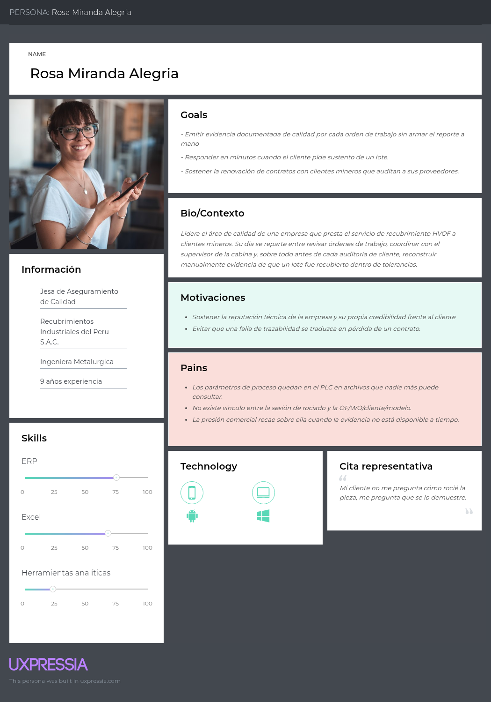

---

#### Ficha de User Persona 2 — Segmento 2: Plantas industriales con línea de recubrimiento in-house

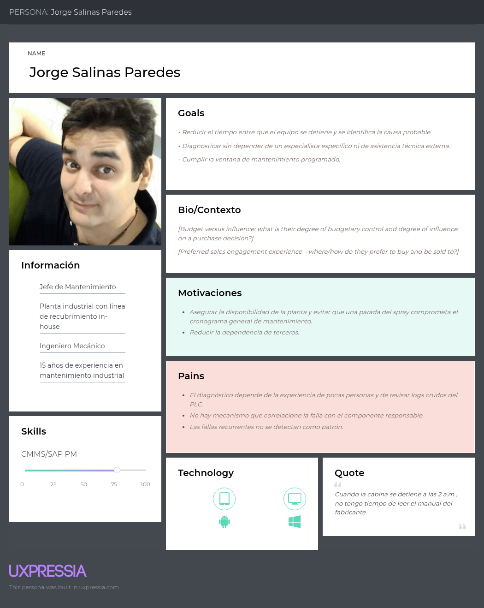

### 2.3.2. User Task Matrix.

| Tarea | Rosa — Frecuencia | Rosa — Importancia | Jorge — Frecuencia | Jorge — Importancia |
|---|---|---|---|---|
| Ejecutar y supervisar una sesión de recubrimiento en la cabina | Baja | Media | Baja | Media |
| Verificar que los parámetros de proceso se mantengan dentro de especificación | Alta | Alta | Media | Alta |
| Registrar a qué pieza, cliente y orden corresponde cada sesión ejecutada | Alta | Alta | Baja | Media |
| Sustentar ante el cliente que un lote fue recubierto dentro de tolerancias | Alta | Alta | N/A | N/A |
| Determinar la causa de una parada o falla del equipo | Baja | Media | Alta | Alta |
| Decidir qué componente de la máquina requiere mantenimiento o repuesto | Baja | Media | Alta | Alta |
| Anticipar fallas recurrentes del equipo | Media | Media | Alta | Alta |
| Verificar el desempeño de una pieza recubierta cuando retorna de campo | Alta | Alta | Media | Media |
| Reportar métricas de calidad o de disponibilidad a la gerencia | Media | Alta | Media | Alta |
| Transferir el conocimiento del proceso entre operadores y técnicos | Media | Media | Media | Alta |

**Tareas con mayor frecuencia e importancia.** Para Rosa, las tareas de mayor peso son sustentar ante el cliente que un lote fue recubierto dentro de tolerancias y registrar la correspondencia entre sesión, pieza, cliente y orden: ambas son diarias y determinan directamente la continuidad del contrato con el cliente minero. Para Jorge, las tareas de mayor peso son determinar la causa de una parada y decidir qué componente atender, dado que de ellas depende la disponibilidad del equipo y el cumplimiento de la ventana de mantenimiento.

**Coincidencias.** Ambos roles comparten como tarea de alta importancia verificar que los parámetros de proceso se mantengan dentro de especificación y reportar métricas a la gerencia, lo que confirma que la trazabilidad del proceso es una necesidad transversal a los dos segmentos, aunque motivada por razones distintas (evidencia comercial en un caso, disponibilidad operativa en el otro).

**Diferencias.** Rosa realiza con alta frecuencia tareas orientadas a documentar y sustentar el proceso ante un tercero externo (el cliente minero), mientras que Jorge realiza con alta frecuencia tareas orientadas a diagnosticar y decidir sobre el propio equipo, sin que un cliente externo participe en esa decisión. Esta diferencia es consistente con la distinción establecida en la sección 1.3 entre el recubrimiento como negocio principal (Segmento 1) y como proceso de soporte al mantenimiento (Segmento 2).


### 2.3.3. User Journey Mapping.

#### Journey Map 1 — Rosa Miranda: sustentar ante el cliente minero que un lote fue recubierto dentro de tolerancias

| Fase | Acciones | Pensamientos | Emociones | Puntos de dolor |
|---|---|---|---|---|
| Solicitud del cliente | Recibe el pedido de sustento y ubica la OF/WO | "Espero que esta vez el registro esté completo" | Neutral, con algo de incertidumbre | No sabe de antemano si el dato existe o está completo |
| Búsqueda de evidencia | Revisa archivos del PLC y bitácoras en papel, consulta al supervisor | "¿Dónde quedó el registro de esa fecha exacta?" | Tensión creciente | Información dispersa entre PLC, papel y memoria del personal |
| Reconstrucción manual | Arma el reporte cruzando fuentes manualmente | "Esto me toma horas que no tengo" | Frustración | Alto esfuerzo manual y riesgo de error humano al cruzar datos |
| Entrega | Envía el reporte, a veces fuera de plazo | "Espero que esto no afecte la renovación del contrato" | Ansiedad | Retraso percibido por el cliente como falta de control de proceso |

#### Journey Map 2 — Jorge Salinas: diagnosticar una parada no programada del equipo HVOF

| Fase | Acciones | Pensamientos | Emociones | Puntos de dolor |
|---|---|---|---|---|
| Detección | El operador reporta la parada; Jorge revisa el código de falla | "¿Es la misma falla del mes pasado?" | Alerta, preocupación | El código de falla del PLC no indica el componente responsable |
| Diagnóstico | Revisa bitácora en papel, llama al técnico senior, escala al fabricante | "Ojalá el técnico que sabe de esto esté disponible" | Impaciencia | El diagnóstico depende del conocimiento tácito de pocas personas |
| Intervención | Interviene el componente señalado y verifica la operación | "Vamos a ver si esto realmente era el problema" | Incertidumbre | Sin correlación automática, la intervención es prueba y error |
| Registro y aprendizaje | Documenta la solución de forma informal | "Espero acordarme la próxima vez que pase esto" | Resignación | El aprendizaje no queda registrado ni es consultable por otros |

### 2.3.4. Empathy Mapping.

#### Empathy Map — Rosa Miranda (Segmento 1)


#### Empathy Map — Jorge Salinas (Segmento 2)


## 2.4. Big Picture Event Storming.

En esta sección se introduce y resume el proceso realizado por nuestro equipo, presentando las evidencias y explicaciones de las etapas del Big Picture Event Storming. En una sesión colaborativa, nuestro equipo se enfocó en entender el dominio del negocio en general, plasmando los eventos significativos y sus relaciones. Es una primera aproximación visual de alto nivel que explora el landscape del negocio, identificando procesos clave y exponiendo potenciales problemas u oportunidades del proceso de recuperación de componentes mediante recubrimiento HVOF, desde la recepción de la pieza del cliente hasta la evaluación de su desempeño en campo. La sesión siguió la guía paso a paso del Event Storming Journal (Bourgau, 2022) y fue documentada con diagramas Mermaid, alternativa permitida por el enunciado del proyecto para Diagram-as-Code. Se conservó la convención de colores del método: naranja para Domain Events, amarillo para Actors, azul para External Systems y rosado para Problems (hotspots).

### Paso 1. Preparación del tablero

Dado que la sesión se realizó de forma remota, la "sala" fue un tablero compartido. El equipo preparó con anticipación:

- El espacio de diseño dividido en tres zonas, siguiendo la guía: *Open* (generación libre), *Explore* (ordenamiento y enriquecimiento) y *Close* (resultados).
- La agenda visual con los nueve pasos de la guía.
- La leyenda de colores.
- Un Domain Event inicial preparado por la facilitadora (*SpraySessionStarted*), siguiendo el truco de Alberto Brandolini de "encender" la sesión con un evento ya colocado en el centro del tablero.

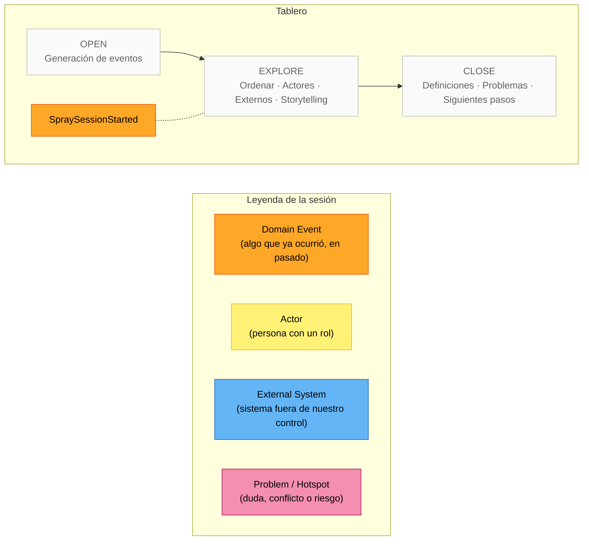

### Paso 2. Energizante

La sesión inició con una dinámica breve de cinco minutos en la que cada integrante describió, en una frase y sin usar términos técnicos, qué pasa con una pieza minera desde que se desgasta hasta que vuelve a operar. El ejercicio sirvió para nivelar el vocabulario entre los integrantes con experiencia en planta y los que no la tenían, y para dejar claro desde el inicio que el tablero se llenaría con hechos del negocio y no con funciones de software.

### Paso 3. Briefing y agenda

La facilitadora (Carolina) presentó el objetivo, el alcance y los casos de uso de la sesión:

| Elemento | Definición acordada |
|---|---|
| Objetivo | Entender de extremo a extremo cómo un componente pasa por el proceso de recuperación HVOF y cómo se conoce su resultado en campo |
| Alcance | Desde la recepción del componente del cliente hasta el registro de su retorno de campo y la evaluación contra el PCR. Incluye la operación del sistema HVOF y el diagnóstico de sus fallas. Excluye la gestión de mantenimiento correctivo/preventivo del sistema HVOF |
| Casos de uso guía | (1) Recuperar un front rod de un cliente minero y entregarlo con evidencia de calidad. (2) Diagnosticar por qué el sistema HVOF se detuvo durante una corrida. (3) Determinar si una pieza que falló en mina antes de su PCR fue mal recubierta |
| Convenciones | Eventos en inglés, en pasado, en PascalCase. Un evento por post-it. Se permite duplicar; se depura al ordenar |

### Paso 4. Generación de Domain Events

Durante veinticinco minutos cada integrante colocó, de forma individual y sin discutir, todos los eventos que recordaba del dominio. La tasa de generación decayó hacia el minuto veinte, señal de pasar al siguiente paso. Se obtuvieron setenta y nueve post-its, incluidos duplicados y eventos que después se reformularon. El tablero, tal como quedó antes de ordenar:

```mermaid
flowchart TB
    classDef evento fill:#FFA726,stroke:#E65100,color:#000

    subgraph W["Tablero — zona OPEN (sin orden)"]
        direction TB
        subgraph R1[" "]
            direction LR
            a1["ComponentReceived"]:::evento
            a2["QualityCertificateIssued"]:::evento
            a3["FeederZeroFeedrateAborted"]:::evento
            a4["SpraySessionStarted"]:::evento
            a5["ComponentReturnedFromField"]:::evento
            a6["RoleAssigned"]:::evento
            a7["PlcTagFileImported"]:::evento
            a8["AlertAcknowledged"]:::evento
        end
        subgraph R2[" "]
            direction LR
            b1["HvofSystemRegistered"]:::evento
            b2["PrematureFailureDetected"]:::evento
            b3["ParameterOutOfRangeDetected"]:::evento
            b4["RecuperationCreated"]:::evento
            b5["RootCauseConfirmed"]:::evento
            b6["SubscriptionActivated"]:::evento
            b7["HopperOverpressureBlocked"]:::evento
            b8["PcrComplianceReportGenerated"]:::evento
        end
        subgraph R3[" "]
            direction LR
            c1["TelemetryBatchIngested"]:::evento
            c2["OrganizationRegistered"]:::evento
            c3["SuspectPartIdentified"]:::evento
            c4["ComponentDelivered"]:::evento
            c5["RecipeDefined"]:::evento
            c6["CriticalFaultAlertRaised"]:::evento
            c7["ServiceLifeRecorded"]:::evento
            c8["SpraySessionCompleted"]:::evento
        end
        subgraph R4[" "]
            direction LR
            d1["FaultCaseOpened"]:::evento
            d2["CustomerRegistered"]:::evento
            d3["TagMappingConfirmed"]:::evento
            d4["SpindleRotationFaulted"]:::evento
            d5["PcrTargetDefined"]:::evento
            d6["OutOfRangeAlertRaised"]:::evento
            d7["RecuperationClosed"]:::evento
            d8["DiagnosticRulesApplied"]:::evento
        end
        subgraph R5[" "]
            direction LR
            e1["PlanSelected"]:::evento
            e2["RecurringFaultPatternDetected"]:::evento
            e3["ProcessReadingRecorded"]:::evento
            e4["TimedShutdownFaultTriggered"]:::evento
            e5["SessionReportGenerated"]:::evento
            e6["HvofSubsystemRegistered"]:::evento
            e7["ProbableCauseSuggested"]:::evento
            e8["UserAuthenticated"]:::evento
            e9["HvofPartRegistered"]:::evento
        end
        subgraph R6[" "]
            direction LR
            f1["SpraySessionAborted"]:::evento
            f2["TagMappingProposed"]:::evento
            f3["PcrTargetMet"]:::evento
            f4["FaultCaseClosed"]:::evento
            f5["EvidenceExported"]:::evento
            f6["AlertDelivered"]:::evento
            f7["TelemetryStreamInterrupted"]:::evento
            f8["DustHouseOverloaded"]:::evento
        end
        subgraph R7[" "]
            direction LR
            g1["FaultFlagActivated"]:::evento
            g2["PrematureFailureCorrelatedWithSession"]:::evento
            g3["DiagnosticRuleCreated"]:::evento
            g4["HvofSystemStatusChanged"]:::evento
            g5["FaultFrequencyReportGenerated"]:::evento
            g6["AlertEscalated"]:::evento
            g7["VisitorSubscribedToNewsletter"]:::evento
            g8["ManualDiagnosisRequired"]:::evento
        end
        subgraph R8[" "]
            direction LR
            h1["SubscriptionExpired"]:::evento
            h2["NotificationPreferenceUpdated"]:::evento
            h3["FaultSymptomsRecorded"]:::evento
            h4["XAxisMotionFaulted"]:::evento
            h5["AccessDenied"]:::evento
            h6["FlameTemperatureOutOfRange"]:::evento
            h7["HourmeterAtDeliveryRecorded"]:::evento
            h8["ComponentMarkedInProcess"]:::evento
        end
        subgraph R9[" "]
            direction LR
            i1["RecipeApplicabilityDefined"]:::evento
            i2["RecipeApproved"]:::evento
            i3["DerivedParameterDefined"]:::evento
            i4["UnitPreferenceUpdated"]:::evento
            i5["SprayingStarted"]:::evento
            i6["SprayingStopped"]:::evento
            i7["UnassignedSessionOpened"]:::evento
            i8["RecipeMismatchDetected"]:::evento
        end
        subgraph R10[" "]
            direction LR
            j1["RecipeVerified"]:::evento
            j2["DerivedParameterComputed"]:::evento
            j3["ReportTemplateCreated"]:::evento
            j4["ReportTemplateShared"]:::evento
            j5["ReportGeneratedFromTemplate"]:::evento
            j6["RecipeNotFoundFaulted"]:::evento
        end
        R1 ~~~ R2 ~~~ R3 ~~~ R4 ~~~ R5 ~~~ R6 ~~~ R7 ~~~ R8 ~~~ R9 ~~~ R10
    end
```

Durante la depuración se tomaron dos decisiones que quedaron registradas para el paso siguiente:

- Los eventos de falla específicos del PLC (*FeederZeroFeedrateAborted*, *HopperOverpressureBlocked*, *SpindleRotationFaulted*, *XAxisMotionFaulted*, *TimedShutdownFaultTriggered*, *DustHouseOverloaded*, *RecipeNotFoundFaulted*) se agruparon bajo un evento genérico *FaultFlagActivated* con el tipo de falla como atributo. Esto evita que el tablero tenga un post-it por cada uno de los más de treinta tags de falla del PLC y refleja cómo lo procesa el sistema: el tag mapeado como indicador de falla se activa, y eso abre el caso.
- *FlameTemperatureOutOfRange* se absorbió en *ParameterOutOfRangeDetected*, por la misma razón. Este evento lleva como atributo la banda alcanzada (advertencia o parada), ya que la receta define bandas de umbral y no un único rango.

### Paso 5. Ordenamiento cronológico

Aquí comenzó la discusión. El equipo ordenó los eventos de izquierda a derecha y, al hacerlo, aparecieron dos flujos concurrentes que se representaron como carriles: mientras la sesión de rociado registra lecturas, en paralelo pueden abrirse casos de falla y generarse alertas. También aparecieron dos flujos alternativos: la sesión puede terminar completada o abortada, y puede abrirse sin orden asignada cuando el PLC reporta rociado activo sin que el operador haya iniciado una sesión.

```mermaid
flowchart LR
    classDef evento fill:#FFA726,stroke:#E65100,color:#000
    classDef fase fill:#FAFAFA,stroke:#BDBDBD,color:#616161

    subgraph F0["0. Configuración"]
        direction TB
        OrganizationRegistered:::evento --> PlanSelected:::evento --> SubscriptionActivated:::evento --> RoleAssigned:::evento --> UnitPreferenceUpdated:::evento
        HvofSystemRegistered:::evento --> HvofSubsystemRegistered:::evento --> HvofPartRegistered:::evento --> PlcTagFileImported:::evento --> TagMappingProposed:::evento --> TagMappingConfirmed:::evento
        TagMappingConfirmed --> RecipeDefined:::evento --> RecipeApplicabilityDefined:::evento --> RecipeApproved:::evento
        TagMappingConfirmed --> DerivedParameterDefined:::evento
        CustomerRegistered:::evento --> PcrTargetDefined:::evento
        DiagnosticRuleCreated:::evento
        ReportTemplateCreated:::evento --> ReportTemplateShared:::evento
    end

    subgraph F1["1. Recepción"]
        direction TB
        ComponentReceived:::evento --> RecuperationCreated:::evento --> ComponentMarkedInProcess:::evento
    end

    subgraph F2["2. Corrida de rociado"]
        direction TB
        SpraySessionStarted:::evento --> RecipeVerified:::evento --> TelemetryBatchIngested:::evento --> ProcessReadingRecorded:::evento
        ProcessReadingRecorded --> DerivedParameterComputed:::evento
        ProcessReadingRecorded --> SprayingStarted:::evento --> SprayingStopped:::evento
        SprayingStopped --> SpraySessionCompleted:::evento
        SprayingStopped --> SpraySessionAborted:::evento
        UnassignedSessionOpened:::evento -. requiere vincular orden .-> SpraySessionStarted
    end

    subgraph F2B["2b. Carril concurrente — Desviaciones y fallas"]
        direction TB
        ParameterOutOfRangeDetected:::evento --> OutOfRangeAlertRaised:::evento --> AlertDelivered:::evento --> AlertAcknowledged:::evento
        RecipeMismatchDetected:::evento --> CriticalFaultAlertRaised:::evento
        FaultFlagActivated:::evento --> FaultCaseOpened:::evento --> FaultSymptomsRecorded:::evento --> DiagnosticRulesApplied:::evento
        DiagnosticRulesApplied --> ProbableCauseSuggested:::evento --> SuspectPartIdentified:::evento --> CriticalFaultAlertRaised
        DiagnosticRulesApplied --> ManualDiagnosisRequired:::evento
        SuspectPartIdentified --> RootCauseConfirmed:::evento --> FaultCaseClosed:::evento
        ManualDiagnosisRequired --> RootCauseConfirmed
        FaultCaseClosed --> RecurringFaultPatternDetected:::evento
        TelemetryStreamInterrupted:::evento
    end

    subgraph F3["3. Cierre y entrega"]
        direction TB
        RecuperationClosed:::evento --> HourmeterAtDeliveryRecorded:::evento --> QualityCertificateIssued:::evento --> ComponentDelivered:::evento
        SessionReportGenerated:::evento
    end

    subgraph F4["4. Campo y PCR"]
        direction TB
        ComponentReturnedFromField:::evento --> ServiceLifeRecorded:::evento
        ServiceLifeRecorded --> PcrTargetMet:::evento
        ServiceLifeRecorded --> PrematureFailureDetected:::evento --> PrematureFailureCorrelatedWithSession:::evento
    end

    subgraph F5["5. Reportes"]
        direction TB
        ReportGeneratedFromTemplate:::evento
        EvidenceExported:::evento
        FaultFrequencyReportGenerated:::evento
        PcrComplianceReportGenerated:::evento
    end

    F0 --> F1 --> F2 --> F3 --> F4 --> F5
    ProcessReadingRecorded -. dispara .-> ParameterOutOfRangeDetected
    DerivedParameterComputed -. dispara .-> ParameterOutOfRangeDetected
    ProcessReadingRecorded -. dispara .-> FaultFlagActivated
    RecipeVerified -. si no aplica .-> RecipeMismatchDetected
    SpraySessionCompleted --> RecuperationClosed
    SpraySessionAborted -. requiere nueva corrida .-> SpraySessionStarted
```

Al ordenar, el equipo hizo explícitas cinco cosas que estaban implícitas:

- *HourmeterAtDeliveryRecorded* no existía en la generación inicial de todos; apareció cuando se preguntó "¿contra qué se compara el horómetro de retorno?". Sin ese dato, *ServiceLifeRecorded* no puede calcular horas logradas.
- *ManualDiagnosisRequired* apareció al preguntar "¿y si ninguna regla coincide?". Es el flujo alternativo de *DiagnosticRulesApplied*.
- *SpraySessionAborted* no cierra la orden: obliga a una nueva corrida. Por eso la flecha punteada regresa a *SpraySessionStarted*.
- *SprayingStarted* y *SprayingStopped* dividen la sesión en pasadas. La sesión la abre el operador porque el PLC no conoce la OF/WO, pero el rociado efectivo lo detecta el tag de estado de rociado activo.
- *RecipeVerified* ocurre entre el inicio de la sesión y la primera lectura: el sistema compara la receta cargada en el controlador con el tipo y modelo del componente de la orden. Si no corresponde, se dispara *RecipeMismatchDetected*.

### Paso 6. Actores y sistemas externos

Con la historia ya ordenada, el equipo identificó quién dispara cada cadena de eventos (post-its amarillos) y qué sistemas fuera de la plataforma participan (post-its azules). Siguiendo la guía, se colocó un actor al inicio de cada cadena y no en cada evento.

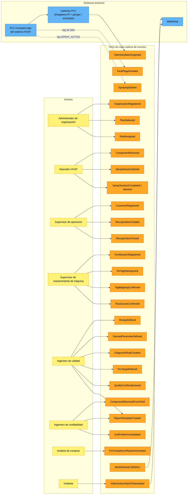

Tres decisiones surgieron en este paso:

- El **PLC** y el **gateway** se modelaron como dos sistemas externos distintos. El PLC es la fuente del dato; el gateway es quien lo lee vía EtherNet/IP y lo envía a la plataforma por REST. Para la demostración del curso, el gateway será un simulador que expone el mismo contrato, de modo que la plataforma no distingue si el origen es hardware real o simulado.
- El **ingeniero de confiabilidad** de la minera (Asset Owner) es quien dispara *ComponentReturnedFromField*, no el proveedor. Es el único que sabe cuántas horas trabajó la pieza en mina. Esta observación fue la que consolidó a la minera como segundo segmento pagante.
- El **PLC** dispara *SprayingStarted* a través del tag de estado de rociado activo, y no el operador. Esto define que la sesión la abre una persona, pero las pasadas de rociado dentro de ella las detecta la máquina.

### Paso 7. Storytelling

Un integrante narró la historia completa recorriendo el tablero de izquierda a derecha, usando el caso de uso guía del front rod. La audiencia interrumpió cuando algo no cuadraba. Las incoherencias que no se pudieron resolver en la sesión se estacionaron como post-its rosados (hotspots).

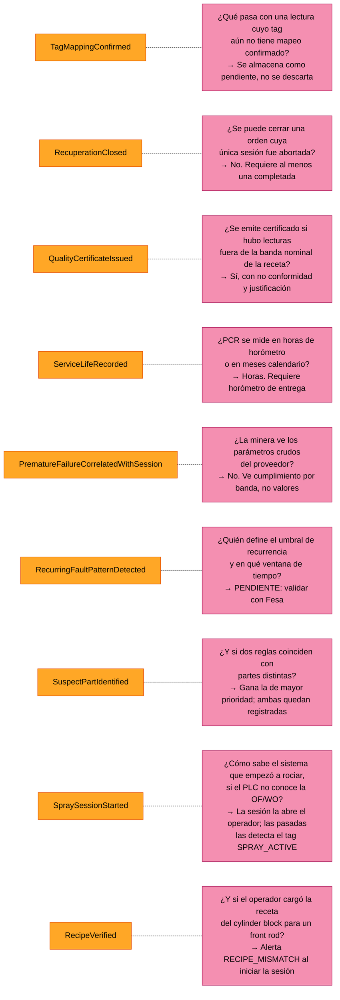

Ocho de los nueve hotspots se resolvieron en la sesión y sus decisiones se trasladaron directamente a los criterios de aceptación de las User Stories (US11, US18, US35, US40, US41, US26, US57 y US56 respectivamente). El hotspot P6 quedó pendiente de validación con el supervisor de mantenimiento durante las entrevistas de la sección 2.2.

Durante la narración se capturaron también las primeras definiciones del lenguaje ubicuo, que se desarrollan en la sección 2.5:

| Término | Definición capturada en la sesión |
|---|---|
| Component | Pieza del cliente que se recupera (front rod, cylinder block). No confundir con las partes del sistema HVOF |
| HVOF Subsystem / HVOF Part | Subsistema del sistema HVOF (alimentador de polvo, consola de gases, chiller, manipulación, colector de polvo) y parte física dentro de él (hopper, disco dosificador, boquilla, spindle) |
| Recuperation | Orden de recuperación identificada por OF y WO; es el trabajo sobre un componente |
| Recipe | Conjunto de setpoints y bandas de umbral cargado en el controlador, aplicable a uno o más tipos y modelos de componente |
| Spray Session | Una corrida de rociado sobre un componente en un sistema HVOF. Una orden puede tener varias |
| Spray Pass | Intervalo de rociado efectivo dentro de una sesión, detectado desde el tag de estado del PLC |
| PCR Target | Horas de operación esperadas para el componente recuperado (Planned Component Replacement) |
| Fault Case | Caso abierto cuando un tag de falla se activa; se diagnostica, se confirma y se cierra |
| Suspect Part | Parte del sistema HVOF que las reglas señalan como probable responsable de la falla |

### Paso 8. Reverse storytelling

Como fase opcional, el equipo tomó el evento de mayor valor de negocio, *PrematureFailureDetected*, y recorrió la historia hacia atrás preguntando repetidamente "¿qué tuvo que ocurrir antes para que esto pasara?". El ejercicio confirmó la cadena de trazabilidad completa y reveló un evento que faltaba.


El evento descubierto, *CustomerLinkedToAssetOwnerOrganization*, resuelve una pregunta que nadie había hecho: ¿cómo puede un ingeniero de confiabilidad de la minera registrar el retorno de una pieza si la minera fue registrada como *Customer* por Fesa y no tiene cuenta propia? La respuesta es que cuando una organización Asset Owner se suscribe con el mismo RUC que un cliente ya registrado por un proveedor, ambos registros se vinculan. Este evento dio origen al segundo escenario de la US13.

### Paso 9. Cierre

Al terminar la sesión el equipo evaluó los resultados contra los tres criterios que propone la guía:

**Entendimiento compartido del dominio.** Los integrantes sin experiencia en planta pudieron narrar la historia completa del front rod sin ayuda al final de la sesión. La distinción entre *Component* (pieza del cliente) y *HVOF Part* (parte física de un subsistema del sistema HVOF), que había generado confusión en reuniones previas, quedó resuelta.

**Problemas identificados.** Nueve hotspots, ocho resueltos en sesión y uno pendiente de validación externa. Las decisiones tomadas se convirtieron en criterios de aceptación, lo que evitó que las ambigüedades llegaran a la implementación.

**Primeras definiciones del lenguaje ubicuo.** Nueve términos capturados, que constituyen el punto de partida del glosario de la sección 2.5.

**Trazabilidad hacia las User Stories.** Los eventos ordenados en el Paso 5 se distribuyen en las épicas del Capítulo III de la siguiente forma:

| Fase del tablero | Eventos | Épica | User Stories |
|---|---|---|---|
| 0. Configuración | OrganizationRegistered, RoleAssigned, PlanSelected, SubscriptionActivated, UnitPreferenceUpdated | E01, E02 | US01–US06, US58 |
| 0. Configuración | HvofSystemRegistered, HvofSubsystemRegistered, HvofPartRegistered, PlcTagFileImported … TagMappingConfirmed, RecipeDefined … RecipeApproved, DerivedParameterDefined, DiagnosticRuleCreated | E03, E06 | US07–US12, US53–US55, US28 |
| 0. Configuración | CustomerRegistered, PcrTargetDefined | E04 | US13, US16 |
| 0. Configuración | ReportTemplateCreated, ReportTemplateShared | E08 | US59–US61, US63 |
| 1. Recepción | ComponentReceived, RecuperationCreated | E04 | US14, US15 |
| 2. Corrida | SpraySessionStarted, RecipeVerified, SprayingStarted/Stopped, UnassignedSessionOpened, DerivedParameterComputed … SpraySessionCompleted/Aborted | E05 | US19–US24, US55–US57 |
| 2b. Desviaciones | ParameterOutOfRangeDetected, RecipeMismatchDetected, OutOfRangeAlertRaised, AlertDelivered | E05, E07 | US21, US31–US34, US56 |
| 2b. Fallas | FaultFlagActivated … RecurringFaultPatternDetected | E06 | US25–US30 |
| 3. Cierre y entrega | RecuperationClosed, QualityCertificateIssued, ComponentDelivered | E04, E08 | US17, US18, US35, US36 |
| 4. Campo y PCR | ComponentReturnedFromField … PrematureFailureCorrelatedWithSession | E09 | US39–US43 |
| 5. Reportes | ReportGeneratedFromTemplate, EvidenceExported, FaultFrequencyReportGenerated, PcrComplianceReportGenerated | E08, E09 | US37, US38, US42, US62, US64 |
| Externos | AlertDelivered (EMAIL), VisitorSubscribedToNewsletter | E11, E10 | US49, US51, US52 |

**Siguientes pasos acordados.** (1) Validar el hotspot P6 en las entrevistas con supervisores de mantenimiento. (2) Llevar el tablero ordenado al Design-Level Event Storming para identificar Commands, Aggregates, Policies y Read Models por bounded context. (3) Completar el glosario de lenguaje ubicuo. Responsable de los siguientes pasos: la facilitadora de la sesión.


## 2.5. Ubiquitous Language.

El siguiente glosario reúne los términos del dominio de recuperación de componentes mediante recubrimiento HVOF, tal como los utilizan los especialistas de las empresas de servicio y los responsables de mantenimiento y confiabilidad de las mineras. Su propósito es que todos los integrantes del equipo y los stakeholders se refieran a cada concepto con una sola palabra y un solo significado, y que ese mismo vocabulario se refleje en las User Stories, los diagramas y el código. Se excluyen deliberadamente términos de ingeniería de software; solo se incluyen conceptos del negocio.

Los términos se presentan en inglés, con su equivalente en español entre paréntesis cuando difiere, y agrupados por área del dominio. Las primeras definiciones fueron capturadas durante el Big Picture Event Storming (sección 2.4) y refinadas a partir de las entrevistas con los segmentos objetivo.

Las definiciones de proceso y recubrimiento se basan en el glosario de proyección térmica de Gordon England (s.f.), en la guía de parámetros de proceso de Oerlikon Metco (2025) y en la literatura sobre control de calidad HVOF (Khan et al., 2019; Mauer, 2022). Los términos de control industrial y comunicación con el PLC se toman de la documentación de Rockwell Automation (2019, 2025) y de ODVA (2015, 2020). Los conceptos de alarma y gestión de alarmas siguen la norma ANSI/ISA-18.2 (International Society of Automation, 2016). Los términos de reemplazo planificado de componentes se basan en la documentación de gestión de equipos mineros de Caterpillar (2017) y en la literatura de gestión de activos (AMS, 2025). Los términos propios de la operación del proveedor (OF, WO, segmento, operación, nomenclatura de tags) provienen del conocimiento directo de planta del equipo y de las entrevistas de needfinding (sección 2.2).

### 2.5.1. Organizaciones y roles

| Término | Definición |
|---|---|
| **Recuperation Supplier** (Proveedor de recuperación) | Empresa que ofrece el servicio de recuperación de componentes mediante recubrimiento HVOF a terceros. Opera una o más celdas HVOF y atiende a varios clientes. Es el primer segmento objetivo. |
| **Asset Owner** (Propietario de activos) | Empresa, típicamente minera, dueña de los componentes que se envían a recuperar. Recibe la pieza recuperada, la pone en operación y conoce su desempeño real en campo. Es el segundo segmento objetivo. |
| **Organization** (Organización) | Empresa registrada en la plataforma, ya sea como Recuperation Supplier o como Asset Owner. Cada organización tiene sus propios usuarios, celdas, componentes y suscripción. |
| **Customer** (Cliente) | Empresa a la que un Recuperation Supplier le presta el servicio. Un Customer puede existir sin tener cuenta en la plataforma; cuando la misma empresa se registra como Asset Owner, ambos registros se vinculan por RUC. |
| **HVOF Operator** (Operador HVOF) | Técnico que opera el sistema HVOF: inicia y finaliza las corridas, monta la pieza y atiende las alertas durante la operación. |
| **Operation Supervisor** (Supervisor de operación) | Responsable del flujo de trabajo del taller: registra clientes y órdenes de recuperación, cierra las órdenes y valida los reportes de sesión. |
| **Machine Maintenance Supervisor** (Supervisor de mantenimiento de máquina) | Responsable de la disponibilidad del sistema HVOF: registra la celda y sus partes, carga y confirma el mapeo de tags del PLC, y confirma la causa raíz de los casos de falla. |
| **Quality Engineer** (Ingeniero de calidad) | Responsable de que el recubrimiento cumpla la especificación: define rangos nominales, PCR objetivo y reglas de diagnóstico, y emite los certificados de calidad. |
| **Reliability Engineer** (Ingeniero de confiabilidad) | Especialista del Asset Owner que da seguimiento a la vida útil de los componentes en operación y registra su retorno de campo. |
| **Procurement Analyst** (Analista de compras) | Responsable del Asset Owner que evalúa el desempeño de los proveedores de recuperación para sustentar decisiones contractuales. |
| **Plan** | Modalidad de suscripción a la plataforma. El plan **Operator** está dirigido a Recuperation Suppliers y se cobra por celda monitoreada; el plan **Asset Owner** está dirigido a propietarios de activos y se cobra por volumen de componentes bajo seguimiento. |
| **Subscription** (Suscripción) | Vínculo vigente entre una organización y un plan, con fecha de inicio y fin. Determina qué capacidades de la plataforma están habilitadas. |

### 2.5.2. Componentes y trazabilidad

| Término | Definición |
|---|---|
| **Component** (Componente / Pieza) | Pieza física del cliente que se somete al proceso de recuperación: front rod, cylinder block, rod assembly, rear cylinder. Se identifica por número de serie y part number. **No debe confundirse con HVOF Cell Part.** |
| **Component Type** (Tipo de componente) | Clasificación funcional del componente según su forma y aplicación (por ejemplo, front rod o cylinder block). Junto con el modelo de máquina, define el PCR objetivo. |
| **Machine Model** (Modelo de máquina) | Modelo del equipo minero al que pertenece el componente (por ejemplo, Caterpillar 797F o 793D). Un mismo tipo de componente tiene distinto PCR según el modelo. |
| **Part Number** | Código del fabricante que identifica el diseño del componente. Dos componentes con el mismo part number son intercambiables. |
| **Serial Number** (Número de serie) | Identificador único de una unidad física de componente. Dos componentes con el mismo part number tienen distinto número de serie. |
| **Recuperation** (Recuperación / Orden de recuperación) | Trabajo de recubrimiento realizado sobre un componente, identificado por su OF y su WO. Registra el horómetro de ingreso, el peso, el lote de polvo y las sesiones de rociado ejecutadas. Una recuperación puede requerir más de una sesión. |
| **Manufacturing Order — OF** (Orden de fabricación) | Identificador que el proveedor asigna al trabajo en su sistema de planta. Es el código con el que la pieza circula por el taller. |
| **Work Order — WO** (Orden de trabajo) | Identificador del servicio acordado con el cliente. Es el código con el que el cliente reconoce el trabajo. Una recuperación tiene exactamente una OF y una WO. |
| **Hourmeter** (Horómetro) | Contador de horas de operación acumuladas de un componente. Se registra al ingreso al taller y al momento de la entrega, y sirve como referencia para calcular la vida útil lograda en campo. |
| **Powder Lot** (Lote de polvo) | Identificación del material de aporte utilizado en el recubrimiento: proveedor, número de lote y composición química. Se vincula a la recuperación para trazabilidad del material. |
| **Delivery** (Entrega) | Momento en que el componente recuperado sale del taller hacia el cliente. Marca el inicio de su periodo de operación en campo. |

### 2.5.3. Vida útil y desempeño en campo

| Término | Definición |
|---|---|
| **PCR — Planned Component Replacement** (Reemplazo planificado de componentes) | Práctica de las mineras de reemplazar componentes críticos en un momento planificado, antes de que fallen, según una vida útil esperada. |
| **PCR Target** (PCR objetivo) | Cantidad de horas de operación que un componente recuperado debería alcanzar antes de su siguiente reemplazo planificado. Se define por tipo de componente y modelo de máquina. Es el estándar contra el cual se evalúa el desempeño real. |
| **Field Return** (Retorno de campo) | Momento en que un componente que estaba en operación en la mina regresa al proveedor, ya sea porque alcanzó su PCR o porque falló antes. Lo registra el Asset Owner, que es quien conoce el horómetro real. |
| **Service Life** (Vida útil lograda) | Horas de operación efectivamente alcanzadas por un componente recuperado, calculadas como la diferencia entre el horómetro al retorno y el horómetro a la entrega. |
| **PCR Met** (PCR alcanzado) | Condición en la que la vida útil lograda es igual o superior al PCR objetivo. Indica que el recubrimiento cumplió su propósito. |
| **Premature Failure** (Falla prematura) | Condición en la que un componente retorna de campo con una vida útil lograda inferior al PCR objetivo. Es el evento de mayor valor analítico del dominio, porque obliga a revisar si el origen estuvo en el proceso de recubrimiento. |
| **PCR Compliance Rate** (Tasa de cumplimiento de PCR) | Proporción de componentes que alcanzaron su PCR sobre el total de componentes retornados en un periodo. Puede calcularse por proveedor, por modelo de máquina o por tipo de componente. |
| **Supplier Performance** (Desempeño de proveedor) | Evaluación que hace el Asset Owner de un Recuperation Supplier en función de la tasa de cumplimiento de PCR de los componentes que este recuperó. |

### 2.5.4. Sistema HVOF y sus partes

| Término | Definición |
|---|---|
| **HVOF — High Velocity Oxygen Fuel** | Proceso de proyección térmica en el que un polvo metálico es fundido y proyectado a alta velocidad mediante la combustión de oxígeno y combustible, para depositar una capa protectora sobre la superficie de un componente. |
| **Thermal Spray** (Proyección térmica) | Familia de procesos de recubrimiento a la que pertenece HVOF. En este dominio se usa como sinónimo del proceso de recuperación. |
| **HVOF System** (Sistema HVOF) | Unidad completa de equipo que ejecuta el proceso: pistola, alimentador, sistema de gases, manipulador de ejes, colector de polvo y PLC de control. Es el activo que el Recuperation Supplier opera y que la plataforma monitorea. |
| **HVOF Subsystem / HVOF Part** (Subsistema o parte del sistema) | Subsistema del sistema HVOF (feeder, consola de gases, chiller, ejes…) y parte física dentro de él, que puede ser origen de una falla: feeder, hopper, spindle, ejes, dust collector, nozzle, unidad de enfriamiento. **No debe confundirse con Component**, que es la pieza del cliente. |
| **Powder Feeder** (Alimentador de polvo) | Parte que dosifica el polvo metálico hacia la pistola a una tasa controlada. Su falla más frecuente es la detención por feedrate cero. |
| **Hopper** (Tolva) | Depósito de polvo que alimenta al feeder. Una sobrepresión en la tolva indica bloqueo aguas abajo. |
| **Spindle** (Husillo) | Eje rotatorio que hace girar el componente durante el rociado para lograr un recubrimiento uniforme. |
| **X Axis / Z Axis** (Ejes X / Z) | Ejes del manipulador que desplazan la pistola a lo largo y en profundidad respecto al componente. |
| **Dust Collector / Dust House** (Colector de polvo) | Sistema de extracción que captura el polvo no adherido. Su sobrecarga afecta la calidad del recubrimiento. |
| **Nozzle** (Boquilla) | Extremo de la pistola por donde sale el chorro de partículas. Es una parte de desgaste. |
| **Equipment Status** (Estado de la celda) | Condición operativa de la celda: activa, en mantenimiento o fuera de servicio. Solo una celda activa puede iniciar sesiones de rociado. |

### 2.5.5. Proceso de rociado y monitoreo

| Término | Definición |
|---|---|
| **Spray Session** (Sesión de rociado / Corrida) | Ejecución continua del proceso de rociado sobre un componente en una celda, con inicio y fin definidos. Pertenece a una recuperación y es operada por un operador HVOF. Termina completada o abortada. |
| **Process Parameter** (Parámetro de proceso) | Magnitud física que caracteriza el proceso y cuyo valor determina la calidad del recubrimiento: presión de oxígeno, presión de combustible, presión de gas portador, temperatura de llama, feedrate, presión de tolva, velocidad del spindle, posición de ejes. |
| **Nominal Range** (Rango nominal) | Intervalo de valores mínimo y máximo dentro del cual un parámetro de proceso se considera correcto para una celda determinada. Lo define el ingeniero de calidad. |
| **Process Reading** (Lectura de proceso) | Valor de un parámetro en un instante determinado durante una sesión de rociado, con su marca de tiempo y su unidad. |
| **Telemetry** (Telemetría) | Flujo de lecturas de proceso que llega automáticamente desde el PLC de la celda a la plataforma durante una sesión. |
| **Deviation** (Desviación) | Lectura de proceso cuyo valor está fuera del rango nominal de su parámetro. Genera una alerta al operador. |
| **PLC — Programmable Logic Controller** (Controlador lógico programable) | Controlador industrial de la celda HVOF que gobierna el proceso y expone en tiempo real los valores de los parámetros y los indicadores de falla. |
| **PLC Tag** | Variable nombrada dentro del PLC que contiene un valor del proceso o un indicador de estado o falla. Cada celda tiene su propio conjunto de tags con nombres definidos por el integrador. |
| **Tag Mapping** (Mapeo de tags) | Asociación entre un tag del PLC y la parte de la celda y el parámetro de proceso que representa. La plataforma lo propone automáticamente a partir del nombre del tag y el supervisor lo confirma. |
| **Fault Flag** (Indicador de falla) | Tag del PLC de tipo booleano que se activa cuando ocurre una condición de falla en una parte de la celda. Su activación abre un caso de falla. |
| **Gateway** | Dispositivo o software que lee los tags del PLC y los envía a la plataforma. En operación real es un equipo conectado a la red industrial; en la demostración, un simulador que expone el mismo contrato. |

### 2.5.6. Fallas y diagnóstico

| Término | Definición |
|---|---|
| **Fault Case** (Caso de falla) | Registro que se abre automáticamente cuando un indicador de falla se activa durante una sesión. Agrupa los síntomas, la causa probable sugerida, la parte sospechosa y la causa raíz confirmada. Pasa por los estados abierto, diagnosticado, confirmado y cerrado. |
| **Fault Type** (Tipo de falla) | Clasificación de la falla según el indicador que la originó: detención del feeder por feedrate cero, sobrepresión de tolva, falla de rotación del spindle, falla de movimiento de eje, paro por temporizador, parada de emergencia, entre otros. |
| **Symptom** (Síntoma) | Valor de un parámetro de proceso registrado en el momento en que ocurrió la falla. El conjunto de síntomas es la evidencia sobre la que se aplican las reglas de diagnóstico. |
| **Diagnostic Rule** (Regla de diagnóstico / Regla causa-efecto) | Relación definida por el ingeniero de calidad entre un tipo de falla, una condición sobre un parámetro, una causa probable y una parte sospechosa. Es conocimiento experto formalizado. |
| **Probable Cause** (Causa probable) | Explicación de la falla sugerida por la regla de diagnóstico que coincidió con los síntomas. No es definitiva hasta que el supervisor la confirme. |
| **Suspect Part** (Parte sospechosa) | Parte de la celda que la regla de diagnóstico señala como probable origen de la falla. Es lo que le indica a mantenimiento qué revisar. |
| **Root Cause** (Causa raíz) | Causa real de la falla, confirmada por el supervisor de mantenimiento tras la revisión física. Puede coincidir o no con la causa probable sugerida. |
| **Corrective Action** (Acción correctiva) | Intervención realizada sobre la celda para resolver la causa raíz. Se registra al confirmar el caso. |
| **Recurring Fault Pattern** (Patrón de falla recurrente) | Condición en la que una misma parte acumula casos de falla del mismo tipo por encima de un umbral dentro de un periodo. Anticipa un problema mayor. |

### 2.5.7. Alertas y evidencia de calidad

| Término | Definición |
|---|---|
| **Alert** (Alerta) | Aviso dirigido a un usuario cuando ocurre una desviación, una falla crítica, un patrón recurrente o una falla prematura. Se entrega en la plataforma y, opcionalmente, por correo electrónico. |
| **Severity** (Severidad) | Nivel de importancia de una alerta: informativa, advertencia o crítica. Determina a quién se dirige y si escala en caso de no atenderse. |
| **Alert Rule** (Regla de alerta) | Configuración que define, para una organización, qué tipos de evento generan alertas, con qué severidad y por qué canal. |
| **Acknowledgement** (Atención de alerta) | Acción de un usuario que marca una alerta como revisada. Una alerta crítica no atendida en el tiempo configurado escala al administrador. |
| **Quality Certificate** (Certificado de calidad) | Documento emitido por el ingeniero de calidad al cerrar una recuperación, que resume el cumplimiento de cada parámetro de proceso respecto a su rango nominal durante las sesiones ejecutadas. Es la evidencia que el proveedor entrega al cliente. |
| **Parameter Compliance** (Cumplimiento por parámetro) | Indicación, dentro del certificado, de si las lecturas de un parámetro se mantuvieron dentro del rango nominal durante toda la recuperación. |
| **Non-conformity** (No conformidad) | Condición del certificado cuando uno o más parámetros presentaron desviaciones. Requiere una justificación del ingeniero de calidad para poder emitirse. |
| **Session Report** (Reporte de sesión) | Resumen de una sesión de rociado: total de lecturas, desviaciones por parámetro y casos de falla ocurridos. |
| **Evidence Export** (Exportación de evidencia) | Conjunto de sesiones y certificados de un periodo, exportado para presentarse en una auditoría del cliente. |

### 2.5.8. Control industrial y red de la celda

| Término | Definición |
|---|---|
| **Allen-Bradley** | Marca de automatización industrial de Rockwell Automation. Es el fabricante del PLC que controla la celda HVOF. |
| **CompactLogix** | Familia de PLCs de Allen-Bradley utilizada en la celda. Expone sus tags en red mediante EtherNet/IP y organiza la lógica en programas y rutinas. |
| **EtherNet/IP** | Protocolo industrial abierto (basado en CIP) sobre Ethernet que permite leer y escribir tags del PLC desde un equipo externo. Es el medio por el que el gateway obtiene la telemetría. |
| **CIP — Common Industrial Protocol** | Protocolo de aplicación sobre el que funciona EtherNet/IP. Define cómo se identifican y consultan los tags. |
| **HMI — Human Machine Interface** (Interfaz hombre-máquina) | Pantalla táctil de la celda desde la que el operador ve valores de proceso, alarmas y arranca o detiene la máquina. Es la única fuente de información del operador cuando no existe la plataforma. |
| **Industrial Network Segment** (Segmento de red industrial) | Red aislada de la celda donde conviven el PLC, la HMI, los variadores y los módulos de comunicación. Tiene su propio rango de direcciones IP y no está expuesta a la red corporativa. |
| **IP Address of the PLC** (Dirección IP del PLC) | Dirección única del PLC dentro del segmento industrial. Es el dato de configuración que necesita el gateway para conectarse. |
| **Slot** | Posición del módulo procesador dentro del chasis del PLC. Junto con la IP, identifica el destino de la conexión. |
| **Communication Module / Anybus** (Módulo de comunicación) | Dispositivo que traduce entre protocolos industriales distintos dentro del segmento (por ejemplo, entre el PLC y un equipo que no habla EtherNet/IP). |
| **VFD — Variable Frequency Drive** (Variador de frecuencia) | Equipo que controla la velocidad de un motor. En la celda gobierna el spindle y los ejes; sus fallas se reportan al PLC como indicadores propios (por ejemplo, falla de velocidad del spindle). |
| **Gateway** (Puerta de enlace) | Equipo conectado al segmento industrial que lee los tags del PLC vía EtherNet/IP y los envía a la plataforma por red corporativa. En Fesa es un Raspberry Pi; en la demostración, un simulador con el mismo contrato. |
| **Polling Interval** (Intervalo de muestreo) | Frecuencia con la que el gateway lee los tags del PLC. En operación real es de 500 milisegundos; define la resolución temporal de la telemetría. |
| **Link Flapping** | Pérdida y recuperación intermitente del enlace de red entre el gateway y el PLC, generalmente por cableado defectuoso. Produce interrupciones en la telemetría. |

### 2.5.9. Tags, umbrales y lógica del PLC

| Término | Definición |
|---|---|
| **Tag** | Variable nombrada del PLC. Un PLC de celda HVOF puede tener más de diez mil tags; la plataforma solo monitorea el subconjunto relevante para el proceso y las fallas (alrededor de doscientos). |
| **Controller Tag / Program Tag** | Ámbito del tag dentro del PLC. Los controller tags son globales; los program tags pertenecen a un programa específico y se identifican con el prefijo del programa. |
| **Tag Path** (Ruta del tag) | Nombre completo con el que se accede a un tag, incluyendo su estructura (por ejemplo, `Mach_FLT.TimedShutdownFlt` o `Spindle.VFD.HSDFlt`). Es lo que la plataforma mapea a una parte y un parámetro. |
| **UDT — User Defined Type** (Tipo definido por el usuario) | Estructura de datos creada por el integrador que agrupa varios tags bajo un mismo nombre (por ejemplo, `Mach_FLT` agrupa todos los indicadores de falla de la máquina). El nombre del UDT suele indicar el subsistema, y por eso sirve para el mapeo automático. |
| **Tag Kind** (Tipo de tag) | Clasificación que hace la plataforma al mapear: lectura analógica (valor continuo de un parámetro), indicador de falla (booleano que abre un caso) o estado (booleano informativo, como *Running* o *Ready*). |
| **Setpoint — SP** (Consigna) | Valor objetivo de un parámetro que el operador o la receta fija en el PLC. |
| **Process Value — PV** (Valor de proceso) | Valor real medido del parámetro. La diferencia entre PV y SP indica qué tan bien controlado está el proceso. |
| **Warning Threshold — HW / LW** (Umbral de advertencia alto / bajo) | Límite del PLC a partir del cual se genera una alarma en la HMI sin detener el proceso. |
| **Shutdown Threshold — HSD / LSD** (Umbral de parada alto / bajo) | Límite del PLC a partir del cual la máquina se detiene automáticamente por seguridad. Un tag como `HSDFlt` indica que el valor superó el umbral alto de parada. |
| **Threshold Bands** (Bandas de umbral) | Relación entre los tres niveles de control: el rango nominal de la plataforma es el más estrecho (calidad), los umbrales de advertencia son intermedios (operación) y los de parada son los más amplios (seguridad). Una lectura puede estar fuera del rango nominal sin que el PLC haya generado alarma alguna. |
| **Alarm** (Alarma) | Aviso generado por el PLC en la HMI cuando un parámetro cruza un umbral de advertencia. No detiene la máquina. **No debe confundirse con Alert**, que es el aviso generado por la plataforma. |
| **Fault** (Falla) | Condición detectada por el PLC que impide continuar la operación. Se representa con un tag booleano de tipo indicador de falla. |
| **Timed Shutdown Fault** (Paro por temporizador) | Falla que el PLC declara cuando una condición anormal persiste más allá de un tiempo límite. Es la clase de falla más frecuente en la celda y suele tener como causa raíz un problema del feeder. |
| **Motion Fault** (Falla de movimiento) | Falla reportada por el control de un eje cuando este no alcanza la posición o velocidad comandada. |
| **Interlock** (Enclavamiento) | Condición de seguridad que debe cumplirse para permitir una acción (por ejemplo, puerta cerrada para permitir ignición). Su incumplimiento bloquea el proceso. |
| **Permissive** (Permisivo) | Conjunto de condiciones que deben ser verdaderas para que el PLC autorice arrancar o continuar el proceso. |
| **E-Stop — Emergency Stop** (Parada de emergencia) | Botón físico que corta la operación de forma inmediata. Su activación se registra como falla de máxima severidad. |
| **Fault Reset** (Reinicio de falla) | Acción del operador en la HMI para borrar una falla una vez resuelta su causa. Marca el fin del episodio de falla en el PLC. |
| **Machine State** (Estado de máquina) | Condición operativa reportada por el PLC: *Idle*, *Ready*, *Running*, *Faulted*. La plataforma la usa para saber si una sesión puede iniciar. |
| **Scan Cycle** (Ciclo de escaneo) | Tiempo que tarda el PLC en ejecutar toda su lógica y actualizar sus tags. Es el límite inferior de resolución de cualquier lectura. |

### 2.5.10. Proceso HVOF y calidad del recubrimiento

| Término | Definición |
|---|---|
| **Metalizado** (término coloquial) | Nombre con el que en el Perú se conoce al recubrimiento por proyección térmica en general. Los clientes suelen pedir "metalizar" una pieza cuando se refieren al servicio HVOF. |
| **Combustion Chamber** (Cámara de combustión) | Parte de la pistola donde se queman oxígeno y combustible para generar el chorro de gases a alta velocidad. |
| **Fuel** (Combustible) | Gas o líquido que se quema con oxígeno en la pistola (según el equipo, queroseno, propano o hidrógeno). Su presión es uno de los parámetros críticos del proceso. |
| **Oxygen** (Oxígeno) | Comburente del proceso. La relación oxígeno-combustible determina la temperatura y velocidad del chorro. |
| **Carrier Gas** (Gas portador) | Gas inerte, normalmente nitrógeno, que transporta el polvo desde el feeder hasta la pistola. Su presión afecta la estabilidad de la alimentación. |
| **Powder** (Polvo) | Material de aporte en forma de partículas finas que se funde y proyecta. En aplicaciones mineras predominan los carburos de tungsteno con cobalto o cromo. **No debe confundirse con Dust**, que es el residuo no adherido. |
| **Feedrate** (Tasa de alimentación) | Cantidad de polvo por unidad de tiempo que el feeder entrega a la pistola. Un feedrate cero durante la corrida indica bloqueo o vaciado del feeder. |
| **Ignition** (Ignición) | Encendido de la llama en la pistola al inicio de la corrida. Su falla impide comenzar el rociado. |
| **Flame** (Llama) | Chorro de gases en combustión que funde y acelera el polvo. Su temperatura es un parámetro de control. |
| **Spray Distance / Standoff** (Distancia de rociado) | Distancia entre la salida de la pistola y la superficie del componente. Afecta la temperatura y velocidad con que las partículas impactan. |
| **Traverse Speed** (Velocidad de traslación) | Velocidad con la que la pistola se desplaza a lo largo del componente durante la corrida. Determina el espesor por pasada. |
| **Rotation Speed / RPM** (Velocidad de rotación) | Velocidad a la que el spindle hace girar el componente. Junto con la traslación, define la uniformidad del recubrimiento. |
| **Pass** (Pasada) | Recorrido completo de la pistola a lo largo del componente. Un recubrimiento se construye con múltiples pasadas. |
| **Coating** (Recubrimiento) | Capa de material depositada sobre el componente. Es el producto final del proceso. |
| **Coating Thickness** (Espesor de recubrimiento) | Grosor de la capa depositada, medido después del rociado. Es la principal característica de aceptación del cliente. |
| **Porosity** (Porosidad) | Proporción de vacíos dentro del recubrimiento. Un recubrimiento HVOF de calidad tiene porosidad muy baja. |
| **Bond Strength** (Adherencia) | Resistencia de la unión entre el recubrimiento y el componente. Depende de la preparación superficial y de los parámetros de proceso. |
| **Surface Preparation / Grit Blasting** (Preparación superficial / Arenado) | Limpieza y rugosidad de la superficie del componente antes del rociado, mediante proyección de partículas abrasivas. Es condición para una buena adherencia. |
| **Masking** (Enmascarado) | Protección de las zonas del componente que no deben recibir recubrimiento. |
| **Finishing / Grinding** (Acabado / Rectificado) | Mecanizado posterior al rociado para llevar el componente a la dimensión final. No forma parte de la sesión de rociado pero sí de la recuperación. |
| **Rework** (Reproceso) | Repetición del rociado sobre un componente cuyo recubrimiento no cumplió la especificación. Requiere una nueva sesión dentro de la misma recuperación. |
| **Dust** (Residuo de polvo) | Partículas de polvo que no se adhirieron al componente y son capturadas por el colector. **No debe confundirse con Powder**. |
| **Deposition Efficiency** (Eficiencia de deposición) | Proporción del polvo alimentado que efectivamente queda adherido al componente. Un valor bajo indica desperdicio de material. |
| **Recipe / Parameter Set** (Receta) | Conjunto de setpoints definidos para un tipo de componente y un tipo de polvo. Es el origen de los rangos nominales que la plataforma monitorea. |

### 2.5.11. Contexto de los componentes mineros

| Término | Definición |
|---|---|
| **Mining Truck** (Camión minero) | Vehículo de acarreo de gran tonelaje (por ejemplo, Caterpillar 797F, 793D o 785C) al que pertenecen la mayoría de componentes recuperados. |
| **Suspension Cylinder / Strut** (Cilindro de suspensión) | Conjunto hidráulico que absorbe la carga del camión. Sus partes internas (front rod, rear cylinder, rod assembly) sufren desgaste abrasivo y son las que se recubren. |
| **Front Rod** (Vástago delantero) | Vástago del cilindro de suspensión delantero. Es el componente que con mayor frecuencia se envía a recuperar. |
| **Cylinder Block** (Bloque de cilindro) | Cuerpo del cilindro de suspensión. Se recubre en su superficie interna. |
| **Wear** (Desgaste) | Pérdida de material de la superficie del componente por fricción o abrasión durante la operación. Es la razón por la que se requiere el recubrimiento. |
| **Segment** (Segmento de negocio) | Línea de negocio del proveedor a la que pertenece el trabajo (por ejemplo, minería o construcción). Se registra en la recuperación. |
| **Operation** (Operación) | Taller o línea de servicio del proveedor que ejecuta el trabajo. Se registra en la recuperación. |
| **Mine Site** (Unidad minera) | Ubicación operativa del Asset Owner donde trabaja el componente. Un mismo cliente puede tener varias unidades con condiciones de desgaste distintas. |
| **Fleet** (Flota) | Conjunto de equipos del mismo modelo que opera una unidad minera. La tasa de falla prematura suele analizarse por flota. |
| **Planned Shutdown** (Parada de planta programada) | Periodo en el que la mina detiene una línea de producción para mantenimiento. Es la ventana en la que se concentran los reemplazos planificados de componentes. |

# Capítulo III: Requirements Specification
## 3.1. User Stories.
## 3.2. Impact Mapping.
## 3.3. Product Backlog

# Capítulo IV: Product Design
## 4.1. Style Guidelines.
Durante el desarrollo de Relient, resulta importante establecer lineamientos visuales que permitan mantener una identidad coherente en las diferentes interfaces del producto. Las inconsistencias en los colores, tipografías, componentes y estilos de interacción pueden afectar la comprensión y experiencia de los usuarios.
Por ello, se establecen las Style Guidelines para definir los recursos visuales de la Landing Page y la Web Application de Relient. Estas pautas consideran las necesidades de los usuarios relacionados con la gestión y monitoreo de procesos, equipos, componentes y recursos del sector industrial y minero. Asimismo, se busca
mantener una interfaz clara, organizada y funcional, que facilite la consulta de información, el seguimiento de alertas y la gestión de los diferentes módulos de la plataforma.

### 4.1.1. General Style Guidelines.
Para esta sección, se han definido los estilos de tipografía, colores y espaciado que se aplicarán en las interfaces web de Relient. Estos elementos buscan mantener una identidad visual consistente y facilitar la interacción de los usuarios con la plataforma.
## Branding
La identidad visual de Relent está orientada a representar innovación, control y eficiencia dentro del sector industrial y minero. El diseño utiliza una estructura ordenada y minimalista, permitiendo que la información operativa sea clara y fácil de interpretar.

## Typography
La propuesta visual de Relient utiliza principalmente las tipografías Balsamiq Sans, Goblin One y Kaushan Script. La tipografía Balsamiq Sans se utiliza para textos generales, etiquetas y componentes informativos. Goblin One se emplea en títulos y elementos destacados, mientras que Kaushan Script se utiliza en elementos
decorativos o distintivos de la identidad visual. La combinación de estas tipografías permite establecer una jerarquía visual entre los diferentes elementos de la interfaz y mantener una presentación coherente en la Landing Page y la Web Application.

 

## Colors
La paleta de colores de Relient está conformada por El marrón oscuro se utiliza en textos y elementos principales, mientras que el crema claro y el blanco permiten construir fondos y espacios visuales. El naranja se emplea para destacar botones, acciones principales y elementos relevantes de la interfaz.

 

## Spacing
El sistema de espaciado de Relient busca mantener una distribución ordenada de los contenidos y evitar la saturación visual. Para ello, se utilizan separaciones consistentes entre títulos, textos, botones, formularios, tablas y componentes de navegación.La configuración del espaciado 
se establece mediante las herramientas de diseño utilizadas en Figma, considerando la distribución de los elementos y la legibilidad de la información en las diferentes vistas de la plataforma.

## Tone of Voice
El tono de comunicación de Relient se caracteriza por ser profesional, claro, directo y orientado a la eficiencia operativa. Debido a que la plataforma está relacionada con el monitoreo y la gestión de procesos industriales, la comunicación busca transmitir control, prevención y confiabilidad. Los mensajes deben utilizar
términos comprensibles y evitar expresiones excesivamente técnicas cuando no sean necesarias. Asimismo, las etiquetas y notificaciones deben orientar al usuario sobre las acciones que puede realizar y los estados de los registros o equipos.

### 4.1.2. Web Style Guidelines.
Las Web Style Guidelines de Relient establecen los criterios visuales y de interacción para las interfaces web del producto. Estas reglas buscan asegurar la consistencia entre la Landing Page y la Web Application, facilitando la navegación y el uso de las funcionalidades disponibles.

 ## Navigation Bar
 La barra de navegación de la Landing Page se ubica en la parte superior de la interfaz y permite acceder a las principales secciones informativas del producto. También incorpora las opciones de ingreso y registro de usuarios.
En la Web Application, la navegación se organiza mediante una barra superior y un menú lateral que permite acceder a los módulos de Usuarios, Equipos, Componentes, Señales, Alertas, Reportes e Inventario.

## Buttons
Los botones utilizan una jerarquía visual que permite diferenciar las acciones principales de las secundarias. El color naranja #E2942E se emplea para destacar las acciones más importantes, como ingresar, registrar información, guardar cambios o iniciar una operación.
Los botones también consideran estados visuales como hover y focus, con el objetivo de proporcionar retroalimentación al usuario durante la interacción.

## Cards
Las tarjetas se utilizan para presentar información de manera organizada e independiente. En la Web Application de Relient pueden emplearse para mostrar indicadores, estados de equipos, alertas, componentes y otros datos relacionados con la operación.
El uso de tarjetas permite separar visualmente la información y facilitar su lectura, especialmente cuando se presentan diferentes registros o indicadores dentro de una misma vista.

## Forms
Los formularios de Relient utilizan una estructura organizada y etiquetas visibles asociadas a cada campo de entrada. Los campos deben contar con espacios adecuados, bordes definidos y estados de focus que permitan identificar el elemento activo.
Los formularios se utilizan en procesos como el registro de usuarios, equipos, componentes, señales e información de inventario. Se busca que los campos sean comprensibles y que los mensajes de validación orienten al usuario cuando se produzca un error.

## Interaction States
Los principales componentes interactivos consideran estados visuales de hover, focus, seleccionado y deshabilitado. Estos estados permiten comunicar qué elementos pueden ser seleccionados o activados.
En Relient, estos criterios también pueden utilizarse para representar estados relacionados con los equipos, las señales y las alertas, facilitando la identificación de información que requiere atención o seguimiento.

## Responsive Web Design
La interfaz de Relient considera un enfoque responsive para adaptar la presentación de los contenidos a diferentes tamaños de pantalla. En la versión de escritorio se utiliza una estructura con menú lateral, tablas y componentes de gestión.
En dispositivos de menor tamaño, los elementos deben reorganizarse para conservar la legibilidad, evitar desbordamientos horizontales y facilitar la interacción con los botones, formularios y registros de la plataforma.

## Accessibility
La experiencia web de Relient considera prácticas básicas de accesibilidad, como el uso de etiquetas visibles en los formularios, contraste entre colores, estados de focus y nombres comprensibles para los botones y elementos de navegación.
Asimismo, la información debe organizarse mediante una jerarquía visual clara, permitiendo que los usuarios identifiquen las funciones y comprendan los mensajes presentados por la plataforma.

## 4.2. Information Architecture.
La arquitectura de información de Relient define la manera en que se distribuyen, relacionan y presentan los contenidos de la plataforma. Su propósito es ayudar a los usuarios a identificar las funcionalidades disponibles y encontrar la información requerida sin realizar pasos innecesarios.
La propuesta contempla la Landing Page y la Web Application de InnovaCorp. Ambas interfaces deben mantener criterios similares en la organización de los contenidos, las etiquetas y los recorridos de navegación. De esta manera, el usuario puede reconocer la identidad y la estructura del producto desde la primera interacción hasta el uso de sus funcionalidades internas.

### 4.2.1. Organization Systems.
Relient utiliza una organización basada principalmente en una estructura jerárquica y temática. La organización jerárquica permite mostrar primero la información más importante y posteriormente dirigir al usuario hacia contenidos específicos. La organización temática agrupa las funcionalidades según el tipo de tarea o información que gestionan.
En la Landing Page, el contenido se distribuye desde la presentación inicial de InnovaCorp y la propuesta de valor de Relient hacia las secciones informativas que explican el funcionamiento de la solución. También se consideran los accesos a About Us, How does it work?, FAQs y Contact, de acuerdo con la estructura de los mockups.
En la Web Application, la información se divide en módulos relacionados con las actividades principales de la plataforma. Estos módulos incluyen Usuarios, Equipos, Componentes, Señales, Alertas, Reportes e Inventario. Cada sección reúne los registros y acciones correspondientes a su finalidad, permitiendo que el usuario pueda consultar y administrar la información de manera más ordenada.
La organización de los módulos también puede incorporar una secuencia de pasos cuando se necesita registrar, actualizar o revisar un elemento. Por ejemplo, una operación puede comenzar con el ingreso de datos, continuar con la validación de la información y finalizar con la confirmación del registro.

### 4.2.2. Labeling Systems.
El sistema de etiquetado de Relient busca utilizar nombres breves, reconocibles y relacionados directamente con las funciones de la plataforma. Las etiquetas deben permitir que el usuario anticipe el contenido de una sección antes de ingresar a ella.
En la Landing Page se utilizan nombres como Home, About Us, How does it work?, FAQs y Contact. Estas denominaciones ayudan a separar la información institucional, la explicación del producto y los canales de comunicación.
En la Web Application, las etiquetas principales corresponden a los módulos de Usuarios, Equipos, Componentes, Señales, Alertas, Reportes e Inventario. Cada nombre se relaciona con el tipo de información que el usuario puede consultar o administrar dentro de la plataforma.
Las acciones deben utilizar expresiones orientadas a la tarea, como “Registrar”, “Guardar”, “Editar”, “Consultar”, “Filtrar” o “Generar reporte”, siempre que correspondan con la funcionalidad implementada. Se evitarán términos excesivamente técnicos, abreviaturas poco claras o denominaciones diferentes para una misma acción.

### 4.2.3. SEO Tags and Meta Tags
Las etiquetas SEO y los Meta Tags de Relient se plantean como recursos para describir el contenido de la Landing Page y facilitar su identificación por parte de los motores de búsqueda. Estos valores permiten comunicar el nombre del producto, su finalidad y los temas relacionados con la solución.
Para InnovaCorp se proponen los siguientes contenidos:

|## Tag | ## Valor|
|:--:|:--:|
|Title | InnovaCorp - Monitoreo inteligente de procesos industriales |
| Description | InnovaCorp ofrece soluciones tecnológicas para monitorear procesos, anticipar fallas y mejorar la trazabilidad industrial|
| Keywords | InnovaCorp, Relient, monitoreo industrial, trazabilidad, prevención de fallas |
| Author | InnovaCorp 

Los valores anteriores representan una propuesta inicial y deben validarse durante la implementación del sitio web. El atributo Title identifica el nombre principal de la página, mientras que la Description presenta una síntesis del servicio ofrecido. Las Keywords reúnen términos relacionados con la actividad de InnovaCorp y el propósito de Relient.
Estas etiquetas se incorporan dentro del elemento <head> del documento HTML. En el caso de la Web Application, los títulos y descripciones pueden ajustarse de acuerdo con la vista o funcionalidad que se esté mostrando.

### 4.2.4. Searching Systems.
El sistema de búsqueda de Relient se define según la cantidad y el tipo de información que debe consultar el usuario en cada interfaz.
En la Landing Page no se considera necesaria una barra de búsqueda principal, debido a que sus contenidos se encuentran distribuidos en secciones específicas y pueden localizarse mediante la navegación superior. El usuario puede dirigirse a las secciones informativas utilizando los enlaces disponibles.
En la Web Application, la búsqueda adquiere mayor importancia porque se gestionan registros relacionados con usuarios, equipos, componentes, señales, alertas, reportes e inventarios. Por este motivo, se pueden incorporar campos de búsqueda y filtros que faciliten la localización de información.
Los criterios de filtrado pueden variar según el módulo. Por ejemplo, se pueden considerar nombres, códigos, categorías, estados o fechas, siempre que estos datos formen parte de la información gestionada por la plataforma. Los resultados deben mostrarse de forma ordenada para que el usuario pueda reconocer los registros y acceder a sus detalles.
Los filtros deben ser comprensibles y permitir que el usuario modifique o elimine los criterios seleccionados. De esta manera, se evita que la búsqueda se convierta en un proceso complicado o que se presenten demasiadas opciones al mismo tiempo.

### 4.2.5. Navigation Systems.
El sistema de navegación de Relient tiene como objetivo facilitar el desplazamiento entre las distintas secciones de la experiencia digital. Para ello, se establecen rutas claras que permitan al usuario comprender dónde se encuentra y qué acciones puede realizar.
En la Landing Page, la navegación principal se presenta en la parte superior e incluye los accesos a Home, About Us, How does it work?, FAQs y Contact. Estos enlaces permiten desplazarse hacia las secciones correspondientes de la página. Además, se consideran acciones como “Empezar ya”, Login y Sign Up, las cuales dirigen al usuario hacia los puntos de interacción definidos en los mockups.
En la Web Application, la navegación se organiza alrededor de los módulos principales de Relient. Los accesos a Usuarios, Equipos, Componentes, Señales, Alertas, Reportes e Inventario deben mantenerse visibles y ordenados para facilitar el acceso a las funciones de gestión y monitoreo.
El footer de la Landing Page complementa la navegación mediante información adicional de la marca y accesos relacionados con las secciones disponibles. Su contenido debe mantener una estructura sencilla y consistente con el resto de la interfaz.
En pantallas pequeñas, los elementos de navegación deben reorganizarse para conservar su visibilidad y permitir una interacción adecuada. Dentro de la Web Application, los recorridos deben mantener una relación clara entre los módulos, los registros y las acciones disponibles, evitando que el usuario pierda el contexto de la tarea que está realizando.

## 4.3. Landing Page UI Design.
El diseño de la interfaz de la Landing Page de Relient representa visualmente la propuesta de InnovaCorp y permite presentar el propósito de la solución de manera ordenada. Su estructura se desarrolla a partir de los criterios definidos en las Style Guidelines y en la arquitectura de información.
La interfaz busca comunicar el valor de Relient, explicar de manera sencilla su finalidad y facilitar el acceso a las principales acciones de navegación. Para ello, se utilizan recursos como la jerarquía tipográfica, la paleta de colores, los espacios entre secciones y los componentes interactivos.
El diseño considera una presentación adaptable a diferentes tamaños de pantalla, manteniendo una relación visual entre los elementos de la marca y las funcionalidades que posteriormente se encuentran disponibles en la Web Application.

### 4.3.1. Landing Page Wireframe.
Los wireframes de la Landing Page de Relient muestran la distribución preliminar de los elementos que conforman la interfaz antes de aplicar todos los estilos visuales. Estos esquemas permiten revisar la ubicación de los contenidos, la organización de la navegación y la jerarquía de las secciones principales.
La elaboración de los wireframes facilita la identificación de posibles problemas de distribución y permite realizar ajustes antes de desarrollar la interfaz definitiva. También ayuda a comprobar que los elementos principales, como el logotipo, los enlaces de navegación y los botones de acción, se encuentren ubicados de acuerdo con la estructura propuesta.

## Desktop Web Browser
 
 
 
 
 

## Mobile Web Browser
 
 
 
 
 


### 4.3.2. Landing Page Mock-up.

## Desktop Web Browser
 
 
 
 
 

## Mobile Web Browser
 
 
 
 
 


## 4.4. Web Applications UX/UI Design.
El diseño UX/UI de la Web Application de Relient, desarrollada por InnovaCorp, se plantea a partir de los resultados obtenidos durante el proceso de UX Research, los User Stories establecidos en el Product Backlog y los lineamientos visuales definidos previamente.
El propósito de esta sección es representar la organización, navegación e interacción de las funcionalidades principales de la plataforma, facilitando que los usuarios puedan realizar sus actividades de manera comprensible, ordenada y eficiente.
Para lograrlo, se elaborarán wireframes, wireflows, mock-ups y user flow diagrams que permitan visualizar la distribución de los componentes de la interfaz y los distintos recorridos que los usuarios pueden seguir dentro de la Web Application. Estos recursos estarán orientados a las funciones de gestión de usuarios, equipos, componentes, señales, alertas, reportes e inventario.

### 4.4.1. Web Applications Wireframes.
Los wireframes de la Web Application de Relient presentan una representación inicial de la estructura y distribución de las pantallas principales de la plataforma. Estos esquemas permiten definir la ubicación de los elementos de navegación, botones, formularios, tarjetas, tablas y secciones informativas antes de incorporar el diseño visual final.
Asimismo, los wireframes ayudan a organizar las funcionalidades de acuerdo con las necesidades de los usuarios y los User Stories definidos, facilitando la revisión de la experiencia de navegación y la identificación de posibles mejoras en la interfaz.

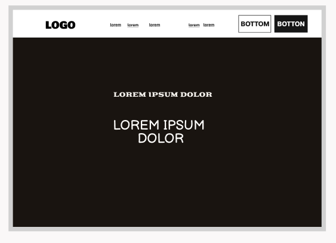 
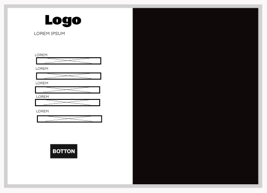 
 
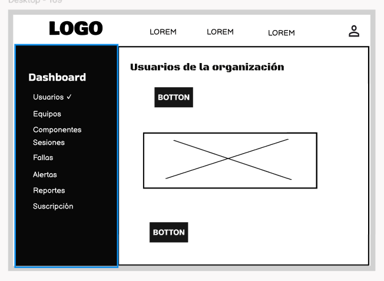 
 
 
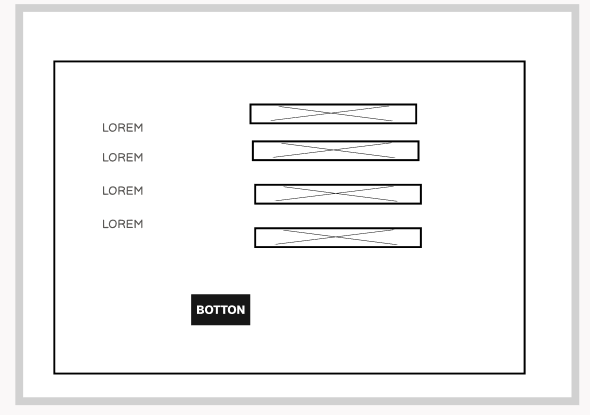 
 
 
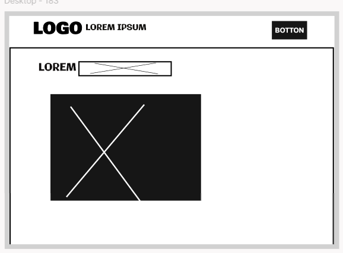 
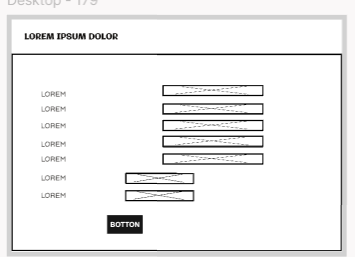 
 
 
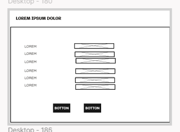 
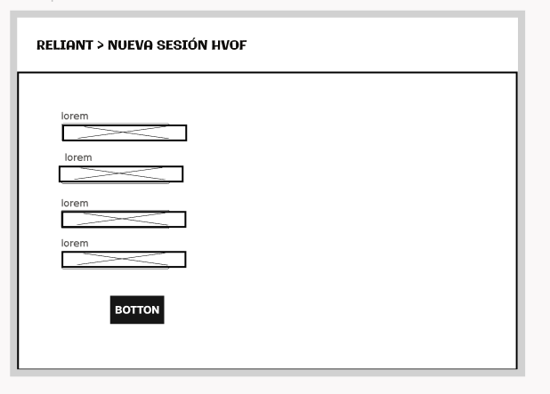 
 
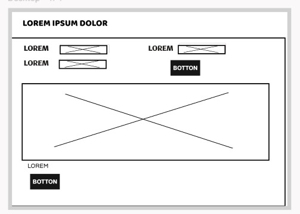 
 
 
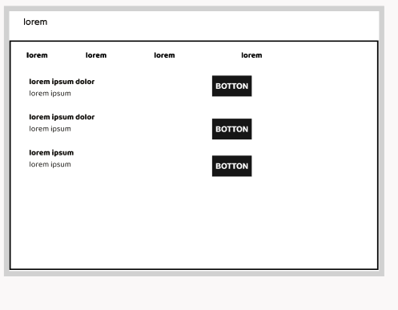 
 


### 4.4.2. Web Applications Wireflow Diagrams.
 


### 4.4.3. Web Applications Mock-ups.
 
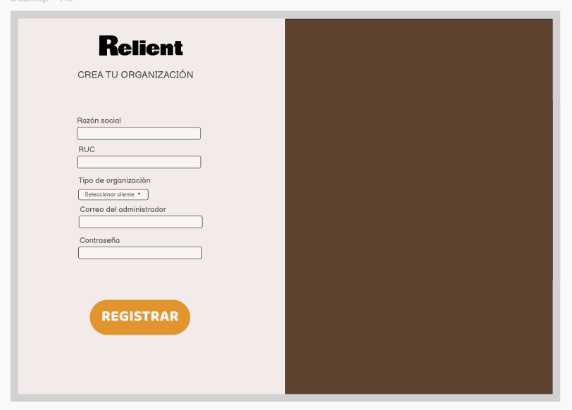 
 
 
 
 
 
 
 
 
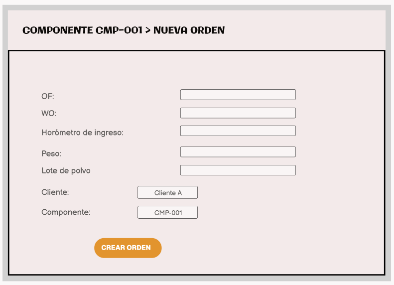 
 
 
 
 
 
 
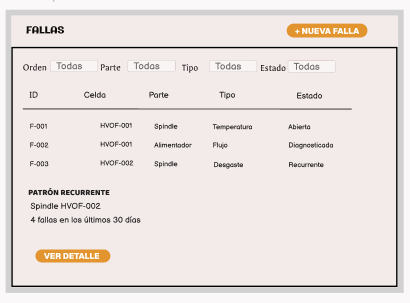 
 
 
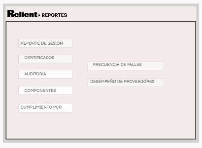 


### 4.4.4. Web Applications User Flow Diagrams.
 


## 4.5. Web Applications Prototyping.
En esta sección se presenta el prototipo interactivo de la Web Application de Reliant, desarrollado a partir de los mock-ups y User Flow Diagrams definidos previamente. El prototipo permite simular la navegación entre las principales vistas de la aplicación y validar la secuencia de interacción que siguen los usuarios para realizar sus tareas principales. Las conexiones entre pantallas fueron definidas considerando los recorridos establecidos en los User Flows y el sistema de navegación propuesto para la aplicación. Se consideraron las principales funcionalidades de Reliant, como el registro y seguimiento de componentes recuperados, la consulta de órdenes de trabajo, la trazabilidad de los procesos de recubrimiento HVOF, el monitoreo de parámetros de operación, el diagnóstico de fallas y el análisis del desempeño de los componentes frente a su vida útil esperada (PCR). A continuación, se presenta una captura del prototipo en funcionamiento y el enlace al video de demostración, donde se muestran los principales flujos de navegación e interacción de la aplicación.

# Video:  
https://youtu.be/ImzFsoEMSIk


## 4.6. Domain-Driven Software Architecture.
### 4.6.1. Design-Level Event Storming.
### 4.6.2. Software Architecture Context Diagram.
### 4.6.3. Software Architecture Container Diagrams.
### 4.6.4. Software Architecture Components Diagrams.
## 4.7. Software Object-Oriented Design.
### 4.7.1. Class Diagrams.
## 4.8. Database Design.
### 4.8.1. Database Diagrams.

# Capítulo V: Product Implementation, Validation & Deployment
## 5.1. Software Configuration Management.
### 5.1.1. Software Development Environment Configuration.
### 5.1.2. Source Code Management.
### 5.1.3. Source Code Style Guide & Conventions.
### 5.1.4. Software Deployment Configuration.
## 5.2. Landing Page, Services & Applications Implementation.
### 5.2.X. Sprint n
#### 5.2.X.1. Sprint Planning n.
#### 5.2.X.2. Aspect Leaders and Collaborators.
#### 5.2.X.3. Sprint Backlog n.
#### 5.2.X.4. Development Evidence for Sprint Review.
#### 5.2.X.5. Execution Evidence for Sprint Review.
#### 5.2.X.6. Services Documentation Evidence for Sprint Review.
#### 5.2.X.7. Software Deployment Evidence for Sprint Review.
#### 5.2.X.8. Team Collaboration Insights during Sprint.
## 5.3. Validation Interviews.
### 5.3.1. Diseño de Entrevistas.
### 5.3.2. Registro de Entrevistas.
### 5.3.3. Evaluaciones según heurísticas.
## 5.4. Video About-the-Product.
# Conclusiones
## Conclusiones y recomendaciones.
## Video About-the-Team.

# Bibliografía

- Automation World. (2025). *How to solve the hidden risks of paper manufacturing on the factory floor*. https://www.automationworld.com/control/article/55378030/how-to-solve-the-hidden-risks-of-paper-manufacturing-on-the-factory-floor

- Innovapptive. (2024, 26 de febrero). *Overcoming equipment maintenance challenges in mining industry*. https://www.innovapptive.com/blog/overcoming-equipment-maintenance-challenges-in-mining-industry

- Khan, M. N., Shah, S., & Shamim, T. (2019). *Investigation of operating parameters on high-velocity oxyfuel thermal spray coating quality for aerospace applications. The International Journal of Advanced Manufacturing Technology*, 103, 2677–2690. https://doi.org/10.1007/s00170-019-03696-0

- Malamousi, K., Delibasis, K., & Kamnis, S. (2024). Real-time thermal spray process monitoring using convolution neural network deep learning architectures. *Journal of Thermal Spray Technology*, 33(1), 17–32. https://doi.org/10.1007/s11666-024-01713-7

- Mauer, G. (2022). Process diagnostics and control in thermal spray. *Journal of Thermal Spray Technology*, 31(4), 818–828.

- Ministerio de Energía y Minas. (2026). *Boletín Estadístico Minero: Balance anual 2025*. [Citado en Revista Tecnología Minera]. https://tecnologiaminera.com/noticia/minem-peru-alcanza-us-62848-millones-en-exportaciones-en-2025-1774388279

- Oerlikon Metco. (2025). *Thermal spray process parameters*. https://www.oerlikon.com/metco/en/solutions-technologies/what-is-thermal-spray/thermal-spray-process-parameters/

- Siemens. (2022). *The true cost of downtime 2022*. https://assets.new.siemens.com/siemens/assets/api/uuid:3d606495-dbe0-43e4-80b1-d04e27ada920/dics-b10153-00-7600truecostofdowntime2022-144.pdf

- Springer Nature. (2025). Outlook of Industry 4.0 integrated technologies in thermal spray processes and applications. *Journal of Thermal Spray Technology*. https://doi.org/10.1007/s11666-025-02096-z

# Anexos
