<div align="center">
 

Universidad Peruana de Ciencias Aplicadas  
Carrera de Ingeniería de Software  

**1ASI0729**  


**Desarrollo de Aplicaciones Open Source**  
NRC  
**7753**  
### **Informe del Trabajo Final**  
Docente  
**Bautista Ubillús, Efrain Ricardo**


  
Equipo  
**InnovaCorp**  
Proyecto  
**Reliant**

**Integrantes**

| Código     | Apellidos y Nombres                  |
|:----------:|:-------------------------------------| 
| u20241b962 | Navarro Aldoradin, Carolina Celeste  |
| u20241f577 | Rivera Aguilar, Scarlet Josefina     |
| u202317807 | Fernandez Seer, Mario Alonso         |

**Periodo 202620**  


**Octubre, 2026**

</div>

<div style="page-break-after: always"></div>

# Registro de Versiones del Informe
| Versión | Fecha | Autor | Descripción de modificación |
|---------|-------|-------|-----------------------------|
| 1.0.1 | 2026-09-18 | Equipo InnovaCorp | Entrega AV1: capítulos I a IV (Startup Profile, Solution Profile, Requirements Elicitation & Analysis, Requirements Specification y Product Design) y sección 5.1 Software Configuration Management. |
| 2.0.0 | 2026-10-02 | Rivera Aguilar, Scarlet Josefina | Retiro de los dos integrantes que dejaron el equipo de los perfiles de integrantes; corrección de la fila duplicada y de los datos de Fernandez Seer, Mario Alonso. |
| 2.0.0 | 2026-10-05 | Navarro Aldoradin, Carolina Celeste | Retiro de los integrantes que dejaron el equipo de la carátula y del Student Outcome; acciones del TB1 en el Student Outcome; corrección de las rutas de imágenes tras la reorganización de `assets/`. |
| 2.0.0 | 2026-10-05 | Navarro Aldoradin, Carolina Celeste | Capítulo III: User Stories US65 (navegación), US66 (cambio de idioma de la aplicación) y US67 (gestión de la sesión), Epic E13, Escenario 3 de US22 y Product Backlog priorizado con Story Points. |
| 2.0.0 | 2026-10-05 | Navarro Aldoradin, Carolina Celeste | Capítulo IV: tipo de gráfico de los elementos de reporte (`viewType` / `view_type`) en 4.7.1 y 4.8.1. |
| 2.0.0 | 2026-10-05 | Navarro Aldoradin, Carolina Celeste | Sección 5.1: repositorios reales de la organización, herramientas del Sprint 2 y 5.1.4 Software Deployment Configuration actualizado a Azure App Service con GitHub Actions. |
| 2.0.0 | 2026-10-05 | Navarro Aldoradin, Carolina Celeste | Sección 5.2.2 Sprint 2 completa: Sprint Planning, LACX, Sprint Backlog, Development, Execution, Services Documentation y Software Deployment Evidence, y Team Collaboration Insights. |
| 2.0.0 | 2026-10-05 | Navarro Aldoradin, Carolina Celeste | Conclusiones y recomendaciones del Sprint 2, referencias bibliográficas de las tecnologías usadas y Anexo de Videos de Exposiciones. |

<!-- TODO: confirmar el número de versión del release de TB1 (2.0.0) al crear el release con Git Flow -->


# Project Report Collaboration Insights

El URL del repositorio para el Project Report en la organización de github es el siguiente:
[https://github.com/upc-pre-202620-1asi0729-7753-innovacorp/reliant-report](https://github.com/upc-pre-202620-1asi0729-7753-innovacorp/reliant-report)

Para la entrega TB1, el informe se actualizó siguiendo el mismo flujo de Git Flow que los demás repositorios del equipo: cada sección se trabajó en una rama `feature/tb1-*` creada desde `develop`, con commits en formato Conventional Commits, y se integró en `develop` mediante merge. Las secciones de TB1 comprenden las correcciones de los capítulos I a V, la especificación de las historias del Sprint 2 y la documentación completa del Sprint 2 en la sección 5.2.2. Las contribuciones de cada integrante al repositorio pueden revisarse en Insights → Contributors.

<!-- TODO: captura de Insights → Contributors de reliant-report (assets/img/5.chapter-v/report-contributors.png) -->


# Contenido

- [Registro de Versiones del Informe](#registro-de-versiones-del-informe)
- [Project Report Collaboration Insights](#project-report-collaboration-insights)
- [Contenido](#contenido)
- [Student Outcome](#student-outcome)
- [Capítulo I: Introducción](#capítulo-i-introducción)
  - [1.1. Startup Profile](#11-startup-profile)
    - [1.1.1. Descripción de la Startup](#111-descripción-de-la-startup)
    - [1.1.2. Perfiles de integrantes del equipo](#112-perfiles-de-integrantes-del-equipo)
  - [1.2. Solution Profile](#12-solution-profile)
    - [1.2.1 Antecedentes y problemática](#121-antecedentes-y-problemática)
    - [1.2.2 Lean UX Process.](#122-lean-ux-process)
      - [1.2.2.1. Lean UX Problem Statements.](#1221-lean-ux-problem-statements)
      - [1.2.2.2. Lean UX Assumptions.](#1222-lean-ux-assumptions)
      - [1.2.2.3. Lean UX Hypothesis Statements.](#1223-lean-ux-hypothesis-statements)
      - [1.2.2.4. Lean UX Canvas.](#1224-lean-ux-canvas)
  - [1.3. Segmentos objetivo.](#13-segmentos-objetivo)
- [Capítulo II: Requirements Elicitation & Analysis](#capítulo-ii-requirements-elicitation--analysis)
  - [2.1. Competidores.](#21-competidores)
    - [2.1.1. Análisis competitivo.](#211-análisis-competitivo)
    - [2.1.2. Estrategias y tácticas frente a competidores.](#212-estrategias-y-tácticas-frente-a-competidores)
  - [2.2. Entrevistas.](#22-entrevistas)
    - [2.2.1. Diseño de entrevistas.](#221-diseño-de-entrevistas)
    - [2.2.2. Registro de entrevistas.](#222-registro-de-entrevistas)
    - [2.2.3. Análisis de entrevistas.](#223-análisis-de-entrevistas)
  - [2.3. Needfinding.](#23-needfinding)
    - [2.3.1. User Personas.](#231-user-personas)
    - [2.3.2. User Task Matrix.](#232-user-task-matrix)
    - [2.3.3. User Journey Mapping.](#233-user-journey-mapping)
    - [2.3.4. Empathy Mapping.](#234-empathy-mapping)
  - [2.4. Big Picture Event Storming.](#24-big-picture-event-storming)
  - [2.5. Ubiquitous Language.](#25-ubiquitous-language)
    - [2.5.1. Organizaciones y roles](#251-organizaciones-y-roles)
    - [2.5.2. Componentes y trazabilidad](#252-componentes-y-trazabilidad)
    - [2.5.3. Vida útil y desempeño en campo](#253-vida-útil-y-desempeño-en-campo)
    - [2.5.4. Sistema HVOF y sus partes](#254-sistema-hvof-y-sus-partes)
    - [2.5.5. Proceso de rociado y monitoreo](#255-proceso-de-rociado-y-monitoreo)
    - [2.5.6. Fallas y diagnóstico](#256-fallas-y-diagnóstico)
    - [2.5.7. Alertas y evidencia de calidad](#257-alertas-y-evidencia-de-calidad)
    - [2.5.8. Control industrial y red de la celda](#258-control-industrial-y-red-de-la-celda)
    - [2.5.9. Tags, umbrales y lógica del PLC](#259-tags-umbrales-y-lógica-del-plc)
    - [2.5.10. Proceso HVOF y calidad del recubrimiento](#2510-proceso-hvof-y-calidad-del-recubrimiento)
    - [2.5.11. Contexto de los componentes mineros](#2511-contexto-de-los-componentes-mineros)
- [Capítulo III: Requirements Specification](#capítulo-iii-requirements-specification)
  - [3.1. User Stories](#31-user-stories)
  - [3.2. Impact Mapping.](#32-impact-mapping)
  - [3.3. Product Backlog](#33-product-backlog)
- [Capítulo IV: Product Design](#capítulo-iv-product-design)
  - [4.1. Style Guidelines.](#41-style-guidelines)
    - [4.1.1. General Style Guidelines.](#411-general-style-guidelines)
    - [4.1.2. Web Style Guidelines.](#412-web-style-guidelines)
  - [4.2. Information Architecture.](#42-information-architecture)
    - [4.2.1. Organization Systems.](#421-organization-systems)
    - [4.2.2. Labeling Systems.](#422-labeling-systems)
    - [4.2.3. SEO Tags and Meta Tags](#423-seo-tags-and-meta-tags)
    - [4.2.4. Searching Systems.](#424-searching-systems)
    - [4.2.5. Navigation Systems.](#425-navigation-systems)
  - [4.3. Landing Page UI Design.](#43-landing-page-ui-design)
    - [4.3.1. Landing Page Wireframe.](#431-landing-page-wireframe)
    - [4.3.2. Landing Page Mock-up.](#432-landing-page-mock-up)
  - [4.4. Web Applications UX/UI Design.](#44-web-applications-uxui-design)
    - [4.4.1. Web Applications Wireframes.](#441-web-applications-wireframes)
    - [4.4.2. Web Applications Wireflow Diagrams.](#442-web-applications-wireflow-diagrams)
    - [4.4.3. Web Applications Mock-ups.](#443-web-applications-mock-ups)
    - [4.4.4. Web Applications User Flow Diagrams.](#444-web-applications-user-flow-diagrams)
  - [4.5. Web Applications Prototyping.](#45-web-applications-prototyping)
  - [4.6. Domain-Driven Software Architecture.](#46-domain-driven-software-architecture)
    - [4.6.1. Design-Level Event Storming.](#461-design-level-event-storming)
    - [4.6.2. Software Architecture Context Diagram.](#462-software-architecture-context-diagram)
    - [4.6.3. Software Architecture Container Diagrams.](#463-software-architecture-container-diagrams)
    - [4.6.4. Software Architecture Components Diagrams.](#464-software-architecture-components-diagrams)
  - [4.7. Software Object-Oriented Design.](#47-software-object-oriented-design)
    - [4.7.1. Class Diagrams.](#471-class-diagrams)
  - [4.8. Database Design.](#48-database-design)
    - [4.8.1. Database Diagrams.](#481-database-diagrams)
- [Capítulo V: Product Implementation, Validation & Deployment](#capítulo-v-product-implementation-validation--deployment)
  - [5.1. Software Configuration Management.](#51-software-configuration-management)
    - [5.1.1. Software Development Environment Configuration.](#511-software-development-environment-configuration)
    - [5.1.2. Source Code Management.](#512-source-code-management)
    - [5.1.3. Source Code Style Guide & Conventions.](#513-source-code-style-guide--conventions)
    - [5.1.4. Software Deployment Configuration.](#514-software-deployment-configuration)
  - [5.2. Landing Page, Services & Applications Implementation.](#52-landing-page-services--applications-implementation)
    - [5.2.1. Sprint 1](#521-sprint-1)
    - [5.2.2. Sprint 2](#522-sprint-2)
      - [5.2.2.1. Sprint Planning 2.](#5221-sprint-planning-2)
      - [5.2.2.2. Aspect Leaders and Collaborators.](#5222-aspect-leaders-and-collaborators)
      - [5.2.2.3. Sprint Backlog 2.](#5223-sprint-backlog-2)
      - [5.2.2.4. Development Evidence for Sprint Review.](#5224-development-evidence-for-sprint-review)
      - [5.2.2.5. Execution Evidence for Sprint Review.](#5225-execution-evidence-for-sprint-review)
      - [5.2.2.6. Services Documentation Evidence for Sprint Review.](#5226-services-documentation-evidence-for-sprint-review)
      - [5.2.2.7. Software Deployment Evidence for Sprint Review.](#5227-software-deployment-evidence-for-sprint-review)
      - [5.2.2.8. Team Collaboration Insights during Sprint.](#5228-team-collaboration-insights-during-sprint)
  - [5.3. Validation Interviews.](#53-validation-interviews)
    - [5.3.1. Diseño de Entrevistas.](#531-diseño-de-entrevistas)
    - [5.3.2. Registro de Entrevistas.](#532-registro-de-entrevistas)
    - [5.3.3. Evaluaciones según heurísticas.](#533-evaluaciones-según-heurísticas)
  - [5.4. Video About-the-Product.](#54-video-about-the-product)
- [Conclusiones](#conclusiones)
  - [Conclusiones y recomendaciones.](#conclusiones-y-recomendaciones)
  - [Video About-the-Team.](#video-about-the-team)
- [Bibliografía](#bibliografía)
- [Anexos](#anexos)
  - [Anexo: Videos de Exposiciones](#anexo-videos-de-exposiciones)

# Student Outcome

El curso contribuye al cumplimiento del Student Outcome ABET: ABET – EAC - Student Outcome 5 Criterio: La capacidad de funcionar efectivamente en un equipo cuyos miembros juntos proporcionan liderazgo, crean un entorno de colaboración e inclusivo, establecen objetivos, planifican tareas y cumplen objetivos. En el siguiente cuadro se describe las acciones realizadas y enunciados de conclusiones por parte del grupo, que permiten sustentar el haber alcanzado el logro del ABET – EAC - Student Outcome 5.

| Criterio específico                                                                             | Acciones realizadas | Conclusiones |
|:-----------------------------------------------------------------------------------------------:|:-------------------:|:------------:|
| Trabaja en equipo para proporcionar liderazgo en forma conjunta | **AV1:**<br>**Mario Fernandez:** Planificó, ejecutó y documentó la entrevista al segmento Asset Owner. Elaboró wireframes que tradujeron hallazgos mineros en flujos y pantallas. Apoyó mockups, consistencia visual y evidencias UX/UI y del About the Team.<br>**Scarlet Rivera:** Participé en el desarrollo de la etapa de investigación de usuarios de InnovaCorp – Reliant mediante el diseño, registro y análisis de entrevistas, así como la realización de entrevistas personales. A través de este proceso, se recopilaron y analizaron las necesidades, experiencias y dificultades de los usuarios relacionados con la gestión de procesos industriales, considerando los segmentos objetivo definidos para el proyecto. Los resultados obtenidos permitieron comprender la problemática actual, identificar oportunidades de mejora y establecer una base para el diseño de una solución que contribuya a la trazabilidad, seguridad y eficiencia de las operaciones industriales.<br>**Carolina Navarro:** Me encargué de realizar múltiples tareas esenciales para alcanzar el éxito del trabajo, tales como la formulación de preguntas para las encuestas, el desarrollo de gráficos y múltiples commits y push sobre el markdown README.<br><br>**TB1:**<br>**Carolina Navarro:** Lideré los aspectos Shared & Navigation, IAM, Equipment, Traceability, Process Monitoring y Billing del Sprint 2. Desarrollé la Frontend Web Application en Angular (16 features sobre cinco bounded contexts), preparé el fake API `reliant-platform-mock` con datos reales de proceso y desplegué ambos productos en Azure App Service con GitHub Actions, publicando los releases 1.0.0 y 1.0.1.<br>**Scarlet Rivera:** Lideré el aspecto Landing Page Design del Sprint 2, a cargo de los wireframes y mock-ups de la Landing Page, y colaboré en su internacionalización.<br>**Mario Fernandez:** Lideré el aspecto Landing Page i18n del Sprint 2, a cargo de la versión en inglés y español de la Landing Page y de su selector de idioma, y colaboré en su diseño.<!-- TODO: el repositorio reliant-website no registra commits de Landing Page Design; agregar la evidencia o ajustar este texto --> | Se concluye que el liderazgo compartido permitió aprovechar las fortalezas de cada integrante, facilitando la coordinación, la toma de decisiones y el avance conjunto hacia los objetivos del proyecto. En el Sprint 2, la asignación de un líder por aspecto permitió que cada bounded context de la Web Application y cada frente de la Landing Page tuviera un responsable claro. |
| Crea un entorno colaborativo e inclusivo, establece metas, planifica tareas y cumple objetivos. | **AV1:**<br>**Mario Fernandez:** Considero que logré establecer metas pragmáticas que contribuyeron al éxito del startup.<br>**Scarlet Rivera:** Participé en el diseño y organización de la experiencia de usuario de InnovaCorp – Reliant mediante la elaboración de los Style Guidelines, la arquitectura de información y el diseño de las interfaces web. Para ello, desarrollé las guías generales y web de estilo, los sistemas de organización, etiquetado, búsqueda y navegación, así como los SEO Tags y Meta Tags. Asimismo, elaboré los wireframes, mockups y diagramas de flujo de la Landing Page y la Web Application, complementando el proceso con el prototipado de las funcionalidades. Estas actividades permitieron estructurar la información, definir la organización visual y establecer una experiencia de navegación coherente con las necesidades de los usuarios y los objetivos del proyecto.<br>**Carolina Navarro:** Me encargué de dirigir este equipo a través de diversas tribulaciones siempre manteniendo una dirección firme y trato cordial con mis compañeros y mediante estas habilidades blandas, pudimos formar un excelente equipo el cual logró integrarse para dar como resultado este startup llamado InnovaCorp con el producto Reliant.<br><br>**TB1:**<br>**Carolina Navarro:** Preparé el Sprint Planning 2, definí el Sprint Goal y descompuse las 16 features en tasks. Mantuve el flujo de trabajo con Git Flow (una rama `feature/*` por feature), Conventional Commits y Semantic Versioning, y documenté el Sprint 2 en el informe.<br>**Scarlet Rivera:** Participé como colaboradora del aspecto Landing Page i18n, de acuerdo con la matriz de líderes y colaboradores del Sprint 2.<br>**Mario Fernandez:** Participé como colaborador del aspecto Landing Page Design, de acuerdo con la matriz de líderes y colaboradores del Sprint 2. | Se concluye que establecer metas claras, distribuir responsabilidades y mantener una comunicación colaborativa permitió organizar el trabajo de manera efectiva y cumplir los objetivos planteados. En el Sprint 2, un Sprint Goal verificable y un flujo de ramas común facilitaron integrar y desplegar la Web Application dentro del plazo. |


# Capítulo I: Introducción
## 1.1. Startup Profile
### 1.1.1. Descripción de la Startup
**InnovaCorp** es una startup tecnológica peruana enfocada en resolver problemas de grandes organizaciones, especialmente del sector Minero e Industrial, de manera ágil e innovadora. Nace de la experiencia directa en planta, donde identificamos que procesos críticos de alta especialización siguen operando con información dispersa, registros manuales y diagnósticos que dependen del conocimiento tácito de pocas personas. Combinamos conocimiento de procesos industriales con desarrollo de software moderno para convertir datos que hoy se pierden en decisiones que evitan fallas y paradas no programadas.

*Misión*
Nuestra misión es brindar a las empresas del sector minero e industrial soluciones tecnológicas que transformen los datos de sus procesos productivos en información accionable, permitiéndoles anticipar fallas, garantizar la trazabilidad de sus operaciones y sostener con evidencia la calidad que sus clientes exigen. Buscamos que ninguna organización dependa del conocimiento tácito ni de registros manuales para tomar decisiones críticas sobre sus procesos.

*Visión*
Ser la plataforma de referencia en Latinoamérica para el monitoreo y la trazabilidad de procesos industriales de alta especialización, reconocida por acercar la analítica de datos a operaciones que históricamente han quedado fuera de la transformación digital, y por convertir cada proceso ejecutado en conocimiento que mejora el siguiente.


### 1.1.2. Perfiles de integrantes del equipo
| Foto de participante                                                    | Nombres y apellidos                | Código de estudiante  | Descripción de carrera                                            | Principales conocimiento técnicos y habilidades                                                                                                                                           |
|:------------------------------------------------------------------------|------------------------------------|-----------------------|-------------------------------------------------------------------|-------------------------------------------------------------------------------------------------------------------------------------------------------------------------------------------|
|   | Carolina Celeste Navarro Aldoradin | u20241b962            | Ingeniería de Software, Universidad Peruana de Ciencias Aplicadas | Cuento con conocimiento del lenguaje Java, C#, C++, Javascript, Python y Ladder. Asimismo, cuento con experiencia en proyectos de integración, monitoreo e IoT en entornos industriales.  |
|  | Scarlet Josefina Rivera Aguilar    | u20241f577            | Ingeniería de Software, Universidad Peruana de Ciencias Aplicadas | Durante mi formación en Ingeniería de Software, actualmente en quinto ciclo, he desarrollado conocimientos en distintos lenguajes de programación, organización y planificación de proyectos. Asimismo, he participado en proyectos académicos relacionados con el desarrollo de aplicaciones web, diseño de interfaces y elaboración de prototipos. |
|  | Mario Alonso Fernández Seer | U202317807 | Ingeniería de Software, Universidad Peruana de Ciencias Aplicadas | Cuento con conocimientos en C++, Python, JavaScript, desarrollo web y diseño de bases de datos. Asimismo, poseo habilidades para el análisis de requerimientos, la documentación de proyectos y la investigación de usuarios. En Reliant participé en el levantamiento y análisis de información del segmento Asset Owner. |


## 1.2. Solution Profile

### 1.2.1 Antecedentes y problemática
La minería constituye el principal motor exportador de la economía peruana. Según el Boletín Estadístico Minero del Ministerio de Energía y Minas, las exportaciones de productos mineros totalizaron US$ 62,848 millones durante 2025, un crecimiento de 27.2 % respecto al año anterior, y representaron alrededor del 67.5 % del valor total exportado por el país. Esta magnitud implica que cualquier interrupción en la cadena de operación minera tiene un impacto directo sobre la economía nacional.

Para sostener esa operación, las mineras dependen de componentes sometidos a desgaste abrasivo severo: ejes de bombas de lodo, rodillos, válvulas e impulsores. Una de las tecnologías más empleadas para extender la vida útil de estas piezas es el recubrimiento por proyección térmica de alta velocidad (HVOF, High Velocity Oxygen Fuel), que deposita capas metálicas de alta densidad y resistencia al desgaste. En el Perú, este servicio no lo ejecuta la minera directamente, sino empresas especializadas que operan como proveedores del sector.

La calidad del recubrimiento depende críticamente de los parámetros de proceso. Khan, Shah y Shamim (2019) establecieron que la calidad del recubrimiento HVOF depende en gran medida de las condiciones operativas seleccionadas durante la aplicación, y estudios posteriores confirman que variables como la tasa de alimentación de polvo, la distancia de proyección, la relación combustible-oxígeno y el flujo total de gases inciden directamente sobre propiedades clave como porosidad, dureza y resistencia al desgaste. Fabricantes de equipos advierten que estas variables deben tratarse como parámetros de proceso con valores y tolerancias formalmente definidos, ya que sin ese control la calidad del recubrimiento puede verse afectada de formas inesperadas y costosas.

Pese a ello, el monitoreo en tiempo real del proceso sigue siendo un desafío técnico. Malamousi, Delibasis y Kamnis (2024) señalan que la proyección térmica es difícil de monitorear en tiempo real debido a las altas velocidades y temperaturas involucradas y al movimiento continuo de la pistola o de la pieza, y que los equipos de monitoreo estáticos existentes no logran seguir la antorcha, lo que dificulta asegurar parámetros óptimos de proceso. En paralelo, la literatura reciente sobre Industria 4.0 aplicada a proyección térmica plantea la necesidad de implementar un control de proceso más inteligente que integre datos de sensores con parámetros de máquina, características del material de aporte y métricas de calidad posteriores a la deposición, para cumplir requisitos de confiabilidad y repetibilidad.

En el contexto peruano, los proveedores de recuperación y sus clientes mineros enfrentan cuatro problemas concurrentes.

Primero, pérdida de trazabilidad del proceso. Los parámetros de operación se generan en el PLC de la máquina, pero se conservan en registros locales o en formatos no consultables. Cuando el cliente exige evidencia de que un lote fue recubierto dentro de tolerancias, la empresa carece de un respaldo estructurado que vincule la orden de fabricación (OF) y la orden de trabajo (WO) con las condiciones reales de la sesión de rociado. Esta dependencia de registros dispersos es un problema documentado en la industria: los procesos basados en papel introducen riesgos de lectura errónea, registro inconsistente e información fragmentada, que retrasan la detección y resolución de incidencias.

Segundo, diagnóstico de fallas dependiente de conocimiento tácito. Cuando el equipo se detiene por una falla, como bloqueo del alimentador, sobrepresión de tolva, paro por temporizador, la identificación de la causa raíz depende de la experiencia de pocos técnicos y de la revisión manual de registros crudos. No existe un mecanismo que correlacione automáticamente la falla con el subsistema o parte del sistema HVOF responsable, lo que prolonga el tiempo de diagnóstico y dificulta detectar patrones recurrentes.

Tercero, imposibilidad de análisis retrospectivo contra el PCR. Las piezas recubiertas se entregan con una expectativa de vida útil formalizada en el Planned Component Replacement (PCR). Cuando una pieza retorna del campo antes de alcanzar ese objetivo, no es posible reconstruir con qué parámetros fue recubierta ni determinar si la falla prematura tuvo origen en el proceso de recubrimiento, en el material, o en las condiciones de operación en mina.

Cuarto, ausencia de una vista consolidada del desempeño de los componentes recuperados. Una empresa minera trabaja con varios proveedores de recuperación y recibe de cada uno la evidencia en su propio formato. No dispone de un medio para comparar, con datos, qué proveedor entrega componentes que alcanzan su PCR con mayor frecuencia, ni para registrar de forma estructurada el retorno de campo de cada pieza. Como resultado, las decisiones de renovación o cambio de proveedor se sustentan en percepción y no en evidencia, y el conocimiento sobre el desempeño real de los componentes se dispersa entre hojas de cálculo y correos.

El costo de esta brecha de información es significativo. El reporte True Cost of Downtime de Siemens estima que las 500 mayores empresas del mundo pierden alrededor del 11 % de sus ingresos por paradas no planificadas, equivalente a USD 1.4 billones anuales, y la falla de componentes críticos representa el 45 % de los casos reportados de downtime. En el sector minero específicamente, estimaciones de la industria sitúan el costo promedio de una parada de equipo en torno a US$ 180,000 por incidente.

En síntesis, existe una desconexión entre los datos que la máquina HVOF ya genera y la capacidad de la organización para convertirlos en trazabilidad verificable, diagnóstico oportuno y aprendizaje sobre el desempeño en campo. Reliant se propone cerrar esa brecha mediante una plataforma que capture la telemetría del proceso, la vincule a la orden de trabajo y a la pieza del cliente, con el subsistema o parte del sistema HVOF implicado, y ofrezca al propietario del activo una vista consolidada del cumplimiento de PCR por proveedor, modelo y tipo de componente.

A continuación, se muestra un árbol de problemas que ordena visualmente las causas y efectos del problema mencionados anteriormente.


```mermaid
flowchart BT

classDef efectoFinal fill:#C62828,stroke:#8E0000,stroke-width:2px,color:#FFFFFF
classDef efectoDirecto fill:#EF9A9A,stroke:#C62828,stroke-width:1px,color:#000000
classDef central fill:#FFB300,stroke:#E65100,stroke-width:3px,color:#000000
classDef causaDirecta fill:#90CAF9,stroke:#1565C0,stroke-width:1px,color:#000000
classDef causaRaiz fill:#C8E6C9,stroke:#2E7D32,stroke-width:1px,color:#000000

PC["<b>PROBLEMA CENTRAL</b><br/><br/>Las empresas de servicio de recubrimiento HVOF<br/>no logran convertir los datos que genera el proceso<br/>en trazabilidad verificable, diagnostico oportuno<br/>ni aprendizaje sobre el desempeno en campo"]

CR1["La telemetria del PLC se guarda<br/>en archivos locales no consultables"]
CR2["No existe vinculo entre el dato de proceso<br/>y la OF / WO / cliente / modelo"]
CR3["El registro de la sesion de rociado<br/>se lleva de forma manual o en papel"]

CR4["No hay catalogo formal de reglas<br/>causa-efecto para las fallas"]
CR5["La falla no se correlaciona<br/>con el subsistema o parte del sistema HVOF responsable"]
CR6["El diagnostico exige revision manual<br/>de logs crudos del PLC"]

CR7["El PCR comprometido no se registra<br/>de forma digital ni consultable"]
CR8["El retorno de la pieza desde mina<br/>no se vincula a su sesion de rociado"]

CR9["Las recetas del controlador definen umbrales<br/>de seguridad, pero no la banda de calidad<br/>que exige el cliente"]
CR10["El PLC solo alarma al cruzar el umbral de parada;<br/>una desviacion dentro de ese margen<br/>pasa inadvertida"]
CR11["Cada proveedor entrega su evidencia<br/>en su propio formato"]
CR12["El retorno de campo se registra en hojas<br/>de calculo, sin vinculo con la pieza"]

CD1["<b>C1.</b> Perdida de trazabilidad<br/>del proceso de rociado"]
CD2["<b>C2.</b> Diagnostico de fallas dependiente<br/>del conocimiento tacito de pocas personas"]
CD3["<b>C3.</b> Imposibilidad de analisis retrospectivo<br/>del desempeno en campo contra el PCR"]
CD4["<b>C4.</b> Deteccion tardia de desviaciones<br/>durante la operacion"]
CD5["<b>C5.</b> Sin vista consolidada del desempeno<br/>de componentes por proveedor"]

ED1["<b>E1.</b> Imposible emitir evidencia documentada<br/>de calidad al cliente minero"]
ED2["<b>E2.</b> Tiempo de diagnostico prolongado<br/>ante cada parada del equipo"]
ED3["<b>E3.</b> Fallas recurrentes no detectadas<br/>ni atribuidas a un componente"]
ED4["<b>E4.</b> Piezas recubiertas fuera de tolerancia<br/>sin que se advierta a tiempo"]
ED5["<b>E5.</b> No se puede determinar el origen<br/>de una falla prematura en campo"]
ED6["<b>E6.</b> Decisiones de contrato con proveedores<br/>basadas en percepcion, no en datos"]

EF1["<b>EF1.</b> Paradas no planificadas<br/>y sobrecosto operativo"]
EF2["<b>EF2.</b> Componentes que fallan<br/>antes de alcanzar su PCR"]
EF3["<b>EF3.</b> Perdida de confianza y de contratos<br/>con clientes del sector minero"]
EF4["<b>EF4.</b> El conocimiento del proceso no se acumula:<br/>cada falla se resuelve desde cero"]

CR1 --> CD1
CR2 --> CD1
CR3 --> CD1

CR4 --> CD2
CR5 --> CD2
CR6 --> CD2

CR7 --> CD3
CR8 --> CD3

CR9 --> CD4
CR10 --> CD4

CR11 --> CD5
CR12 --> CD5

PC --> ED6
ED6 --> EF3
ED6 --> EF4

CD1 --> PC
CD2 --> PC
CD3 --> PC
CD4 --> PC
CD5 --> PC

%% Main problem

PC --> ED1
PC --> ED2
PC --> ED3
PC --> ED4
PC --> ED5

ED1 --> EF3
ED2 --> EF1
ED3 --> EF1
ED3 --> EF4
ED4 --> EF2
ED5 --> EF2
ED5 --> EF4
ED4 --> EF3

%% Styles

class PC central
class CD1,CD2,CD3,CD4,CD5 causaDirecta
class CR1,CR2,CR3,CR4,CR5,CR6,CR7,CR8,CR9,CR10,CR11,CR12 causaRaiz
class ED1,ED2,ED3,ED4,ED5,ED6 efectoDirecto
class EF1,EF2,EF3,EF4 efectoFinal
```

### 1.2.2 Lean UX Process.

El Lean UX Process permite a InnovaCorp validar de forma temprana las creencias que sustentan Reliant, evitando construir funcionalidad sobre supuestos no verificados. El proceso parte de un enunciado único del problema para todo el proyecto, del cual se derivan los assumptions organizados en cinco categorías, y de estos, específicamente de los feature assumptions, se formulan los hypothesis statements que el equipo someterá a validación durante los sprints. Se aplica la versión del template Brand new initiative, dado que Reliant no constituye la evolución de un producto existente sino una iniciativa nueva.

#### 1.2.2.1. Lean UX Problem Statements.

Siguiendo la indicación del enunciado, se elabora un único Problem Statement para todo el proyecto, considerando en él ambos segmentos objetivo.

***The current state of*** *the industrial thermal spray coating market (HVOF) has focused mainly on delivering the coating as a physical service to mining and heavy-industry clients, on operator expertise as the primary mechanism for detecting process deviations, and on workflows where process parameters generated by the machine PLC remain in local logs that are never linked to the work order, the client component, or its expected service life.*

***What existing products/services fail to address is*** *the gap between the telemetry the HVOF equipment already produces and the organization's ability to turn it into verifiable traceability, timely fault diagnosis pointing to a specific HVOF subsystem or part involved, and retrospective learning about how coated components actually perform in the field against their Planned Component Replacement (PCR) target.*

***Our product/service will address this gap by*** *providing a web platform that ingests spray process telemetry in real time through a RESTful API, links every spray session to its manufacturing order (OF), work order (WO), client and component model, raises alerts when parameters leave the quality band defined in the recipe loaded for that component, even when the PLC has not triggered any alarm at its own warning or shutdown thresholds, applies a configurable cause-effect rule catalog to identify the suspect machine part, and records field service life to compare actual performance against the committed PCR.*

***Our initial focus will be*** specialized HVOF coating service providers (Recuperation Suppliers) operating in Peru that serve mining clients and are required to demonstrate process quality, and secondarily the mining companies themselves (Asset Owners), which receive the recovered components, know their actual performance in the field, and need a consolidated view of PCR compliance across all their coating suppliers.

***We'll know we are successful when we see*** *coating service providers issuing quality evidence generated by the platform for at least 80% of their delivered work orders, a reduction of at least 40% in the time required to determine the probable cause of an equipment stoppage, and at least 60% of returned components having their field service life recorded and compared against their PCR target within the platform.*


#### 1.2.2.2. Lean UX Assumptions.

A continuación se enumeran las creencias resultantes de la sesión de discusión del equipo, organizadas según los cinco tipos de assumptions establecidos en Lean UX. Estos enunciados constituyen creencias, no preguntas de discusión.

**Business Assumptions**

1. Creemos que existe en el Perú un número suficiente de empresas de servicio especializado en recubrimiento HVOF y de empresas mineras que reciben componentes recuperados de múltiples proveedores como para sostener un modelo de suscripción B2B con dos planes.
2. Creemos que la presión por trazabilidad proviene del cliente final (minera) y se transfiere contractualmente al proveedor de recubrimiento, lo que convierte la evidencia de proceso en un requisito comercial y no en una mejora opcional.
3. Creemos que los proveedores de recuperación están dispuestos a pagar una suscripción mensual por sistema HVOF monitoreado, y las mineras una suscripción por volumen de componentes bajo seguimiento, siempre que el costo sea marginal frente al de una parada no planificada o de una falla prematura en campo.
4. Creemos que Innovacorp puede construir y operar la plataforma con tecnologías open source (Spring Boot, Angular, PostgreSQL) sin incurrir en costos de licenciamiento que comprometan el margen.
5. Creemos que la integración con el equipo HVOF puede realizarse mediante un gateway que exponga la telemetría vía API REST, sin requerir modificar el PLC ni el software del fabricante del equipo.
6. Creemos que el conocimiento del dominio industrial que posee el equipo constituye una barrera de entrada frente a competidores de software genérico de mantenimiento.
7. Creemos que las mineras pagarán por una vista consolidada del desempeño de sus componentes recuperados porque ningún proveedor individual puede ofrecerles la comparación entre proveedores.

**Business Outcome Assumptions**
1. Creemos que el éxito se evidenciará en la cantidad de órdenes de trabajo cerradas en la plataforma con certificado de calidad emitido.
2. Creemos que el éxito se evidenciará en la reducción del tiempo promedio entre la ocurrencia de una falla y la identificación de su causa probable.
3. Creemos que el éxito se evidenciará en la tasa de renovación de la suscripción al término del primer año.
4. Creemos que el éxito se evidenciará en el número de componentes retornados de campo cuyo desempeño real fue registrado y contrastado contra su PCR.
5. Creemos que el éxito se evidenciará en la cantidad de sesiones de rociado registradas por mes y por sistema HVOF, como indicador de adopción sostenida.
6. Creemos que el éxito se evidenciará en la reducción del número de reclamos de clientes por fallas prematuras que no pudieron ser explicadas.
7. Creemos que el éxito se evidenciará en el número de organizaciones Asset Owner que consultan el reporte de cumplimiento de PCR por proveedor para sustentar una decisión contractual.

**User Assumptions**
1. Creemos que el usuario principal del segmento de empresas de servicio es el Ingeniero de Calidad o Jefe de Procesos, responsable de que el recubrimiento cumpla las especificaciones acordadas con el cliente.
2. Creemos que el usuario principal del segmento Asset Owner es el Ingeniero de Confiabilidad o Planner de Mantenimiento de la minera, responsable de la vida útil de los componentes en operación, con el Analista de Compras como usuario secundario para la evaluación de proveedores.
3. Creemos que el operador de la cabina de rociado es un usuario secundario que interactúa con la plataforma principalmente para iniciar y cerrar sesiones, y para atender alertas.
4. Creemos que los perfiles de ambos segmentos poseen alta competencia en el dominio industrial pero competencia media en herramientas de software, por lo que la curva de aprendizaje debe ser mínima.
5. Creemos que estos usuarios acceden a la plataforma principalmente desde computadores de escritorio en oficina o taller, y de forma secundaria desde dispositivos móviles para consultar alertas.
6. Creemos que el técnico de mantenimiento no requiere que el sistema le indique qué hacer, sino dónde mirar: qué subsistema o parte del sistema HVOF responsable está implicado en la falla.

**User Outcome and Benefit Assumptions**
1. Creemos que el Ingeniero de Calidad busca poder respaldar ante su cliente que un lote fue recubierto dentro de tolerancias, sin depender de reconstruir información desde registros dispersos.
2. Creemos que el Supervisor de Mantenimiento de máquina busca reducir el tiempo que dedica a determinar por qué se detuvo el sistema HVOF.
3. Creemos que ambos perfiles buscan anticipar fallas recurrentes antes de que impacten una ventana de producción comprometida.
4. Creemos que el usuario obtiene valor al poder responder, frente a una falla prematura en campo, si el origen estuvo en el proceso de recubrimiento o fue ajeno a él.
5. Creemos que el usuario valora que el conocimiento sobre fallas quede registrado en el sistema y no dependa de la permanencia de un especialista en la organización.
6. Creemos que el operador obtiene valor al ser advertido de una desviación mientras la sesión está en curso, y no al finalizarla.
7. Creemos que el Ingeniero de Confiabilidad de la minera obtiene valor al registrar el retorno de campo de cada componente en un solo lugar y saber de inmediato si alcanzó su PCR.
8. Creemos que el Analista de Compras obtiene valor al comparar proveedores con datos de cumplimiento de PCR en lugar de con percepción.

**Feature Assumptions**
1. Creemos que un endpoint REST de ingesta de telemetría que registre las lecturas de proceso durante la sesión de rociado permitirá conservar el dato que hoy se pierde.
2. Creemos que vincular cada sesión de rociado con su OF, WO, cliente y modelo de componente permitirá reconstruir la historia completa de cualquier pieza.
3. Creemos que definir recetas por sistema HVOF con setpoints y bandas de umbral (calidad, advertencia y parada), vinculadas a los tipos y modelos de componente a los que aplican, permitirá detectar desviaciones de calidad que el PLC no alarma y advertir cuando la receta cargada no corresponde al componente de la orden.
4. Creemos que un módulo de alertas en tiempo real notificará al responsable en el momento en que la desviación ocurre.
5. Creemos que un catálogo configurable de reglas causa-efecto que identifique el subsistema o parte del sistema HVOF sospechoso reducirá el tiempo de diagnóstico.
6. Creemos que la detección de patrones recurrentes de falla por subsistema o parte permitirá anticipar problemas antes de que provoquen una parada mayor.
7. Creemos que la generación exportable de certificados de calidad por orden de trabajo permitirá entregar evidencia documentada al cliente.
8. Creemos que el registro de vida útil en campo contrastado contra el PCR comprometido permitirá evaluar el desempeño real del recubrimiento a lo largo del tiempo.
9. Creemos que reportes de tasa de falla y cumplimiento de PCR agrupados por proveedor, cliente, modelo y tipo de componente revelarán patrones que hoy no son visibles para la organización.
10. Creemos que una vista consolidada de todos los componentes recuperados de una minera, sin importar qué proveedor los trabajó, eliminará el cruce manual de información entre formatos distintos.
11. Creemos que plantillas de reporte personalizables con logo, layout, variables, tipos de vista y unidades, compartibles dentro de la organización, harán que los reportes se adopten en lugar de rehacerse en Excel.

### 1.2.2.3. Lean UX Hypothesis Statements.

Se formula un hypothesis statement por cada feature assumption enunciado en la sección anterior, siguiendo el template establecido.

---
**Hypothesis Statement 01. Ingesta de telemetría de proceso**

**We believe we will achieve** an increase in the number of spray sessions with complete process records stored in the platform  
**If** Quality Engineers at Recuperation Suppliers and Reliability Engineers at Asset Owners  
**Attain** a permanent, queryable record of the conditions under which every spray session was executed  
**With** a RESTful telemetry ingestion endpoint that registers process readings throughout the spray session.

---
**Hypothesis Statement 02. Vinculación de la sesión con OF, WO, cliente y modelo**

**We believe we will achieve** an increase in the percentage of work orders that can be fully traced from client to process conditions  
**If** Quality Engineers at HVOF coating service providers  
**Attain** the ability to reconstruct the complete history of any coated component on demand  
**With** the linking of every spray session to its manufacturing order, work order, client and component model.
---
**Hypothesis Statement 03. Recetas y bandas de umbral**

**We believe we will achieve** a reduction in components coated outside the quality band without detection and in sessions run with the wrong recipe  
**If** Quality Engineers and spray booth Operators  
**Attain** automatic identification of out-of-tolerance conditions without depending on continuous manual supervision  
**With** per-system recipes that define setpoints and threshold bands linked to the applicable component types and models, with automatic band classification of every reading and recipe-mismatch warnings.
---
**Hypothesis Statement 04. Alertas en tiempo real**

**We believe we will achieve** a reduction in the average time between a process deviation and the response of the responsible person  
**If** spray booth Operators and Maintenance Supervisors  
**Attain** awareness of a deviation while the session is still running rather than after it ends  
**With** a real-time alerting module that notifies the responsible user when a deviation or fault is detected.
---
**Hypothesis Statement 05. Diagnóstico asistido por reglas causa-efecto**

**We believe we will achieve** a reduction of at least 40% in the time required to determine the probable cause of an equipment stoppage  
**If** Maintenance Supervisors and maintenance technicians  
**Attain** a diagnosis that points to the specific HVOF subsystem or part involved instead of a raw fault code  
**With** a configurable cause-effect rule catalog that correlates the fault with a suspect subsystem or part.
---
**Hypothesis Statement 06. Detección de patrones recurrentes de falla**

**We believe we will** achieve a reduction in unplanned stoppages during committed production windows    
**If** Maintenance Supervisors at Recuperation Suppliers  
**Attain** early visibility of HVOF parts that are failing repeatedly  
**With** automatic detection of recurring fault patterns grouped by subsystem, part and HVOF system.
---
**Hypothesis Statement 07. Certificados de calidad por orden de trabajo**

**We believe we will achieve** quality evidence generated by the platform for at least 80% of delivered work orders  
**If** Quality Engineers at HVOF coating service providers  
**Attain** the ability to hand their mining clients documented proof that the batch was coated within tolerance  
**With** exportable quality certificate generation per work order.
---
**Hypothesis Statement 08. Registro de vida útil contra PCR**

**We believe we will achieve** field service life recorded and compared against PCR for at least 60% of returned components  
**If** Reliability Engineers at Asset Owners and Quality Engineers at Recuperation Suppliers.  
**Attain** the ability to determine whether a premature field failure originated in the coating process or elsewhere  
**With** field service life recording contrasted against the committed Planned Component Replacement target.
--- 

**Hypothesis Statement 09. Reportes de tasa de falla por cliente y modelo**

**We believe we will achieve** an increase in the number of process improvement decisions supported by historical evidence  
**If** Reliability Engineers and Procurement Analysts at Asset Owners, and Quality Engineers at Recuperation Suppliers  
**Attain** visibility of failure patterns that are not observable from individual work orders  
**With** failure rate and PCR compliance reports grouped by supplier, client, machine model and component type.
---

**Hypothesis Statement 10. Vista consolidada multi-proveedor**

**We believe we will achieve** adoption of the Asset Owner plan by mining companies
**If** Reliability Engineers and Procurement Analysts at Asset Owners
**Attain** a single view of every recovered component in operation, regardless of which supplier recovered it
**With** a consolidated component view linked to each supplier's quality certificate and field-return record.
---

**Hypothesis Statement 11. Plantillas de reporte personalizables**

**We believe we will achieve** an increase in reports generated and shared from the platform instead of rebuilt in spreadsheets
**If** Quality Engineers and Reliability Engineers
**Attain** reports that carry their organization's branding and show only the variables, views and units they need
**With** customizable report templates that can be shared within the organization.

### 1.2.2.4. Lean UX Canvas.

A continuación se presenta el Lean UX Canvas (versión 2, Jeff Gothelf) elaborado por el equipo, el cual consolida en un solo artefacto el problema de negocio, los resultados esperados, los usuarios, las soluciones propuestas y las hipótesis derivadas de las secciones anteriores. Los cuadros 7 y 8 establecen la prioridad de aprendizaje del equipo para el primer ciclo de validación.

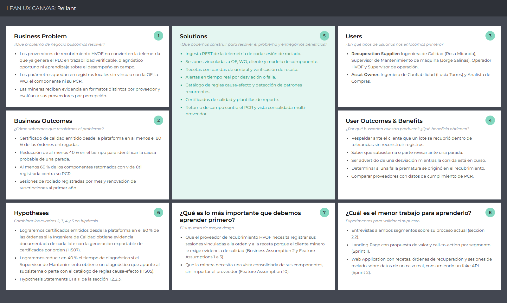

## 1.3. Segmentos objetivo.

Reliant atiende a los dos lados de la relación de recuperación de componentes: a quien **ejecuta** el recubrimiento HVOF y a quien **recibe y opera** la pieza recuperada. La primera versión del análisis consideraba a la empresa minera únicamente como fuente de presión contractual sobre el proveedor; las entrevistas y el Big Picture Event Storming (sección 2.4) mostraron que la minera realiza tareas propias dentro del dominio que nadie más puede realizar: es la única que sabe cuántas horas trabajó la pieza en campo, la que registra su retorno y la que evalúa a sus proveedores. Por ello se definen dos segmentos diferenciados por el **rol que cumplen en la cadena de recuperación**, cada uno con su propio plan de suscripción: el **Recuperation Supplier**, que paga por sistema HVOF monitoreado (plan Operator), y el **Asset Owner**, que paga por volumen de componentes bajo seguimiento (plan Asset Owner). La relación entre ambos genera un efecto de red: cuantos más proveedores registran sus sesiones y certificados en la plataforma, más valor obtiene la minera de su vista consolidada, y cuantas más mineras exigen evidencia desde Reliant, más proveedores tienen incentivo para adoptarla.

### Contexto de mercado

La minería constituye el principal motor exportador de la economía peruana. Según el Boletín Estadístico Minero del Ministerio de Energía y Minas, las exportaciones de productos mineros totalizaron **US$ 62,848 millones durante 2025**, un crecimiento de **27.2 %** respecto al año anterior, y representaron alrededor del **67.5 %** del valor total exportado por el país (MINEM, 2026). A octubre de 2025 existían en el Perú **19,151 titulares mineros** con derechos sobre **55,783 concesiones** (CooperAcción, 2025), lo que dimensiona la escala de la actividad que demanda servicios de mantenimiento y recuperación de componentes.

El ecosistema de proveedores que atiende a este sector tiene además una trayectoria de crecimiento proyectada. De acuerdo con estimaciones de la Sociedad Nacional de Industrias, el aporte de los proveedores mineros al PBI nacional se sitúa actualmente entre **3.5 % y 3.8 %**, y podría alcanzar hasta el **12 % para 2030** si se ejecuta la cartera de proyectos mineros estimada en **US$ 52,000 millones** (Energiminas, 2025).

El costo del problema que Reliant atiende también está documentado. El reporte *True Cost of Downtime* de Siemens estima que las 500 mayores empresas del mundo pierden alrededor del **11 % de sus ingresos** por paradas no planificadas, y la falla de componentes críticos representa el **45 %** de los casos reportados de downtime. En el sector minero específicamente, estimaciones de la industria sitúan el costo promedio de una parada de equipo en torno a **US$ 180,000 por incidente** (Innovapptive, 2024).

---

### Segmento 1: Recuperation Supplier — Empresas de servicio especializado en recubrimiento HVOF

**Descripción**

Empresas que recuperan componentes de terceros mediante recubrimiento térmico HVOF, operando uno o más sistemas HVOF y atendiendo simultáneamente a varios clientes industriales, principalmente del sector minero. Su negocio depende de la capacidad de demostrar que el recubrimiento se ejecutó dentro de la especificación acordada, ya que el cliente vincula la vida útil esperada de la pieza (PCR) a la calidad del proceso. En el mercado peruano este segmento es reducido y altamente especializado: pocos actores, contratos de alto valor y fuerte dependencia de la reputación técnica.

**Características demográficas y organizacionales**

| Variable | Descripción |
|---|---|
| Tipo de organización | Empresa de servicios industriales / metalmecánica especializada, o división de recuperación de componentes de un distribuidor de maquinaria pesada |
| Tamaño | Mediana y gran empresa; entre 50 y 500 colaboradores en la unidad de recuperación |
| Ubicación | Lima Metropolitana y Callao (zonas industriales), con presencia comercial en regiones mineras (Arequipa, Cajamarca, Áncash, Junín) |
| Sector económico | Servicios de mantenimiento y recuperación de componentes industriales |
| Clientes principales | Empresas mineras de gran y mediana minería, oil & gas, generación eléctrica |
| Antigüedad | Organizaciones consolidadas, típicamente con más de 10 años de operación |
| Nivel de digitalización | Medio; cuentan con ERP administrativo, pero los datos de proceso permanecen en el controlador del sistema HVOF, en registros locales o en papel |
| Plan de suscripción | **Operator**, por sistema HVOF monitoreado |

**Perfil del usuario dentro de la organización**

| Variable | Descripción |
|---|---|
| Rol principal | Ingeniero de Calidad e Investigación (define recetas y PCR, emite certificados) |
| Roles secundarios | Supervisor de operación (órdenes de recuperación, cierre y entrega), Supervisor de mantenimiento de máquina (sistema HVOF, subsistemas, tags, diagnóstico de fallas), Operador HVOF (sesiones de rociado, alertas) |
| Edad | 28 a 50 años |
| Formación | Ingeniería Mecánica, Metalúrgica, Industrial o de Materiales; personal técnico con formación en institutos tecnológicos |
| Competencia en el dominio | Alta |
| Competencia digital | Media; usuario habitual de hojas de cálculo y ERP, no de herramientas analíticas |
| Dispositivo de preferencia | Computador de escritorio o laptop en oficina y taller; móvil para consulta de alertas |
| Idioma de trabajo | Español, con manejo de terminología técnica en inglés |

**Motivación de compra**

Este segmento adquiere Reliant porque **sin trazabilidad no puede sostener la garantía que sus clientes le exigen** y porque **cada parada del sistema HVOF se diagnostica desde cero**. La presión es comercial y operativa a la vez: la incapacidad de entregar evidencia documentada del proceso compromete la renovación de contratos con clientes mineros que auditan a sus proveedores, y el diagnóstico dependiente de pocos especialistas prolonga cada parada.

---

### Segmento 2: Asset Owner — Empresas mineras propietarias de los componentes recuperados

**Descripción**

Empresas mineras que envían a recuperar componentes críticos de su flota (front rods, cylinder blocks, ejes, impulsores) a uno o más proveedores de recubrimiento y los reincorporan a la operación con una expectativa de vida útil formalizada en el PCR. Hoy reciben de cada proveedor la evidencia en su propio formato, registran el retorno de campo en hojas de cálculo y evalúan a los proveedores por percepción. Su interés en la plataforma no es operar el proceso HVOF, sino disponer de una **vista consolidada del desempeño de sus componentes recuperados, sin importar qué proveedor los trabajó**, y contrastar ese desempeño contra el PCR comprometido. En el Perú este segmento está formado por operaciones de gran y mediana minería como Cerro Verde, Chinalco o Las Bambas, que concentran el volumen de componentes recuperados del país.

**Características demográficas y organizacionales**

| Variable | Descripción |
|---|---|
| Tipo de organización | Empresa minera de gran o mediana minería, con área de mantenimiento y confiabilidad propia |
| Tamaño | Gran empresa; más de 1,000 colaboradores |
| Ubicación | Regiones mineras del Perú (Arequipa, Junín, Apurímac, Áncash, Cajamarca, Moquegua) con oficinas corporativas en Lima |
| Sector económico | Minería metálica |
| Relación con el proceso | Cliente del servicio de recuperación; trabaja con dos o más proveedores en paralelo |
| Nivel de digitalización | Alto; cuentan con SAP PM o CMMS para gestión de mantenimiento, sin integración con la evidencia de proceso que entrega el proveedor |
| Plan de suscripción | **Asset Owner**, por volumen de componentes bajo seguimiento |

**Perfil del usuario dentro de la organización**

| Variable | Descripción |
|---|---|
| Rol principal | Ingeniero de Confiabilidad / Planner de Mantenimiento (registra el retorno de campo, consulta certificados y cumplimiento de PCR) |
| Roles secundarios | Analista de compras o contratos (evalúa y compara proveedores), Jefe de Mantenimiento |
| Edad | 30 a 55 años |
| Formación | Ingeniería Mecánica, Industrial o de Minas; especialización en confiabilidad o gestión de activos |
| Competencia en el dominio del spray | Baja a media; conocen el componente y su desempeño, no el proceso de recubrimiento |
| Competencia digital | Alta; usuarios habituales de SAP PM, CMMS y herramientas de análisis |
| Dispositivo de preferencia | Computador de escritorio en oficina de mantenimiento o corporativa; móvil o tablet en campo |
| Idioma de trabajo | Español, con manejo de terminología técnica en inglés |

**Motivación de compra**

Este segmento adquiere Reliant porque **una falla prematura de un componente recuperado cuesta más que cualquier suscripción** y porque **ningún proveedor individual puede ofrecerle la comparación entre proveedores**. La presión es económica y contractual: necesita sustentar con datos la renovación o el cambio de un proveedor, saber si una falla prematura tuvo origen en el recubrimiento, y eliminar el cruce manual de evidencias en formatos distintos.

---

### Síntesis comparativa

| Criterio | Segmento 1: Recuperation Supplier | Segmento 2: Asset Owner |
|---|---|---|
| Rol en la cadena | Ejecuta la recuperación | Recibe y opera el componente recuperado |
| Quién decide la compra | Gerencia General / Gerencia de Operaciones del proveedor | Gerencia de Mantenimiento / Confiabilidad de la minera |
| Dolor principal | Pérdida de contratos por falta de evidencia de calidad; paradas del sistema HVOF diagnosticadas desde cero | Fallas prematuras sin explicación; evaluación de proveedores por percepción |
| Usuario primario | Ingeniero de Calidad e Investigación | Ingeniero de Confiabilidad / Planner |
| Prioridad de features | Recetas y bandas de umbral, trazabilidad OF/WO, diagnóstico por subsistema y parte, certificados de calidad | Vista consolidada multi-proveedor, retorno de campo contra PCR, cumplimiento de PCR por proveedor, consulta de certificados |
| Plan y unidad de cobro | Operator, por sistema HVOF monitoreado | Asset Owner, por componentes bajo seguimiento |
| Presencia en Perú | Nicho concentrado, pocos actores | Gran y mediana minería, alto volumen de componentes |
| Rol en la estrategia | Segmento de entrada: genera los datos | Segmento de consolidación: genera la demanda de evidencia |

Ambos segmentos comparten la cadena de trazabilidad de la plataforma: la sesión de rociado que registra el proveedor es la misma que sustenta el certificado que consulta la minera, y el retorno de campo que registra la minera es el que permite al proveedor explicar una falla prematura. Esta dependencia mutua es la que sostiene el modelo de dos planes y justifica el orden de entrada al mercado: primero el Recuperation Supplier, cuyo dolor es más agudo y cuya adopción alimenta de datos la plataforma, y sobre esa base el Asset Owner, para quien el valor crece con cada proveedor incorporado.
# Capítulo II: Requirements Elicitation & Analysis
## 2.1. Competidores.

El dominio del monitoreo de procesos de recubrimiento térmico presenta una particularidad competitiva relevante: **no existe actualmente un producto de software SaaS que cubra de extremo a extremo la trazabilidad del proceso HVOF vinculada a la orden de trabajo y al desempeño en campo del componente**. La oferta existente se concentra en dos extremos del espectro. Por un lado, fabricantes de sensórica industrial especializada que resuelven la medición del proceso con hardware propietario de alto costo, sin capa de gestión ni trazabilidad documental. Por otro, plataformas genéricas de MES, QMS y CMMS que resuelven la trazabilidad y la gestión de mantenimiento, pero desconocen por completo el dominio del thermal spray y no interpretan sus parámetros ni sus modos de falla.

Reliant se ubica deliberadamente en el espacio intermedio. Por ello, el análisis considera dos competidores directos —empresas que ofrecen monitoreo específico de procesos de thermal spray, y un competidor indirecto, plataforma de trazabilidad industrial genérica con oferta parcialmente similar—, conforme a lo establecido en el enunciado del proyecto.

| # | Competidor | Tipo | Origen | Naturaleza de la oferta |
|---|---|---|---|---|
| C1 | **Tecnar Automation** (Accuraspray 4.0 / DPV evolution) | Directo | Canadá | Sensórica en línea para monitoreo de pluma y partículas en vuelo |
| C2 | **Oerlikon Metco** (sistemas de control de proceso) | Directo | Suiza | Fabricante de equipos HVOF con software de control y hojas de parámetros |
| C3 | **DELMIAWorks** (Dassault Systèmes) | Indirecto | Francia / EE. UU. | MES/QMS con trazabilidad de manufactura genérica |

### 2.1.1. Análisis competitivo.

#### Competitive Analysis Landscape

**¿Por qué llevar a cabo este análisis?**

> Determinar si existe en el mercado una solución que resuelva simultáneamente la trazabilidad del proceso HVOF vinculada a la orden de trabajo, el diagnóstico de fallas orientado al subsistema o parte del sistema HVOF responsable, el contraste del desempeño en campo contra el PCR y la comparación entre proveedores de recuperación desde el lado del propietario del activo; e identificar en qué medida las alternativas actuales resultan accesibles para empresas de recubrimiento peruanas de tamaño mediano y para sus clientes mineros. El objetivo es validar que existe un espacio no atendido y establecer sobre qué dimensiones Reliant puede sostener una ventaja competitiva defendible.

| | **InnovaCorp — Reliant** | **C1. Tecnar Automation** | **C2. Oerlikon Metco** | **C3. DELMIAWorks** |
|---|---|---|---|---|
| **PERFIL** | | | | |
| Overview | Startup peruana que ofrece una plataforma web SaaS para monitoreo, trazabilidad y diagnóstico de procesos HVOF, que conecta al proveedor de recuperación con el propietario del activo. Construida sobre tecnologías open source y desplegada en cloud. | Fabricante canadiense de sensores en línea para procesos de proyección térmica. Su producto Accuraspray 4.0 mide temperatura, velocidad, dimensión y estabilidad de la pluma de rociado. | Fabricante suizo líder mundial de equipos y consumibles para thermal spray. Provee pistolas, polvos y sistemas de control de proceso propietarios asociados a sus equipos. | División de Dassault Systèmes que ofrece un MES/ERP con módulos de gestión de calidad y trazabilidad de manufactura para industria discreta. |
| Ventaja competitiva / ¿Qué valor ofrece a los clientes? | Conecta el dato de proceso con la orden de trabajo, el cliente y el desempeño real de la pieza en campo, y es la única que sirve a ambos lados de la relación: el proveedor demuestra calidad y la minera compara proveedores con datos. Conocimiento profundo del dominio HVOF en contexto minero peruano. Costo de entrada bajo, sin hardware propietario y agnóstica al fabricante del equipo y del controlador. | Precisión metrológica certificada y calibración trazable a NIST. Es el estándar de facto para caracterización de pluma en investigación y desarrollo de parámetros. | Integración nativa con su propio equipo. Respaldo de marca global y soporte técnico especializado en toda la cadena (equipo, consumible, parámetro). | Cobertura funcional muy amplia: trazabilidad de lote, control de calidad, planificación y ejecución de manufactura en una sola plataforma. |
| **PERFIL DE MARKETING** | | | | |
| Mercado objetivo | Proveedores de recuperación de componentes mediante HVOF (Recuperation Suppliers) y empresas mineras propietarias de los componentes recuperados (Asset Owners), en Perú y Latinoamérica. | Talleres de thermal spray, centros de investigación y fabricantes aeroespaciales a nivel global. | Compradores de equipos HVOF a nivel global; industria aeroespacial, energía, automotriz y petróleo y gas. | Manufactura discreta de mediano y gran tamaño a nivel global; automotriz, plásticos, dispositivos médicos. |
| Estrategias de marketing | Venta consultiva directa al proveedor, apoyada en conocimiento de dominio y casos reales de diagnóstico de fallas; venta al propietario del activo apoyada en el cumplimiento de PCR por proveedor. Presencia en ferias del sector minero y de proveedores mineros. Landing Page con sección y call-to-action por segmento. | Marketing técnico basado en publicaciones científicas, presencia en conferencias internacionales de thermal spray y red de distribuidores por región. | Marketing de ecosistema: el software se posiciona como complemento del equipo. Fuerte inversión en contenido técnico y capacitación. | Marketing de plataforma empresarial: casos de éxito, webinars, red de partners e integradores. |
| **PERFIL DE PRODUCTO** | | | | |
| Productos y servicios | Plataforma web SaaS con Landing Page, Web Application y RESTful API. Ingesta de telemetría, recetas con bandas de umbral, alertas, diagnóstico asistido por subsistema y parte, certificados de calidad, análisis PCR, vista consolidada multi-proveedor para el propietario del activo y plantillas de reporte personalizables y compartibles. | Sensores de hardware (Accuraspray 4.0, DPV evolution, Shotmeter) con software de visualización asociado. | Equipos HVOF, consumibles, hojas de parámetros y sistemas de control de proceso. Servicios de ingeniería. | Suite MES/ERP modular con trazabilidad, QMS y APQP. Se despliega on-premise o en cloud. |
| Precios y costos | Dos planes de suscripción mensual: Operator, por sistema HVOF monitoreado, para proveedores; y Asset Owner, por volumen de componentes bajo seguimiento, para mineras. Sin costo de hardware propietario. Orientado a ser marginal frente al costo de una parada o de una falla prematura en campo. | Inversión de capital elevada por sensor, más mantenimiento y calibración periódica. Barrera de entrada alta para empresas medianas. | Costo elevado, generalmente asociado a la compra o actualización del equipo completo. | Licenciamiento empresarial de costo alto, con proyecto de implementación e integración prolongado. |
| Canales de distribución (Web y/o Móvil) | Web responsive (Landing Page + Web Application), accesible desde escritorio y móvil. Distribución 100 % digital. | Venta directa y distribuidores. El software opera localmente junto al sensor; sin experiencia web multiusuario. | Venta directa y red global de representantes. Software vinculado al equipo, sin acceso web abierto. | Venta directa y partners de implementación. Interfaz web y cliente de escritorio. |

### 2.1.2. Estrategias y tácticas frente a competidores.

A partir del análisis anterior, InnovaCorp establece cinco estrategias con sus tácticas asociadas, orientadas a aprovechar las debilidades identificadas en los competidores y a mitigar las amenazas sobre la propia posición.

- **Estrategia 1. Especialización de dominio frente a plataformas genéricas**
  Frente a la amplitud funcional de DELMIAWorks y otras plataformas MES/QMS, Reliant compite por profundidad y no por cobertura. La ventaja no consiste en tener más módulos, sino en que el sistema entiende qué significa un feedrate en cero, una sobrepresión de tolva o una receta cargada que no corresponde al componente.
  **Tácticas**: incorporar en el producto un catálogo de reglas causa-efecto construido a partir de fallas reales documentadas en operación; modelar el sistema HVOF por subsistemas y partes para que el diagnóstico señale dónde mirar; emplear en toda la interfaz el ubiquitous language del dominio (OF, WO, PCR, receta, sesión de rociado) en lugar de terminología genérica de manufactura; y sustentar la propuesta comercial mostrando un diagnóstico concreto que una plataforma genérica no podría producir.

- **Estrategia 2. Costo de entrada bajo frente a soluciones intensivas en hardware**
  Frente a Tecnar y Oerlikon Metco, cuyas soluciones exigen inversión de capital significativa, Reliant compite por accesibilidad, aprovechando la telemetría que el controlador del sistema HVOF ya genera.
  **Tácticas**: adoptar un modelo de suscripción mensual por sistema HVOF monitoreado, sin inversión inicial en hardware; ofrecer un periodo de prueba operando sobre datos históricos del propio cliente; e integrarse mediante un gateway con API REST que no requiere modificar el PLC ni el software del fabricante del equipo.

- **Estrategia 3. Neutralidad frente al fabricante del equipo y del controlador**
  Frente a Oerlikon Metco, cuyo software está vinculado a su propio parque de equipos, Reliant compite por independencia: los talleres de recuperación suelen operar sistemas de distintas marcas y generaciones, con controladores de distintos fabricantes.
  **Tácticas**: modelar cada sistema HVOF con sus subsistemas, partes y controladores de forma agnóstica a la marca; importar el catálogo de tags del controlador y proponer automáticamente su mapeo a subsistemas y parámetros, con confirmación del supervisor; normalizar los tipos de dato de Allen-Bradley, Siemens, Schneider, Mitsubishi, Delta y Omron a un modelo canónico; definir recetas con bandas de umbral por sistema en lugar de asumir un modelo único; y posicionar comercialmente la neutralidad como argumento frente a talleres con parque mixto.

- **Estrategia 4. Cierre del ciclo hacia el desempeño en campo**
  Ningún competidor identificado conecta el proceso de recubrimiento con lo que ocurre después con la pieza. Esta es la dimensión donde Reliant no tiene competencia directa y donde concentra su diferenciación.
  **Tácticas**: hacer del análisis PCR el eje del discurso comercial y del Landing Page; permitir que el propietario del activo registre el retorno de campo y que el sistema lo contraste automáticamente contra el PCR; construir reportes de cumplimiento de PCR por proveedor, cliente, modelo y tipo de componente que ningún otro actor puede ofrecer; y desarrollar casos documentados en los que la plataforma permita explicar el origen de una falla prematura en campo a partir de la sesión de rociado original.

- **Estrategia 5. Plataforma de dos segmentos con efecto de red**
  Ningún competidor atiende al comprador del servicio. Reliant convierte a la minera en usuario pagante mediante una vista consolidada que ningún proveedor individual puede ofrecer, y usa esa demanda para acelerar la adopción del lado proveedor.
  **Tácticas**: ofrecer el plan Asset Owner con vista consolidada de componentes recuperados sin importar qué proveedor los trabajó; vincular automáticamente al cliente registrado por un proveedor con la organización Asset Owner cuando esta se suscribe con el mismo RUC; entregar a la minera plantillas de reporte con su propia marca para que la evidencia circule internamente en su formato; y posicionar ante las mineras la exigencia de reportar por Reliant como estándar para todos sus proveedores de recuperación.

**Mitigación de amenazas identificadas**

Ante la falta de trayectoria de la startup, la táctica consiste en apoyarse en evidencia técnica verificable, casos reales de diagnóstico, en lugar de en referencias comerciales inexistentes. Ante la sensibilidad de las empresas respecto de sus parámetros de proceso, se incorporarán desde el inicio términos y condiciones explícitos sobre titularidad y confidencialidad de los datos, expuestos en el footer del Landing Page y de la aplicación, y una regla de visibilidad por la cual el propietario del activo accede al certificado y al cumplimiento por banda, nunca a los valores crudos de telemetría del proveedor. Ante la resistencia cultural al registro digital, el diseño priorizará una curva de aprendizaje mínima, la detección automática de pasadas de rociado desde los tags de estado para reducir la intervención del operador, y flujos con menos pasos que el registro manual actual.

## 2.2. Entrevistas.

Esta sección presenta el proceso de investigación primaria realizado con representantes de los dos segmentos objetivo definidos en la sección 1.3: Recuperation Supplier y Asset Owner. Las entrevistas constituyen la fuente de información a partir de la cual se construyen los User Personas, el User Task Matrix, los User Journey Maps y los Empathy Maps del proceso de Needfinding (sección 2.3), y permiten contrastar los assumptions e hypothesis statements formulados en el Lean UX Process (sección 1.2.2) con el comportamiento real de los segmentos.

### 2.2.1. Diseño de entrevistas.

#### Objetivos del diseño

El diseño de las entrevistas persigue dos propósitos simultáneos. El primero es recolectar la información objetiva y subjetiva necesaria para construir arquetipos verosímiles de cada segmento: características demográficas, personalidad, habilidades, marcas e influencias, dispositivos y canales digitales de preferencia, objetivos, frustraciones y trayectoria profesional. El segundo es comprender el estado actual del proceso de recuperación de componentes desde la perspectiva de cada segmento, sin condicionar las respuestas con la solución propuesta, a fin de validar o refutar las hipótesis de mayor riesgo identificadas en el Lean UX Canvas.

#### Buenas prácticas aplicadas

| Práctica | Aplicación en el diseño |
|---|---|
| Formato semiestructurado | Se definió un conjunto fijo de preguntas principales para garantizar comparabilidad entre entrevistados, con preguntas complementarias que permiten profundizar en hallazgos no anticipados. |
| Preguntas abiertas y no inductivas | Ninguna pregunta sugiere la respuesta esperada ni menciona la solución. Los términos "software", "plataforma" y "sistema" se evitan hasta el bloque de cierre. |
| Preguntas sobre episodios reales | Se privilegia la fórmula "cuénteme la última vez que…" sobre preguntas hipotéticas del tipo "¿usaría usted…?", dado que las declaraciones sobre conducta futura tienen bajo valor predictivo. |
| Orden de los bloques | El perfil personal se aborda primero, en tono conversacional, para establecer confianza antes de tratar temas operativos que pueden resultar sensibles (fallas, reclamos de clientes, auditorías). |
| Captura del lenguaje del dominio | El entrevistador anota los términos propios que utiliza el entrevistado (nombres de documentos, códigos, siglas, fallas), los cuales alimentan el Ubiquitous Language de la sección 2.5. |
| Consentimiento informado | Al inicio de cada sesión se informa al entrevistado sobre la grabación en video y su uso académico, y se solicita su consentimiento explícito. |
| Duración | Entre 20 y 25 minutos por entrevista, editadas posteriormente a segmentos de 3 a 5 minutos para el video consolidado de evidencia. |

#### Información a recolectar para la construcción de arquetipos

De acuerdo con lo requerido para la elaboración de User Personas, cada entrevista recolecta la siguiente información, común a ambos segmentos:

| Categoría | Información principal | Información complementaria |
|---|---|---|
| Demográfica | Nombre, edad, género, distrito de residencia | Régimen de trabajo (en el caso de personal de mina), modalidad de traslado |
| Familiar | Estado civil, personas con quienes vive | Familia a su cargo, impacto del horario laboral en la vida personal |
| Profesional | Formación, cargo actual, antigüedad, línea de reporte | Trayectoria hasta el puesto, certificaciones posteriores |
| Personalidad y habilidades | Estilo de trabajo (planificación vs. resolución sobre la marcha, individual vs. en equipo) | Fortalezas y dificultades en el desempeño del rol |
| Tecnología | Dispositivos de trabajo, navegador, lugar de acceso (oficina o planta) | Herramientas de software de uso cotidiano, percepción sobre ellas |
| Canales digitales | Medio de comunicación habitual con el equipo | Medio preferido para asuntos urgentes |
| Marcas e influencias | Fuentes de actualización profesional | Marcas, proveedores o referentes del sector que considera confiables |
| Objetivos y frustraciones | Aspectos más satisfactorios del trabajo | Aspectos más frustrantes del trabajo |

#### Estructura de la entrevista

La guía se organiza en tres bloques. El Bloque A es común a ambos segmentos y recolecta el perfil del entrevistado. El Bloque B contiene las preguntas específicas de cada segmento sobre su proceso actual y sus problemas. El Bloque C cierra la entrevista abriendo la conversación hacia necesidades no cubiertas y toma de decisiones.

**Bloque A — Perfil del entrevistado (ambos segmentos, 5 minutos)**

| # | Dato requerido | Pregunta principal | Pregunta complementaria |
|---|---|---|---|
| A1 | Nombre, edad, género | ¿Podría presentarse? | — |
| A2 | Distrito, traslado | ¿Dónde vive y cómo llega al trabajo? | En el caso de personal de mina: ¿qué régimen tiene? |
| A3 | Estado civil, familia | ¿Con quién vive? | ¿Tiene familia a su cargo? |
| A4 | Formación, background | ¿Qué estudió? | ¿Cómo llegó a su puesto actual? |
| A5 | Ocupación, cargo | ¿Cuál es su cargo? | ¿Hace cuánto lo ocupa? ¿A quién reporta? |
| A6 | Personalidad | ¿Es más de planificar o de resolver sobre la marcha? | ¿Trabaja mejor solo o en equipo? |
| A7 | Habilidades | ¿Qué es lo que mejor sabe hacer en su trabajo? | ¿Qué le cuesta más? |
| A8 | Dispositivos, browser | ¿Desde qué dispositivo trabaja? | ¿Qué navegador usa? ¿Desde oficina o planta? |
| A9 | Canales digitales | ¿Por qué medio se comunica con su equipo? | ¿Y en urgencias? |
| A10 | Marcas e influencias | ¿Cómo se mantiene actualizado? | ¿Qué marcas o referentes del sector respeta? |
| A11 | Objetivos, frustraciones | ¿Qué le gusta más de su trabajo? | ¿Qué le frustra? |

**Bloque B1 — Segmento Recuperation Supplier (15 minutos)**

Perfiles entrevistados: operador HVOF, supervisor de operación, supervisor de mantenimiento de máquina, ingeniero de investigación y calidad.

| # | Pregunta principal | Preguntas complementarias | Propósito |
|---|---|---|---|
| B1.1 | Cuénteme qué pasa desde que llega una pieza del cliente hasta que sale recuperada. | ¿Cómo la identifican en el taller? ¿Qué documento la acompaña? | Comprender el journey actual (As-Is) y el sistema de identificación de piezas |
| B1.2 | Durante una corrida de rociado, ¿qué información queda guardada y dónde? | ¿Quién la revisa después? ¿Alguna vez buscó una corrida antigua? | Validar el assumption sobre pérdida de trazabilidad del proceso |
| B1.3 | ¿Qué le pide el cliente cuando le entregan el trabajo? | ¿Certificado, informe? ¿Le han hecho auditoría? | Validar H-07: aceptación de evidencia documentada por el cliente |
| B1.4 | Cuénteme la última vez que un cliente cuestionó la calidad de algo entregado. | ¿Qué tuvo que reunir? ¿Cuánto demoró? ¿Tuvo consecuencias? | Cuantificar el impacto de la falta de evidencia |
| B1.5 | ¿Existe un compromiso sobre cuánto debe durar la pieza recuperada? | ¿Cómo lo llaman? ¿Quién lo define? | Confirmar el término PCR en el lenguaje del entrevistado |
| B1.6 | Cuénteme la última vez que la máquina se detuvo sin esperarlo. | ¿Cómo hallaron la causa? ¿Qué parte falló? ¿Cuánto demoró? | Validar H-05: tiempo de diagnóstico y atribución a parte de máquina |
| B1.7 | ¿Hay fallas que se repiten? | ¿Cómo lo saben? ¿Está anotado en algún lado? | Validar H-06: detección de patrones recurrentes |
| B1.8 | Cuando una pieza suya falla en el cliente, ¿cómo se enteran? | ¿Pueden saber si fue el recubrimiento? ¿Qué les faltaría? | Validar H-08: análisis retrospectivo contra PCR |

**Bloque B2 — Segmento Asset Owner (15 minutos)**

Perfiles entrevistados: ingeniero de confiabilidad, planner de mantenimiento, supervisor de mantenimiento, analista de contratos y compras.

| # | Pregunta principal | Preguntas complementarias | Propósito |
|---|---|---|---|
| B2.1 | Cuénteme cómo funciona la recuperación de componentes en su operación. | ¿Qué piezas? ¿Con cuántos proveedores trabajan? | Comprender el contexto y confirmar el escenario multi-proveedor |
| B2.2 | ¿Manejan una expectativa de cuánto debe durar un componente recuperado? | ¿Cómo lo llaman? ¿Cómo le hacen seguimiento? | Confirmar el término PCR y su seguimiento actual |
| B2.3 | Cuénteme la última vez que un componente recuperado falló antes de lo previsto. | ¿Qué pasó en la operación? ¿Cuánto costó? ¿Supieron por qué? | Cuantificar el impacto de la falla prematura; validar H-08 |
| B2.4 | ¿Qué le entrega el proveedor junto con la pieza? | ¿Quién lo revisa? ¿Dónde se guarda? ¿Le sirvió alguna vez después? | Validar H-07 desde el lado del cliente |
| B2.5 | ¿Cómo evalúan a un proveedor de recuperación? | ¿Con qué datos? ¿Han cambiado de proveedor? ¿Por qué? | Validar H-09: evaluación de proveedores con datos |
| B2.6 | ¿Dónde registran la información de los componentes recuperados? | ¿SAP, CMMS, Excel? ¿Está todo en un solo lugar? | Identificar sistemas actuales y competencia indirecta |
| B2.7 | Si quisiera comparar qué proveedor entrega piezas que duran más, ¿cómo lo haría hoy? | ¿Lo ha intentado? ¿Cuánto le tomó? | Sustentar el valor de la vista consolidada (plan Asset Owner) |
| B2.8 | ¿Auditan a sus proveedores? | ¿Qué revisan? ¿Qué les piden que demuestren? | Identificar los requisitos de evidencia que se trasladan al proveedor |

**Bloque C — Cierre (ambos segmentos, 3 minutos)**

| # | Pregunta principal | Pregunta complementaria | Propósito |
|---|---|---|---|
| C1 | De todo esto, ¿qué es lo que más tiempo o dolor de cabeza le genera? | ¿Por qué eso? | Priorizar pain points para el Empathy Map |
| C2 | ¿Qué información le gustaría tener y hoy no tiene? | ¿Qué haría con ella? | Identificar necesidades no anticipadas |
| C3 | ¿Quién decidiría en su empresa adoptar una nueva herramienta? | ¿Qué tendría que demostrarle? | Identificar al decisor de compra para cada segmento |
| C4 | ¿Algo que no le pregunté y debería saber? | — | Cierre abierto |

### 2.2.2. Registro de entrevistas.

| Segmento: RecuperationSupplier | Entrevista #1 |
|:--:|:--:|
| Nombres y Apellidos | Cristian Rimac |
| Edad | 29 años |
| Distrito | San Miguel |
| Ocupacion | Ingeniero de Proyectos |
| Duracion | 16:13 minutos |
| URL | https://drive.google.com/file/d/1Kz4-cB8Z7LLDR8P2sAM7_8ShWzVvMpjP/view?usp=sharing |
| Screenshot|  |
| Resumen | Cristian Rimac, de 29 años, es ingeniero de proyectos y vive en San Miguel. Durante la entrevista, explicó que los componentes recibidos de los clientes se identifican principalmente mediante el número de orden de trabajo. Sin embargo, mencionó que en ocasiones resulta complicado localizar las piezas dentro del taller, por lo que deben buscarlas o consultar con otros trabajadores. Asimismo, indicó que los parámetros del proceso de recuperación pueden quedar registrados, pero no existe un control completo y organizado de la información. Esto dificulta realizar un seguimiento adecuado de las piezas recuperadas y consultar los datos de procesos anteriores. La entrevista permitió identificar problemas relacionados con la trazabilidad de los componentes y la gestión de la información durante el proceso de recuperación.

| Segmento: RecuperationSupplier | Entrevista #2 |
|:--:|:--:|
| Nombres y Apellidos | Aron Ramirez |
| Edad | 30 años |
| Distrito | Surquillo |
| Ocupacion | Especialista en investigación de desarrollo |
| Duracion | 8:50 minutos |
| URL | https://drive.google.com/file/d/1C9NDE2k5fsSGtt2NXbIFq6dNA72oELuV/view?usp=sharing |
| Screenshot|  |
| Resumen | Durante la entrevista, Aron Ramires, de 30 años, explicó que el proceso de recuperación inicia con la recepción e identificación de las piezas del cliente, utilizando órdenes de trabajo y registros internos. Durante el rociado se almacenan datos como los parámetros de la máquina, materiales utilizados y tiempo de trabajo, aunque la búsqueda de registros antiguos puede resultar complicada. Asimismo, mencionó que los clientes solicitan certificados, informes y evidencias de calidad. Cuando se presentan reclamos, es necesario revisar la información del proceso, lo que puede generar demoras. También señaló que existen compromisos relacionados con la duración de las piezas recuperadas (PCR) y que algunas fallas de las máquinas se repiten, pero no siempre están registradas de manera organizada. Finalmente, explicó que cuando una pieza falla en el cliente, se requiere revisar los registros para determinar si el problema está relacionado con el recubrimiento, evidenciando dificultades en la trazabilidad y el análisis de fallas.

| Segmento: RecuperationSupplier | Entrevista #3 |
|:--:|:--:|
| Nombres y Apellidos | Belisa Paredes|
| Edad | 46 años |
| Distrito | Surquillo |
| Ocupacion | supervisora |
| Duracion | 11:35 minutos |
| URL | https://upcedupe-my.sharepoint.com/personal/u202410376_upc_edu_pe/_layouts/15/stream.aspx?id=%2Fpersonal%2Fu202410376%5Fupc%5Fedu%5Fpe%2FDocuments%2FDesarrolloAplicacionesOpenSource%2Emp4&nav=
eyJyZWZlcnJhbEluZm8iOnsi
cmVmZXJyYWxBcHAiOiJTdHJlYW1XZWJBcHAiLCJyZWZlcnJhbFZpZXciOiJTaGFyZURpYWxvZy1MaW5rIiwicmVmZXJyYWxBcHBQbGF0Zm9ybSI6IldlYiIsInJlZmVycmFsTW9kZSI6InZpZXcifX0&ga=1&referrer=StreamWebApp%2EWeb&referrerScenario=AddressBarCopi
ed%2Eview%2E001f7777%2D3095%2D43ae%2Dbdb0%2D89ae880547ea |
| Screenshot|   |
| Resumen | La entrevista busca conocer el proceso de recuperación de piezas, desde su recepción hasta la entrega al cliente, identificando cómo se registran las corridas de rociado, qué evidencias solicitan los clientes y cómo se gestionan los problemas de calidad. También se pretende comprender las fallas de las máquinas, la repetición de errores y el seguimiento de la vida útil de las piezas recuperadas, con el fin de identificar dificultades en la trazabilidad, el diagnóstico y el análisis de fallas.


| Segmento: AssetOwner | Entrevista #1 |
|:--:|:--:|
| Nombres y Apellidos | Jhuol <!-- TODO: apellidos de la entrevista a Jhuol --> |
| Edad | <!-- TODO: edad de la entrevista a Jhuol --> |
| Distrito | <!-- TODO: distrito de la entrevista a Jhuol --> |
| Ocupacion | <!-- TODO: ocupación de la entrevista a Jhuol --> |
| Duracion | <!-- TODO: duración de la entrevista a Jhuol --> |
| URL | <!-- TODO: URL del video de la entrevista a Jhuol --> |
| Screenshot|  |
| Resumen | <!-- TODO: resumen de la entrevista a Jhuol --> |

| Segmento: AssetOwner | Entrevista #2 |
|:--:|:--:|
| Nombres y Apellidos | Wilson Bardales |
| Edad | 65 años |
| Distrito | Lima |
| Ocupacion | Gerente de procesos |
| Duracion | 11:19 minutos |
| URL | https://youtu.be/ELUn_X1SDxo?si=Av2cGm2uR-eTnTVn |
| Screenshot|   |
| Resumen | Wilson Bardales, de 65 años, es gerente de procesos y vive en Lima. Durante la entrevista, explicó que la empresa trabaja en el área de mantenimiento preventivo y utiliza proveedores como Epiroc y Desmozambic, principalmente para las perforadoras de producción. Asimismo, relató un caso en el que una bomba de una perforadora nueva presentaba fallas frecuentes. En conjunto con el proveedor, identificaron problemas relacionados con la calidad del agua utilizada en el sistema de enfriamiento y una baja eficiencia del componente. Como parte de la solución, se recomendó cambiar el motor y realizar correcciones en algunas piezas.La entrevista permitió identificar la importancia de mejorar el seguimiento de la vida útil de los componentes, analizar las causas de fallas prematuras y trabajar con los proveedores para mejorar el desempeño de los equipos.

| Segmento: AssetOwner | Entrevista #3 |
|:--:|:--:|
| Nombres y Apellidos | Valeria Aranguri |
| Edad | 21 años |
| Distrito | Surco |
| Ocupacion | Asistente de construcción y proyectos con experiencia en operaciones mineras |
| Duracion | 13:40 minutos|
| URL | https://drive.google.com/file/d/1lfzvUGM0Sf1K5balZaaP8kYs97IqWC2X/view?usp=sharing |
| Screenshot|  |
| Resumen | La entrevistada cuenta con experiencia como asistente de construcción y proyectos en operaciones mineras como Quellaveco, Las Bambas y Chinalco. Sus responsabilidades incluyeron brindar soporte a ingenieros y supervisores, realizar seguimiento de actividades, coordinar con distintas áreas y elaborar reportes desde campo. Señaló que las fallas de equipos afectan la programación, el personal y los recursos disponibles. Asimismo, explicó que el seguimiento se apoya principalmente en Excel, reportes, llamadas, WhatsApp y sistemas internos que no siempre son visibles para el personal de operación. Para evaluar proveedores se consideran la documentación presentada, el cumplimiento de requisitos, los plazos de entrega y los antecedentes del servicio. Finalmente, manifestó la necesidad de una plataforma centralizada que muestre el estado, ubicación, responsable, proveedor y fecha estimada de disponibilidad de cada componente.

### 2.2.3. Análisis de entrevistas.

El análisis se realizó agrupando lo que relataron los entrevistados de cada segmento según las etapas del proceso de recuperación: recepción e identificación del componente, registro de la corrida de rociado, evidencia de calidad entregada al cliente, fallas del equipo y desempeño del componente en campo. Para cada etapa se identificaron los hallazgos que se repiten entre entrevistas y se contrastaron con los assumptions del Lean UX Process (sección 1.2.2.2).

**Segmento 1: Recuperation Supplier**

| Etapa | Hallazgos | Entrevistas que lo mencionan |
|---|---|---|
| Recepción e identificación | Los componentes se identifican por el número de orden de trabajo y registros internos; ubicar una pieza dentro del taller exige buscarla o consultar a otros trabajadores. | Cristian Rimac, Aron Ramirez |
| Registro de la corrida | Los parámetros de la máquina, los materiales y el tiempo de trabajo se registran, pero sin un control completo ni organizado, y la búsqueda de registros antiguos es complicada. | Cristian Rimac, Aron Ramirez |
| Evidencia para el cliente | Los clientes solicitan certificados, informes y evidencias de calidad; ante un reclamo hay que revisar la información del proceso, lo que genera demoras. | Aron Ramirez |
| Fallas del equipo | Algunas fallas de las máquinas se repiten, pero no siempre quedan registradas de forma organizada. | Aron Ramirez |
| Desempeño en campo | Existen compromisos de duración de las piezas recuperadas (PCR); cuando una pieza falla en el cliente, se revisan los registros para determinar si el origen está en el recubrimiento. | Aron Ramirez |

**Segmento 2: Asset Owner**

| Etapa | Hallazgos | Entrevistas que lo mencionan |
|---|---|---|
| Impacto de las fallas | Las fallas de los equipos afectan la programación, el personal y los recursos disponibles de la operación. | Valeria Aranguri |
| Seguimiento de componentes | El seguimiento se apoya en Excel, reportes, llamadas, WhatsApp y sistemas internos que no siempre son visibles para el personal de operación. | Valeria Aranguri |
| Evaluación de proveedores | Se evalúa a los proveedores por la documentación presentada, el cumplimiento de requisitos, los plazos de entrega y los antecedentes del servicio. | Valeria Aranguri |
| Fallas prematuras | Ante fallas frecuentes de un componente, la causa se identifica en conjunto con el proveedor; se reconoce la necesidad de seguir la vida útil de los componentes y analizar las causas de fallas prematuras. | Wilson Bardales |
| Necesidad expresada | Una plataforma centralizada que muestre el estado, la ubicación, el responsable, el proveedor y la fecha estimada de disponibilidad de cada componente. | Valeria Aranguri |

<!-- TODO: incorporar los hallazgos de la entrevista a Jhuol cuando se registre su resumen -->

**Contraste con los assumptions**

| Assumption (sección 1.2.2.2) | Resultado de las entrevistas |
|---|---|
| Los parámetros de proceso se pierden o no son consultables (Feature Assumption 1) | Confirmado: ambos entrevistados del Recuperation Supplier describen registros incompletos y difíciles de consultar. |
| Vincular cada sesión con su OF, WO y componente permite reconstruir la historia de la pieza (Feature Assumption 2) | Confirmado: la orden de trabajo es hoy el único identificador y no basta para ubicar piezas ni corridas anteriores. |
| La presión por trazabilidad proviene del cliente minero (Business Assumption 2) | Confirmado: los clientes exigen certificados y evidencias, y los reclamos obligan a revisar el proceso. |
| Las fallas recurrentes no se detectan ni se atribuyen a una parte (Feature Assumption 6) | Confirmado parcialmente: se reconoce la recurrencia, pero no su atribución a un subsistema o parte. |
| El registro de vida útil contra el PCR permite evaluar el desempeño real (Feature Assumption 8) | Confirmado: los compromisos de PCR existen y la causa de una falla prematura se investiga de forma manual en ambos segmentos. |
| La minera necesita una vista consolidada de sus componentes, sin importar el proveedor (Feature Assumption 10) | Confirmado: la necesidad de una plataforma centralizada con estado, proveedor y disponibilidad se expresó de forma explícita. |

**Conclusiones del análisis**

1. La trazabilidad del proceso de recuperación depende hoy del número de orden de trabajo y de registros dispersos, lo que justifica priorizar en el Product Backlog el registro de componentes, órdenes de recuperación y sesiones de rociado vinculadas (Epics E03, E04 y E05).
2. La evidencia de calidad es una exigencia comercial del cliente minero; la demora en reunirla ante un reclamo confirma el valor del certificado de calidad y del reporte de sesión (Epic E08).
3. Ambos segmentos investigan las fallas prematuras de forma manual y en conjunto, lo que respalda el registro del retorno de campo contra el PCR y la correlación con la sesión de origen (Epic E09).
4. El Asset Owner sigue sus componentes en herramientas que no comparte con sus proveedores, lo que confirma el valor de la vista consolidada multi-proveedor como propuesta diferenciada para el segundo segmento.

## 2.3. Needfinding.

A partir del análisis de las entrevistas de la sección 2.2 se construyeron tres User Personas. El segmento Recuperation Supplier está representado por dos personas, porque en el proveedor coexisten dos usuarios primarios con objetivos distintos y que rara vez coinciden en la misma persona: quien responde por la calidad del recubrimiento ante el cliente y quien responde por la disponibilidad del sistema HVOF. El segmento Asset Owner está representado por una persona de la empresa minera. Los roles secundarios de cada segmento (operador HVOF, supervisor de operación, analista de compras) se reflejan en las tareas que estas tres personas comparten o delegan.

### 2.3.1. User Personas.

Las fichas se elaboraron en UXPressia con la información recolectada en el Bloque A de las entrevistas (perfil demográfico, dispositivos, canales, marcas e influencias) y con los objetivos y frustraciones expresados en los Bloques B y C.

#### Ficha de User Persona 1 — Segmento Recuperation Supplier: Rosa Miranda Alegria, Ingeniera de Calidad e Investigación

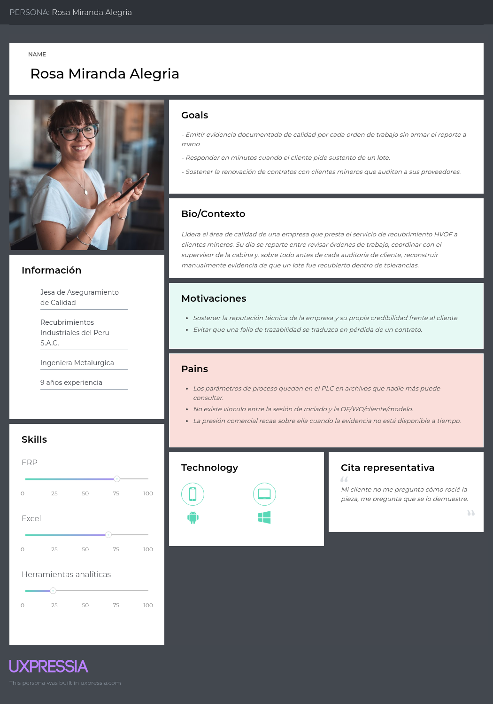

| Campo | Contenido de la ficha |
|---|---|
| Nombre / edad | Rosa Miranda Alegria, 36 años |
| Cargo / empresa | Ingeniera de Calidad e Investigación en un proveedor de recuperación de componentes mediante HVOF (Lima – Callao) |
| Formación | Ingeniería de Materiales; 9 años en procesos de recubrimiento |
| Cita | "Cuando el cliente pregunta con qué parámetros se roció su pieza, la respuesta no puede tardar tres días." |
| Objetivos | Demostrar con datos que cada lote fue recubierto dentro de la especificación; definir y controlar las recetas por tipo de componente; explicar el origen de una falla prematura en campo |
| Frustraciones | Registros dispersos entre PLC, papel y memoria del personal; desviaciones que el PLC no alarma porque solo actúa en los límites de parada; reportes rehechos en Excel para cada cliente |
| Motivaciones | Renovación de contratos con clientes mineros; reputación técnica del taller |
| Tecnología | Laptop en oficina y taller, Excel avanzado, ERP administrativo; móvil para alertas; Chrome |
| Canales | Correo corporativo, WhatsApp con supervisores, reuniones semanales de calidad |
| Marcas e influencias | Oerlikon Metco, Praxair, ASM Thermal Spray Society, normas ISO 9001 y AS9100 |

#### Ficha de User Persona 2 — Segmento Recuperation Supplier: Jorge Salinas Paredes, Supervisor de Mantenimiento de máquina

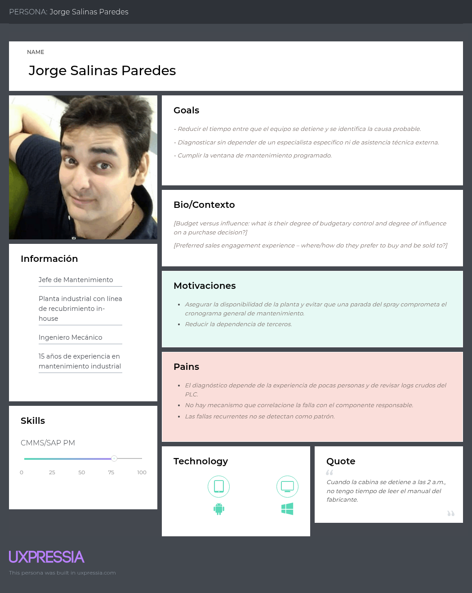

| Campo | Contenido de la ficha |
|---|---|
| Nombre / edad | Jorge Salinas Paredes, 44 años |
| Cargo / empresa | Supervisor de Mantenimiento de máquina del mismo proveedor de recuperación; responsable de la disponibilidad de los sistemas HVOF |
| Formación | Técnico electromecánico (instituto tecnológico); 15 años en mantenimiento industrial, 6 en sistemas de proyección térmica |
| Cita | "El PLC me dice que hubo una falla, no me dice qué parte revisar." |
| Objetivos | Reducir el tiempo entre la parada del sistema HVOF y la identificación de la causa; saber qué subsistema y qué parte intervenir antes de ir a la máquina; anticipar fallas recurrentes |
| Frustraciones | Códigos de falla del PLC sin correlación con la parte responsable; diagnóstico dependiente de dos técnicos senior; bitácora en papel que nadie consulta |
| Motivaciones | Cumplir la ventana de producción comprometida; que el conocimiento del equipo no se vaya con las personas |
| Tecnología | PC de escritorio en taller, RSLogix / Studio 5000 para revisar el PLC, hojas de cálculo básicas; móvil para alertas; Edge |
| Canales | Radio y WhatsApp en planta, correo para reportes, contacto directo con el fabricante del equipo |
| Marcas e influencias | Allen-Bradley (Rockwell), Siemens, Oerlikon Metco, foros de mantenimiento industrial |

#### Ficha de User Persona 3 — Segmento Asset Owner: Lucía Torres Quispe, Ingeniera de Confiabilidad

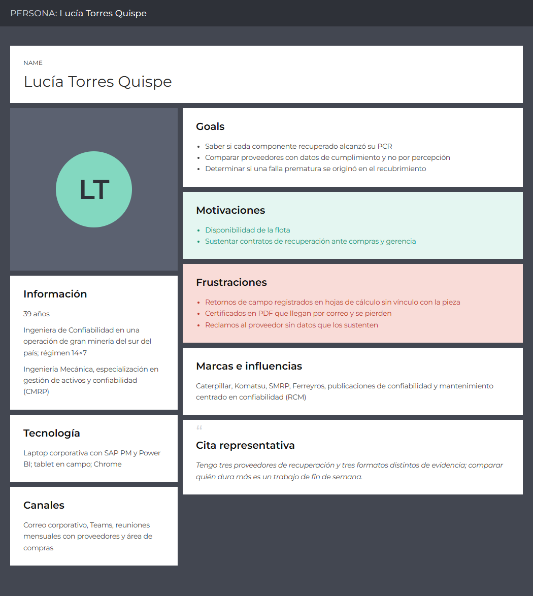

| Campo | Contenido de la ficha |
|---|---|
| Nombre / edad | Lucía Torres Quispe, 39 años |
| Cargo / empresa | Ingeniera de Confiabilidad en una operación de gran minería del sur del país; régimen 14×7 |
| Formación | Ingeniería Mecánica, especialización en gestión de activos y confiabilidad (CMRP) |
| Cita | "Tengo tres proveedores de recuperación y tres formatos distintos de evidencia; comparar quién dura más es un trabajo de fin de semana." |
| Objetivos | Saber si cada componente recuperado alcanzó su PCR; comparar proveedores con datos de cumplimiento y no por percepción; determinar si una falla prematura se originó en el recubrimiento |
| Frustraciones | Retornos de campo registrados en hojas de cálculo sin vínculo con la pieza; certificados en PDF que llegan por correo y se pierden; reclamos al proveedor sin datos que los sustenten |
| Motivaciones | Disponibilidad de la flota; sustentar contratos de recuperación ante compras y gerencia |
| Tecnología | Laptop corporativa con SAP PM y Power BI; tablet en campo; Chrome |
| Canales | Correo corporativo, Teams, reuniones mensuales con proveedores y área de compras |
| Marcas e influencias | Caterpillar, Komatsu, SMRP, Ferreyros, publicaciones de confiabilidad y mantenimiento centrado en confiabilidad (RCM) |

### 2.3.2. User Task Matrix.

La matriz consolida las tareas que realizan los User Personas para cumplir sus objetivos, con independencia de la existencia de Reliant. Se califica la frecuencia y la importancia de cada tarea para cada persona.

| Tarea | Rosa — Frec. | Rosa — Imp. | Jorge — Frec. | Jorge — Imp. | Lucía — Frec. | Lucía — Imp. |
|---|---|---|---|---|---|---|
| Definir los parámetros y tolerancias (receta) con que debe recubrirse cada tipo de componente | Media | Alta | Baja | Media | N/A | N/A |
| Verificar que los parámetros de proceso se mantengan dentro de especificación durante la corrida | Alta | Alta | Media | Alta | N/A | N/A |
| Registrar a qué pieza, cliente y orden corresponde cada sesión ejecutada | Alta | Alta | Baja | Media | N/A | N/A |
| Sustentar ante el cliente que un lote fue recubierto dentro de tolerancias | Alta | Alta | N/A | N/A | N/A | N/A |
| Determinar la causa de una parada o falla del sistema HVOF | Baja | Media | Alta | Alta | N/A | N/A |
| Decidir qué subsistema o parte de la máquina requiere intervención o repuesto | Baja | Media | Alta | Alta | N/A | N/A |
| Anticipar fallas recurrentes del sistema HVOF | Media | Media | Alta | Alta | N/A | N/A |
| Registrar el retorno de campo de un componente y las horas que trabajó | Baja | Media | N/A | N/A | Alta | Alta |
| Verificar si un componente recuperado alcanzó su PCR | Media | Alta | N/A | N/A | Alta | Alta |
| Revisar la evidencia de calidad entregada por el proveedor | N/A | N/A | N/A | N/A | Media | Alta |
| Comparar el desempeño de los proveedores de recuperación | N/A | N/A | N/A | N/A | Media | Alta |
| Explicar el origen de una falla prematura en campo | Media | Alta | Baja | Media | Alta | Alta |
| Reportar métricas de calidad, disponibilidad o confiabilidad a la gerencia | Media | Alta | Media | Alta | Alta | Alta |
| Transferir el conocimiento del proceso o del equipo entre personas | Media | Media | Media | Alta | Baja | Media |

**Tareas con mayor frecuencia e importancia.** Para Rosa, sustentar ante el cliente que un lote fue recubierto dentro de tolerancias y registrar la correspondencia entre sesión, pieza, cliente y orden: ambas son diarias y determinan la continuidad del contrato. Para Jorge, determinar la causa de una parada y decidir qué subsistema o parte atender, porque de ellas depende la disponibilidad del sistema HVOF. Para Lucía, registrar el retorno de campo y verificar el cumplimiento del PCR, que alimentan directamente la evaluación de proveedores y el reporte a gerencia.

**Coincidencias.** Las tres personas comparten como tarea de alta importancia explicar el origen de una falla prematura y reportar métricas a la gerencia. Rosa y Lucía coinciden además en verificar el cumplimiento del PCR: la misma pieza es evaluada por quien la recubrió y por quien la opera, pero hoy con información que no se cruza. Esta coincidencia es la que sostiene el modelo de dos segmentos sobre una única cadena de trazabilidad.

**Diferencias.** Rosa y Jorge actúan sobre el proceso y el equipo dentro del taller; Lucía actúa sobre el componente una vez que vuelve a operar en mina y nunca sobre el sistema HVOF. Dentro del proveedor, Rosa documenta y sustenta ante un tercero, mientras que Jorge diagnostica y decide sobre el propio equipo. Estas diferencias determinan que las tres personas necesiten vistas distintas de la misma información: la receta y el certificado para Rosa, el subsistema y la parte sospechosa para Jorge, y el cumplimiento de PCR por proveedor para Lucía.

### 2.3.3. User Journey Mapping.

Los Journey Maps describen la experiencia actual (as-is) de cada persona en la tarea de mayor peso identificada en la matriz, sin considerar la existencia de Reliant. Se elaboraron en UXPressia; se presenta su contenido y la captura correspondiente.

#### Journey Map 1 — Rosa Miranda: sustentar ante el cliente minero que un lote fue recubierto dentro de tolerancias


| Fase | Acciones | Pensamientos | Emociones | Puntos de dolor |
|---|---|---|---|---|
| Solicitud del cliente | Recibe el pedido de sustento y ubica la OF/WO | "Espero que esta vez el registro esté completo" | Neutral, con algo de incertidumbre | No sabe de antemano si el dato existe o está completo |
| Búsqueda de evidencia | Revisa archivos del PLC y bitácoras en papel, consulta al supervisor de operación | "¿Dónde quedó el registro de esa fecha exacta y con qué receta se corrió?" | Tensión creciente | Información dispersa entre PLC, papel y memoria del personal; la receta usada no quedó registrada |
| Reconstrucción manual | Arma el reporte cruzando fuentes y lo adapta al formato que exige el cliente | "Esto me toma horas que no tengo, y cada cliente pide un formato distinto" | Frustración | Alto esfuerzo manual, riesgo de error al cruzar datos, reporte rehecho en Excel |
| Entrega | Envía el reporte, a veces fuera de plazo | "Espero que esto no afecte la renovación del contrato" | Ansiedad | Retraso percibido por el cliente como falta de control de proceso |

#### Journey Map 2 — Jorge Salinas: diagnosticar una parada no programada del sistema HVOF

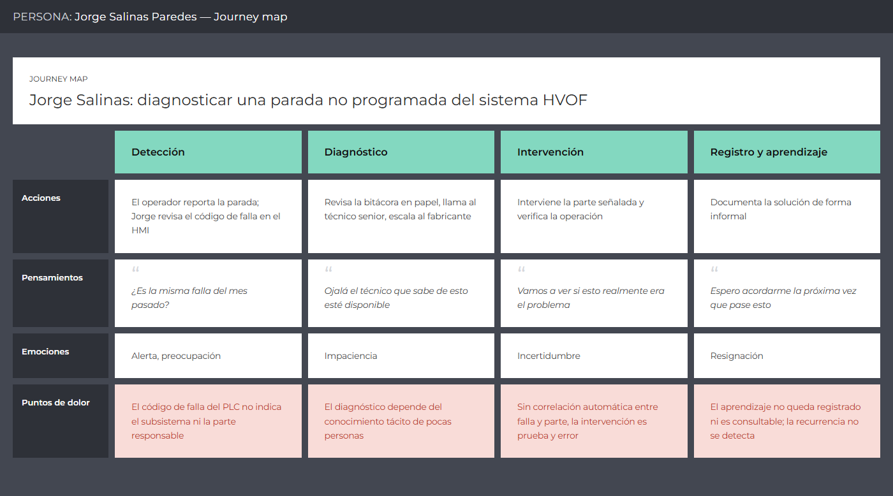

| Fase | Acciones | Pensamientos | Emociones | Puntos de dolor |
|---|---|---|---|---|
| Detección | El operador reporta la parada; Jorge revisa el código de falla en el HMI | "¿Es la misma falla del mes pasado?" | Alerta, preocupación | El código de falla del PLC no indica el subsistema ni la parte responsable |
| Diagnóstico | Revisa la bitácora en papel, llama al técnico senior, escala al fabricante | "Ojalá el técnico que sabe de esto esté disponible" | Impaciencia | El diagnóstico depende del conocimiento tácito de pocas personas |
| Intervención | Interviene la parte señalada y verifica la operación | "Vamos a ver si esto realmente era el problema" | Incertidumbre | Sin correlación automática entre falla y parte, la intervención es prueba y error |
| Registro y aprendizaje | Documenta la solución de forma informal | "Espero acordarme la próxima vez que pase esto" | Resignación | El aprendizaje no queda registrado ni es consultable; la recurrencia no se detecta |

#### Journey Map 3 — Lucía Torres: evaluar un componente recuperado que falló antes de su PCR

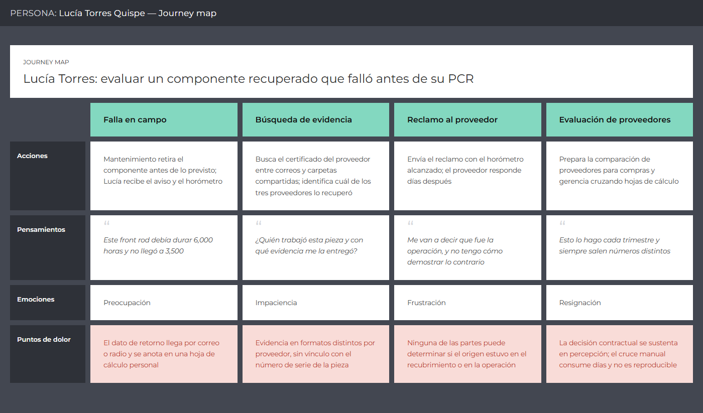

| Fase | Acciones | Pensamientos | Emociones | Puntos de dolor |
|---|---|---|---|---|
| Falla en campo | Mantenimiento retira el componente antes de lo previsto; Lucía recibe el aviso y el horómetro | "Este front rod debía durar 6,000 horas y no llegó a 3,500" | Preocupación | El dato de retorno llega por correo o radio y se anota en una hoja de cálculo personal |
| Búsqueda de evidencia | Busca el certificado del proveedor entre correos y carpetas compartidas; identifica cuál de los tres proveedores lo recuperó | "¿Quién trabajó esta pieza y con qué evidencia me la entregó?" | Impaciencia | Evidencia en formatos distintos por proveedor, sin vínculo con el número de serie de la pieza |
| Reclamo al proveedor | Envía el reclamo con el horómetro alcanzado; el proveedor responde días después | "Me van a decir que fue la operación, y no tengo cómo demostrar lo contrario" | Frustración | Ninguna de las partes puede determinar si el origen estuvo en el recubrimiento o en la operación |
| Evaluación de proveedores | Prepara la comparación de proveedores para compras y gerencia cruzando hojas de cálculo | "Esto lo hago cada trimestre y siempre salen números distintos" | Resignación | La decisión contractual se sustenta en percepción; el cruce manual consume días y no es reproducible |

### 2.3.4. Empathy Mapping.

Los Empathy Maps sintetizan lo que cada persona dice, piensa, hace y siente en relación con el problema, a partir de las citas y observaciones recogidas en las entrevistas. Se elaboraron en UXPressia; se presenta la captura y el contenido de cada cuadrante.

#### Empathy Map — Rosa Miranda (Recuperation Supplier)

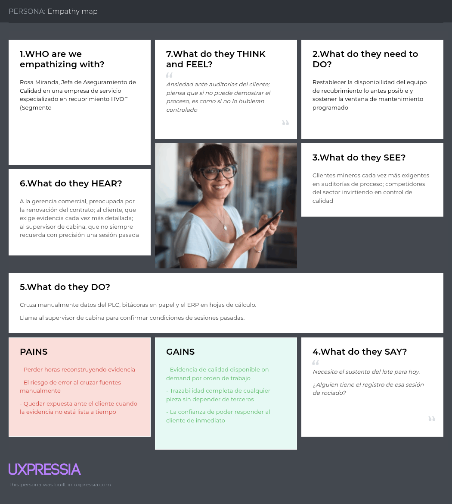

| Cuadrante | Contenido |
|---|---|
| Dice | "El cliente me pide evidencia y yo tengo que armarla a mano." · "El PLC no alarma hasta que ya es tarde." |
| Piensa | Que cada reclamo sin respuesta rápida pone en riesgo el contrato; que la receta correcta depende de que el operador la cargue bien |
| Hace | Cruza archivos del PLC con bitácoras en papel; define parámetros por tipo de pieza en hojas de cálculo; rehace reportes por cliente |
| Siente | Presión comercial, frustración por el tiempo perdido, inseguridad al firmar un certificado sin todos los datos |
| Dolores | Trazabilidad reconstruida a mano; desviaciones de calidad no detectadas; formatos de reporte distintos por cliente |
| Ganancias | Evidencia generada desde el dato de proceso; alerta cuando la lectura sale de la banda de calidad; reportes con la estructura que exige cada cliente |

#### Empathy Map — Jorge Salinas (Recuperation Supplier)

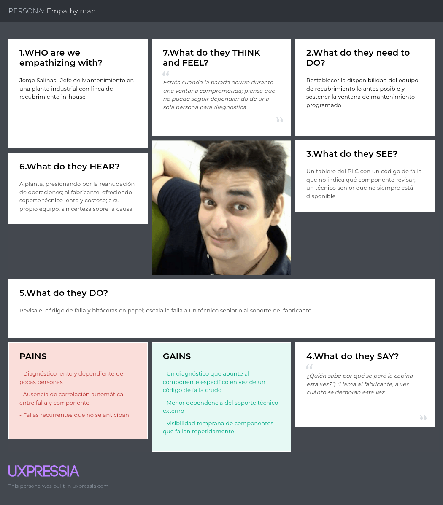

| Cuadrante | Contenido |
|---|---|
| Dice | "El código de falla no me dice qué revisar." · "Si el técnico que sabe está de vacaciones, la máquina espera." |
| Piensa | Que la misma falla ya ocurrió antes pero nadie lo anotó; que el fabricante cobra por diagnósticos que él podría hacer con la información correcta |
| Hace | Revisa el HMI y el PLC, llama al técnico senior, prueba y error sobre la máquina, anota la solución en un cuaderno |
| Siente | Impaciencia por la ventana de producción, resignación ante la falta de registro, orgullo cuando resuelve sin ayuda externa |
| Dolores | Diagnóstico dependiente de pocas personas; sin correlación falla–parte; recurrencias invisibles |
| Ganancias | Caso de falla abierto con síntomas y parte sospechosa; conocimiento registrado y consultable; aviso antes de una parada mayor |

#### Empathy Map — Lucía Torres (Asset Owner)

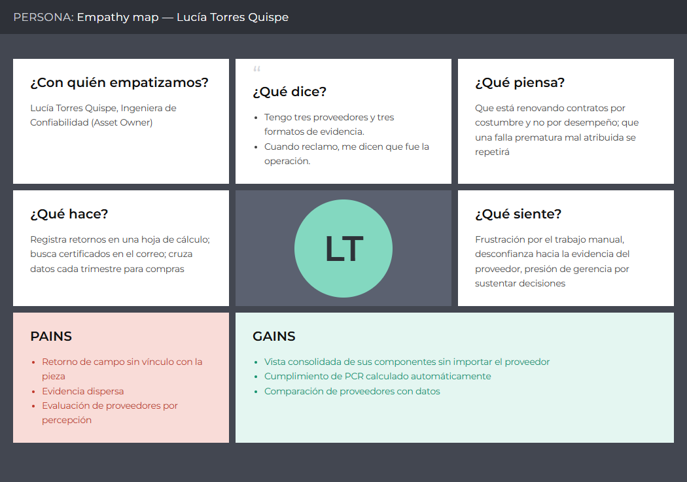

| Cuadrante | Contenido |
|---|---|
| Dice | "Tengo tres proveedores y tres formatos de evidencia." · "Cuando reclamo, me dicen que fue la operación." |
| Piensa | Que está renovando contratos por costumbre y no por desempeño; que una falla prematura mal atribuida se repetirá |
| Hace | Registra retornos en una hoja de cálculo; busca certificados en el correo; cruza datos cada trimestre para compras |
| Siente | Frustración por el trabajo manual, desconfianza hacia la evidencia del proveedor, presión de gerencia por sustentar decisiones |
| Dolores | Retorno de campo sin vínculo con la pieza; evidencia dispersa; evaluación de proveedores por percepción |
| Ganancias | Vista consolidada de sus componentes sin importar el proveedor; cumplimiento de PCR calculado automáticamente; comparación de proveedores con datos |

## 2.4. Big Picture Event Storming.

En esta sección se introduce y resume el proceso realizado por nuestro equipo, presentando las evidencias y explicaciones de las etapas del Big Picture Event Storming. En una sesión colaborativa, nuestro equipo se enfocó en entender el dominio del negocio en general, plasmando los eventos significativos y sus relaciones. Es una primera aproximación visual de alto nivel que explora el landscape del negocio, identificando procesos clave y exponiendo potenciales problemas u oportunidades del proceso de recuperación de componentes mediante recubrimiento HVOF, desde la recepción de la pieza del cliente hasta la evaluación de su desempeño en campo. La sesión siguió la guía paso a paso del Event Storming Journal (Bourgau, 2022) y fue documentada con diagramas Mermaid, alternativa permitida por el enunciado del proyecto para Diagram-as-Code. Se conservó la convención de colores del método: naranja para Domain Events, amarillo para Actors, azul para External Systems y rosado para Problems (hotspots).

### Paso 1. Preparación del tablero

Dado que la sesión se realizó de forma remota, la "sala" fue un tablero compartido. El equipo preparó con anticipación:

- El espacio de diseño dividido en tres zonas, siguiendo la guía: *Open* (generación libre), *Explore* (ordenamiento y enriquecimiento) y *Close* (resultados).
- La agenda visual con los nueve pasos de la guía.
- La leyenda de colores.
- Un Domain Event inicial preparado por la facilitadora (*SpraySessionStarted*), siguiendo el truco de Alberto Brandolini de "encender" la sesión con un evento ya colocado en el centro del tablero.

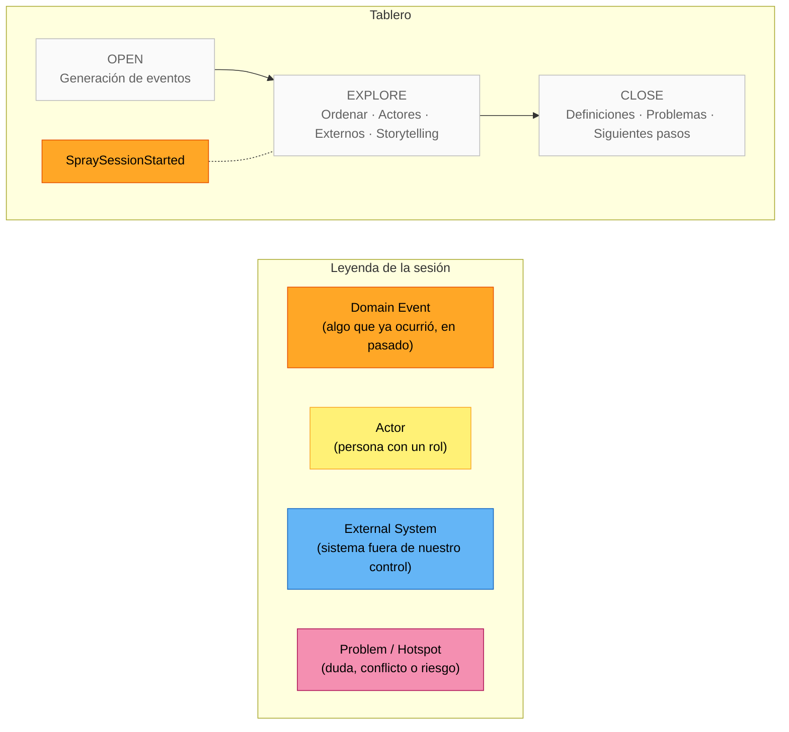
```mermaid
flowchart LR
    classDef evento fill:#FFA726,stroke:#E65100,color:#000
    classDef actor fill:#FFF176,stroke:#F9A825,color:#000
    classDef externo fill:#64B5F6,stroke:#1565C0,color:#000
    classDef problema fill:#F48FB1,stroke:#AD1457,color:#000
    classDef zona fill:#FAFAFA,stroke:#BDBDBD,color:#616161

    subgraph L["Leyenda de la sesión"]
        direction LR
        E["Domain Event<br/>(algo que ya ocurrió, en pasado)"]:::evento
        A["Actor<br/>(persona con un rol)"]:::actor
        X["External System<br/>(sistema fuera de nuestro control)"]:::externo
        P["Problem / Hotspot<br/>(duda, conflicto o riesgo)"]:::problema
    end

    subgraph T["Tablero"]
        direction LR
        O["OPEN<br/>Generación de eventos"]:::zona
        EX["EXPLORE<br/>Ordenar · Actores · Externos · Storytelling"]:::zona
        C["CLOSE<br/>Definiciones · Problemas · Siguientes pasos"]:::zona
        S0["SpraySessionStarted"]:::evento
        O --> EX --> C
        S0 -.- EX
    end
```

### Paso 2. Energizante

La sesión inició con una dinámica breve de cinco minutos en la que cada integrante describió, en una frase y sin usar términos técnicos, qué pasa con una pieza minera desde que se desgasta hasta que vuelve a operar. El ejercicio sirvió para nivelar el vocabulario entre los integrantes con experiencia en planta y los que no la tenían, y para dejar claro desde el inicio que el tablero se llenaría con hechos del negocio y no con funciones de software.

### Paso 3. Briefing y agenda

La facilitadora (Carolina) presentó el objetivo, el alcance y los casos de uso de la sesión:

| Elemento | Definición acordada |
|---|---|
| Objetivo | Entender de extremo a extremo cómo un componente pasa por el proceso de recuperación HVOF y cómo se conoce su resultado en campo |
| Alcance | Desde la recepción del componente del cliente hasta el registro de su retorno de campo y la evaluación contra el PCR. Incluye la operación del sistema HVOF y el diagnóstico de sus fallas. Excluye la gestión de mantenimiento correctivo/preventivo del sistema HVOF |
| Casos de uso guía | (1) Recuperar un front rod de un cliente minero y entregarlo con evidencia de calidad. (2) Diagnosticar por qué el sistema HVOF se detuvo durante una corrida. (3) Determinar si una pieza que falló en mina antes de su PCR fue mal recubierta |
| Convenciones | Eventos en inglés, en pasado, en PascalCase. Un evento por post-it. Se permite duplicar; se depura al ordenar |

### Paso 4. Generación de Domain Events

Durante veinticinco minutos cada integrante colocó, de forma individual y sin discutir, todos los eventos que recordaba del dominio. La tasa de generación decayó hacia el minuto veinte, señal de pasar al siguiente paso. Se obtuvieron setenta y nueve post-its, incluidos duplicados y eventos que después se reformularon. El tablero, tal como quedó antes de ordenar:

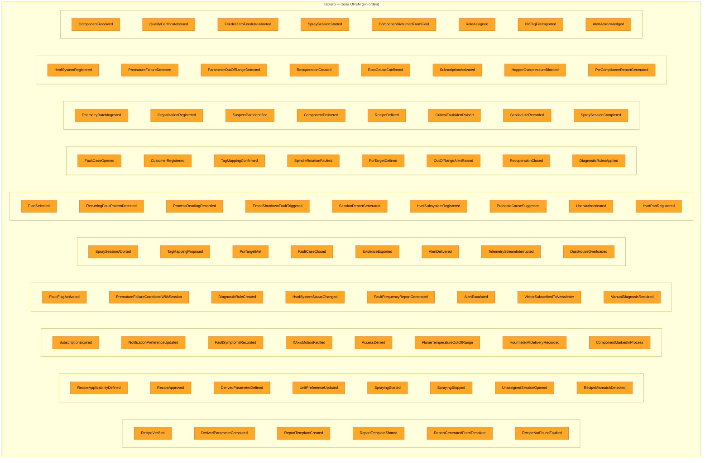
```mermaid
flowchart TB
    classDef evento fill:#FFA726,stroke:#E65100,color:#000

    subgraph W["Tablero — zona OPEN (sin orden)"]
        direction TB
        subgraph R1 [" "]
            direction LR
            a1["ComponentReceived"]:::evento
            a2["QualityCertificateIssued"]:::evento
            a3["FeederZeroFeedrateAborted"]:::evento
            a4["SpraySessionStarted"]:::evento
            a5["ComponentReturnedFromField"]:::evento
            a6["RoleAssigned"]:::evento
            a7["PlcTagFileImported"]:::evento
            a8["AlertAcknowledged"]:::evento
            a1 ~~~ a2 ~~~ a3 ~~~ a4 ~~~ a5 ~~~ a6 ~~~ a7 ~~~ a8
        end
        subgraph R2 [" "]
            direction LR
            b1["HvofSystemRegistered"]:::evento
            b2["PrematureFailureDetected"]:::evento
            b3["ParameterOutOfRangeDetected"]:::evento
            b4["RecuperationCreated"]:::evento
            b5["RootCauseConfirmed"]:::evento
            b6["SubscriptionActivated"]:::evento
            b7["HopperOverpressureBlocked"]:::evento
            b8["PcrComplianceReportGenerated"]:::evento
            b1 ~~~ b2 ~~~ b3 ~~~ b4 ~~~ b5 ~~~ b6 ~~~ b7 ~~~ b8
        end
        subgraph R3[" "]
            direction LR
            c1["TelemetryBatchIngested"]:::evento
            c2["OrganizationRegistered"]:::evento
            c3["SuspectPartIdentified"]:::evento
            c4["ComponentDelivered"]:::evento
            c5["RecipeDefined"]:::evento
            c6["CriticalFaultAlertRaised"]:::evento
            c7["ServiceLifeRecorded"]:::evento
            c8["SpraySessionCompleted"]:::evento
            c1 ~~~ c2 ~~~ c3 ~~~ c4 ~~~ c5 ~~~ c6 ~~~ c7 ~~~ c8
        end
        subgraph R4[" "]
            direction LR
            d1["FaultCaseOpened"]:::evento
            d2["CustomerRegistered"]:::evento
            d3["TagMappingConfirmed"]:::evento
            d4["SpindleRotationFaulted"]:::evento
            d5["PcrTargetDefined"]:::evento
            d6["OutOfRangeAlertRaised"]:::evento
            d7["RecuperationClosed"]:::evento
            d8["DiagnosticRulesApplied"]:::evento
            d1 ~~~ d2 ~~~ d3 ~~~ d4 ~~~ d5 ~~~ d6 ~~~ d7 ~~~ d8
        end
        subgraph R5[" "]
            direction LR
            e1["PlanSelected"]:::evento
            e2["RecurringFaultPatternDetected"]:::evento
            e3["ProcessReadingRecorded"]:::evento
            e4["TimedShutdownFaultTriggered"]:::evento
            e5["SessionReportGenerated"]:::evento
            e6["HvofSubsystemRegistered"]:::evento
            e7["ProbableCauseSuggested"]:::evento
            e8["UserAuthenticated"]:::evento
            e9["HvofPartRegistered"]:::evento
            e1 ~~~ e2 ~~~ e3 ~~~ e4 ~~~ e5 ~~~ e6 ~~~ e7 ~~~ e8 ~~~ e9
        end
        subgraph R6[" "]
            direction LR
            f1["SpraySessionAborted"]:::evento
            f2["TagMappingProposed"]:::evento
            f3["PcrTargetMet"]:::evento
            f4["FaultCaseClosed"]:::evento
            f5["EvidenceExported"]:::evento
            f6["AlertDelivered"]:::evento
            f7["TelemetryStreamInterrupted"]:::evento
            f8["DustHouseOverloaded"]:::evento
            f1 ~~~ f2 ~~~ f3 ~~~ f4 ~~~ f5 ~~~ f6 ~~~ f7 ~~~ f8
        end
        subgraph R7[" "]
            direction LR
            g1["FaultFlagActivated"]:::evento
            g2["PrematureFailureCorrelatedWithSession"]:::evento
            g3["DiagnosticRuleCreated"]:::evento
            g4["HvofSystemStatusChanged"]:::evento
            g5["FaultFrequencyReportGenerated"]:::evento
            g6["AlertEscalated"]:::evento
            g7["VisitorSubscribedToNewsletter"]:::evento
            g8["ManualDiagnosisRequired"]:::evento
            g1 ~~~ g2 ~~~ g3 ~~~ g4 ~~~ g5 ~~~ g6 ~~~ g7 ~~~ g8
        end
        subgraph R8[" "]
            direction LR
            h1["SubscriptionExpired"]:::evento
            h2["NotificationPreferenceUpdated"]:::evento
            h3["FaultSymptomsRecorded"]:::evento
            h4["XAxisMotionFaulted"]:::evento
            h5["AccessDenied"]:::evento
            h6["FlameTemperatureOutOfRange"]:::evento
            h7["HourmeterAtDeliveryRecorded"]:::evento
            h8["ComponentMarkedInProcess"]:::evento
            h1 ~~~ h2 ~~~ h3 ~~~ h4 ~~~ h5 ~~~ h6 ~~~ h7 ~~~ h8
        end
        subgraph R9[" "]
            direction LR
            i1["RecipeApplicabilityDefined"]:::evento
            i2["RecipeApproved"]:::evento
            i3["DerivedParameterDefined"]:::evento
            i4["UnitPreferenceUpdated"]:::evento
            i5["SprayingStarted"]:::evento
            i6["SprayingStopped"]:::evento
            i7["UnassignedSessionOpened"]:::evento
            i8["RecipeMismatchDetected"]:::evento
            i1 ~~~ i2 ~~~ i3 ~~~ i4 ~~~ i5 ~~~ i6 ~~~ i7 ~~~ i8
        end
        subgraph R10[" "]
            direction LR
            j1["RecipeVerified"]:::evento
            j2["DerivedParameterComputed"]:::evento
            j3["ReportTemplateCreated"]:::evento
            j4["ReportTemplateShared"]:::evento
            j5["ReportGeneratedFromTemplate"]:::evento
            j6["RecipeNotFoundFaulted"]:::evento
            j1 ~~~ j2 ~~~ j3 ~~~ j4 ~~~ j5 ~~~ j6
        end
        R1 ~~~ R2 ~~~ R3 ~~~ R4 ~~~ R5 ~~~ R6 ~~~ R7 ~~~ R8 ~~~ R9 ~~~ R10
    end
```

Durante la depuración se tomaron dos decisiones que quedaron registradas para el paso siguiente:

- Los eventos de falla específicos del PLC (*FeederZeroFeedrateAborted*, *HopperOverpressureBlocked*, *SpindleRotationFaulted*, *XAxisMotionFaulted*, *TimedShutdownFaultTriggered*, *DustHouseOverloaded*, *RecipeNotFoundFaulted*) se agruparon bajo un evento genérico *FaultFlagActivated* con el tipo de falla como atributo. Esto evita que el tablero tenga un post-it por cada uno de los más de treinta tags de falla del PLC y refleja cómo lo procesa el sistema: el tag mapeado como indicador de falla se activa, y eso abre el caso.
- *FlameTemperatureOutOfRange* se absorbió en *ParameterOutOfRangeDetected*, por la misma razón. Este evento lleva como atributo la banda alcanzada (advertencia o parada), ya que la receta define bandas de umbral y no un único rango.

### Paso 5. Ordenamiento cronológico

Aquí comenzó la discusión. El equipo ordenó los eventos de izquierda a derecha y, al hacerlo, aparecieron dos flujos concurrentes que se representaron como carriles: mientras la sesión de rociado registra lecturas, en paralelo pueden abrirse casos de falla y generarse alertas. También aparecieron dos flujos alternativos: la sesión puede terminar completada o abortada, y puede abrirse sin orden asignada cuando el PLC reporta rociado activo sin que el operador haya iniciado una sesión.


```mermaid
flowchart LR
    classDef evento fill:#FFA726,stroke:#E65100,color:#000
    classDef fase fill:#FAFAFA,stroke:#BDBDBD,color:#616161

    subgraph F0["0. Configuración"]
        direction TB
        OrganizationRegistered:::evento --> PlanSelected:::evento --> SubscriptionActivated:::evento --> RoleAssigned:::evento --> UnitPreferenceUpdated:::evento
        HvofSystemRegistered:::evento --> HvofSubsystemRegistered:::evento --> HvofPartRegistered:::evento --> PlcTagFileImported:::evento --> TagMappingProposed:::evento --> TagMappingConfirmed:::evento
        TagMappingConfirmed --> RecipeDefined:::evento --> RecipeApplicabilityDefined:::evento --> RecipeApproved:::evento
        TagMappingConfirmed --> DerivedParameterDefined:::evento
        CustomerRegistered:::evento --> PcrTargetDefined:::evento
        DiagnosticRuleCreated:::evento
        ReportTemplateCreated:::evento --> ReportTemplateShared:::evento
    end

    subgraph F1["1. Recepción"]
        direction TB
        ComponentReceived:::evento --> RecuperationCreated:::evento --> ComponentMarkedInProcess:::evento
    end

    subgraph F2["2. Corrida de rociado"]
        direction TB
        SpraySessionStarted:::evento --> RecipeVerified:::evento --> TelemetryBatchIngested:::evento --> ProcessReadingRecorded:::evento
        ProcessReadingRecorded --> DerivedParameterComputed:::evento
        ProcessReadingRecorded --> SprayingStarted:::evento --> SprayingStopped:::evento
        SprayingStopped --> SpraySessionCompleted:::evento
        SprayingStopped --> SpraySessionAborted:::evento
        UnassignedSessionOpened:::evento -. requiere vincular orden .-> SpraySessionStarted
    end

    subgraph F2B["2b. Carril concurrente — Desviaciones y fallas"]
        direction TB
        ParameterOutOfRangeDetected:::evento --> OutOfRangeAlertRaised:::evento --> AlertDelivered:::evento --> AlertAcknowledged:::evento
        RecipeMismatchDetected:::evento --> CriticalFaultAlertRaised:::evento
        FaultFlagActivated:::evento --> FaultCaseOpened:::evento --> FaultSymptomsRecorded:::evento --> DiagnosticRulesApplied:::evento
        DiagnosticRulesApplied --> ProbableCauseSuggested:::evento --> SuspectPartIdentified:::evento --> CriticalFaultAlertRaised
        DiagnosticRulesApplied --> ManualDiagnosisRequired:::evento
        SuspectPartIdentified --> RootCauseConfirmed:::evento --> FaultCaseClosed:::evento
        ManualDiagnosisRequired --> RootCauseConfirmed
        FaultCaseClosed --> RecurringFaultPatternDetected:::evento
        TelemetryStreamInterrupted:::evento
    end

    subgraph F3["3. Cierre y entrega"]
        direction TB
        RecuperationClosed:::evento --> HourmeterAtDeliveryRecorded:::evento --> QualityCertificateIssued:::evento --> ComponentDelivered:::evento
        SessionReportGenerated:::evento
    end

    subgraph F4["4. Campo y PCR"]
        direction TB
        ComponentReturnedFromField:::evento --> ServiceLifeRecorded:::evento
        ServiceLifeRecorded --> PcrTargetMet:::evento
        ServiceLifeRecorded --> PrematureFailureDetected:::evento --> PrematureFailureCorrelatedWithSession:::evento
    end

    subgraph F5["5. Reportes"]
        direction TB
        ReportGeneratedFromTemplate:::evento
        EvidenceExported:::evento
        FaultFrequencyReportGenerated:::evento
        PcrComplianceReportGenerated:::evento
    end

    F0 --> F1 --> F2 --> F3 --> F4 --> F5
    ProcessReadingRecorded -. dispara .-> ParameterOutOfRangeDetected
    DerivedParameterComputed -. dispara .-> ParameterOutOfRangeDetected
    ProcessReadingRecorded -. dispara .-> FaultFlagActivated
    RecipeVerified -. si no aplica .-> RecipeMismatchDetected
    SpraySessionCompleted --> RecuperationClosed
    SpraySessionAborted -. requiere nueva corrida .-> SpraySessionStarted
```

Al ordenar, el equipo hizo explícitas cinco cosas que estaban implícitas:

- *HourmeterAtDeliveryRecorded* no existía en la generación inicial de todos; apareció cuando se preguntó "¿contra qué se compara el horómetro de retorno?". Sin ese dato, *ServiceLifeRecorded* no puede calcular horas logradas.
- *ManualDiagnosisRequired* apareció al preguntar "¿y si ninguna regla coincide?". Es el flujo alternativo de *DiagnosticRulesApplied*.
- *SpraySessionAborted* no cierra la orden: obliga a una nueva corrida. Por eso la flecha punteada regresa a *SpraySessionStarted*.
- *SprayingStarted* y *SprayingStopped* dividen la sesión en pasadas. La sesión la abre el operador porque el PLC no conoce la OF/WO, pero el rociado efectivo lo detecta el tag de estado de rociado activo.
- *RecipeVerified* ocurre entre el inicio de la sesión y la primera lectura: el sistema compara la receta cargada en el controlador con el tipo y modelo del componente de la orden. Si no corresponde, se dispara *RecipeMismatchDetected*.

### Paso 6. Actores y sistemas externos

Con la historia ya ordenada, el equipo identificó quién dispara cada cadena de eventos (post-its amarillos) y qué sistemas fuera de la plataforma participan (post-its azules). Siguiendo la guía, se colocó un actor al inicio de cada cadena y no en cada evento.

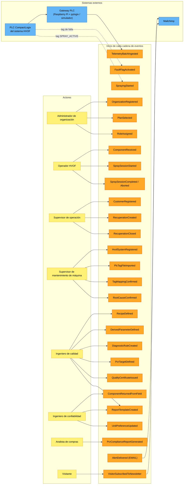
```mermaid
flowchart LR
    classDef evento fill:#FFA726,stroke:#E65100,color:#000
    classDef actor fill:#FFF176,stroke:#F9A825,color:#000
    classDef externo fill:#64B5F6,stroke:#1565C0,color:#000

    subgraph AC["Actores"]
        direction TB
        Adm["Administrador de organización"]:::actor
        Op["Operador HVOF"]:::actor
        SupOp["Supervisor de operación"]:::actor
        SupMant["Supervisor de mantenimiento de máquina"]:::actor
        IngCal["Ingeniero de calidad"]:::actor
        IngConf["Ingeniero de confiabilidad"]:::actor
        Compras["Analista de compras"]:::actor
        Vis["Visitante"]:::actor
    end

    subgraph EX["Sistemas externos"]
        direction TB
        Gw["Gateway PLC<br/>(Raspberry Pi + pylogix / simulador)"]:::externo
        Plc["PLC CompactLogix<br/>del sistema HVOF"]:::externo
        Mc["Mailchimp"]:::externo
    end

    subgraph EV["Inicio de cada cadena de eventos"]
        direction TB
        e1["OrganizationRegistered"]:::evento
        e2["PlanSelected"]:::evento
        e3["RoleAssigned"]:::evento
        e4["HvofSystemRegistered"]:::evento
        e5["PlcTagFileImported"]:::evento
        e6["TagMappingConfirmed"]:::evento
        e7["RecipeDefined"]:::evento
        e8["DerivedParameterDefined"]:::evento
        e9["DiagnosticRuleCreated"]:::evento
        e10["CustomerRegistered"]:::evento
        e11["PcrTargetDefined"]:::evento
        e12["ComponentReceived"]:::evento
        e13["RecuperationCreated"]:::evento
        e14["SpraySessionStarted"]:::evento
        e15["TelemetryBatchIngested"]:::evento
        e16["SprayingStarted"]:::evento
        e17["FaultFlagActivated"]:::evento
        e18["RootCauseConfirmed"]:::evento
        e19["SpraySessionCompleted / Aborted"]:::evento
        e20["RecuperationClosed"]:::evento
        e21["QualityCertificateIssued"]:::evento
        e22["ComponentReturnedFromField"]:::evento
        e23["PcrComplianceReportGenerated"]:::evento
        e24["ReportTemplateCreated"]:::evento
        e25["UnitPreferenceUpdated"]:::evento
        e26["AlertDelivered (EMAIL)"]:::evento
        e27["VisitorSubscribedToNewsletter"]:::evento
    end

    Adm --> e1 & e2 & e3
    SupMant --> e4 & e5 & e6 & e18
    IngCal --> e7 & e8 & e9 & e11 & e21 & e24
    SupOp --> e10 & e13 & e20
    Op --> e12 & e14 & e19
    IngConf --> e22 & e24 & e25
    Compras --> e23
    Vis --> e27

    Plc --> Gw --> e15
    Plc -. tag de falla .-> e17
    Plc -. tag SPRAY_ACTIVE .-> e16
    e26 --> Mc
    e27 --> Mc
```

Tres decisiones surgieron en este paso:

- El **PLC** y el **gateway** se modelaron como dos sistemas externos distintos. El PLC es la fuente del dato; el gateway es quien lo lee vía EtherNet/IP y lo envía a la plataforma por REST. Para la demostración del curso, el gateway será un simulador que expone el mismo contrato, de modo que la plataforma no distingue si el origen es hardware real o simulado.
- El **ingeniero de confiabilidad** de la minera (Asset Owner) es quien dispara *ComponentReturnedFromField*, no el proveedor. Es el único que sabe cuántas horas trabajó la pieza en mina. Esta observación fue la que consolidó a la minera como segundo segmento pagante.
- El **PLC** dispara *SprayingStarted* a través del tag de estado de rociado activo, y no el operador. Esto define que la sesión la abre una persona, pero las pasadas de rociado dentro de ella las detecta la máquina.

### Paso 7. Storytelling

Un integrante narró la historia completa recorriendo el tablero de izquierda a derecha, usando el caso de uso guía del front rod. La audiencia interrumpió cuando algo no cuadraba. Las incoherencias que no se pudieron resolver en la sesión se estacionaron como post-its rosados (hotspots).

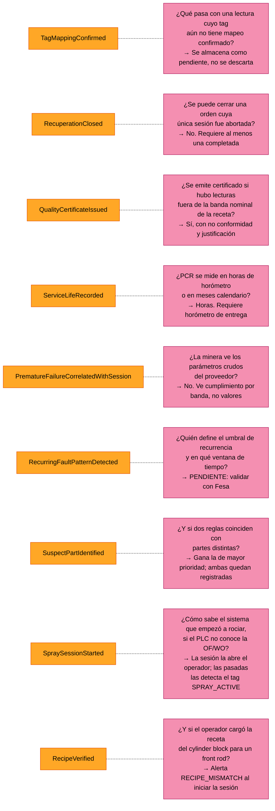
```mermaid
flowchart LR
    classDef evento fill:#FFA726,stroke:#E65100,color:#000
    classDef problema fill:#F48FB1,stroke:#AD1457,color:#000

    TagMappingConfirmed:::evento
    P1["¿Qué pasa con una lectura cuyo tag<br/>aún no tiene mapeo confirmado?<br/>→ Se almacena como pendiente, no se descarta"]:::problema
    TagMappingConfirmed -.- P1

    RecuperationClosed:::evento
    P2["¿Se puede cerrar una orden cuya<br/>única sesión fue abortada?<br/>→ No. Requiere al menos una completada"]:::problema
    RecuperationClosed -.- P2

    QualityCertificateIssued:::evento
    P3["¿Se emite certificado si hubo lecturas<br/>fuera de la banda nominal de la receta?<br/>→ Sí, con no conformidad y justificación"]:::problema
    QualityCertificateIssued -.- P3

    ServiceLifeRecorded:::evento
    P4["¿PCR se mide en horas de horómetro<br/>o en meses calendario?<br/>→ Horas. Requiere horómetro de entrega"]:::problema
    ServiceLifeRecorded -.- P4

    PrematureFailureCorrelatedWithSession:::evento
    P5["¿La minera ve los parámetros crudos<br/>del proveedor?<br/>→ No. Ve cumplimiento por banda, no valores"]:::problema
    PrematureFailureCorrelatedWithSession -.- P5

    RecurringFaultPatternDetected:::evento
    P6["¿Quién define el umbral de recurrencia<br/>y en qué ventana de tiempo?<br/>→ PENDIENTE: validar con Fesa"]:::problema
    RecurringFaultPatternDetected -.- P6

    SuspectPartIdentified:::evento
    P7["¿Y si dos reglas coinciden con<br/>partes distintas?<br/>→ Gana la de mayor prioridad; ambas quedan registradas"]:::problema
    SuspectPartIdentified -.- P7

    SpraySessionStarted:::evento
    P8["¿Cómo sabe el sistema que empezó a rociar,<br/>si el PLC no conoce la OF/WO?<br/>→ La sesión la abre el operador; las pasadas<br/>las detecta el tag SPRAY_ACTIVE"]:::problema
    SpraySessionStarted -.- P8

    RecipeVerified:::evento
    P9["¿Y si el operador cargó la receta<br/>del cylinder block para un front rod?<br/>→ Alerta RECIPE_MISMATCH al iniciar la sesión"]:::problema
    RecipeVerified -.- P9
```

Ocho de los nueve hotspots se resolvieron en la sesión y sus decisiones se trasladaron directamente a los criterios de aceptación de las User Stories (US11, US18, US35, US40, US41, US26, US57 y US56 respectivamente). El hotspot P6 quedó pendiente de validación con el supervisor de mantenimiento durante las entrevistas de la sección 2.2.

Durante la narración se capturaron también las primeras definiciones del lenguaje ubicuo, que se desarrollan en la sección 2.5:

| Término | Definición capturada en la sesión |
|---|---|
| Component | Pieza del cliente que se recupera (front rod, cylinder block). No confundir con las partes del sistema HVOF |
| HVOF Subsystem / HVOF Part | Subsistema del sistema HVOF (alimentador de polvo, consola de gases, chiller, manipulación, colector de polvo) y parte física dentro de él (hopper, disco dosificador, boquilla, spindle) |
| Recuperation | Orden de recuperación identificada por OF y WO; es el trabajo sobre un componente |
| Recipe | Conjunto de setpoints y bandas de umbral cargado en el controlador, aplicable a uno o más tipos y modelos de componente |
| Spray Session | Una corrida de rociado sobre un componente en un sistema HVOF. Una orden puede tener varias |
| Spray Pass | Intervalo de rociado efectivo dentro de una sesión, detectado desde el tag de estado del PLC |
| PCR Target | Horas de operación esperadas para el componente recuperado (Planned Component Replacement) |
| Fault Case | Caso abierto cuando un tag de falla se activa; se diagnostica, se confirma y se cierra |
| Suspect Part | Parte del sistema HVOF que las reglas señalan como probable responsable de la falla |

### Paso 8. Reverse storytelling

Como fase opcional, el equipo tomó el evento de mayor valor de negocio, *PrematureFailureDetected*, y recorrió la historia hacia atrás preguntando repetidamente "¿qué tuvo que ocurrir antes para que esto pasara?". El ejercicio confirmó la cadena de trazabilidad completa y reveló un evento que faltaba.


```mermaid
flowchart RL
    classDef evento fill:#FFA726,stroke:#E65100,color:#000
    classDef nuevo fill:#FFA726,stroke:#AD1457,stroke-width:3px,color:#000

    A["PrematureFailureDetected"]:::evento
    B["ServiceLifeRecorded"]:::evento
    C["ComponentReturnedFromField"]:::evento
    D["ComponentDelivered"]:::evento
    E["HourmeterAtDeliveryRecorded"]:::evento
    F["QualityCertificateIssued"]:::evento
    G["RecuperationClosed"]:::evento
    H["SpraySessionCompleted"]:::evento
    I["ProcessReadingRecorded"]:::evento
    J["RecipeVerified"]:::evento
    K["SpraySessionStarted"]:::evento
    L["RecuperationCreated"]:::evento
    M["ComponentReceived"]:::evento
    N["PcrTargetDefined"]:::evento
    O["CustomerLinkedToAssetOwnerOrganization"]:::nuevo

    A -->|"¿qué lo disparó?"| B -->|"¿qué lo disparó?"| C
    C -->|"¿qué debió existir?"| D --> E --> F --> G --> H --> I --> J --> K --> L --> M
    B -->|"¿contra qué se comparó?"| N
    C -->|"¿quién pudo registrarlo?"| O
```

El evento descubierto, *CustomerLinkedToAssetOwnerOrganization*, resuelve una pregunta que nadie había hecho: ¿cómo puede un ingeniero de confiabilidad de la minera registrar el retorno de una pieza si la minera fue registrada como *Customer* por Fesa y no tiene cuenta propia? La respuesta es que cuando una organización Asset Owner se suscribe con el mismo RUC que un cliente ya registrado por un proveedor, ambos registros se vinculan. Este evento dio origen al segundo escenario de la US13.

### Paso 9. Cierre

Al terminar la sesión el equipo evaluó los resultados contra los tres criterios que propone la guía:

**Entendimiento compartido del dominio.** Los integrantes sin experiencia en planta pudieron narrar la historia completa del front rod sin ayuda al final de la sesión. La distinción entre *Component* (pieza del cliente) y *HVOF Part* (parte física de un subsistema del sistema HVOF), que había generado confusión en reuniones previas, quedó resuelta.

**Problemas identificados.** Nueve hotspots, ocho resueltos en sesión y uno pendiente de validación externa. Las decisiones tomadas se convirtieron en criterios de aceptación, lo que evitó que las ambigüedades llegaran a la implementación.

**Primeras definiciones del lenguaje ubicuo.** Nueve términos capturados, que constituyen el punto de partida del glosario de la sección 2.5.

**Trazabilidad hacia las User Stories.** Los eventos ordenados en el Paso 5 se distribuyen en las épicas del Capítulo III de la siguiente forma:

| Fase del tablero | Eventos | Épica | User Stories |
|---|---|---|---|
| 0. Configuración | OrganizationRegistered, RoleAssigned, PlanSelected, SubscriptionActivated, UnitPreferenceUpdated | E01, E02 | US01–US06, US58 |
| 0. Configuración | HvofSystemRegistered, HvofSubsystemRegistered, HvofPartRegistered, PlcTagFileImported … TagMappingConfirmed, RecipeDefined … RecipeApproved, DerivedParameterDefined, DiagnosticRuleCreated | E03, E06 | US07–US12, US53–US55, US28 |
| 0. Configuración | CustomerRegistered, PcrTargetDefined | E04 | US13, US16 |
| 0. Configuración | ReportTemplateCreated, ReportTemplateShared | E08 | US59–US61, US63 |
| 1. Recepción | ComponentReceived, RecuperationCreated | E04 | US14, US15 |
| 2. Corrida | SpraySessionStarted, RecipeVerified, SprayingStarted/Stopped, UnassignedSessionOpened, DerivedParameterComputed … SpraySessionCompleted/Aborted | E05 | US19–US24, US55–US57 |
| 2b. Desviaciones | ParameterOutOfRangeDetected, RecipeMismatchDetected, OutOfRangeAlertRaised, AlertDelivered | E05, E07 | US21, US31–US34, US56 |
| 2b. Fallas | FaultFlagActivated … RecurringFaultPatternDetected | E06 | US25–US30 |
| 3. Cierre y entrega | RecuperationClosed, QualityCertificateIssued, ComponentDelivered | E04, E08 | US17, US18, US35, US36 |
| 4. Campo y PCR | ComponentReturnedFromField … PrematureFailureCorrelatedWithSession | E09 | US39–US43 |
| 5. Reportes | ReportGeneratedFromTemplate, EvidenceExported, FaultFrequencyReportGenerated, PcrComplianceReportGenerated | E08, E09 | US37, US38, US42, US62, US64 |
| Externos | AlertDelivered (EMAIL), VisitorSubscribedToNewsletter | E11, E10 | US49, US51, US52 |

**Siguientes pasos acordados.** (1) Validar el hotspot P6 en las entrevistas con supervisores de mantenimiento. (2) Llevar el tablero ordenado al Design-Level Event Storming para identificar Commands, Aggregates, Policies y Read Models por bounded context. (3) Completar el glosario de lenguaje ubicuo. Responsable de los siguientes pasos: la facilitadora de la sesión.


## 2.5. Ubiquitous Language.

El siguiente glosario reúne los términos del dominio de recuperación de componentes mediante recubrimiento HVOF, tal como los utilizan los especialistas de las empresas de servicio y los responsables de mantenimiento y confiabilidad de las mineras. Su propósito es que todos los integrantes del equipo y los stakeholders se refieran a cada concepto con una sola palabra y un solo significado, y que ese mismo vocabulario se refleje en las User Stories, los diagramas y el código. Se excluyen deliberadamente términos de ingeniería de software; solo se incluyen conceptos del negocio.

Los términos se presentan en inglés, con su equivalente en español entre paréntesis cuando difiere, y agrupados por área del dominio. Las primeras definiciones fueron capturadas durante el Big Picture Event Storming (sección 2.4) y refinadas a partir de las entrevistas con los segmentos objetivo.

Las definiciones de proceso y recubrimiento se basan en el glosario de proyección térmica de Gordon England (s.f.), en la guía de parámetros de proceso de Oerlikon Metco (2025) y en la literatura sobre control de calidad HVOF (Khan et al., 2019; Mauer, 2022). Los términos de control industrial y comunicación con el PLC se toman de la documentación de Rockwell Automation (2019, 2025) y de ODVA (2015, 2020). Los conceptos de alarma y gestión de alarmas siguen la norma ANSI/ISA-18.2 (International Society of Automation, 2016). Los términos de reemplazo planificado de componentes se basan en la documentación de gestión de equipos mineros de Caterpillar (2017) y en la literatura de gestión de activos (AMS, 2025). Los términos propios de la operación del proveedor (OF, WO, segmento, operación, nomenclatura de tags) provienen del conocimiento directo de planta del equipo y de las entrevistas de needfinding (sección 2.2).

### 2.5.1. Organizaciones y roles

| Término | Definición |
|---|---|
| **Recuperation Supplier** (Proveedor de recuperación) | Empresa que ofrece el servicio de recuperación de componentes mediante recubrimiento HVOF a terceros. Opera una o más celdas HVOF y atiende a varios clientes. Es el primer segmento objetivo. |
| **Asset Owner** (Propietario de activos) | Empresa, típicamente minera, dueña de los componentes que se envían a recuperar. Recibe la pieza recuperada, la pone en operación y conoce su desempeño real en campo. Es el segundo segmento objetivo. |
| **Organization** (Organización) | Empresa registrada en la plataforma, ya sea como Recuperation Supplier o como Asset Owner. Cada organización tiene sus propios usuarios, celdas, componentes y suscripción. |
| **Customer** (Cliente) | Empresa a la que un Recuperation Supplier le presta el servicio. Un Customer puede existir sin tener cuenta en la plataforma; cuando la misma empresa se registra como Asset Owner, ambos registros se vinculan por RUC. |
| **HVOF Operator** (Operador HVOF) | Técnico que opera el sistema HVOF: inicia y finaliza las corridas, monta la pieza y atiende las alertas durante la operación. |
| **Operation Supervisor** (Supervisor de operación) | Responsable del flujo de trabajo del taller: registra clientes y órdenes de recuperación, cierra las órdenes y valida los reportes de sesión. |
| **Machine Maintenance Supervisor** (Supervisor de mantenimiento de máquina) | Responsable de la disponibilidad del sistema HVOF: registra la celda y sus partes, carga y confirma el mapeo de tags del PLC, y confirma la causa raíz de los casos de falla. |
| **Quality Engineer** (Ingeniero de calidad) | Responsable de que el recubrimiento cumpla la especificación: define rangos nominales, PCR objetivo y reglas de diagnóstico, y emite los certificados de calidad. |
| **Reliability Engineer** (Ingeniero de confiabilidad) | Especialista del Asset Owner que da seguimiento a la vida útil de los componentes en operación y registra su retorno de campo. |
| **Procurement Analyst** (Analista de compras) | Responsable del Asset Owner que evalúa el desempeño de los proveedores de recuperación para sustentar decisiones contractuales. |
| **Plan** | Modalidad de suscripción a la plataforma. El plan **Operator** está dirigido a Recuperation Suppliers y se cobra por celda monitoreada; el plan **Asset Owner** está dirigido a propietarios de activos y se cobra por volumen de componentes bajo seguimiento. |
| **Subscription** (Suscripción) | Vínculo vigente entre una organización y un plan, con fecha de inicio y fin. Determina qué capacidades de la plataforma están habilitadas. |

### 2.5.2. Componentes y trazabilidad

| Término | Definición |
|---|---|
| **Component** (Componente / Pieza) | Pieza física del cliente que se somete al proceso de recuperación: front rod, cylinder block, rod assembly, rear cylinder. Se identifica por número de serie y part number. **No debe confundirse con HVOF Cell Part.** |
| **Component Type** (Tipo de componente) | Clasificación funcional del componente según su forma y aplicación (por ejemplo, front rod o cylinder block). Junto con el modelo de máquina, define el PCR objetivo. |
| **Machine Model** (Modelo de máquina) | Modelo del equipo minero al que pertenece el componente (por ejemplo, Caterpillar 797F o 793D). Un mismo tipo de componente tiene distinto PCR según el modelo. |
| **Part Number** | Código del fabricante que identifica el diseño del componente. Dos componentes con el mismo part number son intercambiables. |
| **Serial Number** (Número de serie) | Identificador único de una unidad física de componente. Dos componentes con el mismo part number tienen distinto número de serie. |
| **Recuperation** (Recuperación / Orden de recuperación) | Trabajo de recubrimiento realizado sobre un componente, identificado por su OF y su WO. Registra el horómetro de ingreso, el peso, el lote de polvo y las sesiones de rociado ejecutadas. Una recuperación puede requerir más de una sesión. |
| **Manufacturing Order — OF** (Orden de fabricación) | Identificador que el proveedor asigna al trabajo en su sistema de planta. Es el código con el que la pieza circula por el taller. |
| **Work Order — WO** (Orden de trabajo) | Identificador del servicio acordado con el cliente. Es el código con el que el cliente reconoce el trabajo. Una recuperación tiene exactamente una OF y una WO. |
| **Hourmeter** (Horómetro) | Contador de horas de operación acumuladas de un componente. Se registra al ingreso al taller y al momento de la entrega, y sirve como referencia para calcular la vida útil lograda en campo. |
| **Powder Lot** (Lote de polvo) | Identificación del material de aporte utilizado en el recubrimiento: proveedor, número de lote y composición química. Se vincula a la recuperación para trazabilidad del material. |
| **Delivery** (Entrega) | Momento en que el componente recuperado sale del taller hacia el cliente. Marca el inicio de su periodo de operación en campo. |

### 2.5.3. Vida útil y desempeño en campo

| Término | Definición |
|---|---|
| **PCR — Planned Component Replacement** (Reemplazo planificado de componentes) | Práctica de las mineras de reemplazar componentes críticos en un momento planificado, antes de que fallen, según una vida útil esperada. |
| **PCR Target** (PCR objetivo) | Cantidad de horas de operación que un componente recuperado debería alcanzar antes de su siguiente reemplazo planificado. Se define por tipo de componente y modelo de máquina. Es el estándar contra el cual se evalúa el desempeño real. |
| **Field Return** (Retorno de campo) | Momento en que un componente que estaba en operación en la mina regresa al proveedor, ya sea porque alcanzó su PCR o porque falló antes. Lo registra el Asset Owner, que es quien conoce el horómetro real. |
| **Service Life** (Vida útil lograda) | Horas de operación efectivamente alcanzadas por un componente recuperado, calculadas como la diferencia entre el horómetro al retorno y el horómetro a la entrega. |
| **PCR Met** (PCR alcanzado) | Condición en la que la vida útil lograda es igual o superior al PCR objetivo. Indica que el recubrimiento cumplió su propósito. |
| **Premature Failure** (Falla prematura) | Condición en la que un componente retorna de campo con una vida útil lograda inferior al PCR objetivo. Es el evento de mayor valor analítico del dominio, porque obliga a revisar si el origen estuvo en el proceso de recubrimiento. |
| **PCR Compliance Rate** (Tasa de cumplimiento de PCR) | Proporción de componentes que alcanzaron su PCR sobre el total de componentes retornados en un periodo. Puede calcularse por proveedor, por modelo de máquina o por tipo de componente. |
| **Supplier Performance** (Desempeño de proveedor) | Evaluación que hace el Asset Owner de un Recuperation Supplier en función de la tasa de cumplimiento de PCR de los componentes que este recuperó. |

### 2.5.4. Sistema HVOF y sus partes

| Término | Definición |
|---|---|
| **HVOF — High Velocity Oxygen Fuel** | Proceso de proyección térmica en el que un polvo metálico es fundido y proyectado a alta velocidad mediante la combustión de oxígeno y combustible, para depositar una capa protectora sobre la superficie de un componente. |
| **Thermal Spray** (Proyección térmica) | Familia de procesos de recubrimiento a la que pertenece HVOF. En este dominio se usa como sinónimo del proceso de recuperación. |
| **HVOF System** (Sistema HVOF) | Unidad completa de equipo que ejecuta el proceso: pistola, alimentador, sistema de gases, manipulador de ejes, colector de polvo y PLC de control. Es el activo que el Recuperation Supplier opera y que la plataforma monitorea. |
| **HVOF Subsystem / HVOF Part** (Subsistema o parte del sistema) | Subsistema del sistema HVOF (feeder, consola de gases, chiller, ejes…) y parte física dentro de él, que puede ser origen de una falla: feeder, hopper, spindle, ejes, dust collector, nozzle, unidad de enfriamiento. **No debe confundirse con Component**, que es la pieza del cliente. |
| **Powder Feeder** (Alimentador de polvo) | Parte que dosifica el polvo metálico hacia la pistola a una tasa controlada. Su falla más frecuente es la detención por feedrate cero. |
| **Hopper** (Tolva) | Depósito de polvo que alimenta al feeder. Una sobrepresión en la tolva indica bloqueo aguas abajo. |
| **Spindle** (Husillo) | Eje rotatorio que hace girar el componente durante el rociado para lograr un recubrimiento uniforme. |
| **X Axis / Z Axis** (Ejes X / Z) | Ejes del manipulador que desplazan la pistola a lo largo y en profundidad respecto al componente. |
| **Dust Collector / Dust House** (Colector de polvo) | Sistema de extracción que captura el polvo no adherido. Su sobrecarga afecta la calidad del recubrimiento. |
| **Nozzle** (Boquilla) | Extremo de la pistola por donde sale el chorro de partículas. Es una parte de desgaste. |
| **Equipment Status** (Estado de la celda) | Condición operativa de la celda: activa, en mantenimiento o fuera de servicio. Solo una celda activa puede iniciar sesiones de rociado. |

### 2.5.5. Proceso de rociado y monitoreo

| Término | Definición |
|---|---|
| **Spray Session** (Sesión de rociado / Corrida) | Ejecución continua del proceso de rociado sobre un componente en una celda, con inicio y fin definidos. Pertenece a una recuperación y es operada por un operador HVOF. Termina completada o abortada. |
| **Process Parameter** (Parámetro de proceso) | Magnitud física que caracteriza el proceso y cuyo valor determina la calidad del recubrimiento: presión de oxígeno, presión de combustible, presión de gas portador, temperatura de llama, feedrate, presión de tolva, velocidad del spindle, posición de ejes. |
| **Nominal Range** (Rango nominal) | Intervalo de valores mínimo y máximo dentro del cual un parámetro de proceso se considera correcto para una celda determinada. Lo define el ingeniero de calidad. |
| **Process Reading** (Lectura de proceso) | Valor de un parámetro en un instante determinado durante una sesión de rociado, con su marca de tiempo y su unidad. |
| **Telemetry** (Telemetría) | Flujo de lecturas de proceso que llega automáticamente desde el PLC de la celda a la plataforma durante una sesión. |
| **Deviation** (Desviación) | Lectura de proceso cuyo valor está fuera del rango nominal de su parámetro. Genera una alerta al operador. |
| **PLC — Programmable Logic Controller** (Controlador lógico programable) | Controlador industrial de la celda HVOF que gobierna el proceso y expone en tiempo real los valores de los parámetros y los indicadores de falla. |
| **PLC Tag** | Variable nombrada dentro del PLC que contiene un valor del proceso o un indicador de estado o falla. Cada celda tiene su propio conjunto de tags con nombres definidos por el integrador. |
| **Tag Mapping** (Mapeo de tags) | Asociación entre un tag del PLC y la parte de la celda y el parámetro de proceso que representa. La plataforma lo propone automáticamente a partir del nombre del tag y el supervisor lo confirma. |
| **Fault Flag** (Indicador de falla) | Tag del PLC de tipo booleano que se activa cuando ocurre una condición de falla en una parte de la celda. Su activación abre un caso de falla. |
| **Gateway** | Dispositivo o software que lee los tags del PLC y los envía a la plataforma. En operación real es un equipo conectado a la red industrial; en la demostración, un simulador que expone el mismo contrato. |

### 2.5.6. Fallas y diagnóstico

| Término | Definición |
|---|---|
| **Fault Case** (Caso de falla) | Registro que se abre automáticamente cuando un indicador de falla se activa durante una sesión. Agrupa los síntomas, la causa probable sugerida, la parte sospechosa y la causa raíz confirmada. Pasa por los estados abierto, diagnosticado, confirmado y cerrado. |
| **Fault Type** (Tipo de falla) | Clasificación de la falla según el indicador que la originó: detención del feeder por feedrate cero, sobrepresión de tolva, falla de rotación del spindle, falla de movimiento de eje, paro por temporizador, parada de emergencia, entre otros. |
| **Symptom** (Síntoma) | Valor de un parámetro de proceso registrado en el momento en que ocurrió la falla. El conjunto de síntomas es la evidencia sobre la que se aplican las reglas de diagnóstico. |
| **Diagnostic Rule** (Regla de diagnóstico / Regla causa-efecto) | Relación definida por el ingeniero de calidad entre un tipo de falla, una condición sobre un parámetro, una causa probable y una parte sospechosa. Es conocimiento experto formalizado. |
| **Probable Cause** (Causa probable) | Explicación de la falla sugerida por la regla de diagnóstico que coincidió con los síntomas. No es definitiva hasta que el supervisor la confirme. |
| **Suspect Part** (Parte sospechosa) | Parte de la celda que la regla de diagnóstico señala como probable origen de la falla. Es lo que le indica a mantenimiento qué revisar. |
| **Root Cause** (Causa raíz) | Causa real de la falla, confirmada por el supervisor de mantenimiento tras la revisión física. Puede coincidir o no con la causa probable sugerida. |
| **Corrective Action** (Acción correctiva) | Intervención realizada sobre la celda para resolver la causa raíz. Se registra al confirmar el caso. |
| **Recurring Fault Pattern** (Patrón de falla recurrente) | Condición en la que una misma parte acumula casos de falla del mismo tipo por encima de un umbral dentro de un periodo. Anticipa un problema mayor. |

### 2.5.7. Alertas y evidencia de calidad

| Término | Definición |
|---|---|
| **Alert** (Alerta) | Aviso dirigido a un usuario cuando ocurre una desviación, una falla crítica, un patrón recurrente o una falla prematura. Se entrega en la plataforma y, opcionalmente, por correo electrónico. |
| **Severity** (Severidad) | Nivel de importancia de una alerta: informativa, advertencia o crítica. Determina a quién se dirige y si escala en caso de no atenderse. |
| **Alert Rule** (Regla de alerta) | Configuración que define, para una organización, qué tipos de evento generan alertas, con qué severidad y por qué canal. |
| **Acknowledgement** (Atención de alerta) | Acción de un usuario que marca una alerta como revisada. Una alerta crítica no atendida en el tiempo configurado escala al administrador. |
| **Quality Certificate** (Certificado de calidad) | Documento emitido por el ingeniero de calidad al cerrar una recuperación, que resume el cumplimiento de cada parámetro de proceso respecto a su rango nominal durante las sesiones ejecutadas. Es la evidencia que el proveedor entrega al cliente. |
| **Parameter Compliance** (Cumplimiento por parámetro) | Indicación, dentro del certificado, de si las lecturas de un parámetro se mantuvieron dentro del rango nominal durante toda la recuperación. |
| **Non-conformity** (No conformidad) | Condición del certificado cuando uno o más parámetros presentaron desviaciones. Requiere una justificación del ingeniero de calidad para poder emitirse. |
| **Session Report** (Reporte de sesión) | Resumen de una sesión de rociado: total de lecturas, desviaciones por parámetro y casos de falla ocurridos. |
| **Evidence Export** (Exportación de evidencia) | Conjunto de sesiones y certificados de un periodo, exportado para presentarse en una auditoría del cliente. |

### 2.5.8. Control industrial y red de la celda

| Término | Definición |
|---|---|
| **Allen-Bradley** | Marca de automatización industrial de Rockwell Automation. Es el fabricante del PLC que controla la celda HVOF. |
| **CompactLogix** | Familia de PLCs de Allen-Bradley utilizada en la celda. Expone sus tags en red mediante EtherNet/IP y organiza la lógica en programas y rutinas. |
| **EtherNet/IP** | Protocolo industrial abierto (basado en CIP) sobre Ethernet que permite leer y escribir tags del PLC desde un equipo externo. Es el medio por el que el gateway obtiene la telemetría. |
| **CIP — Common Industrial Protocol** | Protocolo de aplicación sobre el que funciona EtherNet/IP. Define cómo se identifican y consultan los tags. |
| **HMI — Human Machine Interface** (Interfaz hombre-máquina) | Pantalla táctil de la celda desde la que el operador ve valores de proceso, alarmas y arranca o detiene la máquina. Es la única fuente de información del operador cuando no existe la plataforma. |
| **Industrial Network Segment** (Segmento de red industrial) | Red aislada de la celda donde conviven el PLC, la HMI, los variadores y los módulos de comunicación. Tiene su propio rango de direcciones IP y no está expuesta a la red corporativa. |
| **IP Address of the PLC** (Dirección IP del PLC) | Dirección única del PLC dentro del segmento industrial. Es el dato de configuración que necesita el gateway para conectarse. |
| **Slot** | Posición del módulo procesador dentro del chasis del PLC. Junto con la IP, identifica el destino de la conexión. |
| **Communication Module / Anybus** (Módulo de comunicación) | Dispositivo que traduce entre protocolos industriales distintos dentro del segmento (por ejemplo, entre el PLC y un equipo que no habla EtherNet/IP). |
| **VFD — Variable Frequency Drive** (Variador de frecuencia) | Equipo que controla la velocidad de un motor. En la celda gobierna el spindle y los ejes; sus fallas se reportan al PLC como indicadores propios (por ejemplo, falla de velocidad del spindle). |
| **Gateway** (Puerta de enlace) | Equipo conectado al segmento industrial que lee los tags del PLC vía EtherNet/IP y los envía a la plataforma por red corporativa. En Fesa es un Raspberry Pi; en la demostración, un simulador con el mismo contrato. |
| **Polling Interval** (Intervalo de muestreo) | Frecuencia con la que el gateway lee los tags del PLC. En operación real es de 500 milisegundos; define la resolución temporal de la telemetría. |
| **Link Flapping** | Pérdida y recuperación intermitente del enlace de red entre el gateway y el PLC, generalmente por cableado defectuoso. Produce interrupciones en la telemetría. |

### 2.5.9. Tags, umbrales y lógica del PLC

| Término | Definición |
|---|---|
| **Tag** | Variable nombrada del PLC. Un PLC de celda HVOF puede tener más de diez mil tags; la plataforma solo monitorea el subconjunto relevante para el proceso y las fallas (alrededor de doscientos). |
| **Controller Tag / Program Tag** | Ámbito del tag dentro del PLC. Los controller tags son globales; los program tags pertenecen a un programa específico y se identifican con el prefijo del programa. |
| **Tag Path** (Ruta del tag) | Nombre completo con el que se accede a un tag, incluyendo su estructura (por ejemplo, `Mach_FLT.TimedShutdownFlt` o `Spindle.VFD.HSDFlt`). Es lo que la plataforma mapea a una parte y un parámetro. |
| **UDT — User Defined Type** (Tipo definido por el usuario) | Estructura de datos creada por el integrador que agrupa varios tags bajo un mismo nombre (por ejemplo, `Mach_FLT` agrupa todos los indicadores de falla de la máquina). El nombre del UDT suele indicar el subsistema, y por eso sirve para el mapeo automático. |
| **Tag Kind** (Tipo de tag) | Clasificación que hace la plataforma al mapear: lectura analógica (valor continuo de un parámetro), indicador de falla (booleano que abre un caso) o estado (booleano informativo, como *Running* o *Ready*). |
| **Setpoint — SP** (Consigna) | Valor objetivo de un parámetro que el operador o la receta fija en el PLC. |
| **Process Value — PV** (Valor de proceso) | Valor real medido del parámetro. La diferencia entre PV y SP indica qué tan bien controlado está el proceso. |
| **Warning Threshold — HW / LW** (Umbral de advertencia alto / bajo) | Límite del PLC a partir del cual se genera una alarma en la HMI sin detener el proceso. |
| **Shutdown Threshold — HSD / LSD** (Umbral de parada alto / bajo) | Límite del PLC a partir del cual la máquina se detiene automáticamente por seguridad. Un tag como `HSDFlt` indica que el valor superó el umbral alto de parada. |
| **Threshold Bands** (Bandas de umbral) | Relación entre los tres niveles de control: el rango nominal de la plataforma es el más estrecho (calidad), los umbrales de advertencia son intermedios (operación) y los de parada son los más amplios (seguridad). Una lectura puede estar fuera del rango nominal sin que el PLC haya generado alarma alguna. |
| **Alarm** (Alarma) | Aviso generado por el PLC en la HMI cuando un parámetro cruza un umbral de advertencia. No detiene la máquina. **No debe confundirse con Alert**, que es el aviso generado por la plataforma. |
| **Fault** (Falla) | Condición detectada por el PLC que impide continuar la operación. Se representa con un tag booleano de tipo indicador de falla. |
| **Timed Shutdown Fault** (Paro por temporizador) | Falla que el PLC declara cuando una condición anormal persiste más allá de un tiempo límite. Es la clase de falla más frecuente en la celda y suele tener como causa raíz un problema del feeder. |
| **Motion Fault** (Falla de movimiento) | Falla reportada por el control de un eje cuando este no alcanza la posición o velocidad comandada. |
| **Interlock** (Enclavamiento) | Condición de seguridad que debe cumplirse para permitir una acción (por ejemplo, puerta cerrada para permitir ignición). Su incumplimiento bloquea el proceso. |
| **Permissive** (Permisivo) | Conjunto de condiciones que deben ser verdaderas para que el PLC autorice arrancar o continuar el proceso. |
| **E-Stop — Emergency Stop** (Parada de emergencia) | Botón físico que corta la operación de forma inmediata. Su activación se registra como falla de máxima severidad. |
| **Fault Reset** (Reinicio de falla) | Acción del operador en la HMI para borrar una falla una vez resuelta su causa. Marca el fin del episodio de falla en el PLC. |
| **Machine State** (Estado de máquina) | Condición operativa reportada por el PLC: *Idle*, *Ready*, *Running*, *Faulted*. La plataforma la usa para saber si una sesión puede iniciar. |
| **Scan Cycle** (Ciclo de escaneo) | Tiempo que tarda el PLC en ejecutar toda su lógica y actualizar sus tags. Es el límite inferior de resolución de cualquier lectura. |

### 2.5.10. Proceso HVOF y calidad del recubrimiento

| Término | Definición |
|---|---|
| **Metalizado** (término coloquial) | Nombre con el que en el Perú se conoce al recubrimiento por proyección térmica en general. Los clientes suelen pedir "metalizar" una pieza cuando se refieren al servicio HVOF. |
| **Combustion Chamber** (Cámara de combustión) | Parte de la pistola donde se queman oxígeno y combustible para generar el chorro de gases a alta velocidad. |
| **Fuel** (Combustible) | Gas o líquido que se quema con oxígeno en la pistola (según el equipo, queroseno, propano o hidrógeno). Su presión es uno de los parámetros críticos del proceso. |
| **Oxygen** (Oxígeno) | Comburente del proceso. La relación oxígeno-combustible determina la temperatura y velocidad del chorro. |
| **Carrier Gas** (Gas portador) | Gas inerte, normalmente nitrógeno, que transporta el polvo desde el feeder hasta la pistola. Su presión afecta la estabilidad de la alimentación. |
| **Powder** (Polvo) | Material de aporte en forma de partículas finas que se funde y proyecta. En aplicaciones mineras predominan los carburos de tungsteno con cobalto o cromo. **No debe confundirse con Dust**, que es el residuo no adherido. |
| **Feedrate** (Tasa de alimentación) | Cantidad de polvo por unidad de tiempo que el feeder entrega a la pistola. Un feedrate cero durante la corrida indica bloqueo o vaciado del feeder. |
| **Ignition** (Ignición) | Encendido de la llama en la pistola al inicio de la corrida. Su falla impide comenzar el rociado. |
| **Flame** (Llama) | Chorro de gases en combustión que funde y acelera el polvo. Su temperatura es un parámetro de control. |
| **Spray Distance / Standoff** (Distancia de rociado) | Distancia entre la salida de la pistola y la superficie del componente. Afecta la temperatura y velocidad con que las partículas impactan. |
| **Traverse Speed** (Velocidad de traslación) | Velocidad con la que la pistola se desplaza a lo largo del componente durante la corrida. Determina el espesor por pasada. |
| **Rotation Speed / RPM** (Velocidad de rotación) | Velocidad a la que el spindle hace girar el componente. Junto con la traslación, define la uniformidad del recubrimiento. |
| **Pass** (Pasada) | Recorrido completo de la pistola a lo largo del componente. Un recubrimiento se construye con múltiples pasadas. |
| **Coating** (Recubrimiento) | Capa de material depositada sobre el componente. Es el producto final del proceso. |
| **Coating Thickness** (Espesor de recubrimiento) | Grosor de la capa depositada, medido después del rociado. Es la principal característica de aceptación del cliente. |
| **Porosity** (Porosidad) | Proporción de vacíos dentro del recubrimiento. Un recubrimiento HVOF de calidad tiene porosidad muy baja. |
| **Bond Strength** (Adherencia) | Resistencia de la unión entre el recubrimiento y el componente. Depende de la preparación superficial y de los parámetros de proceso. |
| **Surface Preparation / Grit Blasting** (Preparación superficial / Arenado) | Limpieza y rugosidad de la superficie del componente antes del rociado, mediante proyección de partículas abrasivas. Es condición para una buena adherencia. |
| **Masking** (Enmascarado) | Protección de las zonas del componente que no deben recibir recubrimiento. |
| **Finishing / Grinding** (Acabado / Rectificado) | Mecanizado posterior al rociado para llevar el componente a la dimensión final. No forma parte de la sesión de rociado pero sí de la recuperación. |
| **Rework** (Reproceso) | Repetición del rociado sobre un componente cuyo recubrimiento no cumplió la especificación. Requiere una nueva sesión dentro de la misma recuperación. |
| **Dust** (Residuo de polvo) | Partículas de polvo que no se adhirieron al componente y son capturadas por el colector. **No debe confundirse con Powder**. |
| **Deposition Efficiency** (Eficiencia de deposición) | Proporción del polvo alimentado que efectivamente queda adherido al componente. Un valor bajo indica desperdicio de material. |
| **Recipe / Parameter Set** (Receta) | Conjunto de setpoints definidos para un tipo de componente y un tipo de polvo. Es el origen de los rangos nominales que la plataforma monitorea. |

### 2.5.11. Contexto de los componentes mineros

| Término | Definición |
|---|---|
| **Mining Truck** (Camión minero) | Vehículo de acarreo de gran tonelaje (por ejemplo, Caterpillar 797F, 793D o 785C) al que pertenecen la mayoría de componentes recuperados. |
| **Suspension Cylinder / Strut** (Cilindro de suspensión) | Conjunto hidráulico que absorbe la carga del camión. Sus partes internas (front rod, rear cylinder, rod assembly) sufren desgaste abrasivo y son las que se recubren. |
| **Front Rod** (Vástago delantero) | Vástago del cilindro de suspensión delantero. Es el componente que con mayor frecuencia se envía a recuperar. |
| **Cylinder Block** (Bloque de cilindro) | Cuerpo del cilindro de suspensión. Se recubre en su superficie interna. |
| **Wear** (Desgaste) | Pérdida de material de la superficie del componente por fricción o abrasión durante la operación. Es la razón por la que se requiere el recubrimiento. |
| **Segment** (Segmento de negocio) | Línea de negocio del proveedor a la que pertenece el trabajo (por ejemplo, minería o construcción). Se registra en la recuperación. |
| **Operation** (Operación) | Taller o línea de servicio del proveedor que ejecuta el trabajo. Se registra en la recuperación. |
| **Mine Site** (Unidad minera) | Ubicación operativa del Asset Owner donde trabaja el componente. Un mismo cliente puede tener varias unidades con condiciones de desgaste distintas. |
| **Fleet** (Flota) | Conjunto de equipos del mismo modelo que opera una unidad minera. La tasa de falla prematura suele analizarse por flota. |
| **Planned Shutdown** (Parada de planta programada) | Periodo en el que la mina detiene una línea de producción para mantenimiento. Es la ventana en la que se concentran los reemplazos planificados de componentes. |

# Capítulo III: Requirements Specification
## 3.1. User Stories

**Total:** 13 Epics, 66 User Stories y 23 Technical Stories.

A continuación se presenta el conjunto de Epics, User Stories y Technical Stories identificados a partir del análisis de entrevistas de Needfinding, el Big Picture Event Storming (sección 2.4) y los Hypothesis Statements del Lean UX Process, para los segmentos objetivo Recuperation Supplier y Asset Owner de la plataforma Reliant, desarrollada por InnovaCorp.

Las Epics E01 a E09 corresponden a los ocho bounded contexts del dominio: IAM, Billing, Equipment, Traceability, Process Monitoring, Fault Diagnosis, Notifications y Reporting, apoyados por un Shared Kernel transversal. La Epic E10 agrupa las User Stories del sitio web estático (rol visitante); la Epic E11 cubre la integración con servicios de terceros (Mailchimp para correo y newsletter, y el cliente de telemetría conectado al controlador del sistema HVOF); y la Epic E12 agrupa las Technical Stories del RESTful API (rol developer).

Las historias se agrupan por Epic y conservan el identificador con el que se crearon en el Product Backlog, por lo que dentro de una Epic pueden aparecer identificadores no consecutivos: las historias US53 a US64 y TS19 a TS23 se incorporaron tras el refinamiento del modelo de dominio (subsistemas y partes del sistema HVOF, recetas con bandas de umbral, parámetros derivados, pasadas de rociado, unidades preferidas y plantillas de reporte personalizables). Las historias US65 a US67 y la Epic E13 se incorporaron en el Sprint 2 para cubrir la navegación, el cambio de idioma y la gestión de la sesión de la Web Application, y el Escenario 3 de US22 describe la actualización automática de las lecturas en vivo. La historia US09 (rangos nominales por equipo) fue absorbida por US54, dado que los límites de proceso pasaron a definirse por receta y no por máquina.

Los Criterios de Aceptación se redactan en formato Gherkin (Given-When-Then), en tiempo presente y tercera persona, sin referencia a detalles de interfaz de usuario. Cada User Story incluye al menos dos escenarios: el flujo principal y un flujo alternativo o de excepción. Las Technical Stories especifican el recurso, el verbo HTTP y la URL en inglés, siguiendo el estilo arquitectónico RESTful con versionado bajo el prefijo `/api/v1` y respuestas basadas en códigos de estado HTTP estándar.

| Epic / Story ID | Título | Descripción | Criterios de Aceptación | Relacionado con (Epic ID) |
|---|---|---|---|---|
| **E01** | **Identidad y acceso (IAM)** | Épica que agrupa las historias de identidad, acceso y preferencias de usuario. | — | — |
| US01 | Registro de organización | Como administrador de una organización, deseo registrar mi organización indicando su tipo (Recuperation Supplier o Asset Owner), para habilitar el acceso de mi equipo a la plataforma. | *Escenario 1:* **Given** que el administrador ingresa razón social, RUC válido y tipo de organización, **When** solicita el registro, **Then** el sistema crea la organización en estado activo y la cuenta de administrador asociada. **And** el sistema registra la fecha de creación y la zona horaria de la organización.<br><br>*Escenario 2:* **Given** que ya existe una organización registrada con el mismo RUC, **When** solicita el registro, **Then** el sistema rechaza la solicitud e informa que el RUC ya está registrado. | E01 |
| US02 | Inicio de sesión | Como usuario registrado, deseo iniciar sesión con mis credenciales, para acceder a las funciones que corresponden a mi rol. | *Escenario 1:* **Given** que el usuario tiene una cuenta activa, **When** ingresa correo y contraseña correctos, **Then** el sistema autentica al usuario y habilita las funciones de su rol. **And** el sistema registra la fecha y hora del acceso.<br><br>*Escenario 2:* **Given** que el usuario ingresa credenciales incorrectas, **When** intenta iniciar sesión, **Then** el sistema rechaza el acceso sin indicar cuál de los dos datos es incorrecto. | E01 |
| US67 | Gestión de la sesión del usuario | Como usuario registrado, deseo ver con qué cuenta estoy conectado y cerrar mi sesión, para proteger el acceso a la información de mi organización cuando dejo de usar la plataforma. | *Escenario 1:* **Given** que el usuario inició sesión, **When** abre el menú de su cuenta, **Then** el sistema muestra su nombre, su correo, el tipo de su organización y la opción de cerrar sesión.<br><br>*Escenario 2:* **Given** que el usuario inició sesión, **When** cierra sesión, **Then** el sistema elimina la sesión almacenada y lo dirige a la vista de inicio de sesión.<br><br>*Escenario 3:* **Given** que no existe una sesión activa, **When** el usuario intenta acceder a una ruta protegida, **Then** el sistema lo dirige a la vista de inicio de sesión.<br><br>*Escenario 4:* **Given** que el usuario inició sesión, **When** recarga la página, **Then** el sistema conserva su sesión hasta que la cierre. | E01 |
| US03 | Asignación de roles | Como administrador de organización, deseo asignar roles a los usuarios de mi organización, para que cada uno acceda solo a las funciones que le corresponden. | *Escenario 1:* **Given** que existe un usuario perteneciente a la organización del administrador, **When** el administrador le asigna un rol, **Then** el sistema actualiza los permisos del usuario según el rol asignado. **And** el sistema conserva el registro de quién realizó la asignación.<br><br>*Escenario 2:* **Given** que el usuario pertenece a otra organización, **When** el administrador intenta asignarle un rol, **Then** el sistema rechaza la operación. | E01 |
| US04 | Restricción de acceso por rol | Como administrador de organización, deseo que las funciones de la plataforma se restrinjan según el rol del usuario, para proteger la información de la organización. | *Escenario 1:* **Given** que un usuario no posee el rol requerido para una función, **When** intenta ejecutarla, **Then** el sistema deniega la operación e informa que no cuenta con permisos.<br><br>*Escenario 2:* **Given** que un usuario pertenece a una organización, **When** consulta información, **Then** el sistema solo retorna datos pertenecientes a su organización o compartidos con ella. | E01 |
| US58 | Configuración de unidades de medida preferidas | Como usuario de la plataforma, deseo configurar las unidades en que se me presentan los parámetros de proceso (por ejemplo psi o bar, °C o °F, g/min o lb/h), para leer la información en las unidades a las que estoy acostumbrado sin alterar el dato almacenado. | *Escenario 1:* **Given** que el usuario selecciona una unidad para una magnitud (presión, temperatura, caudal, velocidad), **When** consulta lecturas, recetas o reportes, **Then** el sistema convierte los valores a la unidad preferida e indica la unidad presentada. **And** el dato almacenado permanece en la unidad canónica registrada en la ingesta.<br><br>*Escenario 2:* **Given** que el usuario no ha configurado preferencias, **When** consulta información, **Then** el sistema presenta los valores en las unidades por defecto de su organización.<br><br>*Escenario 3:* **Given** que el usuario selecciona una unidad que no corresponde a la magnitud, **When** intenta guardar la preferencia, **Then** el sistema rechaza la operación e indica las unidades válidas para esa magnitud. | E01 |
| **E02** | **Facturación y suscripciones (Billing)** | Épica que agrupa las historias de planes y suscripciones de ambos segmentos. | — | — |
| US05 | Selección de plan | Como administrador de organización, deseo seleccionar el plan correspondiente a mi tipo de organización (Operator, por sistema HVOF monitoreado, o Asset Owner, por componentes en seguimiento), para activar las capacidades de la plataforma. | *Escenario 1:* **Given** que la organización está registrada y sin suscripción activa, **When** el administrador selecciona un plan compatible con su tipo de organización, **Then** el sistema crea la suscripción en estado activo con su fecha de inicio y fin. **And** el sistema habilita las funciones y los límites incluidos en el plan.<br><br>*Escenario 2:* **Given** que el administrador selecciona un plan no compatible con el tipo de su organización, **When** confirma la selección, **Then** el sistema rechaza la operación e indica los planes disponibles para su tipo. | E02 |
| US06 | Consulta y vigencia de suscripción | Como administrador de organización, deseo consultar el estado y la vigencia de mi suscripción, para anticipar su renovación. | *Escenario 1:* **Given** que la organización tiene una suscripción activa, **When** el administrador consulta su suscripción, **Then** el sistema retorna el plan, la fecha de vencimiento y los límites contratados (sistemas HVOF o componentes).<br><br>*Escenario 2:* **Given** que la suscripción ha vencido, **When** un usuario intenta registrar nuevas sesiones o componentes, **Then** el sistema restringe las operaciones de escritura y mantiene disponible la consulta de información histórica. | E02 |
| **E03** | **Gestión de sistemas HVOF, controladores y recetas (Equipment)** | Épica que agrupa las historias de sistemas HVOF, subsistemas, partes, controladores, catálogo de tags, recetas y parámetros derivados. | — | — |
| US07 | Registro de sistema HVOF y sus controladores | Como supervisor de mantenimiento de máquina, deseo registrar un sistema HVOF con su código, fabricante y modelo, y los controladores (PLC) que lo gobiernan con su marca, modelo y dirección IP, para que las sesiones y fallas se asocien a un equipo identificado. | *Escenario 1:* **Given** que el supervisor ingresa código único, fabricante y modelo del sistema, **When** registra el sistema HVOF, **Then** el sistema lo crea en estado activo asociado a su organización.<br><br>*Escenario 2:* **Given** que existe un sistema HVOF registrado, **When** el supervisor agrega un controlador indicando marca (por ejemplo Allen-Bradley), modelo y dirección IPv4 válida, **Then** el sistema asocia el controlador al sistema HVOF y lo deja disponible para importar su catálogo de tags.<br><br>*Escenario 3:* **Given** que ya existe un sistema con el mismo código en la organización o la dirección IP no es una IPv4 válida, **When** intenta registrarlo, **Then** el sistema rechaza la operación e informa el motivo. | E03 |
| US08 | Registro de subsistemas del sistema HVOF | Como supervisor de mantenimiento de máquina, deseo registrar los subsistemas que componen un sistema HVOF (alimentador de polvo, manipulador de pistola, colector de polvo, distribuidor de gases, entre otros) con el alias que usa el controlador (FDR, GM, DH, GD), para que las fallas se atribuyan al subsistema correcto. | *Escenario 1:* **Given** que existe un sistema HVOF registrado, **When** el supervisor agrega un subsistema indicando tipo, alias del controlador y descripción, **Then** el sistema asocia el subsistema al sistema HVOF. **And** el sistema permite consultar los subsistemas por tipo o por alias.<br><br>*Escenario 2:* **Given** que se intenta agregar un subsistema con un tipo no reconocido, **When** se registra, **Then** el sistema rechaza la operación e indica los tipos válidos.<br><br>*Escenario 3:* **Given** que ya existe un subsistema con el mismo alias en el sistema HVOF, **When** se registra, **Then** el sistema rechaza la operación e informa el duplicado. | E03 |
| US53 | Registro de partes de un subsistema | Como supervisor de mantenimiento de máquina, deseo registrar las partes físicas de cada subsistema (motor del alimentador, tolva, spindle, ejes, filtros, entre otras) con su número de serie, fabricante y fecha de instalación, para que el diagnóstico pueda señalar una parte específica y el conteo de fallas se reinicie cuando se reemplace. | *Escenario 1:* **Given** que existe un subsistema registrado, **When** el supervisor agrega una parte indicando nombre, tipo, número de serie, fabricante y fecha de instalación, **Then** el sistema asocia la parte al subsistema. **And** el sistema permite consultar las partes del subsistema por tipo.<br><br>*Escenario 2:* **Given** que una parte fue reemplazada, **When** el supervisor registra el reemplazo con la nueva parte y su fecha de instalación, **Then** el sistema marca la parte anterior como retirada, conserva su historial de fallas y asocia la nueva parte al subsistema.<br><br>*Escenario 3:* **Given** que se intenta registrar una parte con número de serie ya existente en la organización, **When** se registra, **Then** el sistema rechaza la operación e informa el duplicado. | E03 |
| US10 | Importación del catálogo de tags del controlador | Como supervisor de mantenimiento de máquina, deseo importar el archivo de tags exportado del controlador (CSV o JSON) al catálogo de tags del controlador, para que el sistema normalice los tipos de dato del fabricante y proponga a qué subsistema, parámetro o rol de estado corresponde cada tag. | *Escenario 1:* **Given** que el archivo cumple el formato esperado, **When** se procesa el archivo, **Then** el sistema crea el catálogo con el árbol de tags del controlador, conservando el tipo de dato del fabricante y su tipo canónico normalizado (booleano, entero, real, cadena). **And** para cada tag cuyo nombre incluye un alias de subsistema reconocido (por ejemplo FDR o GM) propone el subsistema correspondiente y lo clasifica como lectura analógica.<br><br>*Escenario 2:* **Given** que el archivo contiene un tag cuyo nombre termina en un sufijo de falla (por ejemplo Flt o Fault), **When** se procesa el archivo, **Then** el sistema lo clasifica como indicador de falla y propone el subsistema según el alias que lo precede.<br><br>*Escenario 3:* **Given** que el archivo contiene un tag cuyo nombre indica un estado de máquina (por ejemplo SprayActive o RecipeNumber), **When** se procesa el archivo, **Then** el sistema lo clasifica como tag de estado y propone el rol correspondiente (rociado activo, número de receta).<br><br>*Escenario 4:* **Given** que el archivo contiene un tipo de dato del fabricante no reconocido o no cumple el formato esperado, **When** se intenta cargar, **Then** el sistema asigna tipo canónico desconocido al tag y lo marca como pendiente, o rechaza el archivo indicando el motivo si el formato es inválido. | E03 |
| US11 | Confirmación de mapeo de tags | Como supervisor de mantenimiento de máquina, deseo confirmar o corregir el mapeo propuesto para cada tag (subsistema, parte, parámetro o rol de estado y tipo de tag), para asegurar que las lecturas y fallas se atribuyan correctamente. | *Escenario 1:* **Given** que existe una propuesta de mapeo pendiente para un tag, **When** el supervisor la confirma, **Then** el sistema asocia el tag al subsistema, la parte, el parámetro o rol de estado y el tipo de tag propuestos.<br><br>*Escenario 2:* **Given** que el supervisor modifica el subsistema, la parte, el parámetro o el rol propuestos, **When** guarda la corrección, **Then** el sistema almacena el mapeo corregido y descarta la propuesta original. **And** el sistema registra quién realizó la corrección.<br><br>*Escenario 3:* **Given** que un tag no tiene mapeo confirmado, **When** se recibe una lectura de ese tag, **Then** el sistema la almacena sin asociarla a un parámetro y la marca como pendiente de mapeo, sin descartarla. | E03 |
| US54 | Definición de recetas con bandas de umbral y componentes aplicables | Como ingeniero de calidad, deseo definir recetas de rociado por sistema HVOF con el valor nominal y las bandas de umbral (advertencia y parada, inferior y superior) de cada parámetro, indicando a qué tipos de componente, modelos de máquina y posiciones aplican, para que cada lectura se evalúe contra la especificación de la pieza que se recubre y no solo contra los límites de parada de la máquina. | *Escenario 1:* **Given** que existe un sistema HVOF con parámetros mapeados, **When** el ingeniero define una receta con nombre, número de receta del controlador y, por cada parámetro, valor nominal, límites de advertencia inferior y superior, límites de parada inferior y superior y unidad, **Then** el sistema almacena la receta en estado borrador asociada al sistema HVOF.<br><br>*Escenario 2:* **Given** que los límites de un parámetro no cumplen el orden parada inferior < advertencia inferior < nominal < advertencia superior < parada superior, **When** intenta guardar la receta, **Then** el sistema rechaza la operación e identifica el parámetro inconsistente.<br><br>*Escenario 3:* **Given** que la receta tiene al menos una aplicabilidad (tipo de componente, modelo de máquina y posición), **When** el ingeniero la aprueba, **Then** el sistema la deja vigente y disponible para las sesiones de órdenes cuyo componente coincide con su aplicabilidad. **And** el sistema conserva las versiones anteriores de la receta con su fecha de vigencia. | E03 |
| US55 | Definición de parámetros derivados | Como ingeniero de calidad, deseo definir parámetros derivados mediante una fórmula sobre los tags mapeados del controlador (por ejemplo relación combustible-oxígeno o flujo total de gases), para monitorear variables que el controlador no expone directamente. | *Escenario 1:* **Given** que existen tags mapeados como lectura analógica, **When** el ingeniero define nombre, unidad y expresión que referencia dichos tags, **Then** el sistema valida la expresión y almacena el parámetro derivado asociado al sistema HVOF. **And** al recibir lecturas de los tags referenciados durante una sesión, el sistema calcula el valor y lo registra como lectura derivada evaluable contra la receta.<br><br>*Escenario 2:* **Given** que la expresión referencia un tag inexistente o tiene sintaxis inválida, **When** intenta guardar el parámetro derivado, **Then** el sistema rechaza la operación e indica el error de la expresión.<br><br>*Escenario 3:* **Given** que en un intervalo de muestreo falta la lectura de alguno de los tags referenciados, **When** se evalúa la expresión, **Then** el sistema omite el cálculo para ese instante sin detener la ingesta. | E03 |
| US12 | Cambio de estado de sistema HVOF | Como supervisor de mantenimiento de máquina, deseo cambiar el estado de un sistema HVOF (activo, en mantenimiento, fuera de servicio), para impedir que se inicien sesiones en un equipo no disponible. | *Escenario 1:* **Given** que el sistema HVOF no tiene una sesión de rociado activa, **When** el supervisor cambia su estado, **Then** el sistema actualiza el estado y registra la fecha del cambio.<br><br>*Escenario 2:* **Given** que el sistema HVOF tiene una sesión de rociado activa, **When** el supervisor intenta ponerlo en mantenimiento o fuera de servicio, **Then** el sistema rechaza el cambio hasta que la sesión finalice. | E03 |
| **E04** | **Trazabilidad de componentes y órdenes de recuperación (Traceability)** | Épica que agrupa las historias de clientes, componentes, órdenes de recuperación (OF/WO) y PCR. | — | — |
| US13 | Registro de cliente | Como supervisor de operación, deseo registrar los clientes de mi organización con su razón social, RUC y sede, para vincular cada componente a su propietario. | *Escenario 1:* **Given** que el supervisor ingresa razón social, RUC válido y sede, **When** registra el cliente, **Then** el sistema crea el cliente asociado a la organización.<br><br>*Escenario 2:* **Given** que existe una organización Asset Owner registrada con el mismo RUC, **When** se registra el cliente, **Then** el sistema vincula el cliente con dicha organización para habilitar el acceso a su información compartida. | E04 |
| US14 | Registro de componente recibido | Como operador HVOF, deseo registrar un componente recibido con su número de serie, part number, tipo, modelo de máquina, posición y cliente, para identificarlo durante todo el proceso y seleccionar la receta que le corresponde. | *Escenario 1:* **Given** que el operador ingresa los datos del componente y selecciona un cliente existente, **When** registra el componente, **Then** el sistema lo crea en estado recibido con la fecha de ingreso.<br><br>*Escenario 2:* **Given** que ya existe un componente con el mismo número de serie para el mismo cliente, **When** intenta registrarlo, **Then** el sistema rechaza la operación e informa el duplicado. | E04 |
| US15 | Registro de orden de recuperación | Como supervisor de operación, deseo registrar la orden de recuperación con su OF y WO, horómetro de ingreso, peso y lote de polvo, para trazar el trabajo realizado sobre el componente. | *Escenario 1:* **Given** que existe un componente en estado recibido, **When** el supervisor registra la orden con OF, WO y datos de ingreso, **Then** el sistema crea la orden vinculada al componente y al cliente. **And** el sistema cambia el estado del componente a en proceso.<br><br>*Escenario 2:* **Given** que ya existe una orden con la misma OF o la misma WO, **When** intenta registrarla, **Then** el sistema rechaza la operación e informa cuál identificador está duplicado. | E04 |
| US16 | Definición de PCR objetivo | Como ingeniero de calidad, deseo definir el PCR objetivo en horas por tipo y modelo de componente, para contar con el estándar contra el cual se evaluará el desempeño en campo. | *Escenario 1:* **Given** que existe un tipo y modelo de componente, **When** el ingeniero define el PCR objetivo, **Then** el sistema almacena el valor como vigente para ese tipo y modelo.<br><br>*Escenario 2:* **Given** que ya existe un PCR vigente, **When** el ingeniero lo modifica, **Then** el sistema conserva el valor anterior con su fecha de vigencia y aplica el nuevo solo a componentes registrados a partir de ese momento. | E04 |
| US17 | Consulta de historial de componente | Como ingeniero de calidad, deseo consultar el historial completo de un componente por su número de serie, OF o WO, para responder ante un cuestionamiento del cliente. | *Escenario 1:* **Given** que el componente tiene órdenes y sesiones registradas, **When** el ingeniero lo consulta por cualquiera de sus identificadores, **Then** el sistema retorna las órdenes, sesiones, recetas aplicadas, casos de falla y certificados asociados en orden cronológico.<br><br>*Escenario 2:* **Given** que el identificador consultado no existe, **When** se realiza la consulta, **Then** el sistema informa que no se encontró el componente. | E04 |
| US18 | Cierre y entrega de orden | Como supervisor de operación, deseo cerrar la orden de recuperación y marcar el componente como entregado, para habilitar la emisión del certificado y el seguimiento en campo. | *Escenario 1:* **Given** que la orden tiene al menos una sesión completada y ninguna activa, **When** el supervisor cierra la orden, **Then** el sistema cambia el estado de la orden a cerrada y el del componente a entregado. **And** el sistema registra la fecha de entrega y el horómetro de salida.<br><br>*Escenario 2:* **Given** que la orden tiene una sesión de rociado activa o solo sesiones abortadas, **When** intenta cerrarla, **Then** el sistema rechaza el cierre e informa el motivo. | E04 |
| **E05** | **Monitoreo de proceso en tiempo real (Process Monitoring)** | Épica que agrupa las historias de sesiones de rociado, pasadas, ingesta de lecturas y evaluación por bandas de umbral. | — | — |
| US19 | Inicio de sesión de rociado | Como operador HVOF, deseo iniciar una sesión de rociado seleccionando el sistema HVOF, la orden de recuperación y la receta aplicable al componente, para que las lecturas del proceso se asocien al componente correcto y se evalúen contra su especificación. | *Escenario 1:* **Given** que el sistema HVOF está activo, la orden está en proceso y existe una receta vigente aplicable al componente, **When** el operador inicia la sesión, **Then** el sistema crea la sesión en estado iniciada con fecha y hora, vinculada al sistema HVOF, la orden, la receta y el operador.<br><br>*Escenario 2:* **Given** que el sistema HVOF está en mantenimiento o fuera de servicio, **When** el operador intenta iniciar una sesión, **Then** el sistema rechaza la operación e informa el estado del equipo.<br><br>*Escenario 3:* **Given** que el sistema HVOF ya tiene una sesión activa, **When** el operador intenta iniciar otra, **Then** el sistema rechaza la operación. | E05 |
| US20 | Ingesta automática de lecturas | Como supervisor de operación, deseo que las lecturas del proceso lleguen automáticamente desde el cliente de telemetría conectado al controlador durante la sesión, para no depender de registros manuales. | *Escenario 1:* **Given** que existe una sesión activa, **When** el cliente de telemetría envía un lote de lecturas con marca de tiempo del controlador, tag y valor, **Then** el sistema almacena cada lectura asociada a la sesión y al parámetro mapeado del tag.<br><br>*Escenario 2:* **Given** que la sesión indicada está completada o abortada, **When** el cliente de telemetría envía un lote, **Then** el sistema rechaza el lote e informa el estado de la sesión.<br><br>*Escenario 3:* **Given** que no se reciben lecturas durante un intervalo mayor al intervalo de muestreo configurado, **When** transcurre dicho intervalo, **Then** el sistema marca la telemetría de la sesión como interrumpida. | E05 |
| US57 | Detección de pasadas de rociado y sesiones no asignadas | Como operador HVOF, deseo que el sistema detecte automáticamente el inicio y fin de cada pasada de rociado a partir del tag de estado del controlador, y que conserve en una sesión no asignada las lecturas que lleguen sin una sesión abierta, para no perder telemetría cuando la sesión no se abrió a tiempo. | *Escenario 1:* **Given** que existe una sesión activa y un tag mapeado con el rol rociado activo, **When** el tag cambia a activo y luego a inactivo, **Then** el sistema abre una pasada con la hora de inicio y la cierra con la hora de fin y el número de lecturas registradas.<br><br>*Escenario 2:* **Given** que el sistema HVOF no tiene una sesión activa, **When** llegan lecturas del controlador, **Then** el sistema abre una sesión en estado no asignada, asocia las lecturas a ella y notifica al supervisor de operación.<br><br>*Escenario 3:* **Given** que existe una sesión no asignada, **When** el supervisor la asigna a una orden de recuperación y una receta, **Then** el sistema cambia la sesión a asignada, conserva sus lecturas y pasadas y las reevalúa contra la receta. | E05 |
| US56 | Advertencia por receta no correspondiente al componente | Como supervisor de operación, deseo que el sistema advierta cuando la receta cargada en el controlador no corresponde al componente de la orden en curso, para evitar recubrir una pieza con los parámetros de otra. | *Escenario 1:* **Given** que la sesión está iniciada y el controlador tiene un tag mapeado con el rol número de receta, **When** se recibe una lectura cuyo número de receta no coincide con ninguna receta aplicable al componente de la orden, **Then** el sistema registra la discrepancia en la sesión y genera una alerta de advertencia dirigida al operador y al supervisor de operación.<br><br>*Escenario 2:* **Given** que el número de receta recibido coincide con la receta seleccionada, **When** se recibe la lectura, **Then** el sistema marca la receta de la sesión como verificada.<br><br>*Escenario 3:* **Given** que el controlador no tiene un tag mapeado con el rol número de receta, **When** se inicia la sesión, **Then** el sistema utiliza la receta seleccionada por el operador y señala que la verificación automática no está disponible. | E05 |
| US21 | Clasificación de lecturas por banda de umbral | Como ingeniero de calidad, deseo que el sistema clasifique cada lectura según la banda de la receta vigente de la sesión (nominal, advertencia o parada, inferior o superior), para detectar desviaciones que el controlador no alarma porque solo actúa en los límites de parada. | *Escenario 1:* **Given** que la sesión tiene una receta asociada, **When** se registra una lectura fuera del rango nominal pero dentro de los límites de parada, **Then** el sistema marca la lectura con la banda de advertencia correspondiente y registra la desviación.<br><br>*Escenario 2:* **Given** que la sesión tiene una receta asociada, **When** se registra una lectura fuera de los límites de parada, **Then** el sistema marca la lectura con la banda de parada correspondiente y registra la desviación como crítica.<br><br>*Escenario 3:* **Given** que el parámetro de la lectura no está definido en la receta, **When** se registra la lectura, **Then** el sistema la almacena sin evaluar y la señala como parámetro sin límites definidos. | E05 |
| US22 | Visualización de lecturas en vivo | Como operador HVOF, deseo ver los valores actuales de los parámetros durante la sesión, para reaccionar ante una desviación mientras la corrida está en curso. | *Escenario 1:* **Given** que existe una sesión activa con lecturas recibidas, **When** el operador consulta la sesión, **Then** el sistema retorna el último valor de cada parámetro, incluidos los derivados, con su banda respecto a la receta y en las unidades preferidas del usuario.<br><br>*Escenario 2:* **Given** que un parámetro se encuentra en banda de advertencia o parada, **When** el operador consulta la sesión, **Then** el sistema distingue dicho parámetro de los que están en banda nominal.<br><br>*Escenario 3:* **Given** que la sesión está activa y el operador mantiene abierta la vista de la sesión, **When** llegan nuevas lecturas, **Then** el sistema actualiza los valores de cada parámetro sin que el operador recargue la vista. **And** muestra el total de lecturas por banda y la hora de la última actualización. | E05 |
| US23 | Finalización o aborto de sesión | Como operador HVOF, deseo completar o abortar una sesión indicando el motivo, para dejar constancia del resultado de la corrida. | *Escenario 1:* **Given** que existe una sesión activa, **When** el operador la completa, **Then** el sistema cambia el estado a completada y registra la hora de fin y el número de pasadas.<br><br>*Escenario 2:* **Given** que existe una sesión activa, **When** el operador la aborta indicando un motivo, **Then** el sistema cambia el estado a abortada, registra el motivo y notifica al supervisor de operación. | E05 |
| US24 | Historial de sesiones por sistema HVOF | Como supervisor de operación, deseo consultar el historial de sesiones de un sistema HVOF filtrando por fecha y orden de recuperación, para revisar corridas pasadas. | *Escenario 1:* **Given** que existen sesiones registradas para el sistema HVOF, **When** el supervisor consulta con un rango de fechas, **Then** el sistema retorna las sesiones del periodo con su estado, orden asociada, receta aplicada y cantidad de desviaciones por banda.<br><br>*Escenario 2:* **Given** que no existen sesiones en el periodo consultado, **When** se realiza la consulta, **Then** el sistema retorna una colección vacía. | E05 |
| **E06** | **Diagnóstico de fallas (Fault Diagnosis)** | Épica que agrupa las historias de casos de falla, reglas causa-efecto y patrones recurrentes. | — | — |
| US25 | Apertura automática de caso de falla | Como supervisor de mantenimiento de máquina, deseo que el sistema abra un caso de falla cuando un tag clasificado como indicador de falla se active durante una sesión, para no depender de que el operador lo reporte. | *Escenario 1:* **Given** que un tag mapeado como indicador de falla cambia a activo durante una sesión, **When** se recibe la lectura, **Then** el sistema abre un caso de falla vinculado a la sesión, el sistema HVOF y el subsistema y la parte asociados al tag. **And** el sistema registra los valores de los parámetros en el momento de la falla como síntomas.<br><br>*Escenario 2:* **Given** que ya existe un caso abierto para la misma falla en la misma sesión, **When** el tag vuelve a activarse, **Then** el sistema agrega la ocurrencia al caso existente sin abrir uno nuevo. | E06 |
| US26 | Diagnóstico asistido por reglas causa-efecto | Como supervisor de mantenimiento de máquina, deseo que el sistema aplique el catálogo de reglas causa-efecto al caso de falla abierto, para obtener una causa probable y el subsistema o parte sospechosa. | *Escenario 1:* **Given** que existe un caso abierto y al menos una regla coincide con sus síntomas, **When** el sistema aplica el catálogo, **Then** el caso queda en estado diagnosticado con la causa probable y la parte sospechosa de la regla de mayor prioridad, y las demás coincidencias quedan registradas.<br><br>*Escenario 2:* **Given** que ninguna regla coincide con los síntomas, **When** el sistema aplica el catálogo, **Then** el caso permanece abierto sin sugerencia y se informa que requiere diagnóstico manual. | E06 |
| US27 | Confirmación de causa raíz | Como supervisor de mantenimiento de máquina, deseo confirmar o corregir la causa raíz y registrar la acción correctiva de un caso de falla, para que el conocimiento quede documentado en el sistema. | *Escenario 1:* **Given** que existe un caso diagnosticado, **When** el supervisor confirma la causa sugerida y registra la acción correctiva, **Then** el sistema cambia el caso a confirmado y registra al usuario responsable.<br><br>*Escenario 2:* **Given** que el supervisor determina una causa distinta a la sugerida, **When** registra la causa raíz real, **Then** el sistema almacena ambas, la sugerida y la confirmada, para retroalimentar el catálogo de reglas.<br><br>*Escenario 3:* **Given** que el caso está confirmado, **When** el supervisor lo cierra, **Then** el sistema cambia el estado a cerrado y registra la fecha de cierre. | E06 |
| US28 | Gestión del catálogo de reglas | Como ingeniero de calidad, deseo crear, editar y desactivar reglas causa-efecto indicando el tag o parámetro disparador, la condición, la causa probable y el subsistema o parte sospechosa, para adaptar el diagnóstico a cada sistema HVOF. | *Escenario 1:* **Given** que el ingeniero define una regla con todos sus campos y su prioridad, **When** la guarda, **Then** el sistema la almacena activa y la considera en los siguientes diagnósticos.<br><br>*Escenario 2:* **Given** que una regla está en uso en casos históricos, **When** el ingeniero la desactiva, **Then** el sistema deja de aplicarla a nuevos casos sin alterar los casos ya diagnosticados. | E06 |
| US29 | Detección de patrón recurrente | Como supervisor de mantenimiento de máquina, deseo que el sistema identifique cuando una misma parte acumula fallas del mismo tipo dentro de un periodo, para anticipar un problema mayor. | *Escenario 1:* **Given** que una parte acumula un número de casos del mismo tipo igual o superior al umbral configurado dentro del periodo, **When** se abre el caso que alcanza el umbral, **Then** el sistema marca el patrón como recurrente y registra el evento.<br><br>*Escenario 2:* **Given** que la parte fue reemplazada, **When** se registra el reemplazo, **Then** el sistema reinicia el conteo de ocurrencias para la nueva parte. | E06 |
| US30 | Consulta de casos de falla | Como supervisor de mantenimiento de máquina, deseo consultar los casos de falla filtrando por sistema HVOF, subsistema, parte, tipo y estado, para dar seguimiento a los pendientes. | *Escenario 1:* **Given** que existen casos registrados, **When** el supervisor consulta con uno o más filtros, **Then** el sistema retorna los casos que cumplen los criterios ordenados por fecha de detección.<br><br>*Escenario 2:* **Given** que el supervisor consulta un caso específico, **When** accede al detalle, **Then** el sistema retorna sus síntomas, la causa sugerida, la confirmada y la sesión de origen. | E06 |
| **E07** | **Alertas y notificaciones (Notifications)** | Épica que agrupa las historias de alertas, preferencias de notificación y atención de alertas. | — | — |
| US31 | Alerta por desviación de parámetro | Como operador HVOF, deseo recibir una alerta en la plataforma cuando un parámetro salga de la banda nominal de la receta, con severidad distinta si alcanza la banda de advertencia o la de parada, para actuar mientras la corrida está en curso. | *Escenario 1:* **Given** que se registra una lectura en banda de advertencia en una sesión activa, **When** el sistema procesa el evento, **Then** el sistema genera una alerta de severidad advertencia dirigida al operador de la sesión.<br><br>*Escenario 2:* **Given** que se registra una lectura en banda de parada, **When** el sistema procesa el evento, **Then** el sistema genera una alerta de severidad crítica dirigida al operador y al supervisor de operación.<br><br>*Escenario 3:* **Given** que el mismo parámetro permanece en la misma banda, **When** se registran nuevas lecturas, **Then** el sistema no genera alertas adicionales hasta que el parámetro regrese a la banda nominal o cambie de banda. | E07 |
| US32 | Alerta por falla crítica o patrón recurrente | Como supervisor de mantenimiento de máquina, deseo recibir una alerta cuando se abra un caso de falla crítica o se detecte un patrón recurrente, para intervenir oportunamente. | *Escenario 1:* **Given** que se abre un caso de falla de tipo crítico, **When** el sistema procesa el evento, **Then** el sistema genera una alerta de severidad crítica dirigida a los usuarios con rol de supervisor de mantenimiento de la organización.<br><br>*Escenario 2:* **Given** que se detecta un patrón recurrente, **When** el sistema procesa el evento, **Then** la alerta incluye el subsistema, la parte afectada y el número de ocurrencias en el periodo. | E07 |
| US33 | Preferencias de notificación | Como usuario de la plataforma, deseo configurar qué tipos de alerta recibo y por qué canal, para recibir únicamente lo relevante para mi rol. | *Escenario 1:* **Given** que el usuario habilita un tipo de alerta y un canal, **When** se genera una alerta de ese tipo, **Then** el sistema la entrega por el canal habilitado.<br><br>*Escenario 2:* **Given** que el usuario deshabilita un tipo de alerta, **When** se genera una alerta de ese tipo, **Then** el sistema la registra pero no la entrega a ese usuario. | E07 |
| US34 | Atención de alertas | Como usuario de la plataforma, deseo marcar una alerta como atendida, para distinguir las pendientes de las ya revisadas. | *Escenario 1:* **Given** que existe una alerta en estado generada, **When** el usuario la marca como atendida, **Then** el sistema registra el usuario y la hora de atención.<br><br>*Escenario 2:* **Given** que una alerta crítica no ha sido atendida en el tiempo configurado, **When** vence dicho tiempo, **Then** el sistema la escala a los usuarios con rol de administrador. | E07 |
| **E08** | **Evidencia de calidad, plantillas y reportes (Reporting)** | Épica que agrupa las historias de certificados de calidad, plantillas de reporte personalizables y reportes generados. | — | — |
| US35 | Emisión de certificado de calidad | Como ingeniero de calidad, deseo emitir el certificado de calidad de una orden de recuperación a partir de las sesiones registradas y la receta aplicada, para entregar al cliente evidencia documentada de que la pieza fue recubierta dentro de la especificación. | *Escenario 1:* **Given** que la orden está cerrada y todas las lecturas de sus sesiones se mantuvieron en la banda nominal de la receta, **When** el ingeniero emite el certificado, **Then** el sistema genera el documento con los datos del componente, la OF, la WO, la receta aplicada y el resumen de cumplimiento por parámetro (porcentaje de lecturas en banda nominal), en estado emitido.<br><br>*Escenario 2:* **Given** que alguna sesión presenta lecturas en banda de advertencia o de parada, **When** el ingeniero emite el certificado, **Then** el documento señala los parámetros con desviación y la banda alcanzada, y el ingeniero debe registrar una justificación antes de emitirlo.<br><br>*Escenario 3:* **Given** que la orden no tiene sesiones completadas, **When** se intenta emitir el certificado, **Then** el sistema rechaza la operación e informa el motivo. | E08 |
| US36 | Reporte de sesión | Como supervisor de operación, deseo generar el reporte de una sesión con el resumen de lecturas por banda, pasadas, desviaciones y fallas, para revisar el resultado de la corrida. | *Escenario 1:* **Given** que la sesión está completada o abortada, **When** el supervisor genera el reporte, **Then** el sistema retorna el total de lecturas, la distribución por banda de cada parámetro, las pasadas registradas y los casos de falla abiertos durante la sesión.<br><br>*Escenario 2:* **Given** que la sesión está activa, **When** se intenta generar el reporte, **Then** el sistema informa que el reporte solo está disponible para sesiones finalizadas. | E08 |
| US37 | Exportación de evidencia para auditoría | Como ingeniero de calidad, deseo exportar el historial de sesiones y certificados de un periodo en formato CSV o PDF, para presentarlo durante una auditoría del cliente. | *Escenario 1:* **Given** que existen sesiones y certificados en el periodo, **When** el ingeniero solicita la exportación, **Then** el sistema genera el archivo con los identificadores de componente, OF, WO, receta y el resumen de cada sesión.<br><br>*Escenario 2:* **Given** que el periodo no contiene registros, **When** se solicita la exportación, **Then** el sistema informa que no hay información para exportar. | E08 |
| US38 | Reporte de frecuencia de fallas | Como supervisor de mantenimiento de máquina, deseo consultar la frecuencia de fallas por sistema HVOF, subsistema y parte en un periodo, para priorizar las intervenciones. | *Escenario 1:* **Given** que existen casos de falla en el periodo, **When** el supervisor consulta el reporte, **Then** el sistema retorna el número de casos por tipo, subsistema y parte, ordenados de mayor a menor.<br><br>*Escenario 2:* **Given** que el supervisor selecciona una parte del reporte, **When** accede al detalle, **Then** el sistema retorna los casos que la involucran. | E08 |
| US59 | Creación de plantilla de reporte mediante formulario | Como ingeniero de calidad, deseo crear una plantilla de reporte mediante un formulario, indicando el tipo de reporte, sus secciones, las variables de cada sección, el tipo de vista (tabla, gráfico o indicador) y la unidad, para que los reportes de mi organización tengan la estructura que exige el cliente. | *Escenario 1:* **Given** que el ingeniero selecciona un tipo de reporte (sesión, certificado de calidad, frecuencia de fallas o cumplimiento PCR), **When** agrega secciones con título, variables disponibles para ese tipo, tipo de vista y unidad, **Then** el sistema guarda la plantilla en estado borrador asociada a su organización y al usuario propietario.<br><br>*Escenario 2:* **Given** que el ingeniero agrega una variable que no está disponible para el tipo de reporte, **When** guarda la sección, **Then** el sistema rechaza la operación e indica las variables válidas.<br><br>*Escenario 3:* **Given** que la plantilla no tiene secciones, **When** el ingeniero intenta publicarla, **Then** el sistema rechaza la operación e informa que se requiere al menos una sección. | E08 |
| US60 | Personalización de identidad visual y layout de la plantilla | Como ingeniero de calidad, deseo personalizar el logo, los colores, la tipografía y la orientación de página de una plantilla, para que el reporte refleje la identidad de mi organización. | *Escenario 1:* **Given** que existe una plantilla de la organización, **When** el ingeniero carga un logo en formato PNG o SVG y define color primario, color secundario, tipografía y orientación, **Then** el sistema almacena la configuración y la aplica a todos los reportes generados con esa plantilla.<br><br>*Escenario 2:* **Given** que el archivo del logo no es PNG ni SVG o supera el tamaño máximo permitido, **When** intenta cargarlo, **Then** el sistema rechaza el archivo e indica el motivo. | E08 |
| US61 | Compartición de plantillas | Como ingeniero de calidad, deseo compartir una plantilla con toda mi organización o con usuarios específicos, para que otros generen reportes con la misma estructura sin duplicarla. | *Escenario 1:* **Given** que existe una plantilla privada del ingeniero, **When** cambia su visibilidad a organización, **Then** todos los usuarios de la organización pueden usarla para generar reportes y solo el propietario puede editarla.<br><br>*Escenario 2:* **Given** que el ingeniero comparte la plantilla con usuarios específicos, **When** un usuario incluido consulta las plantillas disponibles, **Then** el sistema la incluye en su lista, y no la incluye para los usuarios no compartidos.<br><br>*Escenario 3:* **Given** que un usuario de otra organización conoce el identificador de la plantilla, **When** intenta acceder a ella, **Then** el sistema deniega el acceso. | E08 |
| US62 | Generación y descarga de reportes desde plantilla | Como supervisor de operación, deseo generar un reporte a partir de una plantilla indicando su objeto (sesión, orden de recuperación, sistema HVOF o periodo) y descargarlo en PDF o CSV, para entregarlo al cliente o a la gerencia. | *Escenario 1:* **Given** que existe una plantilla publicada y el objeto indicado tiene datos, **When** el supervisor solicita generar el reporte, **Then** el sistema crea el reporte generado con fecha, plantilla, usuario y los datos vigentes al momento de la generación, y lo deja disponible para descarga en PDF.<br><br>*Escenario 2:* **Given** que el supervisor solicita el formato CSV, **When** descarga el reporte, **Then** el sistema entrega las variables tabulares de las secciones de tipo tabla.<br><br>*Escenario 3:* **Given** que el objeto indicado no tiene datos (sesión activa o periodo sin registros), **When** se solicita generar el reporte, **Then** el sistema informa que no hay información para el reporte. | E08 |
| US63 | Plantilla predeterminada por tipo de reporte | Como ingeniero de calidad, deseo marcar una plantilla como predeterminada para cada tipo de reporte de mi organización, para que los reportes se generen con ella cuando no se indique otra. | *Escenario 1:* **Given** que existen varias plantillas del mismo tipo en la organización, **When** el ingeniero marca una como predeterminada, **Then** el sistema retira la marca de la anterior y usa la nueva en las generaciones que no indiquen plantilla.<br><br>*Escenario 2:* **Given** que la organización no tiene plantilla predeterminada para un tipo, **When** se genera un reporte sin indicar plantilla, **Then** el sistema utiliza la plantilla base provista por la plataforma. | E08 |
| US64 | Diseño de plantilla mediante editor visual drag & drop | Como ingeniero de calidad, deseo diseñar la plantilla arrastrando y soltando secciones y widgets sobre un lienzo con vista previa, para ajustar la disposición del reporte sin editar los campos uno por uno. | *Escenario 1:* **Given** que la plantilla está en edición, **When** el ingeniero arrastra un widget al lienzo, **Then** el sistema lo agrega a la sección de destino con su posición y actualiza la vista previa.<br><br>*Escenario 2:* **Given** que la plantilla tiene varias secciones, **When** el ingeniero las reordena arrastrándolas, **Then** el sistema conserva el nuevo orden al guardar y lo refleja en los reportes generados.<br><br>*Escenario 3:* **Given** que el widget arrastrado usa una variable no disponible para el tipo de reporte, **When** el ingeniero intenta soltarlo, **Then** el sistema no permite la operación e informa el motivo. | E08 |
| **E09** | **Desempeño en campo y evaluación de proveedores (Traceability / Reporting)** | Épica que agrupa las historias del segmento Asset Owner: retorno de campo, cumplimiento de PCR y evaluación de proveedores. | — | — |
| US39 | Vista consolidada de componentes recuperados | Como analista de compras, deseo consultar en una sola vista todos los componentes recuperados de mi organización con su proveedor, estado y fecha de entrega, para eliminar el cruce manual de información. | *Escenario 1:* **Given** que existen componentes entregados por uno o más proveedores, **When** el analista consulta el listado, **Then** el sistema retorna cada componente con su proveedor, modelo, fecha de entrega y estado en campo.<br><br>*Escenario 2:* **Given** que el analista aplica filtros por proveedor, tipo o modelo, **When** ejecuta la consulta, **Then** el sistema retorna únicamente los componentes que cumplen los criterios. | E09 |
| US40 | Registro de retorno de campo | Como ingeniero de confiabilidad, deseo registrar el retorno de un componente indicando el horómetro alcanzado y el motivo, para que el sistema evalúe si alcanzó su PCR. | *Escenario 1:* **Given** que el componente está en estado entregado y tiene PCR objetivo definido, **When** el ingeniero registra el retorno con horómetro y motivo, **Then** el sistema calcula las horas logradas y determina si el PCR fue alcanzado.<br><br>*Escenario 2:* **Given** que las horas logradas son menores al PCR objetivo, **When** se registra el retorno, **Then** el sistema marca el componente como falla prematura y notifica al proveedor que lo recuperó.<br><br>*Escenario 3:* **Given** que el componente no tiene PCR objetivo definido, **When** se registra el retorno, **Then** el sistema almacena las horas logradas y señala que no es posible evaluar el cumplimiento. | E09 |
| US41 | Consulta de certificado por el cliente | Como ingeniero de confiabilidad, deseo consultar el certificado de calidad de un componente entregado por mi proveedor, para verificar que fue recubierto dentro de tolerancia. | *Escenario 1:* **Given** que el componente pertenece a la organización del ingeniero y tiene certificado emitido, **When** el ingeniero lo consulta, **Then** el sistema retorna el certificado con el resumen de cumplimiento por parámetro, sin exponer los valores crudos de telemetría ni la receta del proveedor.<br><br>*Escenario 2:* **Given** que el componente aún no tiene certificado emitido, **When** se realiza la consulta, **Then** el sistema informa que el certificado está pendiente de emisión. | E09 |
| US42 | Cumplimiento de PCR por proveedor | Como ingeniero de confiabilidad, deseo consultar la tasa de cumplimiento de PCR agrupada por proveedor, modelo de máquina y tipo de componente, para sustentar la renovación o cambio de contratos con datos. | *Escenario 1:* **Given** que existen componentes retornados de dos o más proveedores en el periodo, **When** el ingeniero consulta el reporte agrupado por proveedor, **Then** el sistema retorna, por proveedor, el total de componentes, los que alcanzaron el PCR y la tasa de cumplimiento, ordenados de mayor a menor.<br><br>*Escenario 2:* **Given** que el ingeniero cambia la agrupación a modelo o tipo, **When** ejecuta la consulta, **Then** el sistema recalcula los indicadores según la agrupación seleccionada. | E09 |
| US43 | Correlación de falla prematura con sesión de origen | Como ingeniero de calidad, deseo que al registrarse una falla prematura el sistema me presente la sesión de rociado original del componente, para determinar si el origen estuvo en el recubrimiento. | *Escenario 1:* **Given** que un cliente registra una falla prematura de un componente recuperado por mi organización, **When** el sistema procesa el evento, **Then** el sistema notifica al ingeniero de calidad y vincula la falla con la orden y las sesiones de origen.<br><br>*Escenario 2:* **Given** que el ingeniero accede a la falla, **When** consulta el detalle, **Then** el sistema retorna la receta aplicada, las lecturas fuera de banda nominal y los casos de falla ocurridos durante las sesiones de ese componente. | E09 |
| **E10** | **Landing Page (visitante)** | Épica que agrupa las historias del sitio web estático dirigido al visitante. | — | — |
| US44 | Conocer la propuesta de valor | Como visitante, deseo conocer el problema que resuelve Reliant y sus beneficios desde la página principal, para decidir si la solución es relevante para mi organización. | *Escenario 1:* **Given** que el visitante accede al Landing Page, **When** visualiza la sección principal, **Then** el sistema presenta la propuesta de valor, los segmentos atendidos y un medio de contacto.<br><br>*Escenario 2:* **Given** que el visitante avanza por la página, **When** llega a la sección de producto, **Then** el sistema presenta el video About the Product incrustado. | E10 |
| US45 | Información para Recuperation Supplier | Como visitante del segmento Recuperation Supplier, deseo acceder a la información específica para empresas que operan procesos HVOF, para identificar si la propuesta responde a mis necesidades. | *Escenario 1:* **Given** que el visitante navega el Landing Page, **When** accede a la sección dirigida a proveedores de recuperación, **Then** el sistema presenta los beneficios de trazabilidad, diagnóstico y certificación para ese segmento.<br><br>*Escenario 2:* **Given** que el visitante lee la sección, **When** llega al final, **Then** el sistema presenta un call-to-action propio del segmento. | E10 |
| US46 | Información para Asset Owner | Como visitante del segmento Asset Owner, deseo acceder a la información específica para empresas propietarias de activos, para identificar si la propuesta responde a mis necesidades. | *Escenario 1:* **Given** que el visitante navega el Landing Page, **When** accede a la sección dirigida a propietarios de activos, **Then** el sistema presenta los beneficios de vista consolidada, cumplimiento PCR y evaluación de proveedores.<br><br>*Escenario 2:* **Given** que el visitante lee la sección, **When** llega al final, **Then** el sistema presenta un call-to-action propio del segmento. | E10 |
| US47 | Registro desde call-to-action segmentado | Como visitante, deseo iniciar el registro desde el call-to-action de mi segmento, para llegar directamente a la vista de registro correspondiente en la Web Application. | *Escenario 1:* **Given** que el visitante selecciona el call-to-action de Recuperation Supplier, **When** confirma la acción, **Then** el sistema lo redirige a la vista de registro de la Web Application con el tipo de organización preseleccionado.<br><br>*Escenario 2:* **Given** que el visitante selecciona el call-to-action de Asset Owner, **When** confirma la acción, **Then** el sistema lo redirige a la vista de registro de la Web Application con el tipo Asset Owner preseleccionado. | E10 |
| US48 | Cambio de idioma | Como visitante, deseo cambiar el idioma del Landing Page entre inglés y español, para leer el contenido en el idioma de mi preferencia. | *Escenario 1:* **Given** que el visitante accede al Landing Page, **When** no ha seleccionado idioma, **Then** el sistema presenta el contenido en inglés.<br><br>*Escenario 2:* **Given** que el visitante selecciona español, **When** cambia el idioma, **Then** el sistema presenta todo el contenido en español y conserva la selección durante la navegación. | E10 |
| US49 | Suscripción al newsletter | Como visitante, deseo suscribirme al newsletter de InnovaCorp con mi correo electrónico, para recibir novedades sobre Reliant y el sector. | *Escenario 1:* **Given** que el visitante ingresa un correo electrónico válido en el formulario de suscripción, **When** confirma la suscripción, **Then** el sistema registra el correo en la audiencia de Mailchimp y confirma la suscripción.<br><br>*Escenario 2:* **Given** que el correo ya está suscrito, **When** confirma la suscripción, **Then** el sistema informa que el correo ya se encuentra registrado sin duplicarlo. | E10 |
| US50 | Acceso a Términos y Condiciones | Como visitante, deseo acceder a los Términos y Condiciones del servicio desde el pie de página, para conocer las reglas de uso y el tratamiento de la información antes de registrarme. | *Escenario 1:* **Given** que el visitante se encuentra en cualquier sección del Landing Page, **When** selecciona el enlace de Términos y Condiciones del pie de página, **Then** el sistema presenta el documento completo en el idioma seleccionado.<br><br>*Escenario 2:* **Given** que el usuario se encuentra en la Web Application, **When** selecciona el enlace del pie de página, **Then** el sistema presenta el mismo documento. | E10 |
| **E13** | **Navegación y experiencia común de la Web Application (Shared)** | Épica que agrupa las historias de navegación, idioma y elementos comunes de la Web Application. | — | — |
| US65 | Navegación por la aplicación | Como usuario de la plataforma, deseo navegar entre las secciones de la Web Application desde una barra de navegación común, para llegar a las funciones de mi rol sin perderme. | *Escenario 1:* **Given** que el usuario inició sesión, **When** accede a la aplicación, **Then** el sistema muestra la barra de navegación solo con las opciones que corresponden al tipo de su organización y a su rol.<br><br>*Escenario 2:* **Given** que el usuario está en cualquier vista, **When** selecciona una opción de la barra de navegación, **Then** el sistema presenta la vista correspondiente **And** actualiza el título de la página.<br><br>*Escenario 3:* **Given** que el usuario ingresa una ruta que no existe, **When** la aplicación la procesa, **Then** el sistema muestra una vista de recurso no encontrado con la opción de volver al inicio. | E13 |
| US66 | Cambio de idioma de la aplicación | Como usuario de la plataforma, deseo cambiar el idioma de la Web Application entre español e inglés, para trabajar en el idioma de mi preferencia. | *Escenario 1:* **Given** que el usuario accede a la aplicación, **When** no ha seleccionado idioma, **Then** el sistema presenta la interfaz en español.<br><br>*Escenario 2:* **Given** que el usuario está en cualquier vista, **When** selecciona otro idioma en el selector, **Then** el sistema presenta de inmediato todas las etiquetas, mensajes y opciones en el idioma elegido sin recargar la página **And** conserva el idioma mientras el usuario navega.<br><br>*Escenario 3:* **Given** que un texto no tiene traducción en el idioma elegido, **When** el sistema presenta la vista, **Then** muestra ese texto en inglés. | E13 |
| **E11** | **Integración con servicios externos (Mailchimp / cliente de telemetría)** | Épica que agrupa las historias de integración con Mailchimp y con el cliente de telemetría conectado al controlador del sistema HVOF. | — | — |
| US51 | Entrega de alertas por correo electrónico | Como supervisor de mantenimiento de máquina, deseo recibir por correo electrónico las alertas críticas mediante el servicio externo Mailchimp, para enterarme sin estar frente a la plataforma. | *Escenario 1:* **Given** que el usuario tiene habilitado el canal de correo para alertas críticas, **When** se genera una alerta crítica, **Then** el sistema envía el correo a través de Mailchimp con el sistema HVOF, el subsistema, la parte y la hora de la falla.<br><br>*Escenario 2:* **Given** que el servicio de Mailchimp no está disponible, **When** se intenta el envío, **Then** el sistema registra el intento fallido y conserva la alerta disponible en la plataforma. | E11 |
| US52 | Recepción de telemetría desde el cliente del controlador | Como supervisor de operación, deseo que la plataforma reciba la telemetría desde un cliente externo (gateway o simulador) conectado al controlador del sistema HVOF, para que el registro del proceso no dependa de intervención humana. | *Escenario 1:* **Given** que el cliente de telemetría está autenticado con las credenciales de la organización, **When** envía lotes de lecturas a intervalos regulares, **Then** el sistema los acepta y los asocia a la sesión activa del sistema HVOF, o a una sesión no asignada si no existe una activa.<br><br>*Escenario 2:* **Given** que el cliente de telemetría envía lecturas de un tag sin mapeo confirmado, **When** se recibe el lote, **Then** el sistema las almacena como pendientes de mapeo y no las descarta. | E11 |
| **E12** | **Technical Stories — RESTful API (rol Developer)** | Épica que agrupa las historias técnicas de los Web Services consumidos por la Web Application y el cliente de telemetría. | — | — |
| TS01 | Registro de organización y administrador | Como developer, deseo consumir el endpoint POST /api/v1/authentication/sign-up, para registrar una organización y su usuario administrador desde la Web Application. | *Escenario 1:* **Given** un cuerpo de petición con razón social, RUC, tipo de organización, correo y contraseña válidos, **When** se envía una petición POST a /api/v1/authentication/sign-up, **Then** el servicio responde con estado 201, el recurso de la organización creada y el header Location. **And** el cuerpo de la respuesta no incluye la contraseña ni su hash.<br><br>*Escenario 2:* **Given** un RUC o correo ya registrado, **When** se envía la petición, **Then** el servicio responde con estado 409 e indica el campo en conflicto.<br><br>*Escenario 3:* **Given** un cuerpo con campos inválidos o faltantes, **When** se envía la petición, **Then** el servicio responde con estado 400 y el detalle de los campos inválidos. | E12 |
| TS02 | Autenticación de usuario | Como developer, deseo consumir el endpoint POST /api/v1/authentication/sign-in, para obtener el token de acceso que autoriza las demás peticiones. | *Escenario 1:* **Given** credenciales válidas en el cuerpo de la petición, **When** se envía una petición POST a /api/v1/authentication/sign-in, **Then** el servicio responde con estado 200, el token JWT, su vigencia y los roles del usuario.<br><br>*Escenario 2:* **Given** credenciales inválidas, **When** se envía la petición, **Then** el servicio responde con estado 401 sin indicar cuál dato es incorrecto.<br><br>*Escenario 3:* **Given** una petición a cualquier endpoint protegido sin header Authorization válido, **When** se envía la petición, **Then** el servicio responde con estado 401. | E12 |
| TS03 | Registro de sistema HVOF | Como developer, deseo consumir el endpoint POST /api/v1/hvof-systems, para registrar un sistema HVOF con su código, fabricante y modelo. | *Escenario 1:* **Given** un cuerpo con código, fabricante y modelo válidos, **When** se envía una petición POST a /api/v1/hvof-systems, **Then** el servicio responde con estado 201, el recurso creado y el header Location con /api/v1/hvof-systems/{systemId}.<br><br>*Escenario 2:* **Given** un código de sistema ya existente en la organización, **When** se envía la petición, **Then** el servicio responde con estado 409. | E12 |
| TS04 | Registro de controlador del sistema HVOF | Como developer, deseo consumir el endpoint POST /api/v1/hvof-systems/{systemId}/controllers, para registrar un controlador (PLC) con su marca, modelo y dirección IP. | *Escenario 1:* **Given** un systemId existente y un cuerpo con marca, modelo, dirección IPv4 y puerto válidos, **When** se envía una petición POST a /api/v1/hvof-systems/{systemId}/controllers, **Then** el servicio responde con estado 201 y el recurso del controlador con /api/v1/controllers/{controllerId} en el header Location.<br><br>*Escenario 2:* **Given** una dirección IP que no cumple el formato IPv4, **When** se envía la petición, **Then** el servicio responde con estado 400 e identifica el campo inválido.<br><br>*Escenario 3:* **Given** un systemId inexistente, **When** se envía la petición, **Then** el servicio responde con estado 404. | E12 |
| TS05 | Importación del catálogo de tags del controlador | Como developer, deseo consumir el endpoint POST /api/v1/controllers/{controllerId}/tag-catalog/imports, para cargar el archivo de tags y obtener el catálogo normalizado con las propuestas de mapeo. | *Escenario 1:* **Given** un controllerId existente y un archivo CSV o JSON válido enviado como multipart/form-data, **When** se envía una petición POST a /api/v1/controllers/{controllerId}/tag-catalog/imports, **Then** el servicio responde con estado 201 y el catálogo con sus nodos (nombre, tipo de dato del fabricante, tipo canónico) y las propuestas de mapeo con subsistema sugerido, parámetro o rol sugerido y tipo de tag.<br><br>*Escenario 2:* **Given** un archivo con formato no soportado, **When** se envía la petición, **Then** el servicio responde con estado 415.<br><br>*Escenario 3:* **Given** un archivo sin tags reconocibles, **When** se envía la petición, **Then** el servicio responde con estado 201 y una colección de propuestas sin sugerencia, marcadas como pendientes. | E12 |
| TS06 | Confirmación de mapeo de tag | Como developer, deseo consumir el endpoint PUT /api/v1/controllers/{controllerId}/tag-mappings/{tagId}, para confirmar o corregir el mapeo de un tag. | *Escenario 1:* **Given** un tagId con propuesta pendiente y un cuerpo con subsistema, parte opcional, parámetro o rol de estado y tipo de tag, **When** se envía una petición PUT a /api/v1/controllers/{controllerId}/tag-mappings/{tagId}, **Then** el servicio responde con estado 200 y el mapeo confirmado.<br><br>*Escenario 2:* **Given** un subsistema, parámetro o rol fuera de los valores permitidos, **When** se envía la petición, **Then** el servicio responde con estado 400 y los valores válidos. | E12 |
| TS07 | Registro de componente | Como developer, deseo consumir el endpoint POST /api/v1/components, para registrar un componente recibido del cliente. | *Escenario 1:* **Given** un cuerpo con número de serie, part number, tipo, modelo de máquina, posición y customerId válidos, **When** se envía una petición POST a /api/v1/components, **Then** el servicio responde con estado 201, el recurso creado y el header Location con /api/v1/components/{componentId}.<br><br>*Escenario 2:* **Given** un customerId inexistente, **When** se envía la petición, **Then** el servicio responde con estado 404 e indica que el cliente no existe. | E12 |
| TS08 | Registro de orden de recuperación | Como developer, deseo consumir el endpoint POST /api/v1/recuperations, para crear la orden de recuperación con su OF y WO vinculada a un componente. | *Escenario 1:* **Given** un cuerpo con componentId, OF, WO, horómetro de ingreso, peso y lote de polvo válidos, **When** se envía una petición POST a /api/v1/recuperations, **Then** el servicio responde con estado 201 y el recurso creado.<br><br>*Escenario 2:* **Given** una OF o WO ya registrada, **When** se envía la petición, **Then** el servicio responde con estado 409 e indica el identificador duplicado. | E12 |
| TS09 | Inicio de sesión de rociado | Como developer, deseo consumir el endpoint POST /api/v1/spray-sessions, para iniciar una sesión vinculada a un sistema HVOF, una orden de recuperación y una receta. | *Escenario 1:* **Given** un cuerpo con hvofSystemId, recuperationId, recipeId y operatorId válidos, el sistema activo y sin sesión en curso, **When** se envía una petición POST a /api/v1/spray-sessions, **Then** el servicio responde con estado 201 y el recurso de la sesión en estado STARTED.<br><br>*Escenario 2:* **Given** un recipeId cuya receta no es aplicable al componente de la orden, **When** se envía la petición, **Then** el servicio responde con estado 422 e indica las recetas aplicables.<br><br>*Escenario 3:* **Given** un sistema en estado distinto de ACTIVE o con sesión en curso, **When** se envía la petición, **Then** el servicio responde con estado 409 e indica el motivo. | E12 |
| TS10 | Ingesta de lecturas de telemetría | Como developer, deseo consumir el endpoint POST /api/v1/spray-sessions/{sessionId}/readings, para enviar lotes de lecturas del controlador a una sesión. | *Escenario 1:* **Given** un sessionId con sesión activa y un cuerpo con una colección de lecturas con plcTimestamp, tagPath y value, **When** se envía una petición POST a /api/v1/spray-sessions/{sessionId}/readings, **Then** el servicio responde con estado 202 y el número de lecturas aceptadas, su distribución por banda, las derivadas calculadas y las pendientes de mapeo.<br><br>*Escenario 2:* **Given** un sessionId cuya sesión está completada o abortada, **When** se envía la petición, **Then** el servicio responde con estado 409 e indica el estado actual de la sesión.<br><br>*Escenario 3:* **Given** un lote con más lecturas que el máximo configurado, **When** se envía la petición, **Then** el servicio responde con estado 413. | E12 |
| TS11 | Consulta de lecturas de una sesión | Como developer, deseo consumir el endpoint GET /api/v1/spray-sessions/{sessionId}/readings, para obtener las lecturas de una sesión y mostrarlas en la vista de monitoreo. | *Escenario 1:* **Given** un sessionId existente, **When** se envía una petición GET a /api/v1/spray-sessions/{sessionId}/readings?parameter={parameter}&from={from}&to={to}, **Then** el servicio responde con estado 200 y la colección de lecturas ordenadas por marca de tiempo, indicando en cada una su banda respecto a la receta y si es derivada.<br><br>*Escenario 2:* **Given** un sessionId inexistente, **When** se envía la petición, **Then** el servicio responde con estado 404. | E12 |
| TS12 | Consulta de casos de falla | Como developer, deseo consumir el endpoint GET /api/v1/fault-cases, para listar los casos de falla con filtros de sistema HVOF, subsistema, parte, tipo y estado. | *Escenario 1:* **Given** parámetros de consulta opcionales hvofSystemId, subsystemId, partId, faultType y status, **When** se envía una petición GET a /api/v1/fault-cases, **Then** el servicio responde con estado 200 y la colección de casos que cumplen los filtros, con causa sugerida y parte sospechosa.<br><br>*Escenario 2:* **Given** un valor de status fuera de los permitidos, **When** se envía la petición, **Then** el servicio responde con estado 400. | E12 |
| TS13 | Confirmación de causa raíz | Como developer, deseo consumir el endpoint PATCH /api/v1/fault-cases/{faultCaseId}/root-cause, para registrar la causa raíz confirmada y la acción correctiva. | *Escenario 1:* **Given** un faultCaseId en estado DIAGNOSED u OPEN y un cuerpo con causa raíz y acción correctiva, **When** se envía una petición PATCH a /api/v1/fault-cases/{faultCaseId}/root-cause, **Then** el servicio responde con estado 200 y el caso en estado CONFIRMED.<br><br>*Escenario 2:* **Given** un faultCaseId en estado CLOSED, **When** se envía la petición, **Then** el servicio responde con estado 409. | E12 |
| TS14 | Emisión de certificado de calidad | Como developer, deseo consumir el endpoint POST /api/v1/recuperations/{recuperationId}/quality-certificate, para emitir el certificado de una orden cerrada. | *Escenario 1:* **Given** un recuperationId con orden cerrada y sesiones completadas, **When** se envía una petición POST a /api/v1/recuperations/{recuperationId}/quality-certificate, **Then** el servicio responde con estado 201 y el recurso del certificado con la receta aplicada y su resumen de cumplimiento por parámetro.<br><br>*Escenario 2:* **Given** una orden sin sesiones completadas, **When** se envía la petición, **Then** el servicio responde con estado 409 e indica el motivo.<br><br>*Escenario 3:* **Given** una petición GET al mismo recurso con header Accept application/pdf, **When** se envía la petición, **Then** el servicio responde con estado 200 y el certificado en formato PDF. | E12 |
| TS15 | Registro de retorno de campo | Como developer, deseo consumir el endpoint POST /api/v1/components/{componentId}/field-returns, para registrar el retorno de un componente y su evaluación contra el PCR. | *Escenario 1:* **Given** un componentId en estado DELIVERED y un cuerpo con horómetro de retorno y motivo, **When** se envía una petición POST a /api/v1/components/{componentId}/field-returns, **Then** el servicio responde con estado 201 e incluye las horas logradas, el PCR objetivo y el indicador de cumplimiento.<br><br>*Escenario 2:* **Given** un componentId en estado distinto de DELIVERED, **When** se envía la petición, **Then** el servicio responde con estado 409. | E12 |
| TS16 | Reporte de cumplimiento PCR | Como developer, deseo consumir el endpoint GET /api/v1/reports/pcr-compliance, para obtener la tasa de cumplimiento agrupada por proveedor, modelo o tipo de componente. | *Escenario 1:* **Given** los parámetros de consulta groupBy, from y to, **When** se envía una petición GET a /api/v1/reports/pcr-compliance?groupBy={groupBy}&from={from}&to={to}, **Then** el servicio responde con estado 200 y, por cada grupo, el total de componentes, los que alcanzaron el PCR, las fallas prematuras y la tasa de cumplimiento.<br><br>*Escenario 2:* **Given** un valor de groupBy no permitido o un rango de fechas inválido, **When** se envía la petición, **Then** el servicio responde con estado 400. | E12 |
| TS17 | Consulta de alertas del usuario | Como developer, deseo consumir el endpoint GET /api/v1/alerts, para obtener las alertas dirigidas al usuario autenticado y su estado. | *Escenario 1:* **Given** un token válido y el parámetro opcional status, **When** se envía una petición GET a /api/v1/alerts, **Then** el servicio responde con estado 200 y la colección de alertas del usuario ordenadas por fecha, con tipo, severidad y estado.<br><br>*Escenario 2:* **Given** una petición PATCH a /api/v1/alerts/{alertId}/acknowledge, **When** se envía la petición, **Then** el servicio responde con estado 200 y la alerta en estado ACKNOWLEDGED con la hora de atención. | E12 |
| TS18 | Suscripción al newsletter vía Mailchimp | Como developer, deseo consumir el endpoint POST /api/v1/newsletter/subscriptions, para registrar un correo en la audiencia de Mailchimp desde el Landing Page. | *Escenario 1:* **Given** un cuerpo con un correo electrónico válido, **When** se envía una petición POST a /api/v1/newsletter/subscriptions, **Then** el servicio registra el correo en Mailchimp y responde con estado 201.<br><br>*Escenario 2:* **Given** un correo con formato inválido, **When** se envía la petición, **Then** el servicio responde con estado 400.<br><br>*Escenario 3:* **Given** que Mailchimp no está disponible, **When** se envía la petición, **Then** el servicio responde con estado 503 e indica que la suscripción no pudo completarse. | E12 |
| TS19 | Gestión de recetas del sistema HVOF | Como developer, deseo consumir los endpoints POST /api/v1/hvof-systems/{systemId}/recipes y PUT /api/v1/recipes/{recipeId}, para crear y actualizar recetas con sus parámetros, bandas de umbral y aplicabilidad. | *Escenario 1:* **Given** un systemId existente y un cuerpo con nombre, número de receta, colección de parámetros con nominal, límites de advertencia y parada y unidad, y colección de aplicabilidades, **When** se envía una petición POST a /api/v1/hvof-systems/{systemId}/recipes, **Then** el servicio responde con estado 201, el recurso de la receta en estado DRAFT y el header Location con /api/v1/recipes/{recipeId}.<br><br>*Escenario 2:* **Given** un parámetro cuyos límites no cumplen el orden parada inferior < advertencia inferior < nominal < advertencia superior < parada superior, **When** se envía la petición POST o PUT, **Then** el servicio responde con estado 400 e identifica el parámetro inválido.<br><br>*Escenario 3:* **Given** un recipeId en estado APPROVED, **When** se envía una petición PUT a /api/v1/recipes/{recipeId} con cambios en sus parámetros, **Then** el servicio responde con estado 201 y una nueva versión de la receta, conservando la anterior. | E12 |
| TS20 | Definición de parámetros derivados | Como developer, deseo consumir el endpoint POST /api/v1/hvof-systems/{systemId}/derived-parameters, para registrar un parámetro derivado con su expresión sobre los tags mapeados. | *Escenario 1:* **Given** un systemId existente y un cuerpo con nombre, unidad y expresión que referencia tags mapeados, **When** se envía una petición POST a /api/v1/hvof-systems/{systemId}/derived-parameters, **Then** el servicio valida la expresión, responde con estado 201 y el recurso creado.<br><br>*Escenario 2:* **Given** una expresión con sintaxis inválida o que referencia un tag no mapeado, **When** se envía la petición, **Then** el servicio responde con estado 400 y el detalle del error de la expresión. | E12 |
| TS21 | Preferencias de unidades del usuario | Como developer, deseo consumir el endpoint PUT /api/v1/users/{userId}/unit-preferences, para almacenar las unidades preferidas por magnitud del usuario autenticado. | *Escenario 1:* **Given** un userId igual al del usuario autenticado y un cuerpo con pares magnitud-unidad válidos, **When** se envía una petición PUT a /api/v1/users/{userId}/unit-preferences, **Then** el servicio responde con estado 200 y la colección de preferencias vigentes.<br><br>*Escenario 2:* **Given** una unidad que no corresponde a la magnitud indicada, **When** se envía la petición, **Then** el servicio responde con estado 400 e indica las unidades válidas.<br><br>*Escenario 3:* **Given** un userId distinto del usuario autenticado, **When** se envía la petición, **Then** el servicio responde con estado 403. | E12 |
| TS22 | Gestión de plantillas de reporte | Como developer, deseo consumir los endpoints POST /api/v1/report-templates, PUT /api/v1/report-templates/{templateId}/sections, POST /api/v1/report-templates/{templateId}/logo y POST /api/v1/report-templates/{templateId}/shares, para crear, estructurar, personalizar y compartir plantillas. | *Escenario 1:* **Given** un cuerpo con nombre, tipo de reporte y visibilidad, **When** se envía una petición POST a /api/v1/report-templates, **Then** el servicio responde con estado 201, el recurso de la plantilla en estado DRAFT y el header Location con /api/v1/report-templates/{templateId}.<br><br>*Escenario 2:* **Given** un templateId propio y una colección de secciones con título, variables, tipo de vista y unidad, **When** se envía una petición PUT a /api/v1/report-templates/{templateId}/sections, **Then** el servicio responde con estado 200 y la plantilla actualizada, o con estado 400 si alguna variable no está disponible para el tipo de reporte.<br><br>*Escenario 3:* **Given** un archivo PNG o SVG dentro del tamaño permitido enviado como multipart/form-data, **When** se envía una petición POST a /api/v1/report-templates/{templateId}/logo, **Then** el servicio responde con estado 200 y la configuración de identidad visual actualizada, o con estado 415 si el formato no es admitido.<br><br>*Escenario 4:* **Given** un cuerpo con visibilidad ORGANIZATION o una colección de userIds de la misma organización, **When** se envía una petición POST a /api/v1/report-templates/{templateId}/shares, **Then** el servicio responde con estado 200 y la lista de usuarios con acceso, o con estado 403 si el solicitante no es el propietario. | E12 |
| TS23 | Generación y descarga de reportes | Como developer, deseo consumir los endpoints POST /api/v1/reports y GET /api/v1/reports/{reportId}, para generar un reporte a partir de una plantilla y descargarlo en el formato solicitado. | *Escenario 1:* **Given** un cuerpo con templateId accesible para el usuario, tipo de objeto y objectId (sesión, orden, sistema HVOF o periodo), **When** se envía una petición POST a /api/v1/reports, **Then** el servicio responde con estado 201, el recurso del reporte generado con fecha, plantilla y usuario, y el header Location con /api/v1/reports/{reportId}.<br><br>*Escenario 2:* **Given** un reportId existente, **When** se envía una petición GET a /api/v1/reports/{reportId}?format=pdf o ?format=csv, **Then** el servicio responde con estado 200 y el archivo en el formato solicitado con el header Content-Disposition.<br><br>*Escenario 3:* **Given** un templateId que no está compartido con el usuario o un objectId sin datos, **When** se envía la petición POST, **Then** el servicio responde con estado 403 o 422 respectivamente, indicando el motivo. | E12 |

## 3.2. Impact Mapping.


El Impact Map de Reliant conecta los objetivos de negocio de InnovaCorp con los User Personas de la sección 2.3.1, los cambios de comportamiento que se espera provocar en ellos (impacts), los entregables del producto que provocan esos cambios (deliverables) y las User Stories de la sección 3.1 que los materializan. El artefacto se elaboró en UXPressia a partir de las fichas de User Persona creadas previamente en la misma herramienta; a continuación se presenta su contenido, una representación en Mermaid por cada Business Goal para su lectura dentro del informe y la captura del mapa completo.

Los Business Goals cumplen los criterios SMART: son específicos, medibles, alcanzables con el alcance del producto, relevantes para el modelo de suscripción de dos segmentos (plan Operator y plan Asset Owner) y acotados en el tiempo. Los Actors corresponden a los tres User Personas: **Rosa Miranda**, Ingeniera de Calidad e Investigación de un Recuperation Supplier; **Jorge Salinas**, Supervisor de Mantenimiento de máquina del mismo segmento; y **Lucía Torres**, Ingeniera de Confiabilidad de una empresa minera (Asset Owner). Cuando el comportamiento esperado corresponde a un rol secundario del segmento (operador HVOF, supervisor de operación, analista de compras, visitante del Landing Page), se indica junto al persona que lo representa. Las métricas de los goals se derivan de los Business Outcome Assumptions y de los Hypothesis Statements de la sección 1.2.2.

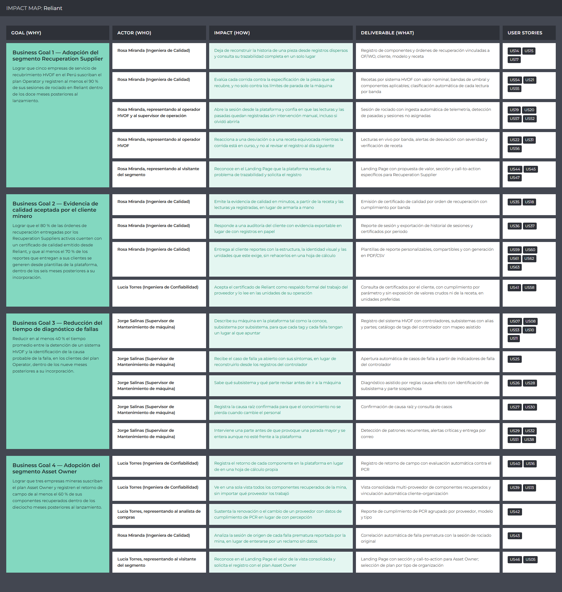

### Business Goal 1 — Adopción del segmento Recuperation Supplier

> **Lograr que cinco empresas de servicio de recubrimiento HVOF en el Perú suscriban el plan Operator y registren al menos el 90 % de sus sesiones de rociado en Reliant dentro de los doce meses posteriores al lanzamiento.**

| Actor | Impact | Deliverable | User Stories |
|---|---|---|---|
| Rosa Miranda (Ingeniera de Calidad) | Deja de reconstruir la historia de una pieza desde registros dispersos y consulta su trazabilidad completa en un solo lugar | Registro de componentes y órdenes de recuperación vinculadas a OF/WO, cliente, modelo y receta | Como operador HVOF, deseo registrar un componente recibido con su número de serie, part number, tipo, modelo de máquina, posición y cliente, para identificarlo durante todo el proceso y seleccionar la receta que le corresponde (US14). Como supervisor de operación, deseo registrar la orden de recuperación con su OF y WO, horómetro de ingreso, peso y lote de polvo, para trazar el trabajo realizado sobre el componente (US15). Como ingeniero de calidad, deseo consultar el historial completo de un componente por su número de serie, OF o WO, para responder ante un cuestionamiento del cliente (US17). |
| Rosa Miranda (Ingeniera de Calidad) | Evalúa cada corrida contra la especificación de la pieza que se recubre, y no solo contra los límites de parada de la máquina | Recetas por sistema HVOF con valor nominal, bandas de umbral y componentes aplicables; clasificación automática de cada lectura por banda | Como ingeniero de calidad, deseo definir recetas de rociado por sistema HVOF con el valor nominal y las bandas de umbral de cada parámetro, indicando a qué tipos de componente, modelos de máquina y posiciones aplican, para que cada lectura se evalúe contra la especificación de la pieza que se recubre (US54). Como ingeniero de calidad, deseo que el sistema clasifique cada lectura según la banda de la receta vigente de la sesión, para detectar desviaciones que el controlador no alarma porque solo actúa en los límites de parada (US21). Como ingeniero de calidad, deseo definir parámetros derivados mediante una fórmula sobre los tags mapeados del controlador, para monitorear variables que el controlador no expone directamente (US55). |
| Rosa Miranda, representando al operador HVOF y al supervisor de operación | Abre la sesión desde la plataforma y confía en que las lecturas y las pasadas quedan registradas sin intervención manual, incluso si olvidó abrirla | Sesión de rociado con ingesta automática de telemetría, detección de pasadas y sesiones no asignadas | Como operador HVOF, deseo iniciar una sesión de rociado seleccionando el sistema HVOF, la orden de recuperación y la receta aplicable al componente, para que las lecturas del proceso se asocien al componente correcto (US19). Como supervisor de operación, deseo que las lecturas del proceso lleguen automáticamente desde el cliente de telemetría conectado al controlador durante la sesión, para no depender de registros manuales (US20). Como operador HVOF, deseo que el sistema detecte automáticamente el inicio y fin de cada pasada de rociado y conserve en una sesión no asignada las lecturas que lleguen sin una sesión abierta, para no perder telemetría (US57). Como supervisor de operación, deseo que la plataforma reciba la telemetría desde un cliente externo conectado al controlador del sistema HVOF, para que el registro del proceso no dependa de intervención humana (US52). |
| Rosa Miranda, representando al operador HVOF | Reacciona a una desviación o a una receta equivocada mientras la corrida está en curso, y no al revisar el registro al día siguiente | Lecturas en vivo por banda, alertas de desviación con severidad y verificación de receta | Como operador HVOF, deseo ver los valores actuales de los parámetros durante la sesión, para reaccionar ante una desviación mientras la corrida está en curso (US22). Como operador HVOF, deseo recibir una alerta en la plataforma cuando un parámetro salga de la banda nominal de la receta, con severidad distinta si alcanza la banda de advertencia o la de parada, para actuar mientras la corrida está en curso (US31). Como supervisor de operación, deseo que el sistema advierta cuando la receta cargada en el controlador no corresponde al componente de la orden en curso, para evitar recubrir una pieza con los parámetros de otra (US56). |
| Rosa Miranda, representando al visitante del segmento | Reconoce en el Landing Page que la plataforma resuelve su problema de trazabilidad y solicita el registro | Landing Page con propuesta de valor, sección y call-to-action específicos para Recuperation Supplier | Como visitante, deseo conocer el problema que resuelve Reliant y sus beneficios desde la página principal, para decidir si la solución es relevante para mi organización (US44). Como visitante del segmento Recuperation Supplier, deseo acceder a la información específica para empresas que operan procesos HVOF, para identificar si la propuesta responde a mis necesidades (US45). Como visitante, deseo iniciar el registro desde el call-to-action de mi segmento, para llegar directamente a la vista de registro correspondiente en la Web Application (US47). |

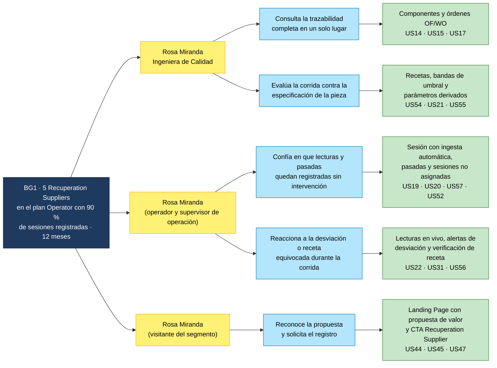
```mermaid
flowchart LR
    classDef goal fill:#1F3A5F,stroke:#0D1F33,color:#fff
    classDef actor fill:#FFF176,stroke:#F9A825,color:#000
    classDef impact fill:#B3E5FC,stroke:#0277BD,color:#000
    classDef deliv fill:#C8E6C9,stroke:#2E7D32,color:#000

    G1["BG1 · 5 Recuperation Suppliers<br/>en el plan Operator con 90 %<br/>de sesiones registradas · 12 meses"]:::goal
    A1["Rosa Miranda<br/>Ingeniera de Calidad"]:::actor
    A1b["Rosa Miranda<br/>(operador y supervisor de operación)"]:::actor
    A1c["Rosa Miranda<br/>(visitante del segmento)"]:::actor

    I1["Consulta la trazabilidad<br/>completa en un solo lugar"]:::impact
    I2["Evalúa la corrida contra la<br/>especificación de la pieza"]:::impact
    I3["Confía en que lecturas y pasadas<br/>quedan registradas sin intervención"]:::impact
    I4["Reacciona a la desviación o receta<br/>equivocada durante la corrida"]:::impact
    I5["Reconoce la propuesta<br/>y solicita el registro"]:::impact

    D1["Componentes y órdenes OF/WO<br/>US14 · US15 · US17"]:::deliv
    D2["Recetas, bandas de umbral y<br/>parámetros derivados<br/>US54 · US21 · US55"]:::deliv
    D3["Sesión con ingesta automática,<br/>pasadas y sesiones no asignadas<br/>US19 · US20 · US57 · US52"]:::deliv
    D4["Lecturas en vivo, alertas de<br/>desviación y verificación de receta<br/>US22 · US31 · US56"]:::deliv
    D5["Landing Page con propuesta de valor<br/>y CTA Recuperation Supplier<br/>US44 · US45 · US47"]:::deliv

    G1 --> A1 --> I1 --> D1
    A1 --> I2 --> D2
    G1 --> A1b --> I3 --> D3
    A1b --> I4 --> D4
    G1 --> A1c --> I5 --> D5
```

### Business Goal 2 — Evidencia de calidad aceptada por el cliente minero

> **Lograr que el 80 % de las órdenes de recuperación entregadas por los Recuperation Suppliers activos cuenten con un certificado de calidad emitido desde Reliant, y que al menos el 70 % de los reportes que entregan a sus clientes se generen desde plantillas de la plataforma, dentro de los seis meses posteriores a su incorporación.**

| Actor | Impact | Deliverable | User Stories |
|---|---|---|---|
| Rosa Miranda (Ingeniera de Calidad) | Emite la evidencia de calidad en minutos, a partir de la receta y las lecturas ya registradas, en lugar de armarla a mano | Emisión de certificado de calidad por orden de recuperación con cumplimiento por banda | Como ingeniero de calidad, deseo emitir el certificado de calidad de una orden de recuperación a partir de las sesiones registradas y la receta aplicada, para entregar al cliente evidencia documentada de que la pieza fue recubierta dentro de la especificación (US35). Como supervisor de operación, deseo cerrar la orden de recuperación y marcar el componente como entregado, para habilitar la emisión del certificado y el seguimiento en campo (US18). |
| Rosa Miranda (Ingeniera de Calidad) | Responde a una auditoría del cliente con evidencia exportable en lugar de con registros en papel | Reporte de sesión y exportación de historial de sesiones y certificados por periodo | Como supervisor de operación, deseo generar el reporte de una sesión con el resumen de lecturas por banda, pasadas, desviaciones y fallas, para revisar el resultado de la corrida (US36). Como ingeniero de calidad, deseo exportar el historial de sesiones y certificados de un periodo en formato CSV o PDF, para presentarlo durante una auditoría del cliente (US37). |
| Rosa Miranda (Ingeniera de Calidad) | Entrega al cliente reportes con la estructura, la identidad visual y las unidades que este exige, sin rehacerlos en una hoja de cálculo | Plantillas de reporte personalizables, compartibles y con generación en PDF/CSV | Como ingeniero de calidad, deseo crear una plantilla de reporte mediante un formulario, indicando el tipo de reporte, sus secciones, variables, tipo de vista y unidad, para que los reportes de mi organización tengan la estructura que exige el cliente (US59). Como ingeniero de calidad, deseo personalizar el logo, los colores, la tipografía y la orientación de página de una plantilla, para que el reporte refleje la identidad de mi organización (US60). Como ingeniero de calidad, deseo compartir una plantilla con toda mi organización o con usuarios específicos, para que otros generen reportes con la misma estructura sin duplicarla (US61). Como supervisor de operación, deseo generar un reporte a partir de una plantilla y descargarlo en PDF o CSV, para entregarlo al cliente o a la gerencia (US62). Como ingeniero de calidad, deseo marcar una plantilla como predeterminada para cada tipo de reporte, para que los reportes se generen con ella cuando no se indique otra (US63). |
| Lucía Torres (Ingeniera de Confiabilidad) | Acepta el certificado de Reliant como respaldo formal del trabajo del proveedor y lo lee en las unidades de su operación | Consulta de certificados por el cliente, con cumplimiento por parámetro y sin exposición de valores crudos ni de la receta, en unidades preferidas | Como ingeniero de confiabilidad, deseo consultar el certificado de calidad de un componente entregado por mi proveedor, para verificar que fue recubierto dentro de tolerancia (US41). Como usuario de la plataforma, deseo configurar las unidades en que se me presentan los parámetros de proceso, para leer la información en las unidades a las que estoy acostumbrado sin alterar el dato almacenado (US58). |

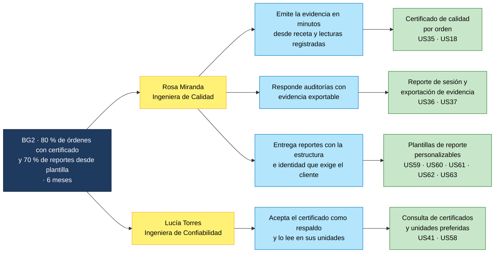
```mermaid
flowchart LR
    classDef goal fill:#1F3A5F,stroke:#0D1F33,color:#fff
    classDef actor fill:#FFF176,stroke:#F9A825,color:#000
    classDef impact fill:#B3E5FC,stroke:#0277BD,color:#000
    classDef deliv fill:#C8E6C9,stroke:#2E7D32,color:#000

    G2["BG2 · 80 % de órdenes con certificado<br/>y 70 % de reportes desde plantilla<br/>· 6 meses"]:::goal
    A1["Rosa Miranda<br/>Ingeniera de Calidad"]:::actor
    A3["Lucía Torres<br/>Ingeniera de Confiabilidad"]:::actor

    I1["Emite la evidencia en minutos<br/>desde receta y lecturas registradas"]:::impact
    I2["Responde auditorías con<br/>evidencia exportable"]:::impact
    I3["Entrega reportes con la estructura<br/>e identidad que exige el cliente"]:::impact
    I4["Acepta el certificado como respaldo<br/>y lo lee en sus unidades"]:::impact

    D1["Certificado de calidad<br/>por orden<br/>US35 · US18"]:::deliv
    D2["Reporte de sesión y<br/>exportación de evidencia<br/>US36 · US37"]:::deliv
    D3["Plantillas de reporte<br/>personalizables<br/>US59 · US60 · US61 · US62 · US63"]:::deliv
    D4["Consulta de certificados<br/>y unidades preferidas<br/>US41 · US58"]:::deliv

    G2 --> A1 --> I1 --> D1
    A1 --> I2 --> D2
    A1 --> I3 --> D3
    G2 --> A3 --> I4 --> D4
```

### Business Goal 3 — Reducción del tiempo de diagnóstico de fallas

> **Reducir en al menos 40 % el tiempo promedio entre la detención de un sistema HVOF y la identificación de la causa probable de la falla, en los clientes del plan Operator, dentro de los nueve meses posteriores a su incorporación.**

| Actor | Impact | Deliverable | User Stories |
|---|---|---|---|
| Jorge Salinas (Supervisor de Mantenimiento de máquina) | Describe su máquina en la plataforma tal como la conoce, subsistema por subsistema, para que cada tag y cada falla tengan un lugar al que apuntar | Registro del sistema HVOF con controladores, subsistemas con alias y partes; catálogo de tags del controlador con mapeo asistido | Como supervisor de mantenimiento de máquina, deseo registrar un sistema HVOF con su código, fabricante y modelo, y los controladores que lo gobiernan, para que las sesiones y fallas se asocien a un equipo identificado (US07). Como supervisor de mantenimiento de máquina, deseo registrar los subsistemas que componen un sistema HVOF con el alias que usa el controlador, para que las fallas se atribuyan al subsistema correcto (US08). Como supervisor de mantenimiento de máquina, deseo registrar las partes físicas de cada subsistema con su número de serie, fabricante y fecha de instalación, para que el diagnóstico pueda señalar una parte específica (US53). Como supervisor de mantenimiento de máquina, deseo importar el archivo de tags exportado del controlador al catálogo de tags, para que el sistema normalice los tipos de dato y proponga a qué subsistema, parámetro o rol corresponde cada tag (US10). Como supervisor de mantenimiento de máquina, deseo confirmar o corregir el mapeo propuesto para cada tag, para asegurar que las lecturas y fallas se atribuyan correctamente (US11). |
| Jorge Salinas (Supervisor de Mantenimiento de máquina) | Recibe el caso de falla ya abierto con sus síntomas, en lugar de reconstruirlo desde los registros del controlador | Apertura automática de casos de falla a partir de indicadores de falla del controlador | Como supervisor de mantenimiento de máquina, deseo que el sistema abra un caso de falla cuando un tag clasificado como indicador de falla se active durante una sesión, para no depender de que el operador lo reporte (US25). |
| Jorge Salinas (Supervisor de Mantenimiento de máquina) | Sabe qué subsistema y qué parte revisar antes de ir a la máquina | Diagnóstico asistido por reglas causa-efecto con identificación de subsistema y parte sospechosa | Como supervisor de mantenimiento de máquina, deseo que el sistema aplique el catálogo de reglas causa-efecto al caso de falla abierto, para obtener una causa probable y el subsistema o parte sospechosa (US26). Como ingeniero de calidad, deseo crear, editar y desactivar reglas causa-efecto indicando el tag o parámetro disparador, la condición, la causa probable y el subsistema o parte sospechosa, para adaptar el diagnóstico a cada sistema HVOF (US28). |
| Jorge Salinas (Supervisor de Mantenimiento de máquina) | Registra la causa raíz confirmada para que el conocimiento no se pierda cuando cambie el personal | Confirmación de causa raíz y consulta de casos | Como supervisor de mantenimiento de máquina, deseo confirmar o corregir la causa raíz y registrar la acción correctiva de un caso de falla, para que el conocimiento quede documentado en el sistema (US27). Como supervisor de mantenimiento de máquina, deseo consultar los casos de falla filtrando por sistema HVOF, subsistema, parte, tipo y estado, para dar seguimiento a los pendientes (US30). |
| Jorge Salinas (Supervisor de Mantenimiento de máquina) | Interviene una parte antes de que provoque una parada mayor y se entera aunque no esté frente a la plataforma | Detección de patrones recurrentes, alertas críticas y entrega por correo | Como supervisor de mantenimiento de máquina, deseo que el sistema identifique cuando una misma parte acumula fallas del mismo tipo dentro de un periodo, para anticipar un problema mayor (US29). Como supervisor de mantenimiento de máquina, deseo recibir una alerta cuando se abra un caso de falla crítica o se detecte un patrón recurrente, para intervenir oportunamente (US32). Como supervisor de mantenimiento de máquina, deseo recibir por correo electrónico las alertas críticas mediante el servicio externo Mailchimp, para enterarme sin estar frente a la plataforma (US51). Como supervisor de mantenimiento de máquina, deseo consultar la frecuencia de fallas por sistema HVOF, subsistema y parte en un periodo, para priorizar las intervenciones (US38). |

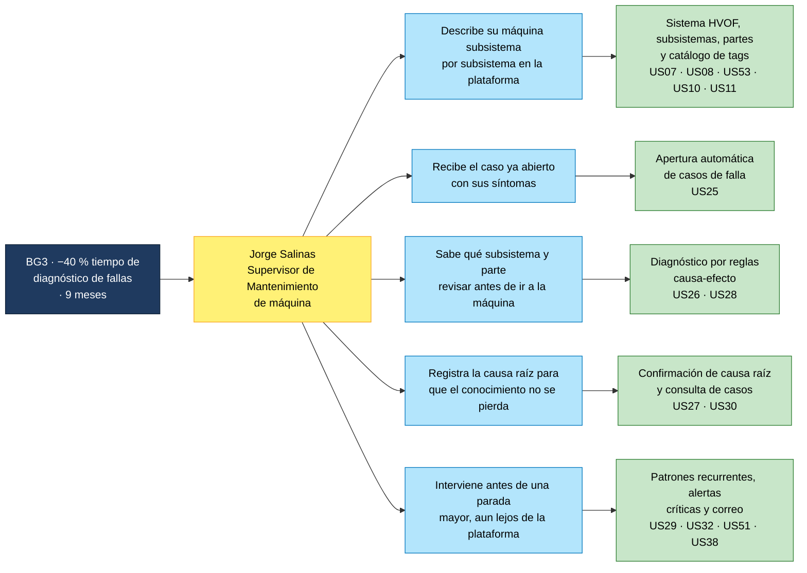
```mermaid
flowchart LR
    classDef goal fill:#1F3A5F,stroke:#0D1F33,color:#fff
    classDef actor fill:#FFF176,stroke:#F9A825,color:#000
    classDef impact fill:#B3E5FC,stroke:#0277BD,color:#000
    classDef deliv fill:#C8E6C9,stroke:#2E7D32,color:#000

    G3["BG3 · −40 % tiempo de<br/>diagnóstico de fallas<br/>· 9 meses"]:::goal
    A2["Jorge Salinas<br/>Supervisor de Mantenimiento<br/>de máquina"]:::actor

    I1["Describe su máquina subsistema<br/>por subsistema en la plataforma"]:::impact
    I2["Recibe el caso ya abierto<br/>con sus síntomas"]:::impact
    I3["Sabe qué subsistema y parte<br/>revisar antes de ir a la máquina"]:::impact
    I4["Registra la causa raíz para<br/>que el conocimiento no se pierda"]:::impact
    I5["Interviene antes de una parada<br/>mayor, aun lejos de la plataforma"]:::impact

    D1["Sistema HVOF, subsistemas, partes<br/>y catálogo de tags<br/>US07 · US08 · US53 · US10 · US11"]:::deliv
    D2["Apertura automática<br/>de casos de falla<br/>US25"]:::deliv
    D3["Diagnóstico por reglas<br/>causa-efecto<br/>US26 · US28"]:::deliv
    D4["Confirmación de causa raíz<br/>y consulta de casos<br/>US27 · US30"]:::deliv
    D5["Patrones recurrentes, alertas<br/>críticas y correo<br/>US29 · US32 · US51 · US38"]:::deliv

    G3 --> A2
    A2 --> I1 --> D1
    A2 --> I2 --> D2
    A2 --> I3 --> D3
    A2 --> I4 --> D4
    A2 --> I5 --> D5
```

### Business Goal 4 — Adopción del segmento Asset Owner

> **Lograr que tres empresas mineras suscriban el plan Asset Owner y registren el retorno de campo de al menos el 60 % de sus componentes recuperados dentro de los dieciocho meses posteriores al lanzamiento.**

| Actor | Impact | Deliverable | User Stories |
|---|---|---|---|
| Lucía Torres (Ingeniera de Confiabilidad) | Registra el retorno de cada componente en la plataforma en lugar de en una hoja de cálculo propia | Registro de retorno de campo con evaluación automática contra el PCR | Como ingeniero de confiabilidad, deseo registrar el retorno de un componente indicando el horómetro alcanzado y el motivo, para que el sistema evalúe si alcanzó su PCR (US40). Como ingeniero de calidad, deseo definir el PCR objetivo en horas por tipo y modelo de componente, para contar con el estándar contra el cual se evaluará el desempeño en campo (US16). |
| Lucía Torres (Ingeniera de Confiabilidad) | Ve en una sola vista todos los componentes recuperados de la mina, sin importar qué proveedor los trabajó | Vista consolidada multi-proveedor de componentes recuperados y vinculación automática cliente–organización | Como analista de compras, deseo consultar en una sola vista todos los componentes recuperados de mi organización con su proveedor, estado y fecha de entrega, para eliminar el cruce manual de información (US39). Como supervisor de operación, deseo registrar los clientes de mi organización con su razón social, RUC y sede, para vincular cada componente a su propietario (US13). |
| Lucía Torres, representando al analista de compras | Sustenta la renovación o el cambio de un proveedor con datos de cumplimiento de PCR en lugar de con percepción | Reporte de cumplimiento de PCR agrupado por proveedor, modelo y tipo | Como ingeniero de confiabilidad, deseo consultar la tasa de cumplimiento de PCR agrupada por proveedor, modelo de máquina y tipo de componente, para sustentar la renovación o cambio de contratos con datos (US42). |
| Rosa Miranda (Ingeniera de Calidad) | Analiza la sesión de origen de cada falla prematura reportada por la mina, en lugar de enterarse por un reclamo sin datos | Correlación automática de falla prematura con la sesión de rociado original | Como ingeniero de calidad, deseo que al registrarse una falla prematura el sistema me presente la sesión de rociado original del componente, para determinar si el origen estuvo en el recubrimiento (US43). |
| Lucía Torres, representando al visitante del segmento | Reconoce en el Landing Page el valor de la vista consolidada y solicita el registro con el plan Asset Owner | Landing Page con sección y call-to-action para Asset Owner; selección de plan por tipo de organización | Como visitante del segmento Asset Owner, deseo acceder a la información específica para empresas propietarias de activos, para identificar si la propuesta responde a mis necesidades (US46). Como administrador de organización, deseo seleccionar el plan correspondiente a mi tipo de organización, para activar las capacidades de la plataforma (US05). |

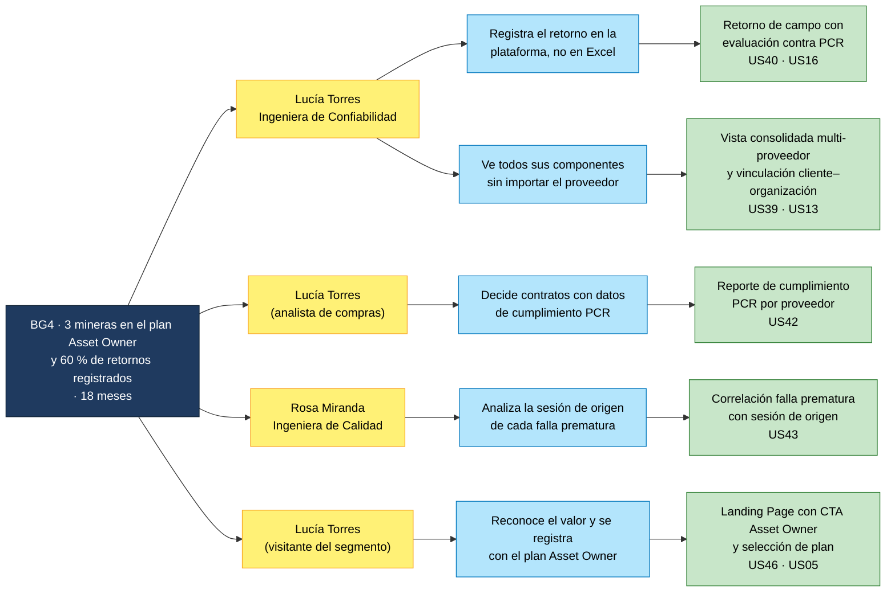
```mermaid
flowchart LR
    classDef goal fill:#1F3A5F,stroke:#0D1F33,color:#fff
    classDef actor fill:#FFF176,stroke:#F9A825,color:#000
    classDef impact fill:#B3E5FC,stroke:#0277BD,color:#000
    classDef deliv fill:#C8E6C9,stroke:#2E7D32,color:#000

    G4["BG4 · 3 mineras en el plan Asset Owner<br/>y 60 % de retornos registrados<br/>· 18 meses"]:::goal
    A3["Lucía Torres<br/>Ingeniera de Confiabilidad"]:::actor
    A3b["Lucía Torres<br/>(analista de compras)"]:::actor
    A1["Rosa Miranda<br/>Ingeniera de Calidad"]:::actor
    A3c["Lucía Torres<br/>(visitante del segmento)"]:::actor

    I1["Registra el retorno en la<br/>plataforma, no en Excel"]:::impact
    I2["Ve todos sus componentes<br/>sin importar el proveedor"]:::impact
    I3["Decide contratos con datos<br/>de cumplimiento PCR"]:::impact
    I4["Analiza la sesión de origen<br/>de cada falla prematura"]:::impact
    I5["Reconoce el valor y se registra<br/>con el plan Asset Owner"]:::impact

    D1["Retorno de campo con<br/>evaluación contra PCR<br/>US40 · US16"]:::deliv
    D2["Vista consolidada multi-proveedor<br/>y vinculación cliente–organización<br/>US39 · US13"]:::deliv
    D3["Reporte de cumplimiento<br/>PCR por proveedor<br/>US42"]:::deliv
    D4["Correlación falla prematura<br/>con sesión de origen<br/>US43"]:::deliv
    D5["Landing Page con CTA Asset Owner<br/>y selección de plan<br/>US46 · US05"]:::deliv

    G4 --> A3 --> I1 --> D1
    A3 --> I2 --> D2
    G4 --> A3b --> I3 --> D3
    G4 --> A1 --> I4 --> D4
    G4 --> A3c --> I5 --> D5
```

### Síntesis

Los cuatro Business Goals se refuerzan entre sí. BG1 y BG4 miden la adopción de cada segmento pagante; BG2 y BG3 miden el valor que cada segmento obtiene una vez adoptada la plataforma y son, a la vez, los mecanismos que sostienen la renovación de las suscripciones. El mapa hace visible además la dependencia entre segmentos: los deliverables de BG4 (vista consolidada, cumplimiento de PCR, correlación de fallas prematuras) solo producen impacto cuando los Recuperation Suppliers ya registran sesiones y emiten certificados (BG1 y BG2), lo que explica el orden del Product Backlog de la sección 3.3. Las historias no referenciadas en los mapas (autenticación, roles, vigencia de suscripción, cambio de estado del sistema HVOF, cierre de sesión e historial de sesiones, preferencias y atención de alertas, cambio de idioma, newsletter, términos y condiciones, editor drag & drop y las Technical Stories) son habilitadoras de los deliverables anteriores y no provocan por sí mismas un cambio de comportamiento en los actores.

## 3.3. Product Backlog

El Product Backlog de Reliant ordena todas las User Stories y Technical Stories de la sección 3.1 según su prioridad para el negocio. El orden responde a la estrategia de entrada al mercado descrita en 1.3: primero las historias del Landing Page (Sprint 1), luego las que permiten a un Recuperation Supplier registrar su organización, su equipamiento, sus recetas y sus órdenes de recuperación y ejecutar una sesión de rociado de extremo a extremo (Sprint 2), y a continuación las Technical Stories del RESTful API, la ingesta automática de telemetría, las alertas, el diagnóstico de fallas, la evidencia de calidad y las funciones del segmento Asset Owner.

La estimación se expresa en Story Points sobre la escala de Fibonacci (1, 2, 3, 5, 8), considerando la complejidad, el esfuerzo y la incertidumbre de cada historia relativa a las demás. Las historias incorporadas desde la versión AV1 conservan la estimación acordada por el equipo en ese entregable.

El Product Backlog se gestiona en Trello, con una lista por Sprint y una etiqueta por Epic: [https://trello.com/b/aDFKmtGp/reliant-product-backlog](https://trello.com/b/aDFKmtGp/reliant-product-backlog). Cada tarjeta indica sus Story Points entre paréntesis.

<!-- TODO: hacer público el tablero Reliant - Product Backlog y agregar su captura -->

| # Orden | User Story Id | Título | Descripción | Story Points (1 / 2 / 3 / 5 / 8) |
|---|---|---|---|---|
| 1 | US44 | Conocer la propuesta de valor | Como visitante, deseo conocer el problema que resuelve Reliant y sus beneficios desde la página principal, para decidir si la solución es relevante para mi organización. | 3 |
| 2 | US45 | Información para Recuperation Supplier | Como visitante del segmento Recuperation Supplier, deseo acceder a la información específica para empresas que operan procesos HVOF, para identificar si la propuesta responde a mis necesidades. | 2 |
| 3 | US46 | Información para Asset Owner | Como visitante del segmento Asset Owner, deseo acceder a la información específica para empresas propietarias de activos, para identificar si la propuesta responde a mis necesidades. | 2 |
| 4 | US47 | Registro desde call-to-action segmentado | Como visitante, deseo iniciar el registro desde el call-to-action de mi segmento, para llegar directamente a la vista de registro correspondiente en la Web Application. | 2 |
| 5 | US48 | Cambio de idioma | Como visitante, deseo cambiar el idioma del Landing Page entre inglés y español, para leer el contenido en el idioma de mi preferencia. | 3 |
| 6 | US49 | Suscripción al newsletter | Como visitante, deseo suscribirme al newsletter de InnovaCorp con mi correo electrónico, para recibir novedades sobre Reliant y el sector. | 3 |
| 7 | US50 | Acceso a Términos y Condiciones | Como visitante, deseo acceder a los Términos y Condiciones del servicio desde el pie de página, para conocer las reglas de uso y el tratamiento de la información antes de registrarme. | 1 |
| 8 | US65 | Navegación por la aplicación | Como usuario de la plataforma, deseo navegar entre las secciones de la Web Application desde una barra de navegación común, para llegar a las funciones de mi rol sin perderme. | 3 |
| 9 | US66 | Cambio de idioma de la aplicación | Como usuario de la plataforma, deseo cambiar el idioma de la Web Application entre español e inglés, para trabajar en el idioma de mi preferencia. | 2 |
| 10 | US01 | Registro de organización | Como administrador de una organización, deseo registrar mi organización indicando su tipo (Recuperation Supplier o Asset Owner), para habilitar el acceso de mi equipo a la plataforma. | 3 |
| 11 | US02 | Inicio de sesión | Como usuario registrado, deseo iniciar sesión con mis credenciales, para acceder a las funciones que corresponden a mi rol. | 3 |
| 12 | US67 | Gestión de la sesión del usuario | Como usuario registrado, deseo ver con qué cuenta estoy conectado y cerrar mi sesión, para proteger el acceso a la información de mi organización cuando dejo de usar la plataforma. | 2 |
| 13 | US03 | Asignación de roles | Como administrador de organización, deseo asignar roles a los usuarios de mi organización, para que cada uno acceda solo a las funciones que le corresponden. | 3 |
| 14 | US04 | Restricción de acceso por rol | Como administrador de organización, deseo que las funciones de la plataforma se restrinjan según el rol del usuario, para proteger la información de la organización. | 3 |
| 15 | US05 | Selección de plan | Como administrador de organización, deseo seleccionar el plan correspondiente a mi tipo de organización (Operator, por sistema HVOF monitoreado, o Asset Owner, por componentes en seguimiento), para activar las capacidades de la plataforma. | 3 |
| 16 | US06 | Consulta y vigencia de suscripción | Como administrador de organización, deseo consultar el estado y la vigencia de mi suscripción, para anticipar su renovación. | 2 |
| 17 | US13 | Registro de cliente | Como supervisor de operación, deseo registrar los clientes de mi organización con su razón social, RUC y sede, para vincular cada componente a su propietario. | 2 |
| 18 | US14 | Registro de componente recibido | Como operador HVOF, deseo registrar un componente recibido con su número de serie, part number, tipo, modelo de máquina, posición y cliente, para identificarlo durante todo el proceso y seleccionar la receta que le corresponde. | 3 |
| 19 | US15 | Registro de orden de recuperación | Como supervisor de operación, deseo registrar la orden de recuperación con su OF y WO, horómetro de ingreso, peso y lote de polvo, para trazar el trabajo realizado sobre el componente. | 5 |
| 20 | US07 | Registro de sistema HVOF y sus controladores | Como supervisor de mantenimiento de máquina, deseo registrar un sistema HVOF con su código, fabricante y modelo, y los controladores (PLC) que lo gobiernan con su marca, modelo y dirección IP, para que las sesiones y fallas se asocien a un equipo identificado. | 3 |
| 21 | US12 | Cambio de estado de sistema HVOF | Como supervisor de mantenimiento de máquina, deseo cambiar el estado de un sistema HVOF (activo, en mantenimiento, fuera de servicio), para impedir que se inicien sesiones en un equipo no disponible. | 2 |
| 22 | US08 | Registro de subsistemas del sistema HVOF | Como supervisor de mantenimiento de máquina, deseo registrar los subsistemas que componen un sistema HVOF (alimentador de polvo, manipulador de pistola, colector de polvo, distribuidor de gases, entre otros) con el alias que usa el controlador (FDR, GM, DH, GD), para que las fallas se atribuyan al subsistema correcto. | 3 |
| 23 | US53 | Registro de partes de un subsistema | Como supervisor de mantenimiento de máquina, deseo registrar las partes físicas de cada subsistema (motor del alimentador, tolva, spindle, ejes, filtros, entre otras) con su número de serie, fabricante y fecha de instalación, para que el diagnóstico pueda señalar una parte específica y el conteo de fallas se reinicie cuando se reemplace. | 3 |
| 24 | US54 | Definición de recetas con bandas de umbral y componentes aplicables | Como ingeniero de calidad, deseo definir recetas de rociado por sistema HVOF con el valor nominal y las bandas de umbral (advertencia y parada, inferior y superior) de cada parámetro, indicando a qué tipos de componente, modelos de máquina y posiciones aplican, para que cada lectura se evalúe contra la especificación de la pieza que se recubre y no solo contra los límites de parada de la máquina. | 8 |
| 25 | US19 | Inicio de sesión de rociado | Como operador HVOF, deseo iniciar una sesión de rociado seleccionando el sistema HVOF, la orden de recuperación y la receta aplicable al componente, para que las lecturas del proceso se asocien al componente correcto y se evalúen contra su especificación. | 3 |
| 26 | US21 | Clasificación de lecturas por banda de umbral | Como ingeniero de calidad, deseo que el sistema clasifique cada lectura según la banda de la receta vigente de la sesión (nominal, advertencia o parada, inferior o superior), para detectar desviaciones que el controlador no alarma porque solo actúa en los límites de parada. | 5 |
| 27 | US22 | Visualización de lecturas en vivo | Como operador HVOF, deseo ver los valores actuales de los parámetros durante la sesión, para reaccionar ante una desviación mientras la corrida está en curso. | 5 |
| 28 | US23 | Finalización o aborto de sesión | Como operador HVOF, deseo completar o abortar una sesión indicando el motivo, para dejar constancia del resultado de la corrida. | 2 |
| 29 | US24 | Historial de sesiones por sistema HVOF | Como supervisor de operación, deseo consultar el historial de sesiones de un sistema HVOF filtrando por fecha y orden de recuperación, para revisar corridas pasadas. | 3 |
| 30 | TS01 | Registro de organización y administrador | Como developer, deseo consumir el endpoint POST /api/v1/authentication/sign-up, para registrar una organización y su usuario administrador desde la Web Application. | 3 |
| 31 | TS02 | Autenticación de usuario | Como developer, deseo consumir el endpoint POST /api/v1/authentication/sign-in, para obtener el token de acceso que autoriza las demás peticiones. | 3 |
| 32 | TS03 | Registro de sistema HVOF | Como developer, deseo consumir el endpoint POST /api/v1/hvof-systems, para registrar un sistema HVOF con su código, fabricante y modelo. | 3 |
| 33 | TS04 | Registro de controlador del sistema HVOF | Como developer, deseo consumir el endpoint POST /api/v1/hvof-systems/{systemId}/controllers, para registrar un controlador (PLC) con su marca, modelo y dirección IP. | 3 |
| 34 | TS07 | Registro de componente | Como developer, deseo consumir el endpoint POST /api/v1/components, para registrar un componente recibido del cliente. | 3 |
| 35 | TS08 | Registro de orden de recuperación | Como developer, deseo consumir el endpoint POST /api/v1/recuperations, para crear la orden de recuperación con su OF y WO vinculada a un componente. | 3 |
| 36 | TS09 | Inicio de sesión de rociado | Como developer, deseo consumir el endpoint POST /api/v1/spray-sessions, para iniciar una sesión vinculada a un sistema HVOF, una orden de recuperación y una receta. | 3 |
| 37 | TS10 | Ingesta de lecturas de telemetría | Como developer, deseo consumir el endpoint POST /api/v1/spray-sessions/{sessionId}/readings, para enviar lotes de lecturas del controlador a una sesión. | 8 |
| 38 | TS11 | Consulta de lecturas de una sesión | Como developer, deseo consumir el endpoint GET /api/v1/spray-sessions/{sessionId}/readings, para obtener las lecturas de una sesión y mostrarlas en la vista de monitoreo. | 3 |
| 39 | TS19 | Gestión de recetas del sistema HVOF | Como developer, deseo consumir los endpoints POST /api/v1/hvof-systems/{systemId}/recipes y PUT /api/v1/recipes/{recipeId}, para crear y actualizar recetas con sus parámetros, bandas de umbral y aplicabilidad. | 5 |
| 40 | US10 | Importación del catálogo de tags del controlador | Como supervisor de mantenimiento de máquina, deseo importar el archivo de tags exportado del controlador (CSV o JSON) al catálogo de tags del controlador, para que el sistema normalice los tipos de dato del fabricante y proponga a qué subsistema, parámetro o rol de estado corresponde cada tag. | 8 |
| 41 | US11 | Confirmación de mapeo de tags | Como supervisor de mantenimiento de máquina, deseo confirmar o corregir el mapeo propuesto para cada tag (subsistema, parte, parámetro o rol de estado y tipo de tag), para asegurar que las lecturas y fallas se atribuyan correctamente. | 5 |
| 42 | TS05 | Importación del catálogo de tags del controlador | Como developer, deseo consumir el endpoint POST /api/v1/controllers/{controllerId}/tag-catalog/imports, para cargar el archivo de tags y obtener el catálogo normalizado con las propuestas de mapeo. | 8 |
| 43 | TS06 | Confirmación de mapeo de tag | Como developer, deseo consumir el endpoint PUT /api/v1/controllers/{controllerId}/tag-mappings/{tagId}, para confirmar o corregir el mapeo de un tag. | 3 |
| 44 | US20 | Ingesta automática de lecturas | Como supervisor de operación, deseo que las lecturas del proceso lleguen automáticamente desde el cliente de telemetría conectado al controlador durante la sesión, para no depender de registros manuales. | 8 |
| 45 | US52 | Recepción de telemetría desde el cliente del controlador | Como supervisor de operación, deseo que la plataforma reciba la telemetría desde un cliente externo (gateway o simulador) conectado al controlador del sistema HVOF, para que el registro del proceso no dependa de intervención humana. | 5 |
| 46 | US57 | Detección de pasadas de rociado y sesiones no asignadas | Como operador HVOF, deseo que el sistema detecte automáticamente el inicio y fin de cada pasada de rociado a partir del tag de estado del controlador, y que conserve en una sesión no asignada las lecturas que lleguen sin una sesión abierta, para no perder telemetría cuando la sesión no se abrió a tiempo. | 8 |
| 47 | US56 | Advertencia por receta no correspondiente al componente | Como supervisor de operación, deseo que el sistema advierta cuando la receta cargada en el controlador no corresponde al componente de la orden en curso, para evitar recubrir una pieza con los parámetros de otra. | 3 |
| 48 | US55 | Definición de parámetros derivados | Como ingeniero de calidad, deseo definir parámetros derivados mediante una fórmula sobre los tags mapeados del controlador (por ejemplo relación combustible-oxígeno o flujo total de gases), para monitorear variables que el controlador no expone directamente. | 5 |
| 49 | TS20 | Definición de parámetros derivados | Como developer, deseo consumir el endpoint POST /api/v1/hvof-systems/{systemId}/derived-parameters, para registrar un parámetro derivado con su expresión sobre los tags mapeados. | 3 |
| 50 | US31 | Alerta por desviación de parámetro | Como operador HVOF, deseo recibir una alerta en la plataforma cuando un parámetro salga de la banda nominal de la receta, con severidad distinta si alcanza la banda de advertencia o la de parada, para actuar mientras la corrida está en curso. | 5 |
| 51 | US32 | Alerta por falla crítica o patrón recurrente | Como supervisor de mantenimiento de máquina, deseo recibir una alerta cuando se abra un caso de falla crítica o se detecte un patrón recurrente, para intervenir oportunamente. | 3 |
| 52 | US34 | Atención de alertas | Como usuario de la plataforma, deseo marcar una alerta como atendida, para distinguir las pendientes de las ya revisadas. | 2 |
| 53 | TS17 | Consulta de alertas del usuario | Como developer, deseo consumir el endpoint GET /api/v1/alerts, para obtener las alertas dirigidas al usuario autenticado y su estado. | 3 |
| 54 | US33 | Preferencias de notificación | Como usuario de la plataforma, deseo configurar qué tipos de alerta recibo y por qué canal, para recibir únicamente lo relevante para mi rol. | 3 |
| 55 | US51 | Entrega de alertas por correo electrónico | Como supervisor de mantenimiento de máquina, deseo recibir por correo electrónico las alertas críticas mediante el servicio externo Mailchimp, para enterarme sin estar frente a la plataforma. | 5 |
| 56 | US16 | Definición de PCR objetivo | Como ingeniero de calidad, deseo definir el PCR objetivo en horas por tipo y modelo de componente, para contar con el estándar contra el cual se evaluará el desempeño en campo. | 3 |
| 57 | US17 | Consulta de historial de componente | Como ingeniero de calidad, deseo consultar el historial completo de un componente por su número de serie, OF o WO, para responder ante un cuestionamiento del cliente. | 5 |
| 58 | US18 | Cierre y entrega de orden | Como supervisor de operación, deseo cerrar la orden de recuperación y marcar el componente como entregado, para habilitar la emisión del certificado y el seguimiento en campo. | 3 |
| 59 | US25 | Apertura automática de caso de falla | Como supervisor de mantenimiento de máquina, deseo que el sistema abra un caso de falla cuando un tag clasificado como indicador de falla se active durante una sesión, para no depender de que el operador lo reporte. | 8 |
| 60 | US26 | Diagnóstico asistido por reglas causa-efecto | Como supervisor de mantenimiento de máquina, deseo que el sistema aplique el catálogo de reglas causa-efecto al caso de falla abierto, para obtener una causa probable y el subsistema o parte sospechosa. | 8 |
| 61 | US27 | Confirmación de causa raíz | Como supervisor de mantenimiento de máquina, deseo confirmar o corregir la causa raíz y registrar la acción correctiva de un caso de falla, para que el conocimiento quede documentado en el sistema. | 3 |
| 62 | US28 | Gestión del catálogo de reglas | Como ingeniero de calidad, deseo crear, editar y desactivar reglas causa-efecto indicando el tag o parámetro disparador, la condición, la causa probable y el subsistema o parte sospechosa, para adaptar el diagnóstico a cada sistema HVOF. | 5 |
| 63 | TS12 | Consulta de casos de falla | Como developer, deseo consumir el endpoint GET /api/v1/fault-cases, para listar los casos de falla con filtros de sistema HVOF, subsistema, parte, tipo y estado. | 3 |
| 64 | TS13 | Confirmación de causa raíz | Como developer, deseo consumir el endpoint PATCH /api/v1/fault-cases/{faultCaseId}/root-cause, para registrar la causa raíz confirmada y la acción correctiva. | 2 |
| 65 | US29 | Detección de patrón recurrente | Como supervisor de mantenimiento de máquina, deseo que el sistema identifique cuando una misma parte acumula fallas del mismo tipo dentro de un periodo, para anticipar un problema mayor. | 5 |
| 66 | US30 | Consulta de casos de falla | Como supervisor de mantenimiento de máquina, deseo consultar los casos de falla filtrando por sistema HVOF, subsistema, parte, tipo y estado, para dar seguimiento a los pendientes. | 3 |
| 67 | US35 | Emisión de certificado de calidad | Como ingeniero de calidad, deseo emitir el certificado de calidad de una orden de recuperación a partir de las sesiones registradas y la receta aplicada, para entregar al cliente evidencia documentada de que la pieza fue recubierta dentro de la especificación. | 8 |
| 68 | TS14 | Emisión de certificado de calidad | Como developer, deseo consumir el endpoint POST /api/v1/recuperations/{recuperationId}/quality-certificate, para emitir el certificado de una orden cerrada. | 5 |
| 69 | US36 | Reporte de sesión | Como supervisor de operación, deseo generar el reporte de una sesión con el resumen de lecturas por banda, pasadas, desviaciones y fallas, para revisar el resultado de la corrida. | 3 |
| 70 | US37 | Exportación de evidencia para auditoría | Como ingeniero de calidad, deseo exportar el historial de sesiones y certificados de un periodo en formato CSV o PDF, para presentarlo durante una auditoría del cliente. | 5 |
| 71 | US38 | Reporte de frecuencia de fallas | Como supervisor de mantenimiento de máquina, deseo consultar la frecuencia de fallas por sistema HVOF, subsistema y parte en un periodo, para priorizar las intervenciones. | 3 |
| 72 | US40 | Registro de retorno de campo | Como ingeniero de confiabilidad, deseo registrar el retorno de un componente indicando el horómetro alcanzado y el motivo, para que el sistema evalúe si alcanzó su PCR. | 5 |
| 73 | TS15 | Registro de retorno de campo | Como developer, deseo consumir el endpoint POST /api/v1/components/{componentId}/field-returns, para registrar el retorno de un componente y su evaluación contra el PCR. | 3 |
| 74 | US41 | Consulta de certificado por el cliente | Como ingeniero de confiabilidad, deseo consultar el certificado de calidad de un componente entregado por mi proveedor, para verificar que fue recubierto dentro de tolerancia. | 3 |
| 75 | US39 | Vista consolidada de componentes recuperados | Como analista de compras, deseo consultar en una sola vista todos los componentes recuperados de mi organización con su proveedor, estado y fecha de entrega, para eliminar el cruce manual de información. | 5 |
| 76 | US42 | Cumplimiento de PCR por proveedor | Como ingeniero de confiabilidad, deseo consultar la tasa de cumplimiento de PCR agrupada por proveedor, modelo de máquina y tipo de componente, para sustentar la renovación o cambio de contratos con datos. | 8 |
| 77 | TS16 | Reporte de cumplimiento PCR | Como developer, deseo consumir el endpoint GET /api/v1/reports/pcr-compliance, para obtener la tasa de cumplimiento agrupada por proveedor, modelo o tipo de componente. | 5 |
| 78 | US43 | Correlación de falla prematura con sesión de origen | Como ingeniero de calidad, deseo que al registrarse una falla prematura el sistema me presente la sesión de rociado original del componente, para determinar si el origen estuvo en el recubrimiento. | 5 |
| 79 | US58 | Configuración de unidades de medida preferidas | Como usuario de la plataforma, deseo configurar las unidades en que se me presentan los parámetros de proceso (por ejemplo psi o bar, °C o °F, g/min o lb/h), para leer la información en las unidades a las que estoy acostumbrado sin alterar el dato almacenado. | 3 |
| 80 | TS21 | Preferencias de unidades del usuario | Como developer, deseo consumir el endpoint PUT /api/v1/users/{userId}/unit-preferences, para almacenar las unidades preferidas por magnitud del usuario autenticado. | 2 |
| 81 | US59 | Creación de plantilla de reporte mediante formulario | Como ingeniero de calidad, deseo crear una plantilla de reporte mediante un formulario, indicando el tipo de reporte, sus secciones, las variables de cada sección, el tipo de vista (tabla, gráfico o indicador) y la unidad, para que los reportes de mi organización tengan la estructura que exige el cliente. | 5 |
| 82 | US60 | Personalización de identidad visual y layout de la plantilla | Como ingeniero de calidad, deseo personalizar el logo, los colores, la tipografía y la orientación de página de una plantilla, para que el reporte refleje la identidad de mi organización. | 5 |
| 83 | US61 | Compartición de plantillas | Como ingeniero de calidad, deseo compartir una plantilla con toda mi organización o con usuarios específicos, para que otros generen reportes con la misma estructura sin duplicarla. | 3 |
| 84 | US62 | Generación y descarga de reportes desde plantilla | Como supervisor de operación, deseo generar un reporte a partir de una plantilla indicando su objeto (sesión, orden de recuperación, sistema HVOF o periodo) y descargarlo en PDF o CSV, para entregarlo al cliente o a la gerencia. | 8 |
| 85 | US63 | Plantilla predeterminada por tipo de reporte | Como ingeniero de calidad, deseo marcar una plantilla como predeterminada para cada tipo de reporte de mi organización, para que los reportes se generen con ella cuando no se indique otra. | 2 |
| 86 | US64 | Diseño de plantilla mediante editor visual drag & drop | Como ingeniero de calidad, deseo diseñar la plantilla arrastrando y soltando secciones y widgets sobre un lienzo con vista previa, para ajustar la disposición del reporte sin editar los campos uno por uno. | 8 |
| 87 | TS22 | Gestión de plantillas de reporte | Como developer, deseo consumir los endpoints POST /api/v1/report-templates, PUT /api/v1/report-templates/{templateId}/sections, POST /api/v1/report-templates/{templateId}/logo y POST /api/v1/report-templates/{templateId}/shares, para crear, estructurar, personalizar y compartir plantillas. | 5 |
| 88 | TS23 | Generación y descarga de reportes | Como developer, deseo consumir los endpoints POST /api/v1/reports y GET /api/v1/reports/{reportId}, para generar un reporte a partir de una plantilla y descargarlo en el formato solicitado. | 5 |
| 89 | TS18 | Suscripción al newsletter vía Mailchimp | Como developer, deseo consumir el endpoint POST /api/v1/newsletter/subscriptions, para registrar un correo en la audiencia de Mailchimp desde el Landing Page. | 3 |

# Capítulo IV: Product Design
## 4.1. Style Guidelines.
Durante el desarrollo de Relient, resulta importante establecer lineamientos visuales que permitan mantener una identidad coherente en las diferentes interfaces del producto. Las inconsistencias en los colores, tipografías, componentes y estilos de interacción pueden afectar la comprensión y experiencia de los usuarios.
Por ello, se establecen las Style Guidelines para definir los recursos visuales de la Landing Page y la Web Application de Relient. Estas pautas consideran las necesidades de los usuarios relacionados con la gestión y monitoreo de procesos, equipos, componentes y recursos del sector industrial y minero. Asimismo, se busca
mantener una interfaz clara, organizada y funcional, que facilite la consulta de información, el seguimiento de alertas y la gestión de los diferentes módulos de la plataforma.

### 4.1.1. General Style Guidelines.
Para esta sección, se han definido los estilos de tipografía, colores y espaciado que se aplicarán en las interfaces web de Relient. Estos elementos buscan mantener una identidad visual consistente y facilitar la interacción de los usuarios con la plataforma.
## Branding
La identidad visual de Relent está orientada a representar innovación, control y eficiencia dentro del sector industrial y minero. El diseño utiliza una estructura ordenada y minimalista, permitiendo que la información operativa sea clara y fácil de interpretar.

## Typography
La propuesta visual de Relient utiliza principalmente las tipografías Balsamiq Sans, Goblin One y Kaushan Script. La tipografía Balsamiq Sans se utiliza para textos generales, etiquetas y componentes informativos. Goblin One se emplea en títulos y elementos destacados, mientras que Kaushan Script se utiliza en elementos
decorativos o distintivos de la identidad visual. La combinación de estas tipografías permite establecer una jerarquía visual entre los diferentes elementos de la interfaz y mantener una presentación coherente en la Landing Page y la Web Application.

 

## Colors
La paleta de colores de Relient está conformada por El marrón oscuro se utiliza en textos y elementos principales, mientras que el crema claro y el blanco permiten construir fondos y espacios visuales. El naranja se emplea para destacar botones, acciones principales y elementos relevantes de la interfaz.

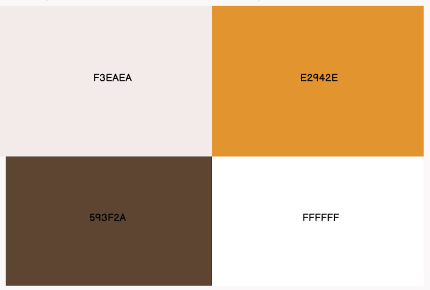 

## Spacing
El sistema de espaciado de Relient busca mantener una distribución ordenada de los contenidos y evitar la saturación visual. Para ello, se utilizan separaciones consistentes entre títulos, textos, botones, formularios, tablas y componentes de navegación.La configuración del espaciado 
se establece mediante las herramientas de diseño utilizadas en Figma, considerando la distribución de los elementos y la legibilidad de la información en las diferentes vistas de la plataforma.

## Tone of Voice
El tono de comunicación de Relient se caracteriza por ser profesional, claro, directo y orientado a la eficiencia operativa. Debido a que la plataforma está relacionada con el monitoreo y la gestión de procesos industriales, la comunicación busca transmitir control, prevención y confiabilidad. Los mensajes deben utilizar
términos comprensibles y evitar expresiones excesivamente técnicas cuando no sean necesarias. Asimismo, las etiquetas y notificaciones deben orientar al usuario sobre las acciones que puede realizar y los estados de los registros o equipos.

### 4.1.2. Web Style Guidelines.
Las Web Style Guidelines de Relient establecen los criterios visuales y de interacción para las interfaces web del producto. Estas reglas buscan asegurar la consistencia entre la Landing Page y la Web Application, facilitando la navegación y el uso de las funcionalidades disponibles.

 ## Navigation Bar
 La barra de navegación de la Landing Page se ubica en la parte superior de la interfaz y permite acceder a las principales secciones informativas del producto. También incorpora las opciones de ingreso y registro de usuarios.
En la Web Application, la navegación se organiza mediante una barra superior y un menú lateral que permite acceder a los módulos de Usuarios, Equipos, Componentes, Señales, Alertas, Reportes e Inventario.

## Buttons
Los botones utilizan una jerarquía visual que permite diferenciar las acciones principales de las secundarias. El color naranja #E2942E se emplea para destacar las acciones más importantes, como ingresar, registrar información, guardar cambios o iniciar una operación.
Los botones también consideran estados visuales como hover y focus, con el objetivo de proporcionar retroalimentación al usuario durante la interacción.

## Cards
Las tarjetas se utilizan para presentar información de manera organizada e independiente. En la Web Application de Relient pueden emplearse para mostrar indicadores, estados de equipos, alertas, componentes y otros datos relacionados con la operación.
El uso de tarjetas permite separar visualmente la información y facilitar su lectura, especialmente cuando se presentan diferentes registros o indicadores dentro de una misma vista.

## Forms
Los formularios de Relient utilizan una estructura organizada y etiquetas visibles asociadas a cada campo de entrada. Los campos deben contar con espacios adecuados, bordes definidos y estados de focus que permitan identificar el elemento activo.
Los formularios se utilizan en procesos como el registro de usuarios, equipos, componentes, señales e información de inventario. Se busca que los campos sean comprensibles y que los mensajes de validación orienten al usuario cuando se produzca un error.

## Interaction States
Los principales componentes interactivos consideran estados visuales de hover, focus, seleccionado y deshabilitado. Estos estados permiten comunicar qué elementos pueden ser seleccionados o activados.
En Relient, estos criterios también pueden utilizarse para representar estados relacionados con los equipos, las señales y las alertas, facilitando la identificación de información que requiere atención o seguimiento.

## Responsive Web Design
La interfaz de Relient considera un enfoque responsive para adaptar la presentación de los contenidos a diferentes tamaños de pantalla. En la versión de escritorio se utiliza una estructura con menú lateral, tablas y componentes de gestión.
En dispositivos de menor tamaño, los elementos deben reorganizarse para conservar la legibilidad, evitar desbordamientos horizontales y facilitar la interacción con los botones, formularios y registros de la plataforma.

## Accessibility
La experiencia web de Relient considera prácticas básicas de accesibilidad, como el uso de etiquetas visibles en los formularios, contraste entre colores, estados de focus y nombres comprensibles para los botones y elementos de navegación.
Asimismo, la información debe organizarse mediante una jerarquía visual clara, permitiendo que los usuarios identifiquen las funciones y comprendan los mensajes presentados por la plataforma.

## 4.2. Information Architecture.
La arquitectura de información de Relient define la manera en que se distribuyen, relacionan y presentan los contenidos de la plataforma. Su propósito es ayudar a los usuarios a identificar las funcionalidades disponibles y encontrar la información requerida sin realizar pasos innecesarios.
La propuesta contempla la Landing Page y la Web Application de InnovaCorp. Ambas interfaces deben mantener criterios similares en la organización de los contenidos, las etiquetas y los recorridos de navegación. De esta manera, el usuario puede reconocer la identidad y la estructura del producto desde la primera interacción hasta el uso de sus funcionalidades internas.

### 4.2.1. Organization Systems.
Relient utiliza una organización basada principalmente en una estructura jerárquica y temática. La organización jerárquica permite mostrar primero la información más importante y posteriormente dirigir al usuario hacia contenidos específicos. La organización temática agrupa las funcionalidades según el tipo de tarea o información que gestionan.
En la Landing Page, el contenido se distribuye desde la presentación inicial de InnovaCorp y la propuesta de valor de Relient hacia las secciones informativas que explican el funcionamiento de la solución. También se consideran los accesos a About Us, How does it work?, FAQs y Contact, de acuerdo con la estructura de los mockups.
En la Web Application, la información se divide en módulos relacionados con las actividades principales de la plataforma. Estos módulos incluyen Usuarios, Equipos, Componentes, Señales, Alertas, Reportes e Inventario. Cada sección reúne los registros y acciones correspondientes a su finalidad, permitiendo que el usuario pueda consultar y administrar la información de manera más ordenada.
La organización de los módulos también puede incorporar una secuencia de pasos cuando se necesita registrar, actualizar o revisar un elemento. Por ejemplo, una operación puede comenzar con el ingreso de datos, continuar con la validación de la información y finalizar con la confirmación del registro.

### 4.2.2. Labeling Systems.
El sistema de etiquetado de Relient busca utilizar nombres breves, reconocibles y relacionados directamente con las funciones de la plataforma. Las etiquetas deben permitir que el usuario anticipe el contenido de una sección antes de ingresar a ella.
En la Landing Page se utilizan nombres como Home, About Us, How does it work?, FAQs y Contact. Estas denominaciones ayudan a separar la información institucional, la explicación del producto y los canales de comunicación.
En la Web Application, las etiquetas principales corresponden a los módulos de Usuarios, Equipos, Componentes, Señales, Alertas, Reportes e Inventario. Cada nombre se relaciona con el tipo de información que el usuario puede consultar o administrar dentro de la plataforma.
Las acciones deben utilizar expresiones orientadas a la tarea, como “Registrar”, “Guardar”, “Editar”, “Consultar”, “Filtrar” o “Generar reporte”, siempre que correspondan con la funcionalidad implementada. Se evitarán términos excesivamente técnicos, abreviaturas poco claras o denominaciones diferentes para una misma acción.

### 4.2.3. SEO Tags and Meta Tags
Las etiquetas SEO y los Meta Tags de Relient se plantean como recursos para describir el contenido de la Landing Page y facilitar su identificación por parte de los motores de búsqueda. Estos valores permiten comunicar el nombre del producto, su finalidad y los temas relacionados con la solución.
Para InnovaCorp se proponen los siguientes contenidos:

|## Tag | ## Valor|
|:--:|:--:|
|Title | InnovaCorp - Monitoreo inteligente de procesos industriales |
| Description | InnovaCorp ofrece soluciones tecnológicas para monitorear procesos, anticipar fallas y mejorar la trazabilidad industrial|
| Keywords | InnovaCorp, Relient, monitoreo industrial, trazabilidad, prevención de fallas |
| Author | InnovaCorp 

Los valores anteriores representan una propuesta inicial y deben validarse durante la implementación del sitio web. El atributo Title identifica el nombre principal de la página, mientras que la Description presenta una síntesis del servicio ofrecido. Las Keywords reúnen términos relacionados con la actividad de InnovaCorp y el propósito de Relient.
Estas etiquetas se incorporan dentro del elemento <head> del documento HTML. En el caso de la Web Application, los títulos y descripciones pueden ajustarse de acuerdo con la vista o funcionalidad que se esté mostrando.

### 4.2.4. Searching Systems.
El sistema de búsqueda de Relient se define según la cantidad y el tipo de información que debe consultar el usuario en cada interfaz.
En la Landing Page no se considera necesaria una barra de búsqueda principal, debido a que sus contenidos se encuentran distribuidos en secciones específicas y pueden localizarse mediante la navegación superior. El usuario puede dirigirse a las secciones informativas utilizando los enlaces disponibles.
En la Web Application, la búsqueda adquiere mayor importancia porque se gestionan registros relacionados con usuarios, equipos, componentes, señales, alertas, reportes e inventarios. Por este motivo, se pueden incorporar campos de búsqueda y filtros que faciliten la localización de información.
Los criterios de filtrado pueden variar según el módulo. Por ejemplo, se pueden considerar nombres, códigos, categorías, estados o fechas, siempre que estos datos formen parte de la información gestionada por la plataforma. Los resultados deben mostrarse de forma ordenada para que el usuario pueda reconocer los registros y acceder a sus detalles.
Los filtros deben ser comprensibles y permitir que el usuario modifique o elimine los criterios seleccionados. De esta manera, se evita que la búsqueda se convierta en un proceso complicado o que se presenten demasiadas opciones al mismo tiempo.

### 4.2.5. Navigation Systems.
El sistema de navegación de Relient tiene como objetivo facilitar el desplazamiento entre las distintas secciones de la experiencia digital. Para ello, se establecen rutas claras que permitan al usuario comprender dónde se encuentra y qué acciones puede realizar.
En la Landing Page, la navegación principal se presenta en la parte superior e incluye los accesos a Home, About Us, How does it work?, FAQs y Contact. Estos enlaces permiten desplazarse hacia las secciones correspondientes de la página. Además, se consideran acciones como “Empezar ya”, Login y Sign Up, las cuales dirigen al usuario hacia los puntos de interacción definidos en los mockups.
En la Web Application, la navegación se organiza alrededor de los módulos principales de Relient. Los accesos a Usuarios, Equipos, Componentes, Señales, Alertas, Reportes e Inventario deben mantenerse visibles y ordenados para facilitar el acceso a las funciones de gestión y monitoreo.
El footer de la Landing Page complementa la navegación mediante información adicional de la marca y accesos relacionados con las secciones disponibles. Su contenido debe mantener una estructura sencilla y consistente con el resto de la interfaz.
En pantallas pequeñas, los elementos de navegación deben reorganizarse para conservar su visibilidad y permitir una interacción adecuada. Dentro de la Web Application, los recorridos deben mantener una relación clara entre los módulos, los registros y las acciones disponibles, evitando que el usuario pierda el contexto de la tarea que está realizando.

## 4.3. Landing Page UI Design.
El diseño de la interfaz de la Landing Page de Relient representa visualmente la propuesta de InnovaCorp y permite presentar el propósito de la solución de manera ordenada. Su estructura se desarrolla a partir de los criterios definidos en las Style Guidelines y en la arquitectura de información.
La interfaz busca comunicar el valor de Relient, explicar de manera sencilla su finalidad y facilitar el acceso a las principales acciones de navegación. Para ello, se utilizan recursos como la jerarquía tipográfica, la paleta de colores, los espacios entre secciones y los componentes interactivos.
El diseño considera una presentación adaptable a diferentes tamaños de pantalla, manteniendo una relación visual entre los elementos de la marca y las funcionalidades que posteriormente se encuentran disponibles en la Web Application.

### 4.3.1. Landing Page Wireframe.
Los wireframes de la Landing Page de Relient muestran la distribución preliminar de los elementos que conforman la interfaz antes de aplicar todos los estilos visuales. Estos esquemas permiten revisar la ubicación de los contenidos, la organización de la navegación y la jerarquía de las secciones principales.
La elaboración de los wireframes facilita la identificación de posibles problemas de distribución y permite realizar ajustes antes de desarrollar la interfaz definitiva. También ayuda a comprobar que los elementos principales, como el logotipo, los enlaces de navegación y los botones de acción, se encuentren ubicados de acuerdo con la estructura propuesta.

## Desktop Web Browser
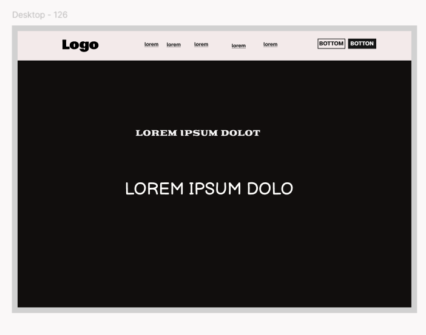 
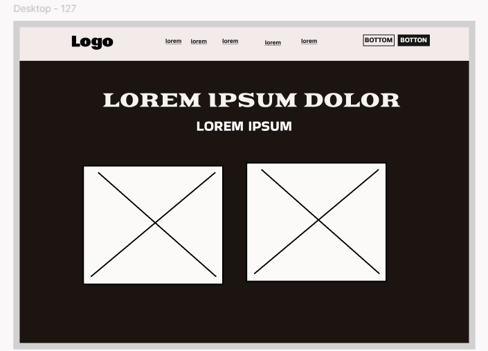 
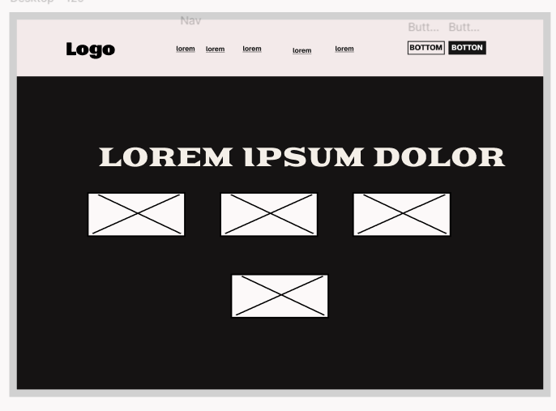 
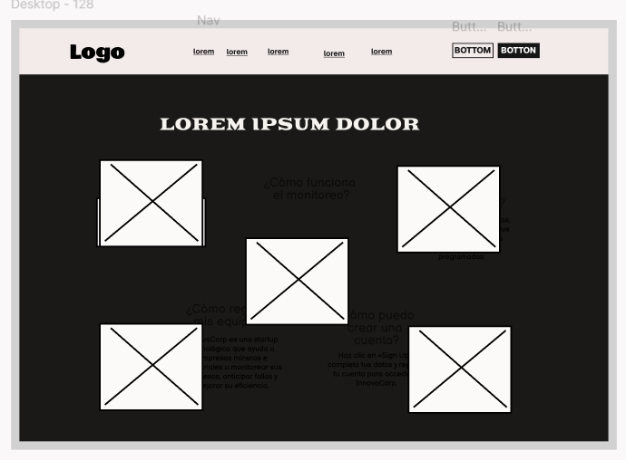 
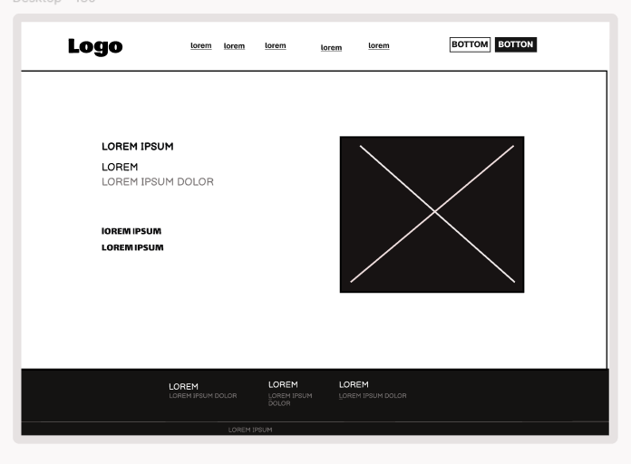 

## Mobile Web Browser
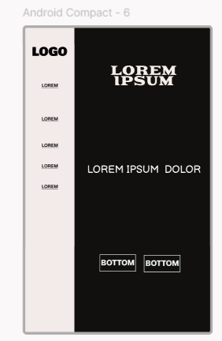 
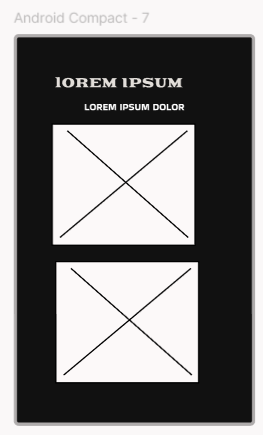 
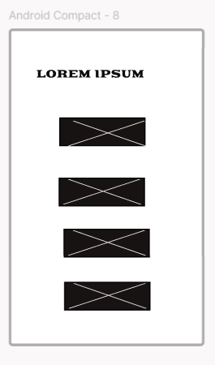 
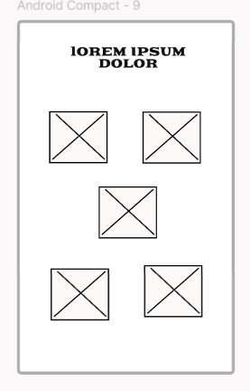 
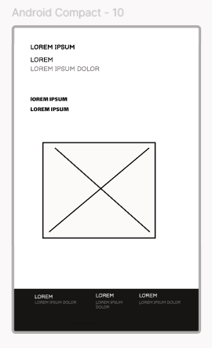 


### 4.3.2. Landing Page Mock-up.

## Desktop Web Browser
 
 
 
 
 

## Mobile Web Browser
 
 
 
 
 


## 4.4. Web Applications UX/UI Design.
El diseño UX/UI de la Web Application de Relient, desarrollada por InnovaCorp, se plantea a partir de los resultados obtenidos durante el proceso de UX Research, los User Stories establecidos en el Product Backlog y los lineamientos visuales definidos previamente.
El propósito de esta sección es representar la organización, navegación e interacción de las funcionalidades principales de la plataforma, facilitando que los usuarios puedan realizar sus actividades de manera comprensible, ordenada y eficiente.
Para lograrlo, se elaborarán wireframes, wireflows, mock-ups y user flow diagrams que permitan visualizar la distribución de los componentes de la interfaz y los distintos recorridos que los usuarios pueden seguir dentro de la Web Application. Estos recursos estarán orientados a las funciones de gestión de usuarios, equipos, componentes, señales, alertas, reportes e inventario.

### 4.4.1. Web Applications Wireframes.
Los wireframes de la Web Application de Relient presentan una representación inicial de la estructura y distribución de las pantallas principales de la plataforma. Estos esquemas permiten definir la ubicación de los elementos de navegación, botones, formularios, tarjetas, tablas y secciones informativas antes de incorporar el diseño visual final.
Asimismo, los wireframes ayudan a organizar las funcionalidades de acuerdo con las necesidades de los usuarios y los User Stories definidos, facilitando la revisión de la experiencia de navegación y la identificación de posibles mejoras en la interfaz.

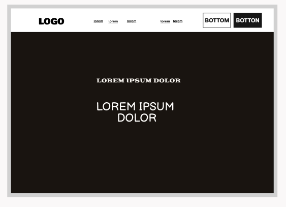 
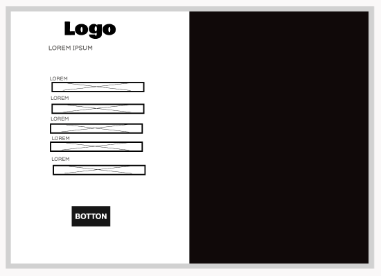 
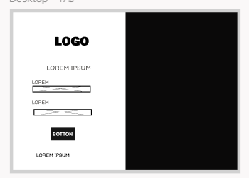 
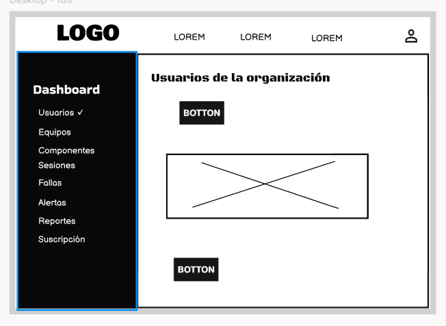 
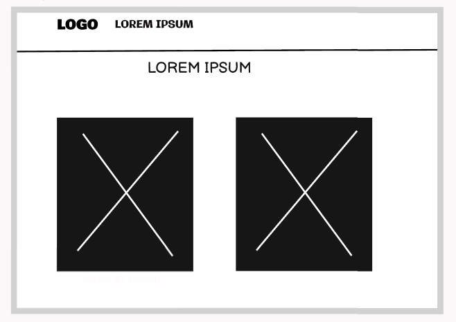 
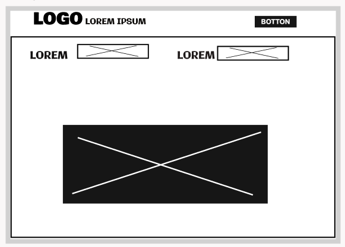 
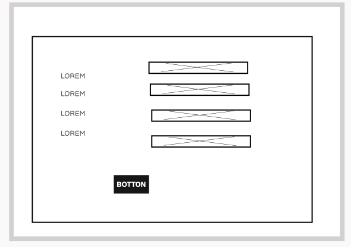 
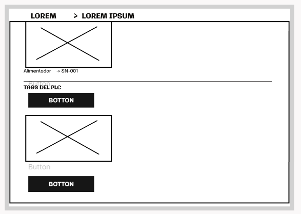 
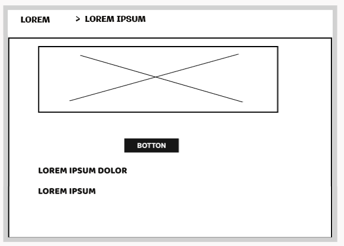 
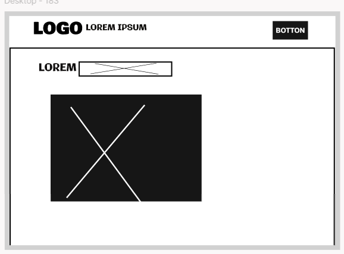 
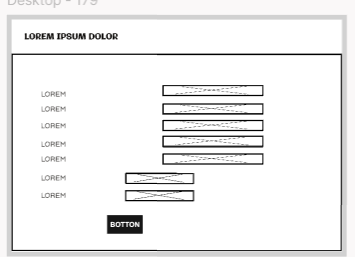 
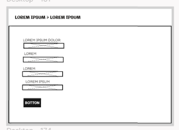 
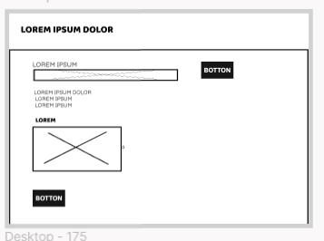 
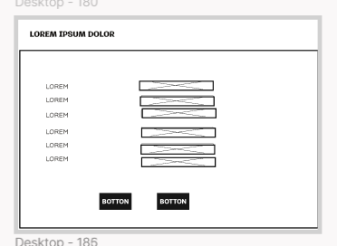 
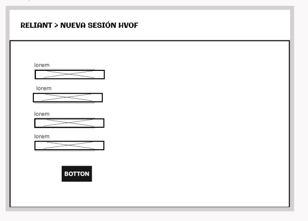 
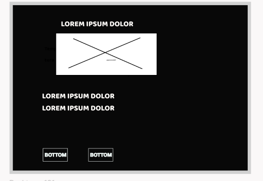 
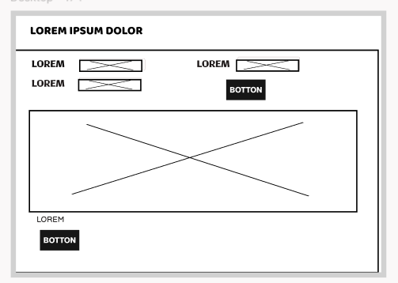 
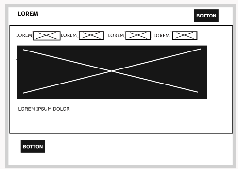 
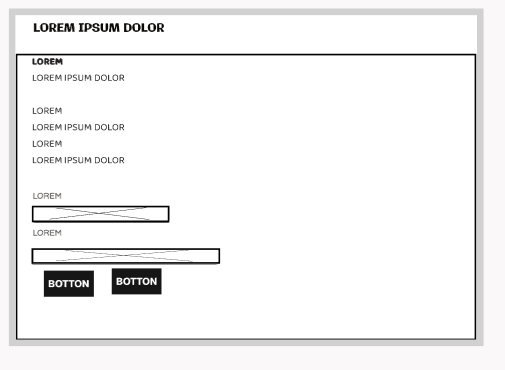 
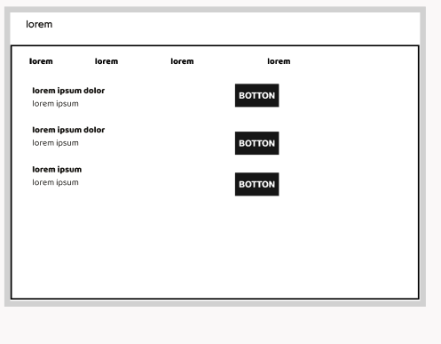 
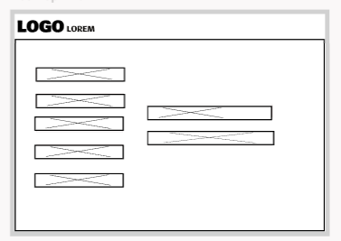 


### 4.4.2. Web Applications Wireflow Diagrams.
 


### 4.4.3. Web Applications Mock-ups.
 
 
 
 
 
 
 
 
 
 
 
 
 
 
 
 
 
 
 
 
 


### 4.4.4. Web Applications User Flow Diagrams.
 


## 4.5. Web Applications Prototyping.
En esta sección se presenta el prototipo interactivo de la Web Application de Reliant, desarrollado a partir de los mock-ups y User Flow Diagrams definidos previamente. El prototipo permite simular la navegación entre las principales vistas de la aplicación y validar la secuencia de interacción que siguen los usuarios para realizar sus tareas principales. Las conexiones entre pantallas fueron definidas considerando los recorridos establecidos en los User Flows y el sistema de navegación propuesto para la aplicación. Se consideraron las principales funcionalidades de Reliant, como el registro y seguimiento de componentes recuperados, la consulta de órdenes de trabajo, la trazabilidad de los procesos de recubrimiento HVOF, el monitoreo de parámetros de operación, el diagnóstico de fallas y el análisis del desempeño de los componentes frente a su vida útil esperada (PCR). A continuación, se presenta una captura del prototipo en funcionamiento y el enlace al video de demostración, donde se muestran los principales flujos de navegación e interacción de la aplicación.

# Video:  
https://youtu.be/ImzFsoEMSIk


## 4.6. Domain-Driven Software Architecture.
### 4.6.1. Design-Level Event Storming.

El Design-Level Event Storming parte del tablero ordenado del Big Picture Event Storming (sección 2.4), tal como se acordó en su cierre: sobre cada grupo de eventos se identifican los Commands que los provocan, el Aggregate que decide, las Policies que reaccionan a otros eventos y los Read Models que consumen los usuarios. El resultado define los bounded contexts que se modelan en las secciones 4.6.2 a 4.8.

#### 4.6.1.1. Candidate Context Discovery.

Para descubrir los bounded contexts candidatos el equipo aplicó la técnica *look-for-pivotal-events* sobre el tablero del Big Picture. Los eventos pivote marcan un cambio de responsabilidad en el negocio: *OrganizationRegistered* separa la configuración de la organización de su operación; *SubscriptionActivated* separa la facturación del uso de la plataforma; *HvofSystemRegistered* y *RecipeApproved* cierran la configuración del equipamiento; *RecuperationCreated* abre la trazabilidad de la pieza; *SpraySessionStarted* y *SpraySessionCompleted* delimitan el monitoreo del proceso; *FaultCaseOpened* inicia el diagnóstico; *OutOfRangeAlertRaised* inicia la notificación; y *QualityCertificateIssued* y *PcrComplianceReportGenerated* producen la evidencia y los reportes. Los eventos agrupados entre pivotes, junto con el lenguaje que usa cada actor, dieron lugar a ocho bounded contexts y un Shared Kernel transversal:

| Bounded Context | Responsabilidad | Eventos pivote | Épicas |
|---|---|---|---|
| IAM | Organizaciones, usuarios, roles y preferencias | OrganizationRegistered, UserAuthenticated | E01 |
| Billing | Planes y suscripciones | PlanSelected, SubscriptionActivated | E02 |
| Equipment | Sistemas HVOF, controladores, tags y recetas | HvofSystemRegistered, RecipeApproved | E03 |
| Traceability | Clientes, componentes, órdenes de recuperación y PCR | RecuperationCreated, RecuperationClosed, ServiceLifeRecorded | E04, E09 |
| Process Monitoring | Sesiones de rociado, lecturas y bandas | SpraySessionStarted, ParameterOutOfRangeDetected, SpraySessionCompleted | E05 |
| Fault Diagnosis | Casos de falla, reglas y patrones | FaultCaseOpened, RootCauseConfirmed | E06 |
| Notifications | Alertas, preferencias y newsletter | OutOfRangeAlertRaised, AlertDelivered | E07, E11 |
| Reporting | Certificados, plantillas y reportes | QualityCertificateIssued, PcrComplianceReportGenerated | E08, E09 |

#### 4.6.1.2. Domain Message Flows Modeling.

El flujo principal del dominio es la recuperación de un componente desde su recepción hasta la evidencia de calidad. El siguiente diagrama muestra los mensajes que intercambian los bounded contexts en ese escenario: los comandos llegan desde los usuarios o el cliente de telemetría, y los bounded contexts se comunican mediante eventos de integración y consultas a través de sus Context Facades.


```mermaid
sequenceDiagram
    autonumber
    actor Op as Operador HVOF
    participant TR as Traceability
    participant PM as Process Monitoring
    participant EQ as Equipment
    participant FD as Fault Diagnosis
    participant NT as Notifications
    participant RP as Reporting
    actor QE as Ingeniera de calidad
    Op->>TR: RegisterComponent / CreateRecuperation
    Op->>PM: StartSpraySession(sistema, orden, receta)
    PM->>EQ: recipeAppliesTo / fetchRecipeLimits
    PM->>TR: fetchComponentSpec(orden)
    Note over PM: IngestTelemetry desde el cliente del PLC
    PM-->>NT: ParameterOutOfRangeDetected
    NT-->>Op: OutOfRangeAlertRaised
    PM-->>FD: FaultFlagActivated
    FD->>EQ: fetchSubsystemAndPart
    FD-->>NT: FaultCaseOpened
    Op->>PM: CompleteSpraySession
    PM-->>TR: SpraySessionCompleted
    QE->>TR: CloseRecuperation
    QE->>RP: IssueQualityCertificate
    RP->>TR: fetchLinkedSessionIds
    RP->>PM: fetchOutOfRangeSummary
    RP-->>QE: QualityCertificateIssued
```

#### 4.6.1.3. Bounded Context Canvases.

Cada canvas resume, por bounded context, los comandos que recibe, el Aggregate que los procesa, los eventos que emite, las Policies que reaccionan a eventos de otros contextos y los Read Models que alimenta. La leyenda de colores sigue la del Big Picture Event Storming:

| Elemento | Color |
|---|---|
| Actor | Amarillo claro |
| Command | Azul |
| Aggregate | Amarillo |
| Domain Event | Naranja |
| Policy | Lila |
| Read Model | Verde |
| Sistema externo u otro bounded context | Rosado |

**IAM**: Identidad, registro de organizaciones, autenticación, roles y preferencias de unidades.


```mermaid
flowchart LR
    classDef actor fill:#FFF9C4,stroke:#F9A825,color:#000
    classDef command fill:#90CAF9,stroke:#1565C0,color:#000
    classDef aggregate fill:#FFF176,stroke:#F9A825,color:#000
    classDef evento fill:#FFA726,stroke:#E65100,color:#000
    classDef policy fill:#CE93D8,stroke:#6A1B9A,color:#000
    classDef readmodel fill:#A5D6A7,stroke:#2E7D32,color:#000
    classDef external fill:#F48FB1,stroke:#AD1457,color:#000
    A1(["Administrador de organización"]):::actor --> C1["SignUp"]:::command --> G1["Organization / User"]:::aggregate --> E1["OrganizationRegistered"]:::evento
    A2(["Usuario registrado"]):::actor --> C2["SignIn"]:::command --> G1 --> E2["UserAuthenticated"]:::evento
    A1 --> C3["AssignRole"]:::command --> G1 --> E3["RoleAssigned"]:::evento
    A2 --> C4["UpdateUnitPreference"]:::command --> G2["UserPreference"]:::aggregate --> E4["UnitPreferenceUpdated"]:::evento
    E1 --> P1{{"Cuando se registra una organización, vincular los clientes con el mismo RUC"}}:::policy
    E2 --> R1[/"Sesión y roles del usuario"/]:::readmodel
```

**Billing**: Planes Operator y Asset Owner, selección de plan y vigencia de la suscripción.


```mermaid
flowchart LR
    classDef actor fill:#FFF9C4,stroke:#F9A825,color:#000
    classDef command fill:#90CAF9,stroke:#1565C0,color:#000
    classDef aggregate fill:#FFF176,stroke:#F9A825,color:#000
    classDef evento fill:#FFA726,stroke:#E65100,color:#000
    classDef policy fill:#CE93D8,stroke:#6A1B9A,color:#000
    classDef readmodel fill:#A5D6A7,stroke:#2E7D32,color:#000
    classDef external fill:#F48FB1,stroke:#AD1457,color:#000
    A1(["Administrador de organización"]):::actor --> C1["SelectPlan"]:::command --> G1["Subscription"]:::aggregate --> E1["PlanSelected"]:::evento --> E2["SubscriptionActivated"]:::evento
    X1["Reloj del sistema"]:::external --> C2["ExpireSubscription"]:::command --> G1 --> E3["SubscriptionExpired"]:::evento
    E2 --> P1{{"Al registrar un sistema HVOF, verificar el cupo del plan Operator"}}:::policy
    G1 --> R1[/"Estado y vigencia de la suscripción"/]:::readmodel
```

**Equipment**: Sistemas HVOF, subsistemas, partes, controladores, catálogo de tags, recetas y parámetros derivados.


```mermaid
flowchart LR
    classDef actor fill:#FFF9C4,stroke:#F9A825,color:#000
    classDef command fill:#90CAF9,stroke:#1565C0,color:#000
    classDef aggregate fill:#FFF176,stroke:#F9A825,color:#000
    classDef evento fill:#FFA726,stroke:#E65100,color:#000
    classDef policy fill:#CE93D8,stroke:#6A1B9A,color:#000
    classDef readmodel fill:#A5D6A7,stroke:#2E7D32,color:#000
    classDef external fill:#F48FB1,stroke:#AD1457,color:#000
    A1(["Supervisor de mantenimiento de máquina"]):::actor --> C1["RegisterHvofSystem"]:::command --> G1["HVOFSystem"]:::aggregate --> E1["HvofSystemRegistered"]:::evento
    A1 --> C2["RegisterSubsystem / RegisterPart"]:::command --> G1 --> E2["HvofSubsystemRegistered / HvofPartRegistered"]:::evento
    A1 --> C3["ImportControllerTags"]:::command --> G2["ControllerTagCatalog"]:::aggregate --> E3["PlcTagFileImported"]:::evento --> P1{{"Proponer el mapeo de cada tag con las TagMappingRule"}}:::policy --> E4["TagMappingProposed"]:::evento
    A1 --> C4["ConfirmTagMapping"]:::command --> G1 --> E5["TagMappingConfirmed"]:::evento
    A2(["Ingeniera de calidad"]):::actor --> C5["CreateRecipe"]:::command --> G3["Recipe"]:::aggregate --> E6["RecipeDefined / RecipeApplicabilityDefined"]:::evento
    A2 --> C6["ApproveRecipe"]:::command --> G3 --> E7["RecipeApproved"]:::evento
    A2 --> C7["DefineDerivedParameter"]:::command --> G1 --> E8["DerivedParameterDefined"]:::evento
    G3 --> R1[/"Límites de la receta por parámetro"/]:::readmodel
```

**Traceability**: Clientes, componentes, órdenes de recuperación con OF y WO, PCR objetivo y retorno de campo.


```mermaid
flowchart LR
    classDef actor fill:#FFF9C4,stroke:#F9A825,color:#000
    classDef command fill:#90CAF9,stroke:#1565C0,color:#000
    classDef aggregate fill:#FFF176,stroke:#F9A825,color:#000
    classDef evento fill:#FFA726,stroke:#E65100,color:#000
    classDef policy fill:#CE93D8,stroke:#6A1B9A,color:#000
    classDef readmodel fill:#A5D6A7,stroke:#2E7D32,color:#000
    classDef external fill:#F48FB1,stroke:#AD1457,color:#000
    A1(["Supervisor de operación"]):::actor --> C1["RegisterCustomer"]:::command --> G1["Customer"]:::aggregate --> E1["CustomerRegistered"]:::evento
    A2(["Operador HVOF"]):::actor --> C2["RegisterComponent"]:::command --> G2["Component"]:::aggregate --> E2["ComponentReceived"]:::evento
    A1 --> C3["CreateRecuperation"]:::command --> G3["Recuperation"]:::aggregate --> E3["RecuperationCreated"]:::evento
    X1["SpraySessionCompleted (Process Monitoring)"]:::external --> P1{{"Vincular la sesión a la orden y marcar el componente en proceso"}}:::policy --> E4["ComponentMarkedInProcess"]:::evento
    A1 --> C4["CloseRecuperation"]:::command --> G3 --> E5["RecuperationClosed"]:::evento --> E6["ComponentDelivered"]:::evento
    A3(["Ingeniera de confiabilidad"]):::actor --> C5["RecordFieldReturn"]:::command --> G2 --> E7["ServiceLifeRecorded"]:::evento --> P2{{"Si las horas no alcanzan el PCR, detectar falla prematura"}}:::policy --> E8["PrematureFailureDetected"]:::evento
    G2 --> R1[/"Historial del componente"/]:::readmodel
```

**Process Monitoring**: Sesiones de rociado, ingesta de telemetría, pasadas, clasificación por banda y verificación de receta.


```mermaid
flowchart LR
    classDef actor fill:#FFF9C4,stroke:#F9A825,color:#000
    classDef command fill:#90CAF9,stroke:#1565C0,color:#000
    classDef aggregate fill:#FFF176,stroke:#F9A825,color:#000
    classDef evento fill:#FFA726,stroke:#E65100,color:#000
    classDef policy fill:#CE93D8,stroke:#6A1B9A,color:#000
    classDef readmodel fill:#A5D6A7,stroke:#2E7D32,color:#000
    classDef external fill:#F48FB1,stroke:#AD1457,color:#000
    A1(["Operador HVOF"]):::actor --> C1["StartSpraySession"]:::command --> G1["SpraySession"]:::aggregate --> E1["SpraySessionStarted"]:::evento --> P1{{"Verificar que la receta aplique al componente de la orden"}}:::policy
    P1 --> E2["RecipeVerified"]:::evento
    P1 --> E3["RecipeMismatchDetected"]:::evento
    X1["Cliente de telemetría del PLC"]:::external --> C2["IngestTelemetry"]:::command --> G1 --> E4["ProcessReadingRecorded"]:::evento --> P2{{"Clasificar cada lectura según las bandas de la receta"}}:::policy --> E5["ParameterOutOfRangeDetected"]:::evento
    G1 --> E6["SprayingStarted / SprayingStopped"]:::evento
    G1 --> E7["FaultFlagActivated"]:::evento
    X1 --> P3{{"Si no hay sesión abierta, abrir una sesión no asignada"}}:::policy --> E8["UnassignedSessionOpened"]:::evento
    A1 --> C3["CompleteSpraySession / AbortSpraySession"]:::command --> G1 --> E9["SpraySessionCompleted / SpraySessionAborted"]:::evento
    G1 --> R1[/"Lecturas en vivo por banda"/]:::readmodel
```

**Fault Diagnosis**: Casos de falla, reglas causa-efecto, causa raíz y patrones recurrentes.


```mermaid
flowchart LR
    classDef actor fill:#FFF9C4,stroke:#F9A825,color:#000
    classDef command fill:#90CAF9,stroke:#1565C0,color:#000
    classDef aggregate fill:#FFF176,stroke:#F9A825,color:#000
    classDef evento fill:#FFA726,stroke:#E65100,color:#000
    classDef policy fill:#CE93D8,stroke:#6A1B9A,color:#000
    classDef readmodel fill:#A5D6A7,stroke:#2E7D32,color:#000
    classDef external fill:#F48FB1,stroke:#AD1457,color:#000
    X1["FaultFlagActivated (Process Monitoring)"]:::external --> P1{{"Abrir un caso de falla por cada indicador activado"}}:::policy --> C1["OpenFaultCase"]:::command --> G1["FaultCase"]:::aggregate --> E1["FaultCaseOpened"]:::evento
    E1 --> P2{{"Aplicar el catálogo de reglas causa-efecto"}}:::policy --> G2["DiagnosticRule"]:::aggregate --> E2["ProbableCauseSuggested / SuspectPartIdentified"]:::evento
    A1(["Supervisor de mantenimiento de máquina"]):::actor --> C2["ConfirmRootCause"]:::command --> G1 --> E3["RootCauseConfirmed"]:::evento --> E4["FaultCaseClosed"]:::evento
    E3 --> P3{{"Si la misma parte acumula fallas del mismo tipo, detectar patrón"}}:::policy --> G3["FaultPattern"]:::aggregate --> E5["RecurringFaultPatternDetected"]:::evento
    A2(["Ingeniera de calidad"]):::actor --> C3["CreateDiagnosticRule"]:::command --> G2 --> E6["DiagnosticRuleCreated"]:::evento
    G1 --> R1[/"Casos de falla por sistema, subsistema y parte"/]:::readmodel
```

**Notifications**: Alertas en la plataforma y por correo, preferencias de notificación y newsletter.


```mermaid
flowchart LR
    classDef actor fill:#FFF9C4,stroke:#F9A825,color:#000
    classDef command fill:#90CAF9,stroke:#1565C0,color:#000
    classDef aggregate fill:#FFF176,stroke:#F9A825,color:#000
    classDef evento fill:#FFA726,stroke:#E65100,color:#000
    classDef policy fill:#CE93D8,stroke:#6A1B9A,color:#000
    classDef readmodel fill:#A5D6A7,stroke:#2E7D32,color:#000
    classDef external fill:#F48FB1,stroke:#AD1457,color:#000
    X1["ParameterOutOfRangeDetected / RecipeMismatchDetected / UnassignedSessionOpened"]:::external --> P1{{"Alertar al operador según la severidad de la banda"}}:::policy --> C1["RaiseAlert"]:::command --> G1["Alert"]:::aggregate --> E1["OutOfRangeAlertRaised"]:::evento
    X2["FaultCaseOpened / RecurringFaultPatternDetected / PrematureFailureDetected"]:::external --> P2{{"Alertar al supervisor de mantenimiento y a calidad"}}:::policy --> C1
    G1 --> E2["CriticalFaultAlertRaised"]:::evento --> P3{{"Si la preferencia incluye correo, entregar por Mailchimp"}}:::policy --> X3["Mailchimp"]:::external --> E3["AlertDelivered"]:::evento
    A1(["Usuario de la plataforma"]):::actor --> C2["AcknowledgeAlert"]:::command --> G1 --> E4["AlertAcknowledged"]:::evento
    A1 --> C3["UpdateNotificationPreference"]:::command --> G2["NotificationPreference"]:::aggregate --> E5["NotificationPreferenceUpdated"]:::evento
    A2(["Visitante"]):::actor --> C4["SubscribeToNewsletter"]:::command --> G3["NewsletterSubscription"]:::aggregate --> E6["VisitorSubscribedToNewsletter"]:::evento
```

**Reporting**: Certificados de calidad, reportes de sesión, plantillas de reporte y cumplimiento de PCR.


```mermaid
flowchart LR
    classDef actor fill:#FFF9C4,stroke:#F9A825,color:#000
    classDef command fill:#90CAF9,stroke:#1565C0,color:#000
    classDef aggregate fill:#FFF176,stroke:#F9A825,color:#000
    classDef evento fill:#FFA726,stroke:#E65100,color:#000
    classDef policy fill:#CE93D8,stroke:#6A1B9A,color:#000
    classDef readmodel fill:#A5D6A7,stroke:#2E7D32,color:#000
    classDef external fill:#F48FB1,stroke:#AD1457,color:#000
    X1["RecuperationClosed (Traceability)"]:::external --> P1{{"Habilitar la emisión del certificado de la orden"}}:::policy
    A1(["Ingeniera de calidad"]):::actor --> C1["IssueQualityCertificate"]:::command --> G1["QualityCertificate"]:::aggregate --> E1["QualityCertificateIssued"]:::evento
    P1 --> C1
    A1 --> C2["CreateReportTemplate / ShareReportTemplate"]:::command --> G2["ReportTemplate"]:::aggregate --> E2["ReportTemplateCreated / ReportTemplateShared"]:::evento
    A2(["Supervisor de operación"]):::actor --> C3["GenerateReport"]:::command --> G3["GeneratedReport"]:::aggregate --> E3["ReportGeneratedFromTemplate / SessionReportGenerated"]:::evento
    A3(["Ingeniera de confiabilidad"]):::actor --> C4["GeneratePcrComplianceReport"]:::command --> G4["PcrComplianceReport"]:::aggregate --> E4["PcrComplianceReportGenerated"]:::evento
    G4 --> R1[/"Cumplimiento de PCR por proveedor, modelo y tipo"/]:::readmodel
```

### 4.6.2. Software Architecture Context Diagram.


### 4.6.3. Software Architecture Container Diagrams.


### 4.6.4. Software Architecture Components Diagrams.

Ver seccion: assets/img/chapter-iv/component-diagrams
en repositorio.

## 4.7. Software Object-Oriented Design.
### 4.7.1. Class Diagrams.

El diagrama de clases traduce los agregados del Event Storming (4.6.1) al modelo de objetos que sustentará la implementación en el Capítulo V.
Debido a la complejidad del sistema, a la cantidad de Bounded Contexts definidos y a la cantidad de clases por capa de Domain-Driven Design, se muestra el diagrama de clases subdividido para una mejor visualización.

#### Equipment


#### FaultDiagnosis


#### ProcessMonitoring


#### Traceability


#### Reporting

En el bounded context Reporting, el tipo de gráfico de cada elemento de una plantilla se modela con el atributo `viewType` del Value Object `ReportWidget`, cuyo enum `ViewTypeEnum` incluye los gráficos de línea (`LINE_CHART`), de barras (`BAR_CHART`) y de indicador (`GAUGE`), además de las vistas tabulares y de resumen (`TABLE`, `KPI_CARD`, `MIN_MAX_AVG`, `BAND_TIMELINE`).


#### Notifications


#### Billing


#### IAM


#### Shared


## 4.8. Database Design.
### 4.8.1. Database Diagrams.

El modelo relacional se despliega sobre PostgreSQL y refleja de forma directa el diagrama de clases de 4.7.1, con tablas puente derivadas de las relaciones muchos-a-muchos implícitas en el dominio.


En la tabla `report_widgets`, la columna `view_type` almacena el tipo de gráfico de cada elemento de la plantilla (`LINE_CHART`, `BAR_CHART`, `GAUGE`, `TABLE`, `KPI_CARD`, `MIN_MAX_AVG` o `BAND_TIMELINE`), como valor del enum `ViewTypeEnum` persistido en texto.


# Capítulo V: Product Implementation, Validation & Deployment
## 5.1. Software Configuration Management.

En esta sección se establecen las decisiones y convenciones que permiten mantener la consistencia del proyecto Reliant durante todo su ciclo de vida: las herramientas que utiliza el equipo de InnovaCorp, el esquema de control de versiones, las guías de estilo para cada lenguaje y la configuración de despliegue de cada producto. Todas las decisiones aplican por igual a los cuatro repositorios del proyecto: el informe, el Landing Page, la Frontend Web Application y los Web Services.

### 5.1.1. Software Development Environment Configuration.

A continuación se especifican los productos de software que utilizan los miembros del equipo, agrupados por tipo de actividad, con su propósito en el proyecto y la ruta de referencia o descarga.

**Project Management**

| Producto | Propósito en el proyecto | Ruta |
|---|---|---|
| Trello | Product Backlog priorizado, Sprint Backlogs con tasks por historia y tablero de estado (To Do / In Process / To Review / Done) | https://trello.com |
| Agile Tools by Corrello (Power-Up) | Story Points en las tarjetas y suma por lista para calcular la velocity | https://trello.com/power-ups |
| Microsoft Teams | Reuniones de Sprint Planning, Review y Retrospective; comunicación con el docente | https://www.microsoft.com/microsoft-teams |
| WhatsApp | Coordinación diaria del equipo | https://www.whatsapp.com |

**Requirements Management**

| Producto | Propósito en el proyecto | Ruta |
|---|---|---|
| GitHub (repositorio del informe) | Redacción colaborativa del informe en Markdown, con historial de versiones por commit | https://github.com |
| Trello | Registro de User Stories y Technical Stories con estimación y prioridad | https://trello.com |

**Product UX/UI Design**

| Producto | Propósito en el proyecto | Ruta |
|---|---|---|
| UXPressia | User Personas, Empathy Maps, User Journey Maps e Impact Map | https://uxpressia.com |
| Figma | Wireframes, mock-ups y prototipos del Landing Page y la Web Application | https://www.figma.com |
| FigJam | Wireflows y User Flows | https://www.figma.com/figjam |
| Mermaid | Big Picture y Design-Level Event Storming, árbol de problemas | https://mermaid.js.org |
| PlantUML | Diagramas de clases y de base de datos (Diagram-as-Code) | https://plantuml.com |
| Structurizr | Diagramas C4 (Context, Container, Component) | https://structurizr.com |

**Software Development**

| Producto | Propósito en el proyecto | Ruta |
|---|---|---|
| Java Development Kit 21 (LTS) | Lenguaje y runtime de los Web Services | https://adoptium.net |
| Spring Boot 3.x + Spring Data JPA | Framework del RESTful API, persistencia y seguridad | https://spring.io/projects/spring-boot |
| Apache Maven | Gestión de dependencias y construcción del backend | https://maven.apache.org |
| IntelliJ IDEA Community | IDE para el desarrollo del backend | https://www.jetbrains.com/idea |
| Node.js 24 LTS + npm | Runtime y gestor de paquetes de la Web Application y del fake API | https://nodejs.org |
| Angular CLI 22 | Framework de la Frontend Web Application (componentes standalone y signals) | https://angular.dev |
| ngx-translate | Internacionalización de la Web Application (inglés y español) | https://github.com/ngx-translate/core |
| json-server 0.17.4 | Fake API REST que sirve los datos de prueba de la Web Application durante el Sprint 2 | https://github.com/typicode/json-server |
| WebStorm | IDE para la Web Application y el fake API, con soporte para Git Flow | https://www.jetbrains.com/webstorm |
| Angular Material | Biblioteca de componentes UI basada en Material Design | https://material.angular.io |
| Visual Studio Code | Editor para el Landing Page (HTML5, CSS3, JavaScript) y la Web Application | https://code.visualstudio.com |
| PostgreSQL 16 | Base de datos relacional de los Web Services | https://www.postgresql.org |
| Docker Desktop | Contenedores para PostgreSQL en desarrollo y empaquetado del backend | https://www.docker.com |
| Postman | Pruebas manuales de los endpoints | https://www.postman.com |
| Python 3.12 | Simulador de telemetría del gateway PLC | https://www.python.org |

**Software Deployment**

| Producto | Propósito en el proyecto | Ruta |
|---|---|---|
| Microsoft Azure App Service (Linux) | Despliegue de la Frontend Web Application y del fake API como Web Apps independientes | https://azure.microsoft.com/products/app-service |
| PM2 | Servidor de archivos estáticos en modo SPA para la Web Application dentro de App Service | https://pm2.keymetrics.io |
| GitHub Actions | Integración y despliegue continuo: build, pruebas y publicación en Azure en cada push a `main` | https://github.com/features/actions |
| Render | Despliegue previsto de los Web Services (contenedor Docker) y de PostgreSQL gestionado | https://render.com |

**Software Documentation**

| Producto | Propósito en el proyecto | Ruta |
|---|---|---|
| Markdown | Formato del informe y de los README de cada repositorio | https://www.markdownguide.org |
| OpenAPI / Swagger UI (springdoc) | Documentación interactiva de los endpoints del RESTful API | https://springdoc.org |
| Mailchimp | Servicio externo para newsletter y alertas por correo | https://mailchimp.com |
| OBS Studio y Clipchamp | Grabación y edición de los videos de exposición, entrevistas y About-the-Product | https://obsproject.com · https://clipchamp.com |
| Microsoft Stream | Publicación de los videos del proyecto | https://www.microsoft.com/microsoft-stream |

### 5.1.2. Source Code Management.

El equipo utiliza GitHub como plataforma de control de versiones bajo la organización [upc-pre-202620-1asi0729-7753-innovacorp](https://github.com/upc-pre-202620-1asi0729-7753-innovacorp). Cada producto tiene su propio repositorio:

| Repositorio | Contenido | URL |
|---|---|---|
| `reliant-report` | Informe del proyecto en Markdown (README.md principal y archivos por capítulo) | https://github.com/upc-pre-202620-1asi0729-7753-innovacorp/reliant-report |
| `reliant-website` | Sitio web estático (Landing Page) en HTML5, CSS3 y JavaScript | https://github.com/upc-pre-202620-1asi0729-7753-innovacorp/reliant-website |
| `reliant-webapp` | Frontend Web Application en Angular | https://github.com/upc-pre-202620-1asi0729-7753-innovacorp/reliant-webapp |
| `reliant-platform-mock` | Fake API en json-server que expone los datos de prueba bajo `/api/v1` mientras no existen los Web Services | https://github.com/upc-pre-202620-1asi0729-7753-innovacorp/reliant-platform-mock |
| `reliant-platform` | RESTful API en Spring Boot, con pruebas unitarias y de integración (se crea en el Sprint 3) | — |

**GitFlow como workflow de control de versiones**

Se aplica el modelo de ramas propuesto por Vincent Driessen. Las ramas y sus convenciones de nombre son:

| Rama | Propósito | Convención de nombre | Ejemplo |
|---|---|---|---|
| `main` | Código en producción. Solo recibe merges desde `release/*` y `hotfix/*`. Cada merge se etiqueta con una versión | `main` | — |
| `develop` | Rama de integración. Recibe los merges de las `feature/*` terminadas | `develop` | — |
| `feature/*` | Una rama por User Story o Technical Story. Nace de `develop` y vuelve a `develop` por pull request | `feature/<story-id>-<descripcion-kebab>` | `feature/US07-register-hvof-system` |
| `release/*` | Preparación de una versión: correcciones menores, versión en `pom.xml` / `package.json`. Nace de `develop`, se fusiona en `main` y `develop` | `release/v<MAJOR>.<MINOR>.<PATCH>` | `release/v1.2.0` |
| `hotfix/*` | Corrección urgente sobre producción. Nace de `main`, se fusiona en `main` y `develop` | `hotfix/v<MAJOR>.<MINOR>.<PATCH>` | `hotfix/v1.2.1` |

Cada `feature/*` se integra mediante pull request con al menos una revisión de otro integrante antes del merge. No se realizan commits directos sobre `main` ni `develop`.

**Semantic Versioning para los releases**

Los releases siguen Semantic Versioning 2.0.0 con el formato `vMAJOR.MINOR.PATCH`:

| Componente | Se incrementa cuando |
|---|---|
| MAJOR | Se introduce un cambio incompatible en el API (por ejemplo, cambio de contrato de un endpoint en uso) |
| MINOR | Se agrega funcionalidad compatible (una nueva User Story implementada) |
| PATCH | Se corrige un error sin cambiar funcionalidad |

Versiones publicadas a la fecha: `v0.1.0` del Landing Page (AV1) y `1.0.0` y `1.0.1` de la Frontend Web Application (TB1, Sprint 2). En la Web Application, la rama de release y la etiqueta usan el número de versión sin prefijo (`release/1.0.1`, etiqueta `1.0.1`), que coincide con el campo `version` de `package.json`.

**Conventional Commits para los mensajes**

Todo mensaje de commit sigue la especificación Conventional Commits con la estructura `<tipo>(<alcance>): <descripción>`, en inglés, en imperativo y en minúsculas. El alcance es opcional y, cuando se usa, corresponde al bounded context o al producto afectado.

| Tipo | Uso | Ejemplo |
|---|---|---|
| `feat` | Nueva funcionalidad | `feat(equipment): add recipe applicability by component model` |
| `fix` | Corrección de un error | `fix(processmonitoring): evaluate band only on value change` |
| `docs` | Cambios en documentación o en el informe | `docs(report): add design-level event storming section` |
| `style` | Formato, sin cambio de lógica | `style(webapp): apply prettier to iam module` |
| `refactor` | Cambio de código que no agrega funcionalidad ni corrige errores | `refactor(traceability): extract WorkOrderNumber value object` |
| `test` | Pruebas nuevas o corregidas | `test(faultdiagnosis): cover rule priority resolution` |
| `chore` | Tareas de mantenimiento, dependencias | `chore: bump spring boot to 3.3.4` |
| `ci` | Cambios en la integración continua | `ci: add maven build workflow` |
| `build` | Cambios en el sistema de construcción o despliegue | `build(platform): add multi-stage dockerfile` |

Los cambios incompatibles se señalan con `!` después del tipo o con un pie `BREAKING CHANGE:`, y elevan la versión MAJOR.

### 5.1.3. Source Code Style Guide & Conventions.

Toda la nomenclatura del código (identificadores, archivos, paquetes, rutas, tablas, mensajes de commit) se redacta en inglés. Las convenciones adoptadas por lenguaje son:

**HTML5 y CSS3 (Landing Page y templates de Angular)**

Se sigue la HTML Style Guide de W3Schools y la Google HTML/CSS Style Guide.

| Regla | Aplicación |
|---|---|
| Declarar `<!DOCTYPE html>`, `lang` y `charset` | `<html lang="en">`, `<meta charset="utf-8">` |
| Elementos y atributos en minúsculas; valores de atributo entre comillas dobles | `<section class="hero">` |
| Semántica antes que `div` genéricos | `header`, `nav`, `main`, `section`, `article`, `footer` |
| Atributo `alt` en toda imagen y atributos ARIA en controles interactivos | `aria-label`, `aria-expanded`, `role` |
| Clases en kebab-case con nomenclatura BEM cuando hay variantes | `.plan-card`, `.plan-card--featured`, `.plan-card__price` |
| Sin estilos inline; colores, tipografía y espaciado como variables CSS | `--color-primary`, `--font-heading`, `--space-md` |
| Indentación de dos espacios | — |

**JavaScript y TypeScript**

Se sigue la Google TypeScript Style Guide.

| Regla | Aplicación |
|---|---|
| `camelCase` para variables, funciones y propiedades; `PascalCase` para clases, interfaces y tipos; `UPPER_SNAKE_CASE` para constantes | `sprayEnergy`, `SpraySession`, `MAX_READINGS_PER_BATCH` |
| `const` por defecto, `let` solo cuando hay reasignación; nunca `var` | — |
| Tipado explícito en firmas públicas; sin `any` | `handle(command: StartSpraySessionCommand): Observable<SpraySession>` |
| Comillas simples, punto y coma obligatorio, dos espacios de indentación | — |
| Un módulo por concepto; importaciones ordenadas (Angular, terceros, propias) | — |

**Angular**

Se sigue la Angular Coding Style Guide oficial.

| Regla | Aplicación |
|---|---|
| Nombres de archivo en kebab-case con sufijo por tipo | `spray-session-card.component.ts`, `iam.facade.ts`, `process-monitoring-api.service.ts` |
| Selectores de componente con prefijo de la aplicación | `app-spray-session-card` |
| Estructura por bounded context con capas | `src/app/<bc>/presentation`, `application`, `domain`, `infrastructure` |
| Un componente nunca hace HTTP directo: delega en la facade, que usa el servicio de infraestructura | `component → facade → api service` |
| Componentes standalone, `OnPush` y signals para el estado | — |
| Solo Angular Material como biblioteca de componentes | — |

**Java y Spring Boot**

Se sigue la Google Java Style Guide y las convenciones de Spring Boot.

| Regla | Aplicación |
|---|---|
| Paquetes en minúsculas, sin guiones bajos; `PascalCase` para clases, `camelCase` para métodos y atributos, `UPPER_SNAKE_CASE` para constantes y valores de enum | `com.innovacorp.reliant.equipment.domain.model.aggregates.HVOFSystem` |
| Siglas tratadas como palabras en nombres compuestos | `HvofSystemController`, `JwtTokenService` |
| Estructura por bounded context con cuatro capas | `<bc>/domain`, `application`, `infrastructure`, `interfaces` |
| Sufijos por rol DDD | `*Command`, `*Query`, `*Event`, `*CommandServiceImpl`, `*QueryServiceImpl`, `*Repository`, `*Resource`, `*Assembler`, `*ContextFacade`, `External*Service` |
| Value Objects como `record`; enums con `EnumType.STRING` | `record IpAddressV4(String value)` |
| Indentación de dos espacios, límite de 100 columnas, llaves en la misma línea | — |
| Inyección por constructor; sin `@Autowired` en campos | — |
| Endpoints REST: `/api/v1`, sustantivos en plural, kebab-case, verbos HTTP semánticos y códigos de estado estándar | `POST /api/v1/spray-sessions/{sessionId}/readings` → `202 Accepted` |
| Base de datos: tablas y columnas en snake_case, tablas en plural, generadas con `SnakeCasePhysicalNamingStrategy` | `spray_sessions`, `hvof_system_id` |

**Gherkin (criterios de aceptación y pruebas de aceptación)**

Se siguen las Gherkin Conventions for Readable Specifications: un escenario por comportamiento, pasos `Given / When / Then / And` en tercera persona y tiempo presente, sin detalles de interfaz de usuario, y `Feature` nombrada igual que la User Story que cubre.

**Python (simulador de telemetría)**

Se sigue PEP 8: `snake_case` para funciones y variables, `PascalCase` para clases, cuatro espacios de indentación, y tipado con anotaciones en las funciones públicas.

### 5.1.4. Software Deployment Configuration.

En el Sprint 2 la Frontend Web Application y su fake API se despliegan en **Microsoft Azure App Service** sobre Linux, cada una como un Web App independiente dentro del grupo de recursos `reliant-rg`. Cada Web App se conecta a su repositorio de GitHub desde el **Deployment Center**, que genera un workflow de **GitHub Actions** en la rama `main`: cada push a `main` construye el proyecto y lo publica en Azure. Se descartó **Azure Static Web Apps** porque la política de regiones de la suscripción de estudiante rechazó la creación del recurso (`RequestDisallowedByAzure`); por esa razón el archivo `public/staticwebapp.config.json` que se agregó en la versión 1.0.1 de la Web Application quedó sin uso.

| Recurso de Azure | Producto | Repositorio | Workflow de GitHub Actions | URL pública |
|---|---|---|---|---|
| Web App `reliant-mockapi` | Fake API (json-server) | [`reliant-platform-mock`](https://github.com/upc-pre-202620-1asi0729-7753-innovacorp/reliant-platform-mock) | `.github/workflows/main_reliant-mockapi.yml` | https://reliant-mockapi-ajh4eqgkf7hxg2fx.eastus-01.azurewebsites.net/api/v1 |
| Web App `reliant-web-application` | Frontend Web Application (Angular) | [`reliant-webapp`](https://github.com/upc-pre-202620-1asi0729-7753-innovacorp/reliant-webapp) | `.github/workflows/main_reliant-web-application.yml` | https://reliant-web-application-hsa3asb7axaph6hf.chilecentral-01.azurewebsites.net |
| Landing Page | Sitio web estático | [`reliant-website`](https://github.com/upc-pre-202620-1asi0729-7753-innovacorp/reliant-website) | <!-- TODO: el repositorio reliant-website no contiene workflow de GitHub Actions --> — | <!-- TODO: URL pública del Landing Page --> |

**Fake API → Azure App Service (`reliant-mockapi`)**

| Paso | Descripción |
|---|---|
| 1 | El repositorio `reliant-platform-mock` contiene el fake API como proyecto Node.js independiente. La clase `MockApiServer` crea el servidor de json-server 0.17.4, expone `GET /api/v1/health` y reescribe `/api/v1/*` hacia las colecciones de `db.json`; la clase `MockApiServerConfig` toma el puerto de la variable `PORT` que inyecta App Service y la ruta del archivo de datos de `JSON_SERVER_DB_PATH` |
| 2 | `package.json` define `"start": "node server.js"` y `"engines": { "node": ">=24" }`, por lo que App Service inicia el servidor con `npm start` sin Startup Command adicional |
| 3 | En Azure Portal se crea el Web App `reliant-mockapi`: publicación **Code**, runtime **Node 24 LTS**, sistema operativo **Linux**, grupo de recursos `reliant-rg`, región **East US** <!-- TODO: confirmar la región; el dominio asignado es eastus-01 -->, plan **Basic B1** (el plan gratuito F1 no habilita el despliegue continuo desde GitHub Actions) |
| 4 | En Deployment Center se elige GitHub como origen, la organización del equipo, el repositorio `reliant-platform-mock` y la rama `main`. Azure agrega el workflow `main_reliant-mockapi.yml` al repositorio y ejecuta el primer despliegue |
| 5 | Se verifica el servicio en `https://reliant-mockapi-ajh4eqgkf7hxg2fx.eastus-01.azurewebsites.net/api/v1/health` y en las colecciones, por ejemplo `/api/v1/components` |

**Frontend Web Application → Azure App Service (`reliant-web-application`)**

| Paso | Descripción |
|---|---|
| 1 | En `src/environments/environment.ts` (configuración de producción) se define `platformProviderApiBaseUrl` con la URL del fake API desplegado y se mantiene `useFakeIam: true`, de modo que el registro y el inicio de sesión usan los adapters `FakeSignUpApiEndpoint` y `FakeSignInApiEndpoint` contra las colecciones `/users` y `/organizations`. Los adapters reales (`SignUpApiEndpoint`, `SignInApiEndpoint`) quedan listos para los Web Services en Spring Boot |
| 2 | Se publica el release `1.0.1` con Git Flow; `main` queda con la versión desplegable y las etiquetas `1.0.0` y `1.0.1` |
| 3 | En Azure Portal se crea el Web App `reliant-web-application`: publicación **Code**, runtime **Node 24 LTS**, sistema operativo **Linux**, grupo de recursos `reliant-rg`, región **Chile Central** <!-- TODO: confirmar la región; el dominio asignado es chilecentral-01 --> |
| 4 | En Deployment Center se conecta el repositorio `reliant-webapp` y la rama `main`. El workflow generado, `main_reliant-web-application.yml`, instala dependencias, ejecuta `npm run build` (que produce `dist/reliant-webapp/browser`) y publica el resultado con `azure/webapps-deploy` |
| 5 | En Configuration → General settings se define el Startup Command, para que PM2 sirva el build de Angular como Single Page Application y redirija cualquier ruta a `index.html`: |

```bash
pm2 serve /home/site/wwwroot/dist/reliant-webapp/browser --no-daemon --spa
```

| Paso | Descripción |
|---|---|
| 6 | Se verifica la aplicación en `https://reliant-web-application-hsa3asb7axaph6hf.chilecentral-01.azurewebsites.net`, incluida la recarga directa de una ruta interna como `/equipment/hvof-systems` |

**Configuración prevista para los Web Services (Sprint 3)**

La configuración siguiente describe cómo se desplegará el RESTful API en Spring Boot cuando reemplace al fake API; en ese momento la Web Application cambiará `useFakeIam` a `false` y `platformProviderApiBaseUrl` a la URL de los Web Services.

**Web Services → Render (contenedor Docker)**

| Paso | Descripción |
|---|---|
| 1 | El repositorio `reliant-platform` incluye un `Dockerfile` multi-stage: la primera etapa compila con Maven sobre `eclipse-temurin:21-jdk`; la segunda ejecuta el `jar` sobre `eclipse-temurin:21-jre` |
| 2 | Se crea en Render un Web Service de tipo Docker conectado a la rama `main` |
| 3 | Se definen las variables de entorno: `SPRING_PROFILES_ACTIVE=prod`, `DATABASE_URL`, `DATABASE_USERNAME`, `DATABASE_PASSWORD`, `JWT_SECRET`, `JWT_EXPIRATION_DAYS`, `MAILCHIMP_API_KEY`, `MAILCHIMP_AUDIENCE_ID`, `CORS_ALLOWED_ORIGINS` |
| 4 | Render ejecuta el health check sobre `GET /api/v1/health` (`HealthController`) |
| 5 | La documentación OpenAPI queda publicada en `https://[servicio].onrender.com/swagger-ui.html` |

```dockerfile
FROM eclipse-temurin:21-jdk AS build
WORKDIR /app
COPY pom.xml .
COPY src ./src
RUN ./mvnw -q -DskipTests package

FROM eclipse-temurin:21-jre
WORKDIR /app
COPY --from=build /app/target/*.jar app.jar
EXPOSE 8080
ENTRYPOINT ["java", "-jar", "app.jar"]
```

**Base de datos → PostgreSQL gestionado en Render**

| Paso | Descripción |
|---|---|
| 1 | Se crea una instancia PostgreSQL 16 en Render en la misma región que el Web Service |
| 2 | La URL interna se inyecta como `DATABASE_URL` en el Web Service |
| 3 | El perfil `prod` usa `spring.jpa.hibernate.ddl-auto=validate`; el esquema se crea desde los scripts versionados en `src/main/resources/db/migration`. El perfil `dev` usa `update` sobre un contenedor local `postgres:16` |

**Perfiles de Spring Boot**

| Archivo | Uso |
|---|---|
| `application.properties` | Configuración base: zona horaria `America/Lima`, `SnakeCasePhysicalNamingStrategy`, springdoc |
| `application-dev.properties` | Base de datos local en Docker, CORS a `http://localhost:4200`, logging detallado |
| `application-prod.properties` | Variables de entorno de Render, CORS al dominio de la Web Application en Azure App Service, logging mínimo |

**Simulador de telemetría (gateway)**

El script `telemetry_simulator.py` se ejecuta localmente durante las demostraciones y envía lotes de lecturas por `POST /api/v1/spray-sessions/{sessionId}/readings` a la URL del API desplegado, autenticándose con las credenciales de la organización. No se despliega en la nube: representa al gateway que en producción se conecta al PLC.
## 5.2. Landing Page, Services & Applications Implementation.
### 5.2.1. Sprint 1

<!-- TODO: documentar el Sprint 1 (Landing Page v0.1.0, publicada el 2026-09-13 en reliant-website) -->

### 5.2.2. Sprint 2

#### 5.2.2.1. Sprint Planning 2.

El Sprint 2 tuvo como objetivo construir la primera versión de la Frontend Web Application de Reliant sobre los bounded contexts que sostienen el flujo principal del segmento Recuperation Supplier: IAM, Billing, Equipment, Traceability y Process Monitoring. Al no existir aún los Web Services, la aplicación consume un fake API en json-server cuyos datos reproducen un caso real de recuperación con un sistema HVOF, una receta con bandas de umbral y sesiones de rociado con sus lecturas de proceso. Además, el equipo continuó el trabajo sobre el Landing Page en los aspectos de diseño e internacionalización. Según el historial de commits de `reliant-webapp`, el desarrollo se realizó entre el 29 de setiembre y el 4 de octubre de 2026, y cerró con el release 1.0.1 desplegado en Azure App Service.

| Sprint # | Sprint 2 |
|---|---|
| **Sprint Planning Background** | |
| Date | <!-- TODO: fecha del Sprint Planning 2 --> |
| Time | <!-- TODO: hora del Sprint Planning 2 --> |
| Location | <!-- TODO: lugar o plataforma (p. ej. Microsoft Teams) --> |
| Prepared By | Navarro Aldoradin, Carolina Celeste |
| Attendees (to planning meeting) | Navarro Aldoradin, Carolina Celeste / Rivera Aguilar, Scarlet Josefina / Fernandez Seer, Mario Alonso |
| Sprint 1 Review Summary | En el Sprint 1 se publicó la primera versión del Landing Page (`v0.1.0`, repositorio `reliant-website`), con las secciones de propuesta de valor, información por segmento y Términos y Condiciones. <!-- TODO: completar con los comentarios recibidos en la revisión del Sprint 1 --> |
| Sprint 1 Retrospective Summary | <!-- TODO: resumen de la retrospectiva del Sprint 1 --> |
| **Sprint Goal & User Stories** | |
| Sprint 2 Goal | Our focus is on letting a recuperation supplier register its equipment, recipes and recuperations, and run and monitor a spray session end to end. We believe it delivers process control and traceability to recuperation suppliers and visibility to asset owners. This will be confirmed when a supervisor completes a spray session in the deployed web application and an asset owner can review it. |
| Sprint 2 Velocity | 69 <!-- TODO: confirmar la velocity acordada por el equipo --> |
| Sum of Story Points | 69 (21 User Stories de la Web Application, según los Story Points de la sección 3.3) |

#### 5.2.2.2. Aspect Leaders and Collaborators.

La siguiente matriz LACX (Leadership-and-Collaboration Matrix) identifica, para cada aspecto trabajado en el Sprint 2, al integrante que lo lideró (L) y a quienes colaboraron (C). Los seis primeros aspectos corresponden a la Frontend Web Application, organizada por bounded context; los dos últimos corresponden al Landing Page.

| Team Member (Last Name, First Name) | GitHub Username | Shared & Navigation Leader (L) / Collaborator (C) | IAM Leader (L) / Collaborator (C) | Equipment Leader (L) / Collaborator (C) | Traceability Leader (L) / Collaborator (C) | Process Monitoring Leader (L) / Collaborator (C) | Billing Leader (L) / Collaborator (C) | Landing Page Design Leader (L) / Collaborator (C) | Landing Page i18n Leader (L) / Collaborator (C) |
|---|---|:-:|:-:|:-:|:-:|:-:|:-:|:-:|:-:|
| Navarro Aldoradin, Carolina Celeste | genixmvp | L | L | L | L | L | L | C | C |
| Rivera Aguilar, Scarlet Josefina | scarletriveraaguilar-spec | – | – | – | – | – | – | L | C |
| Fernandez Seer, Mario Alonso | MrBaru | – | – | – | – | – | – | C | L |

#### 5.2.2.3. Sprint Backlog 2.

El Sprint Backlog 2 descompone las User Stories del Sprint 2 en tareas de implementación. Las tareas de la Frontend Web Application siguen la estructura por bounded context y por capa con la que se construyó cada feature en su rama `feature/*`: entidad del dominio, contrato de respuesta, assembler y endpoint en infraestructura, store en la capa de aplicación, vistas y rutas en presentación, y traducciones en inglés y español. Las 72 tareas de la Web Application, con 171 horas estimadas, quedaron en estado Done al cierre del Sprint. Las tareas del Landing Page corresponden a los aspectos de diseño e internacionalización de la matriz LACX.

El tablero del Sprint 2 se gestiona en Trello con las listas To-do, In Progress, To Review y Done: [https://trello.com/b/ccOu9yk5/reliant-sprint-2](https://trello.com/b/ccOu9yk5/reliant-sprint-2). El archivo [`docs/trello-sprint-2.csv`](docs/trello-sprint-2.csv) contiene las mismas tareas en formato tabular.

<!-- TODO: hacer público el tablero de Trello y agregar la captura en assets/img/5.chapter-v/5.2.2.3-trello-sprint-2.png -->

| Sprint # | Sprint 2 | | | | | | |
|---|---|---|---|---|---|---|---|
| **User Story Id** | **User Story Title** | **Work-Item / Task Id** | **Title** | **Description** | **Estimation (Hours)** | **Assigned To** | **Status (To-do / In-Process / To-Review / Done)** |
| US65 | Navegación por la aplicación | T01 | Set up the Angular project | Create the Angular project and add Angular Material, ngx-translate and json-server, with the environment files and endpoint paths. | 2 | Navarro Aldoradin, Carolina Celeste | Done |
| US65 | Navegación por la aplicación | T02 | Prepare the fake API data | Load db.json with the Fesa recuperation case, the /api/v1 routes and the fake API launcher script. | 3 | Navarro Aldoradin, Carolina Celeste | Done |
| US65 | Navegación por la aplicación | T03 | Customize the Material theme | Apply the Azure/Blue Material theme and the shared spacing class. | 1 | Navarro Aldoradin, Carolina Celeste | Done |
| US65 | Navegación por la aplicación | T04 | Add Home, About and PageNotFound views | Create the shared views, including the way back home from an unknown route. | 2 | Navarro Aldoradin, Carolina Celeste | Done |
| US65 | Navegación por la aplicación | T05 | Add bounded context list views and routes | Create the list views for traceability, equipment and process monitoring and register their lazy-loaded routes with page titles. | 3 | Navarro Aldoradin, Carolina Celeste | Done |
| US65 | Navegación por la aplicación | T06 | Add the Layout component | Build the toolbar with the navigation options and show the Layout in the App shell; update the App test with the router. | 2 | Navarro Aldoradin, Carolina Celeste | Done |
| US66 | Cambio de idioma de la aplicación | T07 | Add English and Spanish translations | Create en.json and es.json with the shared keys. | 2 | Navarro Aldoradin, Carolina Celeste | Done |
| US66 | Cambio de idioma de la aplicación | T08 | Provide TranslateService | Register the supported languages, Spanish as default and English as fallback. | 1 | Navarro Aldoradin, Carolina Celeste | Done |
| US66 | Cambio de idioma de la aplicación | T09 | Add LanguageSwitcher and FooterContent | Create both components and wire them into the Layout. | 2 | Navarro Aldoradin, Carolina Celeste | Done |
| US66 | Cambio de idioma de la aplicación | T10 | Translate the existing views | Translate Home, About, PageNotFound and the bounded context list views; update the App test. | 2 | Navarro Aldoradin, Carolina Celeste | Done |
| US13 | Registro de cliente | T11 | Add the shared base classes | Create BaseEntity, BaseResponse, BaseAssembler, ErrorHandlingEnabledBaseType, BaseApiEndpoint, BaseApi and BaseForm. | 4 | Navarro Aldoradin, Carolina Celeste | Done |
| US13 | Registro de cliente | T12 | Add the Customer entity and infrastructure | Create the Customer entity, the customers response, CustomerAssembler, CustomersApiEndpoint and TraceabilityApi. | 3 | Navarro Aldoradin, Carolina Celeste | Done |
| US13 | Registro de cliente | T13 | Add TraceabilityStore for customers | Keep the customers state with signals and expose create, update and delete. | 2 | Navarro Aldoradin, Carolina Celeste | Done |
| US13 | Registro de cliente | T14 | Add customer translations | Add the English and Spanish keys for customers. | 1 | Navarro Aldoradin, Carolina Celeste | Done |
| US13 | Registro de cliente | T15 | Add CustomerList and CustomerForm views | List customers with edit and delete actions and add the form with create and edit modes and its routes. | 3 | Navarro Aldoradin, Carolina Celeste | Done |
| US14 | Registro de componente recibido | T16 | Add the RecoveredComponent entity and infrastructure | Create the entity, the components response, ComponentAssembler and ComponentsApiEndpoint, and add them to TraceabilityApi. | 3 | Navarro Aldoradin, Carolina Celeste | Done |
| US14 | Registro de componente recibido | T17 | Add components to TraceabilityStore | Keep the components state and its operations. | 2 | Navarro Aldoradin, Carolina Celeste | Done |
| US14 | Registro de componente recibido | T18 | Add component translations | Add the English and Spanish keys for components. | 1 | Navarro Aldoradin, Carolina Celeste | Done |
| US14 | Registro de componente recibido | T19 | Add ComponentList and ComponentForm views | List components and add the form with create and edit modes and its routes. | 3 | Navarro Aldoradin, Carolina Celeste | Done |
| US15 | Registro de orden de recuperación | T20 | Add the Recuperation entity and infrastructure | Create the entity, the recuperations response, RecuperationAssembler and RecuperationsApiEndpoint, and add them to TraceabilityApi. | 3 | Navarro Aldoradin, Carolina Celeste | Done |
| US15 | Registro de orden de recuperación | T21 | Add recuperations to TraceabilityStore | Keep the recuperation orders state and its operations. | 2 | Navarro Aldoradin, Carolina Celeste | Done |
| US15 | Registro de orden de recuperación | T22 | Add recuperation translations | Add the English and Spanish keys for recuperation orders. | 1 | Navarro Aldoradin, Carolina Celeste | Done |
| US15 | Registro de orden de recuperación | T23 | Add RecuperationList and RecuperationForm views | List recuperation orders with OF and WO and add the form with create and edit modes and its routes. | 3 | Navarro Aldoradin, Carolina Celeste | Done |
| US07 | Registro de sistema HVOF y sus controladores | T24 | Add the HvofSystem and Controller entities | Create both entities. | 2 | Navarro Aldoradin, Carolina Celeste | Done |
| US07 | Registro de sistema HVOF y sus controladores | T25 | Add HVOF system and controller infrastructure | Create the responses, assemblers, endpoints and EquipmentApi. | 3 | Navarro Aldoradin, Carolina Celeste | Done |
| US07 | Registro de sistema HVOF y sus controladores | T26 | Add EquipmentStore for systems and controllers | Keep the HVOF systems and controllers state. | 2 | Navarro Aldoradin, Carolina Celeste | Done |
| US07 | Registro de sistema HVOF y sus controladores | T27 | Add HVOF system and controller translations | Add the English and Spanish keys. | 1 | Navarro Aldoradin, Carolina Celeste | Done |
| US07 | Registro de sistema HVOF y sus controladores | T28 | Add HvofSystemList, HvofSystemForm and ControllerForm views | List systems with their status and add the system form and the controller form. | 4 | Navarro Aldoradin, Carolina Celeste | Done |
| US07 | Registro de sistema HVOF y sus controladores | T29 | Add HvofSystemDetail with the controllers tab | Show the system detail with its controllers and register the routes. | 2 | Navarro Aldoradin, Carolina Celeste | Done |
| US08 · US53 | Registro de subsistemas del sistema HVOF · Registro de partes de un subsistema | T30 | Add the HvofSubsystem and HvofPart entities and infrastructure | Create the entities, responses, assemblers and endpoints and add them to EquipmentApi. | 3 | Navarro Aldoradin, Carolina Celeste | Done |
| US08 · US53 | Registro de subsistemas del sistema HVOF · Registro de partes de un subsistema | T31 | Add subsystems and parts to EquipmentStore | Keep the subsystems and parts state. | 2 | Navarro Aldoradin, Carolina Celeste | Done |
| US08 · US53 | Registro de subsistemas del sistema HVOF · Registro de partes de un subsistema | T32 | Add subsystem and part translations | Add the English and Spanish keys. | 1 | Navarro Aldoradin, Carolina Celeste | Done |
| US08 · US53 | Registro de subsistemas del sistema HVOF · Registro de partes de un subsistema | T33 | Add HvofSubsystemForm and HvofPartForm views | Create both forms and their routes. | 3 | Navarro Aldoradin, Carolina Celeste | Done |
| US08 · US53 | Registro de subsistemas del sistema HVOF · Registro de partes de un subsistema | T34 | Add the subsystems tab to HvofSystemDetail | Show the subsystems and their parts in the system detail. | 2 | Navarro Aldoradin, Carolina Celeste | Done |
| US54 | Definición de recetas con bandas de umbral y componentes aplicables | T35 | Add the Recipe entity and infrastructure | Create the entity with parameter bands and applicabilities, its response, assembler, endpoint and API methods. | 3 | Navarro Aldoradin, Carolina Celeste | Done |
| US54 | Definición de recetas con bandas de umbral y componentes aplicables | T36 | Add recipes to EquipmentStore and translations | Keep the recipes state and add the English and Spanish keys. | 2 | Navarro Aldoradin, Carolina Celeste | Done |
| US54 | Definición de recetas con bandas de umbral y componentes aplicables | T37 | Add the threshold order validator | Validate that shutdown, warning and nominal limits are ordered. | 2 | Navarro Aldoradin, Carolina Celeste | Done |
| US54 | Definición de recetas con bandas de umbral y componentes aplicables | T38 | Add the RecipeForm view | Edit applicabilities and parameter bands, with its routes. | 4 | Navarro Aldoradin, Carolina Celeste | Done |
| US54 | Definición de recetas con bandas de umbral y componentes aplicables | T39 | Add the recipes tab to HvofSystemDetail | Show the recipes of the system. | 1 | Navarro Aldoradin, Carolina Celeste | Done |
| US19 | Inicio de sesión de rociado | T40 | Add the SpraySession entity and infrastructure | Create the entity, the response, assembler, endpoint and ProcessMonitoringApi. | 3 | Navarro Aldoradin, Carolina Celeste | Done |
| US19 | Inicio de sesión de rociado | T41 | Add ProcessMonitoringStore for sessions | Keep the spray sessions state. | 2 | Navarro Aldoradin, Carolina Celeste | Done |
| US19 | Inicio de sesión de rociado | T42 | Add spray session translations | Add the English and Spanish keys. | 1 | Navarro Aldoradin, Carolina Celeste | Done |
| US19 | Inicio de sesión de rociado | T43 | Add SpraySessionList and SpraySessionStart views | List sessions and start a session selecting the HVOF system, the recuperation order and the recipe, with its routes. | 4 | Navarro Aldoradin, Carolina Celeste | Done |
| US22 · US21 | Visualización de lecturas en vivo · Clasificación de lecturas por banda de umbral | T44 | Add the ProcessReading entity and band classifier | Classify each reading as nominal, out of nominal, warning or shutdown against the recipe. | 3 | Navarro Aldoradin, Carolina Celeste | Done |
| US22 · US21 | Visualización de lecturas en vivo · Clasificación de lecturas por banda de umbral | T45 | Add process readings infrastructure | Create the response, assembler, endpoint and API methods. | 2 | Navarro Aldoradin, Carolina Celeste | Done |
| US22 · US21 | Visualización de lecturas en vivo · Clasificación de lecturas por banda de umbral | T46 | Add readings polling and band counts to the store | Refresh the readings periodically and count them by band. | 3 | Navarro Aldoradin, Carolina Celeste | Done |
| US22 · US21 | Visualización de lecturas en vivo · Clasificación de lecturas por banda de umbral | T47 | Add ParameterCard and SpraySessionDetail | Show the live parameter cards, the band summary and the last update, with the session detail route and translations. | 4 | Navarro Aldoradin, Carolina Celeste | Done |
| US23 | Finalización o aborto de sesión | T48 | Add completeSession and abortSession to the store | Close the session as completed or aborted with its end time. | 2 | Navarro Aldoradin, Carolina Celeste | Done |
| US23 | Finalización o aborto de sesión | T49 | Add the AbortSessionDialog component | Ask for the abort reason before closing the session. | 2 | Navarro Aldoradin, Carolina Celeste | Done |
| US23 | Finalización o aborto de sesión | T50 | Add complete and abort actions to SpraySessionDetail | Add the actions and the finish session translations. | 2 | Navarro Aldoradin, Carolina Celeste | Done |
| US23 | Finalización o aborto de sesión | T51 | Test the session flow against db.json | Run the start, monitor and finish flow on the fake API data. | 1 | Navarro Aldoradin, Carolina Celeste | Done |
| US24 | Historial de sesiones por sistema HVOF | T52 | Add the per-session deviation count | Count the readings outside the nominal band for each session. | 2 | Navarro Aldoradin, Carolina Celeste | Done |
| US24 | Historial de sesiones por sistema HVOF | T53 | Add filters to SpraySessionList | Filter sessions by HVOF system, recuperation order and date range and show the deviation count. | 3 | Navarro Aldoradin, Carolina Celeste | Done |
| US01 | Registro de organización | T54 | Add the Organization, User and Role entities | Create the IAM entities and the SignUpCommand. | 2 | Navarro Aldoradin, Carolina Celeste | Done |
| US01 | Registro de organización | T55 | Add the sign-up port with real and fake adapters | Create the request, response, assembler, SignUpApiEndpoint and FakeSignUpApiEndpoint, and provide the port in IamApi. | 4 | Navarro Aldoradin, Carolina Celeste | Done |
| US01 | Registro de organización | T56 | Add IamStore for sign-up and IAM translations | Keep the sign-up state and add the English and Spanish keys. | 2 | Navarro Aldoradin, Carolina Celeste | Done |
| US01 | Registro de organización | T57 | Add the SignUpForm view and IAM routes | Register the organization with its type and administrator. | 3 | Navarro Aldoradin, Carolina Celeste | Done |
| US02 · US67 | Inicio de sesión · Gestión de la sesión del usuario | T58 | Add the sign-in port with real and fake adapters | Create the SignInCommand, request, response, assembler, SignInApiEndpoint and FakeSignInApiEndpoint. | 3 | Navarro Aldoradin, Carolina Celeste | Done |
| US02 · US67 | Inicio de sesión · Gestión de la sesión del usuario | T59 | Add session state, signIn and signOut to IamStore | Persist the session and token and clear them on sign-out. | 3 | Navarro Aldoradin, Carolina Celeste | Done |
| US02 · US67 | Inicio de sesión · Gestión de la sesión del usuario | T60 | Add the SignInForm view and protect the routes | Add the sign-in route, the guards and the iamInterceptor. | 3 | Navarro Aldoradin, Carolina Celeste | Done |
| US02 · US67 | Inicio de sesión · Gestión de la sesión del usuario | T61 | Add the AuthenticationSection component | Show the user menu with the sign-out option and filter the toolbar by session and organization type. | 2 | Navarro Aldoradin, Carolina Celeste | Done |
| US02 · US67 | Inicio de sesión · Gestión de la sesión del usuario | T62 | Filter data by organization | Inject IamStore in the other stores, filter by organization id and fix the circular dependency. | 3 | Navarro Aldoradin, Carolina Celeste | Done |
| US03 · US04 | Asignación de roles · Restricción de acceso por rol | T63 | Add users and roles to IamApi and IamStore | Add the endpoints, state and translations; add the operations supervisor and procurement analyst roles to the fake API. | 3 | Navarro Aldoradin, Carolina Celeste | Done |
| US03 · US04 | Asignación de roles · Restricción de acceso por rol | T64 | Add UserList and UserRoleForm views | List the organization users and edit their roles. | 3 | Navarro Aldoradin, Carolina Celeste | Done |
| US03 · US04 | Asignación de roles · Restricción de acceso por rol | T65 | Add role guards | Guard the user routes and restrict equipment and session actions by role. | 2 | Navarro Aldoradin, Carolina Celeste | Done |
| US05 · US06 | Selección de plan · Consulta y vigencia de suscripción | T66 | Add the Plan and Subscription entities and BillingApi | Create the entities, responses, assemblers and endpoints. | 3 | Navarro Aldoradin, Carolina Celeste | Done |
| US05 · US06 | Selección de plan · Consulta y vigencia de suscripción | T67 | Add BillingStore and billing translations | Keep plans and subscription state and add the English and Spanish keys. | 2 | Navarro Aldoradin, Carolina Celeste | Done |
| US05 · US06 | Selección de plan · Consulta y vigencia de suscripción | T68 | Add PlanSelection and SubscriptionDetail views | Select the plan for the organization type and show the subscription status, with routes and toolbar option. | 3 | Navarro Aldoradin, Carolina Celeste | Done |
| — | Release y despliegue (1.0.0 · 1.0.1) | T69 | Release 1.0.0 | Close the release branch, update CHANGELOG and tag 1.0.0. | 1 | Navarro Aldoradin, Carolina Celeste | Done |
| — | Release y despliegue (1.0.0 · 1.0.1) | T70 | Create and deploy the mock API project | Create reliant-platform-mock and deploy it to Azure App Service with GitHub Actions. | 3 | Navarro Aldoradin, Carolina Celeste | Done |
| — | Release y despliegue (1.0.0 · 1.0.1) | T71 | Point production at the deployed mock API | Update the production environment and keep the fake IAM adapters; release 1.0.1. | 1 | Navarro Aldoradin, Carolina Celeste | Done |
| — | Release y despliegue (1.0.0 · 1.0.1) | T72 | Deploy the web application to Azure App Service | Create the Web App, connect GitHub Actions and set the pm2 startup command. | 3 | Navarro Aldoradin, Carolina Celeste | Done |
| US44 · US45 · US46 | Propuesta de valor e información por segmento (Landing Page) | T73 | Design the Landing Page wireframes | Update the desktop and mobile wireframes of the Landing Page. | 3 | Rivera Aguilar, Scarlet Josefina | To-do <!-- TODO: actualizar el estado; no hay commits de Landing Page Design en reliant-website --> |
| US44 · US45 · US46 | Propuesta de valor e información por segmento (Landing Page) | T74 | Design the Landing Page mock-ups | Update the desktop and mobile mock-ups following the style guidelines. | 4 | Rivera Aguilar, Scarlet Josefina | To-do <!-- TODO: actualizar el estado; no hay commits de Landing Page Design en reliant-website --> |
| US48 | Cambio de idioma (Landing Page) | T75 | Externalize the Landing Page texts | Move the Landing Page texts to English and Spanish resources. | 3 | Fernandez Seer, Mario Alonso | Done |
| US48 | Cambio de idioma (Landing Page) | T76 | Add the Landing Page language switcher | Switch the content between English and Spanish. | 2 | Fernandez Seer, Mario Alonso | Done |

#### 5.2.2.4. Development Evidence for Sprint Review.

En esta sección se presentan los commits realizados durante el Sprint 2 en los repositorios de la organización. La Frontend Web Application se construyó en el repositorio `reliant-webapp` con una rama `feature/*` por cada una de las 16 features del Sprint, integradas en `develop` y publicadas en `main` mediante los releases `1.0.0` y `1.0.1`. El fake API se separó en su propio repositorio, `reliant-platform-mock`, para desplegarlo como servicio independiente. Los mensajes siguen Conventional Commits; los dos commits titulados "Add or update the Azure App Service build and deployment workflow config" fueron generados por el Deployment Center de Azure al conectar cada repositorio con GitHub Actions.

**Frontend Web Application — `reliant-webapp`**

| Repository | Branch | Commit Id | Commit Message | Commit Message Body | Committed on (Date) |
|---|---|---|---|---|---|
| upc-pre-202620-1asi0729-7753-innovacorp/reliant-webapp | develop | e65cfed | chore: initial commit. |  | 2026-09-29 |
| upc-pre-202620-1asi0729-7753-innovacorp/reliant-webapp | develop | 516c590 | chore: update project metadata. |  | 2026-09-29 |
| upc-pre-202620-1asi0729-7753-innovacorp/reliant-webapp | develop | f8da5d1 | chore: add angular material dependency. |  | 2026-09-29 |
| upc-pre-202620-1asi0729-7753-innovacorp/reliant-webapp | develop | 96e9076 | chore: add ngx-translate dependency. |  | 2026-09-29 |
| upc-pre-202620-1asi0729-7753-innovacorp/reliant-webapp | develop | 10e919a | chore: add environment files. |  | 2026-09-29 |
| upc-pre-202620-1asi0729-7753-innovacorp/reliant-webapp | develop | b590473 | chore: add json-server dependency. |  | 2026-09-29 |
| upc-pre-202620-1asi0729-7753-innovacorp/reliant-webapp | develop | 210c083 | chore: update environment files with endpoints. |  | 2026-09-29 |
| upc-pre-202620-1asi0729-7753-innovacorp/reliant-webapp | develop | 834fbcb | chore: add fake API data. |  | 2026-09-29 |
| upc-pre-202620-1asi0729-7753-innovacorp/reliant-webapp | develop | 7c1a8ed | chore: add reliant logo. |  | 2026-09-29 |
| upc-pre-202620-1asi0729-7753-innovacorp/reliant-webapp | develop | a301ad4 | chore: update fake API data. |  | 2026-09-29 |
| upc-pre-202620-1asi0729-7753-innovacorp/reliant-webapp | develop | ef5a81c | chore: add fake API routes. |  | 2026-09-29 |
| upc-pre-202620-1asi0729-7753-innovacorp/reliant-webapp | develop | 4ae3ac1 | chore: add fake API launcher script. |  | 2026-09-29 |
| upc-pre-202620-1asi0729-7753-innovacorp/reliant-webapp | feature/navigate-the-application | 1a802f1 | style: customize the Material theme. |  | 2026-09-29 |
| upc-pre-202620-1asi0729-7753-innovacorp/reliant-webapp | feature/navigate-the-application | 58fb93a | style: add the shared spacing class. |  | 2026-09-29 |
| upc-pre-202620-1asi0729-7753-innovacorp/reliant-webapp | feature/navigate-the-application | 2f8141b | feat(shared): add Home view. |  | 2026-09-29 |
| upc-pre-202620-1asi0729-7753-innovacorp/reliant-webapp | feature/navigate-the-application | 43fc4a0 | feat(shared): add About view. |  | 2026-09-29 |
| upc-pre-202620-1asi0729-7753-innovacorp/reliant-webapp | feature/navigate-the-application | 87f1767 | feat(traceability): add CustomerList, ComponentList and RecuperationList views. |  | 2026-09-29 |
| upc-pre-202620-1asi0729-7753-innovacorp/reliant-webapp | feature/navigate-the-application | 98928d2 | feat(equipment): add HvofSystemList view. |  | 2026-09-29 |
| upc-pre-202620-1asi0729-7753-innovacorp/reliant-webapp | feature/navigate-the-application | c99018a | feat(process-monitoring): add SpraySessionList view. |  | 2026-09-29 |
| upc-pre-202620-1asi0729-7753-innovacorp/reliant-webapp | feature/navigate-the-application | 42a5468 | feat(shared): add PageNotFound view with the way back home. |  | 2026-09-29 |
| upc-pre-202620-1asi0729-7753-innovacorp/reliant-webapp | feature/navigate-the-application | b9e2aab | feat: add traceability, equipment and process-monitoring routes. |  | 2026-09-29 |
| upc-pre-202620-1asi0729-7753-innovacorp/reliant-webapp | feature/navigate-the-application | e221f81 | feat(shared): add application routes. |  | 2026-09-29 |
| upc-pre-202620-1asi0729-7753-innovacorp/reliant-webapp | feature/navigate-the-application | 0834151 | feat(shared): add Layout component. |  | 2026-09-29 |
| upc-pre-202620-1asi0729-7753-innovacorp/reliant-webapp | feature/navigate-the-application | 6065d5d | feat(app): show Layout in the App shell. |  | 2026-09-29 |
| upc-pre-202620-1asi0729-7753-innovacorp/reliant-webapp | feature/navigate-the-application | 4af5040 | test(app): provide the router in the App test. |  | 2026-09-29 |
| upc-pre-202620-1asi0729-7753-innovacorp/reliant-webapp | feature/switch-application-language | e66dd03 | feat(shared): add English translations. |  | 2026-09-29 |
| upc-pre-202620-1asi0729-7753-innovacorp/reliant-webapp | feature/switch-application-language | 707c953 | feat(shared): add Spanish translations. |  | 2026-09-29 |
| upc-pre-202620-1asi0729-7753-innovacorp/reliant-webapp | feature/switch-application-language | af4889f | feat(app): provide TranslateService and register the supported languages. |  | 2026-09-29 |
| upc-pre-202620-1asi0729-7753-innovacorp/reliant-webapp | feature/switch-application-language | 77114a7 | feat(shared): add LanguageSwitcher component. |  | 2026-09-29 |
| upc-pre-202620-1asi0729-7753-innovacorp/reliant-webapp | feature/switch-application-language | 5cf51f4 | feat(shared): add FooterContent component. |  | 2026-09-29 |
| upc-pre-202620-1asi0729-7753-innovacorp/reliant-webapp | feature/switch-application-language | fc6d059 | feat(shared): wire LanguageSwitcher and FooterContent into Layout. |  | 2026-09-29 |
| upc-pre-202620-1asi0729-7753-innovacorp/reliant-webapp | feature/switch-application-language | a05f7a1 | feat(shared): translate Home, About and PageNotFound views. |  | 2026-09-29 |
| upc-pre-202620-1asi0729-7753-innovacorp/reliant-webapp | feature/switch-application-language | 37e0be6 | feat: translate the bounded-context list views. |  | 2026-09-29 |
| upc-pre-202620-1asi0729-7753-innovacorp/reliant-webapp | feature/switch-application-language | 5b4c68a | test(app): provide TranslateService in the App test. |  | 2026-09-29 |
| upc-pre-202620-1asi0729-7753-innovacorp/reliant-webapp | feature/switch-application-language | aca7ee6 | test(app): provide TranslateService in the App test. |  | 2026-09-29 |
| upc-pre-202620-1asi0729-7753-innovacorp/reliant-webapp | feature/manage-customers | 7e999af | feat(shared): add BaseEntity interface. |  | 2026-09-29 |
| upc-pre-202620-1asi0729-7753-innovacorp/reliant-webapp | feature/manage-customers | c83f028 | feat(traceability): add Customer entity. |  | 2026-09-29 |
| upc-pre-202620-1asi0729-7753-innovacorp/reliant-webapp | feature/manage-customers | b4fd2fd | feat(shared): add BaseResponse and BaseResource. |  | 2026-09-29 |
| upc-pre-202620-1asi0729-7753-innovacorp/reliant-webapp | feature/manage-customers | 129a769 | feat(traceability): add customers API contract. |  | 2026-09-29 |
| upc-pre-202620-1asi0729-7753-innovacorp/reliant-webapp | feature/manage-customers | 3cc6020 | feat(shared): add BaseAssembler interface. |  | 2026-09-29 |
| upc-pre-202620-1asi0729-7753-innovacorp/reliant-webapp | feature/manage-customers | 351d7bb | feat(traceability): add CustomerAssembler. |  | 2026-09-29 |
| upc-pre-202620-1asi0729-7753-innovacorp/reliant-webapp | feature/manage-customers | 208dfad | feat(shared): add ErrorHandlingEnabledBaseType. |  | 2026-09-29 |
| upc-pre-202620-1asi0729-7753-innovacorp/reliant-webapp | feature/manage-customers | e6f815e | feat(shared): add BaseApiEndpoint. |  | 2026-09-29 |
| upc-pre-202620-1asi0729-7753-innovacorp/reliant-webapp | feature/manage-customers | a736236 | feat(traceability): add CustomersApiEndpoint. |  | 2026-09-29 |
| upc-pre-202620-1asi0729-7753-innovacorp/reliant-webapp | feature/manage-customers | 699ee5f | feat(shared): add BaseApi. |  | 2026-09-29 |
| upc-pre-202620-1asi0729-7753-innovacorp/reliant-webapp | feature/manage-customers | fef8e68 | feat(traceability): add TraceabilityApi and provide HttpClient. |  | 2026-09-29 |
| upc-pre-202620-1asi0729-7753-innovacorp/reliant-webapp | feature/manage-customers | bd86ba4 | feat(traceability): add customer translations in English. |  | 2026-09-29 |
| upc-pre-202620-1asi0729-7753-innovacorp/reliant-webapp | feature/manage-customers | 1cba4f8 | feat(traceability): add customer translations in Spanish. |  | 2026-09-29 |
| upc-pre-202620-1asi0729-7753-innovacorp/reliant-webapp | feature/manage-customers | 0316d0f | feat(traceability): add TraceabilityStore, customers only. |  | 2026-09-29 |
| upc-pre-202620-1asi0729-7753-innovacorp/reliant-webapp | feature/manage-customers | 2572edc | feat(shared): add BaseForm. |  | 2026-09-29 |
| upc-pre-202620-1asi0729-7753-innovacorp/reliant-webapp | feature/manage-customers | 7911cad | feat(traceability): fill in the CustomerList view with edit and delete actions. |  | 2026-09-29 |
| upc-pre-202620-1asi0729-7753-innovacorp/reliant-webapp | feature/manage-customers | b721033 | feat(traceability): add CustomerForm view with create and edit modes. |  | 2026-09-30 |
| upc-pre-202620-1asi0729-7753-innovacorp/reliant-webapp | feature/manage-customers | 1a08bd9 | feat(traceability): add the create and edit customer routes. |  | 2026-09-30 |
| upc-pre-202620-1asi0729-7753-innovacorp/reliant-webapp | feature/manage-components | cccc695 | feat(traceability): add RecoveredComponent entity. |  | 2026-09-30 |
| upc-pre-202620-1asi0729-7753-innovacorp/reliant-webapp | feature/manage-components | a916606 | feat(traceability): add components API contract. |  | 2026-09-30 |
| upc-pre-202620-1asi0729-7753-innovacorp/reliant-webapp | feature/manage-components | 0894bb2 | feat(traceability): add ComponentAssembler. |  | 2026-09-30 |
| upc-pre-202620-1asi0729-7753-innovacorp/reliant-webapp | feature/manage-components | c9904d2 | feat(traceability): add ComponentsApiEndpoint. |  | 2026-09-30 |
| upc-pre-202620-1asi0729-7753-innovacorp/reliant-webapp | feature/manage-components | 4d22e8f | feat(traceability): add components to TraceabilityApi. |  | 2026-09-30 |
| upc-pre-202620-1asi0729-7753-innovacorp/reliant-webapp | feature/manage-components | fb0fb67 | feat(traceability): add component translations in English. |  | 2026-09-30 |
| upc-pre-202620-1asi0729-7753-innovacorp/reliant-webapp | feature/manage-components | dcf7d93 | feat(traceability): add component translations in Spanish. |  | 2026-09-30 |
| upc-pre-202620-1asi0729-7753-innovacorp/reliant-webapp | feature/manage-components | dee7cfc | feat(traceability): add components to TraceabilityStore. |  | 2026-09-30 |
| upc-pre-202620-1asi0729-7753-innovacorp/reliant-webapp | feature/manage-components | 5569505 | feat(traceability): full in the ComponentList view. |  | 2026-09-30 |
| upc-pre-202620-1asi0729-7753-innovacorp/reliant-webapp | feature/manage-components | 61e7959 | feat(traceability): add ComponentForm view with create and edit modes. |  | 2026-09-30 |
| upc-pre-202620-1asi0729-7753-innovacorp/reliant-webapp | feature/manage-components | 4d75eab | feat(traceability): add the create and edit component routes. |  | 2026-09-30 |
| upc-pre-202620-1asi0729-7753-innovacorp/reliant-webapp | feature/manage-components | c97f1d8 | feat(traceability): add the create and edit component routes. |  | 2026-09-30 |
| upc-pre-202620-1asi0729-7753-innovacorp/reliant-webapp | feature/manage-recuperations | 68284e7 | feat(traceability): add Recuperation entity. |  | 2026-09-30 |
| upc-pre-202620-1asi0729-7753-innovacorp/reliant-webapp | feature/manage-recuperations | 4740c08 | feat(traceability): add recuperations API contract. |  | 2026-09-30 |
| upc-pre-202620-1asi0729-7753-innovacorp/reliant-webapp | feature/manage-recuperations | 036b2b3 | feat(traceability): add RecuperationAssembler. |  | 2026-09-30 |
| upc-pre-202620-1asi0729-7753-innovacorp/reliant-webapp | feature/manage-recuperations | 41fdba4 | feat(traceability): add RecuperationsApiEndpoint. |  | 2026-09-30 |
| upc-pre-202620-1asi0729-7753-innovacorp/reliant-webapp | feature/manage-recuperations | 9a28f3a | feat(traceability): add recuperations to TraceabilityApi. |  | 2026-09-30 |
| upc-pre-202620-1asi0729-7753-innovacorp/reliant-webapp | feature/manage-recuperations | a391d64 | feat(traceability): add recuperation translations in English. |  | 2026-09-30 |
| upc-pre-202620-1asi0729-7753-innovacorp/reliant-webapp | feature/manage-recuperations | 1e7c614 | feat(traceability): add recuperation translations in Spanish. |  | 2026-09-30 |
| upc-pre-202620-1asi0729-7753-innovacorp/reliant-webapp | feature/manage-recuperations | 24c30e9 | feat(traceability): add recuperations to TraceabilityStore. |  | 2026-09-30 |
| upc-pre-202620-1asi0729-7753-innovacorp/reliant-webapp | feature/manage-recuperations | 8563ba3 | feat(traceability): fill in the RecuperationList view. |  | 2026-09-30 |
| upc-pre-202620-1asi0729-7753-innovacorp/reliant-webapp | feature/manage-recuperations | 3b1914b | feat(traceability): add RecuperationForm view with create and edit modes. |  | 2026-09-30 |
| upc-pre-202620-1asi0729-7753-innovacorp/reliant-webapp | feature/manage-recuperations | c66401c | feat(traceability): add the create and edit recuperation routes. |  | 2026-09-30 |
| upc-pre-202620-1asi0729-7753-innovacorp/reliant-webapp | feature/manage-hvof-systems | b97f777 | feat(equipment): add HvofSystem entity. |  | 2026-09-30 |
| upc-pre-202620-1asi0729-7753-innovacorp/reliant-webapp | feature/manage-hvof-systems | d22e8e1 | feat(equipment): add Controller entity. |  | 2026-09-30 |
| upc-pre-202620-1asi0729-7753-innovacorp/reliant-webapp | feature/manage-hvof-systems | 7299aa4 | feat(equipment): add hvof systems and controllers API contracts. |  | 2026-09-30 |
| upc-pre-202620-1asi0729-7753-innovacorp/reliant-webapp | feature/manage-hvof-systems | 3b56f45 | feat(equipment): add HvofSystemAssembler and ControllerAssembler. |  | 2026-09-30 |
| upc-pre-202620-1asi0729-7753-innovacorp/reliant-webapp | feature/manage-hvof-systems | 7b8c5f8 | feat(equipment): add HvofSystemsApiEndpoint and ControllersApiEndpoint. |  | 2026-09-30 |
| upc-pre-202620-1asi0729-7753-innovacorp/reliant-webapp | feature/manage-hvof-systems | faef005 | feat(equipment): add EquipmentApi. |  | 2026-09-30 |
| upc-pre-202620-1asi0729-7753-innovacorp/reliant-webapp | feature/manage-hvof-systems | f813662 | feat(equipment): add HVOF system and controller translations in English. |  | 2026-09-30 |
| upc-pre-202620-1asi0729-7753-innovacorp/reliant-webapp | feature/manage-hvof-systems | 20d65d7 | feat(equipment): add HVOF system and controller translations in Spanish. |  | 2026-09-30 |
| upc-pre-202620-1asi0729-7753-innovacorp/reliant-webapp | feature/manage-hvof-systems | 2f2aa67 | feat(equipment): add EquipmentStore, systems and controllers. |  | 2026-09-30 |
| upc-pre-202620-1asi0729-7753-innovacorp/reliant-webapp | feature/manage-hvof-systems | 30e90b9 | feat(equipment): fill in the HvofSystemList view. |  | 2026-09-30 |
| upc-pre-202620-1asi0729-7753-innovacorp/reliant-webapp | feature/manage-hvof-systems | ea0be7a | feat(equipment): add HvofSystemForm view with create and edit modes. |  | 2026-09-30 |
| upc-pre-202620-1asi0729-7753-innovacorp/reliant-webapp | feature/manage-hvof-systems | a6c04b0 | feat(equipment): add ControllerForm view. |  | 2026-09-30 |
| upc-pre-202620-1asi0729-7753-innovacorp/reliant-webapp | feature/manage-hvof-systems | f443178 | feat(equipment): add HvofSystemDetail view with the controllers tab. |  | 2026-09-30 |
| upc-pre-202620-1asi0729-7753-innovacorp/reliant-webapp | feature/manage-hvof-systems | 81c8632 | feat(equipment): add HVOF system and controller routes. |  | 2026-09-30 |
| upc-pre-202620-1asi0729-7753-innovacorp/reliant-webapp | feature/manage-hvof-subsystems | 8030450 | feat(equipment): add HvofSubsystem and HvofPart entities. |  | 2026-09-30 |
| upc-pre-202620-1asi0729-7753-innovacorp/reliant-webapp | feature/manage-hvof-subsystems | dc9d992 | feat(equipment): add subsystem and part contracts, assemblers and endpoints. |  | 2026-09-30 |
| upc-pre-202620-1asi0729-7753-innovacorp/reliant-webapp | feature/manage-hvof-subsystems | 4fe3e40 | feat(equipment): add subsystems and parts to EquipmentApi. |  | 2026-09-30 |
| upc-pre-202620-1asi0729-7753-innovacorp/reliant-webapp | feature/manage-hvof-subsystems | e2ac6e2 | feat(equipment): add subsystem and part translations. |  | 2026-09-30 |
| upc-pre-202620-1asi0729-7753-innovacorp/reliant-webapp | feature/manage-hvof-subsystems | 8cd941a | feat(equipment): add subsystems and parts to EquipmentStore. |  | 2026-09-30 |
| upc-pre-202620-1asi0729-7753-innovacorp/reliant-webapp | feature/manage-hvof-subsystems | 61ec034 | feat(equipment): add HvofSubsystemForm view. |  | 2026-09-30 |
| upc-pre-202620-1asi0729-7753-innovacorp/reliant-webapp | feature/manage-hvof-subsystems | 057fe7a | feat(equipment): add HvofPartForm view. |  | 2026-09-30 |
| upc-pre-202620-1asi0729-7753-innovacorp/reliant-webapp | feature/manage-hvof-subsystems | 3907ee0 | feat(equipment): add the subsystems tab to HvofSystemDetail. |  | 2026-09-30 |
| upc-pre-202620-1asi0729-7753-innovacorp/reliant-webapp | feature/manage-hvof-subsystems | 8cb2045 | feat(equipment): add subsystem and part routes. |  | 2026-09-30 |
| upc-pre-202620-1asi0729-7753-innovacorp/reliant-webapp | feature/manage-recipes | 00c3cb6 | feat(equipment): add Recipe entity. |  | 2026-09-30 |
| upc-pre-202620-1asi0729-7753-innovacorp/reliant-webapp | feature/manage-recipes | 87822fb | feat(equipment): add recipes contract, assembler, endpoint and API methods. |  | 2026-09-30 |
| upc-pre-202620-1asi0729-7753-innovacorp/reliant-webapp | feature/manage-recipes | ca5c10e | feat(equipment): add recipe translations. |  | 2026-09-30 |
| upc-pre-202620-1asi0729-7753-innovacorp/reliant-webapp | feature/manage-recipes | f6a801a | feat(equipment): add recipes to EquipmentStore. |  | 2026-09-30 |
| upc-pre-202620-1asi0729-7753-innovacorp/reliant-webapp | feature/manage-recipes | 58b245a | feat(equipment): add threshold order validator. |  | 2026-09-30 |
| upc-pre-202620-1asi0729-7753-innovacorp/reliant-webapp | feature/manage-recipes | 8df17a6 | feat(equipment): add RecipeForm view with applicabilities and parameter bands. |  | 2026-09-30 |
| upc-pre-202620-1asi0729-7753-innovacorp/reliant-webapp | feature/manage-recipes | b8ef137 | feat(equipment): add the recipes tab to HvofSystemDetail. |  | 2026-09-30 |
| upc-pre-202620-1asi0729-7753-innovacorp/reliant-webapp | feature/manage-recipes | acd58f3 | feat(equipment): add recipe routes. |  | 2026-09-30 |
| upc-pre-202620-1asi0729-7753-innovacorp/reliant-webapp | feature/start-spray-session | 5dbe789 | feat(process-monitoring): add SpraySession entity. |  | 2026-10-01 |
| upc-pre-202620-1asi0729-7753-innovacorp/reliant-webapp | feature/start-spray-session | 83d7ffa | feat(process-monitoring): add spray sessions contract, assembler and endpoint. |  | 2026-10-01 |
| upc-pre-202620-1asi0729-7753-innovacorp/reliant-webapp | feature/start-spray-session | 8f0777e | feat(process-monitoring): add ProcessMonitoringApi, sessions only. |  | 2026-10-01 |
| upc-pre-202620-1asi0729-7753-innovacorp/reliant-webapp | feature/start-spray-session | 9519793 | feat(process-monitoring): add spray session translations. |  | 2026-10-01 |
| upc-pre-202620-1asi0729-7753-innovacorp/reliant-webapp | feature/start-spray-session | 4ff39c3 | feat(process-monitoring): add ProcessMonitoringStore, sessions only. |  | 2026-10-01 |
| upc-pre-202620-1asi0729-7753-innovacorp/reliant-webapp | feature/start-spray-session | 22570df | feat(process-monitoring): fill in the SpraySessionList view. |  | 2026-10-01 |
| upc-pre-202620-1asi0729-7753-innovacorp/reliant-webapp | feature/start-spray-session | 0f71889 | feat(process-monitoring): add SpraySessionStart view. |  | 2026-10-01 |
| upc-pre-202620-1asi0729-7753-innovacorp/reliant-webapp | feature/start-spray-session | 61e294e | feat(process-monitoring): add spray session routes. |  | 2026-10-01 |
| upc-pre-202620-1asi0729-7753-innovacorp/reliant-webapp | feature/start-spray-session | dcc40e8 | feat(process-monitoring): add spray session routes. |  | 2026-10-01 |
| upc-pre-202620-1asi0729-7753-innovacorp/reliant-webapp | feature/monitor-live-readings | 9ef2f78 | feat(process-monitoring): add ProcessReading entity and band classifier. |  | 2026-10-01 |
| upc-pre-202620-1asi0729-7753-innovacorp/reliant-webapp | feature/monitor-live-readings | a59bfc5 | feat(process-monitoring): add process readings contract, assembler, endpoint and API methods. |  | 2026-10-01 |
| upc-pre-202620-1asi0729-7753-innovacorp/reliant-webapp | feature/monitor-live-readings | dcaa8c4 | feat(process-monitoring): add session detail translations. |  | 2026-10-01 |
| upc-pre-202620-1asi0729-7753-innovacorp/reliant-webapp | feature/monitor-live-readings | 7f07f3c | feat(process-monitoring): add readings, polling and band counts to ProcessMonitoringStore. |  | 2026-10-01 |
| upc-pre-202620-1asi0729-7753-innovacorp/reliant-webapp | feature/monitor-live-readings | 3d554d7 | feat(process-monitoring): add ParameterCard component. |  | 2026-10-02 |
| upc-pre-202620-1asi0729-7753-innovacorp/reliant-webapp | feature/monitor-live-readings | 4f8195b | feat(process-monitoring): add SpraySessionDetail view with live parameter cards. |  | 2026-10-02 |
| upc-pre-202620-1asi0729-7753-innovacorp/reliant-webapp | feature/monitor-live-readings | b3b072f | feat(process-monitoring): add the session detail route. |  | 2026-10-02 |
| upc-pre-202620-1asi0729-7753-innovacorp/reliant-webapp | feature/finish-spray-session | 2c3b6fc | feat(process-monitoring): add finish session translations. |  | 2026-10-02 |
| upc-pre-202620-1asi0729-7753-innovacorp/reliant-webapp | feature/finish-spray-session | e81ed06 | feat(process-monitoring): add completeSession and abortSession to ProcessMonitoringStore. |  | 2026-10-02 |
| upc-pre-202620-1asi0729-7753-innovacorp/reliant-webapp | feature/finish-spray-session | 029b312 | feat(process-monitoring): add AbortSessionDialog component. |  | 2026-10-02 |
| upc-pre-202620-1asi0729-7753-innovacorp/reliant-webapp | feature/finish-spray-session | 6928be6 | feat(process-monitoring): add complete and abort actions to SpraySessionDetail. |  | 2026-10-02 |
| upc-pre-202620-1asi0729-7753-innovacorp/reliant-webapp | feature/finish-spray-session | 351d8eb | chore: run changes and try db.json for spray sessions. |  | 2026-10-02 |
| upc-pre-202620-1asi0729-7753-innovacorp/reliant-webapp | feature/browse-session-history | 073c388 | feat(process-monitoring): add per-session deviation count. |  | 2026-10-02 |
| upc-pre-202620-1asi0729-7753-innovacorp/reliant-webapp | feature/browse-session-history | 049bf13 | feat(process-monitoring): add filters and deviation count to SpraySessionList. |  | 2026-10-02 |
| upc-pre-202620-1asi0729-7753-innovacorp/reliant-webapp | feature/browse-session-history | 51cd208 | fix: fix mat input module import. |  | 2026-10-02 |
| upc-pre-202620-1asi0729-7753-innovacorp/reliant-webapp | feature/register-a-new-organization | a28fde6 | feat(iam): add Organization, User and Role entities. |  | 2026-10-02 |
| upc-pre-202620-1asi0729-7753-innovacorp/reliant-webapp | feature/register-a-new-organization | 10d0abe | feat(iam): add SignUpCommand. |  | 2026-10-02 |
| upc-pre-202620-1asi0729-7753-innovacorp/reliant-webapp | feature/register-a-new-organization | db87e15 | feat(iam): add sign-up request, response and assembler. |  | 2026-10-02 |
| upc-pre-202620-1asi0729-7753-innovacorp/reliant-webapp | feature/register-a-new-organization | bcf51e1 | feat(iam): add sign up port with real and fake adapters. |  | 2026-10-02 |
| upc-pre-202620-1asi0729-7753-innovacorp/reliant-webapp | feature/register-a-new-organization | 7381a21 | feat(iam): add IamApi and provide the sign-up port. |  | 2026-10-02 |
| upc-pre-202620-1asi0729-7753-innovacorp/reliant-webapp | feature/register-a-new-organization | 5b212ab | feat(iam): add IAM translations. |  | 2026-10-02 |
| upc-pre-202620-1asi0729-7753-innovacorp/reliant-webapp | feature/register-a-new-organization | 11fa018 | feat(iam): add IamStore, sign-up only. |  | 2026-10-02 |
| upc-pre-202620-1asi0729-7753-innovacorp/reliant-webapp | feature/register-a-new-organization | 36841d1 | feat(iam): add SignUpForm view. |  | 2026-10-02 |
| upc-pre-202620-1asi0729-7753-innovacorp/reliant-webapp | feature/register-a-new-organization | a23d578 | feat(iam): add IAM routes and mount them in the application. |  | 2026-10-02 |
| upc-pre-202620-1asi0729-7753-innovacorp/reliant-webapp | feature/sign-in-and-manage-the-session | 82b9b04 | feat(iam): add SignInCommand. |  | 2026-10-02 |
| upc-pre-202620-1asi0729-7753-innovacorp/reliant-webapp | feature/sign-in-and-manage-the-session | 699f003 | feat(iam): add sign-in request, response, assembler and port. |  | 2026-10-02 |
| upc-pre-202620-1asi0729-7753-innovacorp/reliant-webapp | feature/sign-in-and-manage-the-session | 29e789b | feat(iam): add SignInApiEndpoint and FakeSignInApiEndpoint. |  | 2026-10-02 |
| upc-pre-202620-1asi0729-7753-innovacorp/reliant-webapp | feature/sign-in-and-manage-the-session | 935e83b | feat(iam): add sign-in to IamApi and provide the sign-in port. |  | 2026-10-02 |
| upc-pre-202620-1asi0729-7753-innovacorp/reliant-webapp | feature/sign-in-and-manage-the-session | 27e62fa | feat(iam): add session state, signIn and signOut to IamStore. |  | 2026-10-02 |
| upc-pre-202620-1asi0729-7753-innovacorp/reliant-webapp | feature/sign-in-and-manage-the-session | d0eda9f | feat(iam): add SignInForm view and route. |  | 2026-10-02 |
| upc-pre-202620-1asi0729-7753-innovacorp/reliant-webapp | feature/sign-in-and-manage-the-session | 7d6b4fa | feat(iam): protect the application routes. |  | 2026-10-02 |
| upc-pre-202620-1asi0729-7753-innovacorp/reliant-webapp | feature/sign-in-and-manage-the-session | 382d978 | feat(iam): add and register the iamInterceptor. |  | 2026-10-02 |
| upc-pre-202620-1asi0729-7753-innovacorp/reliant-webapp | feature/sign-in-and-manage-the-session | 0dd3078 | feat(iam): add AuthenticationSection component. |  | 2026-10-02 |
| upc-pre-202620-1asi0729-7753-innovacorp/reliant-webapp | feature/sign-in-and-manage-the-session | 4c71ee3 | feat(shared): filter the toolbar options by session and organization type. |  | 2026-10-02 |
| upc-pre-202620-1asi0729-7753-innovacorp/reliant-webapp | feature/sign-in-and-manage-the-session | 196e641 | feat(iam): inject iam store in stores and filter by organization id. |  | 2026-10-04 |
| upc-pre-202620-1asi0729-7753-innovacorp/reliant-webapp | feature/sign-in-and-manage-the-session | 515710c | refactor: take organization and operator from IamStore. |  | 2026-10-04 |
| upc-pre-202620-1asi0729-7753-innovacorp/reliant-webapp | feature/sign-in-and-manage-the-session | ce666f2 | test(app): provide HttpClient and the IAM ports in the App test. |  | 2026-10-04 |
| upc-pre-202620-1asi0729-7753-innovacorp/reliant-webapp | feature/sign-in-and-manage-the-session | 5be78dd | fix(iam): fix circular dependecy in iam store. |  | 2026-10-04 |
| upc-pre-202620-1asi0729-7753-innovacorp/reliant-webapp | feature/manage-user-roles | 81df0fc | chore: add operations supervisor and procurement analyst roles to the fake API. |  | 2026-10-04 |
| upc-pre-202620-1asi0729-7753-innovacorp/reliant-webapp | feature/manage-user-roles | c60b98d | feat(iam): add users and roles endpoints to IamApi. |  | 2026-10-04 |
| upc-pre-202620-1asi0729-7753-innovacorp/reliant-webapp | feature/manage-user-roles | 6b376dc | feat(iam): add user and role translations. |  | 2026-10-04 |
| upc-pre-202620-1asi0729-7753-innovacorp/reliant-webapp | feature/manage-user-roles | ec648ce | feat(iam): add users and roles to IamStore. |  | 2026-10-04 |
| upc-pre-202620-1asi0729-7753-innovacorp/reliant-webapp | feature/manage-user-roles | 58e690f | feat(iam): add UserList and UserRoleForm views. |  | 2026-10-04 |
| upc-pre-202620-1asi0729-7753-innovacorp/reliant-webapp | feature/manage-user-roles | 6d02b3b | feat(iam): add user routes guarded by role and role-based access to equipment and sessions. |  | 2026-10-04 |
| upc-pre-202620-1asi0729-7753-innovacorp/reliant-webapp | feature/select-subscription-plan | bbdfd3a | feat(billing): add Plan and Subscription entities. |  | 2026-10-04 |
| upc-pre-202620-1asi0729-7753-innovacorp/reliant-webapp | feature/select-subscription-plan | 78d69d3 | feat(billing): add plans and subscriptions infrastructure and BillingApi. |  | 2026-10-04 |
| upc-pre-202620-1asi0729-7753-innovacorp/reliant-webapp | feature/select-subscription-plan | 2414b07 | feat(billing): add billing translations. |  | 2026-10-04 |
| upc-pre-202620-1asi0729-7753-innovacorp/reliant-webapp | feature/select-subscription-plan | 648e1e7 | feat(billing): add BillingStore. |  | 2026-10-04 |
| upc-pre-202620-1asi0729-7753-innovacorp/reliant-webapp | feature/select-subscription-plan | ba35ec0 | feat(billing): add PlanSelection and SubscriptionDetail views. |  | 2026-10-04 |
| upc-pre-202620-1asi0729-7753-innovacorp/reliant-webapp | feature/select-subscription-plan | 10f69f8 | feat(billing): add billing routes and the subscription toolbar option. |  | 2026-10-04 |
| upc-pre-202620-1asi0729-7753-innovacorp/reliant-webapp | release/1.0.0 | d87b56b | chore(release): 1.0.0. |  | 2026-10-04 |
| upc-pre-202620-1asi0729-7753-innovacorp/reliant-webapp | release/1.0.1 | 1abc987 | feat(environment): point production at the deployed mock API and keep fake IAM adapters. |  | 2026-10-04 |
| upc-pre-202620-1asi0729-7753-innovacorp/reliant-webapp | release/1.0.1 | a5b244f | chore: add Azure Static Web Apps SPA fallback rule. |  | 2026-10-04 |
| upc-pre-202620-1asi0729-7753-innovacorp/reliant-webapp | release/1.0.1 | b72dafd | chore(release): 1.0.1. |  | 2026-10-04 |
| upc-pre-202620-1asi0729-7753-innovacorp/reliant-webapp | main | b7b1539 | Add or update the Azure App Service build and deployment workflow config |  | 2026-10-04 |

**Fake API — `reliant-platform-mock`**

| Repository | Branch | Commit Id | Commit Message | Commit Message Body | Committed on (Date) |
|---|---|---|---|---|---|
| upc-pre-202620-1asi0729-7753-innovacorp/reliant-platform-mock | main | 71e588f | chore: add the mock API as its  own deployable project. |  | 2026-10-04 |
| upc-pre-202620-1asi0729-7753-innovacorp/reliant-platform-mock | main | 0c2f6cb | Add or update the Azure App Service build and deployment workflow config |  | 2026-10-04 |

**Landing Page — `reliant-website`**

En el repositorio `reliant-website` se integró la internacionalización del Landing Page en la rama `feature/landing-i18n`: el texto de cada sección se carga en inglés o español según el selector de idioma, que recuerda la elección del visitante.

| Repository | Branch | Commit Id | Commit Message | Commit Message Body | Committed on (Date) |
|---|---|---|---|---|---|
| upc-pre-202620-1asi0729-7753-innovacorp/reliant-website | feature/landing-i18n | 9edfcb8 | feat(i18n): add English and Spanish internationalization |  | 2026-10-05 |
| upc-pre-202620-1asi0729-7753-innovacorp/reliant-website | feature/landing-i18n | e5b9c15 | fix(i18n): align language switcher in legal page headers |  | 2026-10-05 |
| upc-pre-202620-1asi0729-7753-innovacorp/reliant-website | feature/landing-i18n | 247c677 | docs(i18n): document internationalization support |  | 2026-10-05 |
| upc-pre-202620-1asi0729-7753-innovacorp/reliant-website | develop | 303d033 | chore(merge): integrate feature/landing-i18n into develop |  | 2026-10-05 |
| upc-pre-202620-1asi0729-7753-innovacorp/reliant-website | main | c3ece13 | chore(merge): integrate develop into main |  | 2026-10-05 |

<!-- TODO: agregar los commits de Landing Page Design cuando se suban a reliant-website -->

**Informe — `reliant-report`**

| Repository | Branch | Commit Id | Commit Message | Commit Message Body | Committed on (Date) |
|---|---|---|---|---|---|
| upc-pre-202620-1asi0729-7753-innovacorp/reliant-report | main | ab75064 | Fix duplicate participant entry in README | Removed duplicate entry for Scarlet Josefina Rivera Aguilar. | 2026-10-02 |
| upc-pre-202620-1asi0729-7753-innovacorp/reliant-report | main | d2cb360 | Remove Yopla's profile from README | Removed Jonathan Alberto Yopla Romero's profile from the README. | 2026-10-02 |
| upc-pre-202620-1asi0729-7753-innovacorp/reliant-report | main | 8a95d2d | Fix participant details for Mario Alonso Fernández |  | 2026-10-02 |
| upc-pre-202620-1asi0729-7753-innovacorp/reliant-report | main | 153954d | Update README to remove student entries | Removed two student entries from the list. | 2026-10-02 |
| upc-pre-202620-1asi0729-7753-innovacorp/reliant-report | develop | 9c4d280 | chore: add evidence images of basic forms and lists. |  | 2026-10-04 |
| upc-pre-202620-1asi0729-7753-innovacorp/reliant-report | feature/tb1-cover | ec5492c | docs(cover): remove withdrawn members from cover and team profiles and fix asset paths. |  | 2026-10-05 |
| upc-pre-202620-1asi0729-7753-innovacorp/reliant-report | feature/tb1-student-outcome | f0b5b6e | docs(student-outcome): remove withdrawn members and add tb1 actions. |  | 2026-10-05 |
| upc-pre-202620-1asi0729-7753-innovacorp/reliant-report | feature/tb1-user-stories | 1cbddfc | docs(requirements): add us65 to us67, us22 scenario 3 and the product backlog. |  | 2026-10-05 |
| upc-pre-202620-1asi0729-7753-innovacorp/reliant-report | feature/tb1-class-diagrams | 569d437 | docs(design): document the report widget chart type in class and database diagrams. |  | 2026-10-05 |
| upc-pre-202620-1asi0729-7753-innovacorp/reliant-report | feature/tb1-deployment-configuration | 5263457 | docs(deployment): describe the azure app service deployment configuration. |  | 2026-10-05 |
| upc-pre-202620-1asi0729-7753-innovacorp/reliant-report | feature/tb1-sprint-planning | e2762f3 | docs(sprint-2): add sprint planning 2 and aspect leaders and collaborators. |  | 2026-10-05 |
| upc-pre-202620-1asi0729-7753-innovacorp/reliant-report | feature/tb1-sprint-backlog | 685bdd4 | docs(sprint-2): add sprint backlog 2 and the trello board tasks. |  | 2026-10-05 |
<!-- TODO: completar con los commits de las secciones 5.2.2.4 a 5.2.2.8 y del cierre de TB1 -->

#### 5.2.2.5. Execution Evidence for Sprint Review.

Al cierre del Sprint 2, la Frontend Web Application de Reliant permite a un Recuperation Supplier registrar su organización e iniciar sesión, gestionar sus clientes, componentes y órdenes de recuperación, registrar su sistema HVOF con controladores, subsistemas, partes y recetas con bandas de umbral, y ejecutar una sesión de rociado de extremo a extremo: iniciarla, seguir sus lecturas clasificadas por banda, completarla o abortarla y consultarla luego en el historial. El administrador de la organización gestiona además los roles de sus usuarios y su plan de suscripción, y toda la interfaz está disponible en español e inglés.

Las capturas siguientes se tomaron ejecutando la versión 1.0.1 en el entorno local de desarrollo (`ng serve` contra el fake API en json-server con los mismos datos de `db.json`), con el usuario administrador de la organización de prueba. En el entorno local la vista de una sesión activa muestra además el botón "Simular lectura", que solo existe en desarrollo para generar lecturas sin el gateway del PLC. La sección 5.2.2.7 muestra la misma aplicación desplegada en Azure App Service.

URL de la aplicación desplegada: https://reliant-web-application-hsa3asb7axaph6hf.chilecentral-01.azurewebsites.net

Video de navegación del producto (Sprint 2): <!-- TODO: URL de Microsoft Stream del video upc-pre-202620-1asi0729-7753-innovacorp-productnavigation-sprint-2 -->

| Feature · User Story | Evidencia | Descripción |
|---|---|---|
| F13 register-a-new-organization · US01 |  | Registro de una nueva organización: el administrador indica el tipo de organización (Recuperation Supplier o Asset Owner) y sus datos de acceso. |
| F14 sign-in-and-manage-the-session · US02 |  | Inicio de sesión con correo y contraseña. En el Sprint 2 la autenticación se resuelve con los adapters fake contra las colecciones `/users` y `/organizations` del fake API. |
| F1 navigate-the-application · F14 · US65 · US67 |  | Vista de inicio después de iniciar sesión: la barra de navegación muestra solo las opciones de un Recuperation Supplier con rol administrador, y el menú de la cuenta presenta el correo, el tipo de organización y la opción de salir. |
| F3 manage-customers · US13 |  | Clientes de la organización con sus acciones de edición y eliminación. |
| F4 manage-components · US14 |  | Componentes recibidos con su número de serie, part number, tipo, modelo de máquina, cliente y PCR objetivo. |
| F5 manage-recuperations · US15 |  | Órdenes de recuperación con su WO y OF, componente, cliente y estado. |
| F6 manage-hvof-systems · US07 |  | Sistemas HVOF de la organización (HVOF-01, Oerlikon Metco MultiCoat / Diamond Jet 2700). |
| F6 manage-hvof-systems · US07 |  | Detalle del sistema HVOF con la pestaña de controladores. |
| F7 manage-hvof-subsystems · US08 · US53 |  | Subsistemas del sistema HVOF y sus partes. |
| F8 manage-recipes · US54 |  | Recetas del sistema HVOF: receta 12, WC-10Co-4Cr sobre vástago hidráulico, con nueve parámetros. |
| F8 manage-recipes · US54 |  | Edición de la receta con sus componentes aplicables y las bandas de umbral de cada parámetro (parada, advertencia, nominal y setpoint). |
| F9 start-spray-session · US19 |  | Inicio de una sesión de rociado: se elige el sistema HVOF, la orden de recuperación y una receta activa del sistema. |
| F10 monitor-live-readings · US21 · US22 |  | Lecturas de la sesión 3: último valor de cada parámetro con su banda respecto a la receta, conteo de lecturas por banda y hora de la última actualización. |
| F10 monitor-live-readings · F11 finish-spray-session · US22 · US23 |  | Sesión activa: la vista se actualiza periódicamente y ofrece las acciones de completar y abortar la sesión. |
| F11 finish-spray-session · US23 |  | Diálogo para abortar una sesión indicando el motivo. |
| F12 browse-session-history · US24 |  | Historial de sesiones con filtros por sistema HVOF, orden y rango de fechas, estado de cada sesión y número de desviaciones. |
| F15 manage-user-roles · US03 |  | Usuarios de la organización con sus roles. |
| F15 manage-user-roles · US03 · US04 |  | Asignación de roles a un usuario de la organización. |
| F16 select-subscription-plan · US05 |  | Selección de plan: solo se habilita el plan que corresponde al tipo de organización. |
| F16 select-subscription-plan · US06 |  | Estado y vigencia de la suscripción de la organización. |
| F2 switch-application-language · US66 |  | La misma vista de sistemas HVOF después de cambiar el idioma a inglés con el selector EN / ES. |
| F1 navigate-the-application · US65 |  | Vista de recurso no encontrado con la opción de volver al inicio. |

#### 5.2.2.6. Services Documentation Evidence for Sprint Review.

En el Sprint 2 el equipo no desarrolló Web Services propios: el RESTful API en Spring Boot se construirá en el Sprint 3. Para que la Frontend Web Application trabaje contra un API real desde el primer día, se publicó un fake API con json-server 0.17.4 en el repositorio `reliant-platform-mock`, desplegado en Azure App Service. El fake API expone cada colección de `db.json` como recurso REST bajo el prefijo `/api/v1`, con soporte para los verbos GET, POST, PUT, PATCH y DELETE, filtros por cualquier atributo (`?organizationId=1`) y ordenamiento (`_sort`, `_order`). Además expone `GET /api/v1/health` para verificar el servicio.

URL base: `https://reliant-mockapi-ajh4eqgkf7hxg2fx.eastus-01.azurewebsites.net/api/v1`

El archivo `db.json` contiene 34 colecciones que reproducen un caso de recuperación de un proveedor de recubrimiento HVOF y su cliente minero: el sistema HVOF-01 con su controlador CompactLogix, subsistemas, partes y mapeo de tags; la receta 12 (WC-10Co-4Cr sobre vástago hidráulico) con nueve parámetros; tres órdenes de recuperación; sesiones de rociado de setiembre de 2026 terminadas como abortada, completada e interrumpida, con sus pasadas de rociado y lecturas de proceso; y usuarios con los roles de administrador, ingeniero de calidad, supervisor de mantenimiento, operador HVOF e ingeniero de confiabilidad. Las colecciones de Fault Diagnosis, Notifications y Reporting ya están cargadas, pero la Web Application del Sprint 2 aún no las consume.

La tabla siguiente lista los endpoints que consume la Web Application, agrupados por bounded context. Los nombres de colección conservan el formato camelCase de json-server; en los Web Services se publicarán en kebab-case según la convención de 5.1.3 (por ejemplo, `/api/v1/hvof-systems`).

| Bounded Context | Verbo HTTP | Endpoint (`/api/v1` + ruta) | Uso en la Web Application | Parámetros de consulta |
|---|---|---|---|---|
| IAM | POST | `/organizations` | Registro de la organización (adapter `FakeSignUpApiEndpoint`) | — |
| IAM | POST | `/users` | Registro del administrador de la organización recién creada (adapter `FakeSignUpApiEndpoint`) | — |
| IAM | GET | `/users` | Inicio de sesión (adapter `FakeSignInApiEndpoint`) y lista de usuarios de la organización | `email`, `password` · `organizationId` |
| IAM | GET | `/organizations/{id}` | Tipo de la organización del usuario que inicia sesión | — |
| IAM | PATCH | `/users/{id}` | Asignación de roles a un usuario (`roleIds`) | — |
| IAM | GET | `/roles` | Catálogo de roles | — |
| Billing | GET | `/plans` | Planes disponibles (Operator y Asset Owner) | — |
| Billing | GET | `/subscriptions` | Suscripción de la organización | `organizationId` |
| Billing | POST | `/subscriptions` | Selección de plan | — |
| Traceability | GET | `/customers` | Clientes del Recuperation Supplier | `supplierOrganizationId` |
| Traceability | GET · POST · PUT · DELETE | `/customers · /customers/{id}` | Consulta, registro, edición y eliminación de clientes | — |
| Traceability | GET · POST · PUT | `/components · /components/{id}` | Consulta, registro y edición de componentes | — |
| Traceability | GET · POST · PUT | `/recuperations · /recuperations/{id}` | Consulta, registro y edición de órdenes de recuperación | `supplierOrganizationId` |
| Equipment | GET · POST · PUT | `/hvofSystems · /hvofSystems/{id}` | Consulta, registro y edición de sistemas HVOF | `organizationId` |
| Equipment | GET · POST · PUT | `/controllers · /controllers/{id}` | Controladores de un sistema HVOF | `hvofSystemId` |
| Equipment | GET · POST · PUT | `/hvofSubsystems · /hvofSubsystems/{id}` | Subsistemas de un sistema HVOF | — |
| Equipment | GET · POST · DELETE | `/hvofParts · /hvofParts/{id}` | Partes de un subsistema | — |
| Equipment | GET · POST · PUT | `/recipes · /recipes/{id}` | Recetas con componentes aplicables y bandas de umbral | — |
| Process Monitoring | GET · POST | `/spraySessions · /spraySessions/{id}` | Historial, detalle e inicio de sesiones de rociado | — |
| Process Monitoring | PATCH | `/spraySessions/{id}` | Completar o abortar una sesión (`status`, `endedAt`, `abortReason`) | — |
| Process Monitoring | GET | `/processReadings` | Lecturas de una sesión, ordenadas en el tiempo, y conteo de desviaciones | `spraySessionId`, `_sort=epochMillis`, `_order=asc` · `band` |
| Process Monitoring | POST | `/processReadings` | Lectura simulada (solo en el entorno de desarrollo) | — |

**Ejemplo 1 — Consulta de los clientes de un Recuperation Supplier**

```http
GET /api/v1/customers?supplierOrganizationId=1
```

Respuesta `200 OK` (primer elemento):

```json
[
  {
    "id": 1,
    "supplierOrganizationId": 1,
    "linkedAssetOwnerOrganizationId": 2,
    "legalName": "Sociedad Minera Cerro Verde S.A.A.",
    "ruc": "20170072465",
    "mineSite": "Cerro Verde - Arequipa"
  }
]
```

**Ejemplo 2 — Inicio de una sesión de rociado**

```http
POST /api/v1/spraySessions
Content-Type: application/json
```

```json
{
  "hvofSystemId": 1,
  "recuperationId": 3,
  "operatorId": 4,
  "recipeNumber": 12,
  "startedAt": "2026-10-02T23:49:41.144Z",
  "endedAt": null,
  "timeZone": "America/Lima",
  "status": "active",
  "abortReason": null
}
```

Respuesta `201 Created`: el mismo recurso con el identificador asignado (`"id": 5`).

**Ejemplo 3 — Lecturas de proceso de una sesión**

```http
GET /api/v1/processReadings?spraySessionId=1&_sort=epochMillis&_order=asc
```

Respuesta `200 OK` (primer elemento):

```json
[
  {
    "id": 1,
    "spraySessionId": 1,
    "epochMillis": 1788918823000,
    "plcClockOffsetMillis": 0,
    "tagPath": "FuelGas.Flow.Actual",
    "parameter": "fuel_gas_flow",
    "subsystemId": 1,
    "partId": 1,
    "value": 14.1,
    "unitSymbol": "SCFH",
    "unitCategory": "flow",
    "band": "shutdown",
    "derived": false,
    "mappingPending": false
  }
]
```

**Ejemplo 4 — Aborto de una sesión de rociado**

```http
PATCH /api/v1/spraySessions/{id}
Content-Type: application/json
```

```json
{
  "status": "aborted",
  "endedAt": "<fecha y hora de cierre>",
  "abortReason": "<motivo seleccionado>"
}
```

Respuesta `200 OK`: la sesión con los atributos actualizados.

La documentación OpenAPI con Swagger UI (springdoc) se publicará en el Sprint 3, junto con los Web Services en Spring Boot que reemplazarán al fake API. En ese momento la Web Application cambiará `useFakeIam` a `false` para usar los endpoints `POST /api/v1/authentication/sign-up` y `POST /api/v1/authentication/sign-in` descritos en las Technical Stories TS01 y TS02.

#### 5.2.2.7. Software Deployment Evidence for Sprint Review.

En el Sprint 2 se desplegaron en Microsoft Azure App Service el fake API y la Frontend Web Application, ambos con despliegue continuo desde GitHub Actions. La configuración resultante se describe en la sección 5.1.4; a continuación se narran los pasos tal como se ejecutaron el 4 de octubre de 2026, incluidos los problemas encontrados y cómo se resolvieron.

| Producto | URL pública |
|---|---|
| Fake API (`reliant-platform-mock`) | https://reliant-mockapi-ajh4eqgkf7hxg2fx.eastus-01.azurewebsites.net/api/v1 |
| Frontend Web Application (`reliant-webapp`, versión 1.0.1) | https://reliant-web-application-hsa3asb7axaph6hf.chilecentral-01.azurewebsites.net |
| Landing Page (`reliant-website`) | <!-- TODO: URL pública del Landing Page --> |

**Paso 1. Separar el fake API en su propio repositorio.** Durante el desarrollo, el fake API vivía dentro de `reliant-webapp` (carpeta `server/`, ejecutada con `json-server --watch db.json --routes routes.json`). Para desplegarlo como servicio independiente se creó el repositorio `reliant-platform-mock` (commit `71e588f`, "chore: add the mock API as its own deployable project."), con las clases `MockApiServer` y `MockApiServerConfig`, el punto de entrada `server.js` y el script `npm start`.

**Paso 2. Crear el Web App del fake API.** En Azure Portal se creó el Web App `reliant-mockapi` (Linux, Node 24 LTS) en el grupo de recursos `reliant-rg`. El primer intento falló porque la suscripción de estudiante solo permite crear recursos en un conjunto de regiones, por lo que se eligió una región permitida. Se usó el plan Basic B1, porque el plan gratuito F1 no permitía habilitar el despliegue continuo con GitHub Actions.

<!-- TODO: captura del error de región al crear el Web App (assets/img/5.chapter-v/5.2.2.7-region-error.png) -->
<!-- TODO: captura de la configuración del Web App reliant-mockapi en Azure Portal (assets/img/5.chapter-v/5.2.2.7-mockapi-web-app.png) -->

**Paso 3. Conectar GitHub Actions al fake API.** Desde Deployment Center se conectó el repositorio `reliant-platform-mock` y la rama `main`. Azure agregó el workflow `main_reliant-mockapi.yml` (commit `0c2f6cb`) y su primera ejecución, "Build and deploy Node.js app to Azure Web App - reliant-mockapi #1", terminó correctamente en 1 min 44 s.


El fake API desplegado responde con las colecciones de `db.json`; por ejemplo, `GET /api/v1/components`:


**Paso 4. Preparar el release de la Web Application.** Se cerró el release `1.0.0` con Git Flow y, en el release `1.0.1`, se apuntó el entorno de producción al fake API desplegado manteniendo los adapters fake de IAM (commit `1abc987`). Las ramas `main` y `develop` y la etiqueta `1.0.0` quedaron publicadas en GitHub:


**Paso 5. Intento con Azure Static Web Apps.** Como la Web Application es una SPA estática, primero se intentó publicarla con Azure Static Web Apps; para ello el release `1.0.1` incluyó el archivo `public/staticwebapp.config.json` con la regla de fallback a `index.html` (commit `a5b244f`). La creación del recurso fue rechazada por la política de la suscripción de estudiante (`RequestDisallowedByAzure`), por lo que se optó por un segundo Web App de App Service y el archivo quedó sin uso.

<!-- TODO: captura del error RequestDisallowedByAzure al crear el Static Web App (assets/img/5.chapter-v/5.2.2.7-static-web-apps-error.png) -->

**Paso 6. Crear el Web App de la Frontend Web Application y conectar GitHub Actions.** Se creó el Web App `reliant-web-application` (Linux, Node 24 LTS) en `reliant-rg` y se conectó desde Deployment Center al repositorio `reliant-webapp`, rama `main`. Azure agregó el workflow `main_reliant-web-application.yml` (commit `b7b1539`), que construye la aplicación con `npm run build` y publica el resultado; su primera ejecución terminó correctamente.


**Paso 7. Configurar el Startup Command.** Con el despliegue terminado, el sitio respondía `503 Service Unavailable`: App Service no tenía un proceso que sirviera los archivos estáticos generados por Angular.


Se configuró en Configuration → General settings el Startup Command siguiente, para que PM2 sirva el build como Single Page Application y redirija cualquier ruta a `index.html`:

```bash
pm2 serve /home/site/wwwroot/dist/reliant-webapp/browser --no-daemon --spa
```

<!-- TODO: captura del Startup Command en Azure Portal (assets/img/5.chapter-v/5.2.2.7-startup-command.png) -->

**Paso 8. Verificar la aplicación desplegada.** Tras reiniciar el Web App, la aplicación respondió en su URL pública, incluida la carga directa de la ruta `/equipment/hvof-systems`, en inglés y en español:


Las herramientas de desarrollo del navegador muestran que la aplicación desplegada consume las colecciones del fake API en Azure (`hvofSystems`, `controllers`, `hvofSubsystems`, `hvofParts`, `recipes`):


#### 5.2.2.8. Team Collaboration Insights during Sprint.

Durante el Sprint 2 el trabajo se distribuyó según la matriz LACX de la sección 5.2.2.2. Navarro Aldoradin, Carolina Celeste lideró los seis aspectos de la Frontend Web Application y desarrolló la totalidad del repositorio `reliant-webapp`: los 171 commits sin merge de las 16 ramas `feature/*` y de los releases `1.0.0` y `1.0.1`. También creó y desplegó el repositorio `reliant-platform-mock`. Fernandez Seer, Mario Alonso lideró el aspecto Landing Page i18n e implementó la internacionalización del Landing Page en la rama `feature/landing-i18n` de `reliant-website`, que Navarro Aldoradin, Carolina Celeste revisó, ajustó e integró en `develop` y `main`. Rivera Aguilar, Scarlet Josefina lideró el aspecto Landing Page Design; a la fecha de este informe, el repositorio `reliant-website` no registra commits de ese aspecto. En el repositorio del informe, además de las secciones del Sprint 2, Rivera Aguilar, Scarlet Josefina registró el 2 de octubre de 2026 las correcciones de los perfiles de integrantes en la rama `main`.

La tabla resume las contribuciones de los integrantes actuales del equipo registradas por GitHub en cada repositorio de la organización (Insights → Contributors, contribuciones acumuladas a la fecha de redacción):

| Repositorio | Contribuidor (usuario de GitHub) | Commits |
|---|---|---|
| `reliant-webapp` | genixmvp | 192 |
| `reliant-platform-mock` | genixmvp | 2 |
| `reliant-report` | genixmvp | 137 |
| `reliant-report` | scarletriveraaguilar-spec | 60 |
| `reliant-report` | MrBaru | 1 |
| `reliant-website` | genixmvp | 4 |
| `reliant-website` | MrBaru | 1 |

La concentración del desarrollo de la Web Application en una sola integrante es el principal riesgo de colaboración identificado en este Sprint. Para el Sprint 3 se recomienda distribuir los bounded contexts de los Web Services entre los tres integrantes y mantener el flujo de Git Flow con una rama `feature/*` por historia, de modo que la contribución de cada integrante quede registrada en los repositorios.

<!-- TODO: capturas de Insights → Contributors de reliant-webapp, reliant-platform-mock, reliant-website y reliant-report (assets/img/5.chapter-v/5.2.2.8-<repositorio>-contributors.png) -->
<!-- TODO: capturas de Insights → Network o Commits de reliant-webapp para mostrar las ramas feature/* del Sprint 2 -->

## 5.3. Validation Interviews.
### 5.3.1. Diseño de Entrevistas.
### 5.3.2. Registro de Entrevistas.
### 5.3.3. Evaluaciones según heurísticas.
## 5.4. Video About-the-Product.
# Conclusiones
## Conclusiones y recomendaciones.

**Conclusiones del Sprint 2 (TB1)**

1. La primera versión de la Frontend Web Application cubre el flujo principal del segmento Recuperation Supplier: registrar la organización y su equipamiento, definir recetas con bandas de umbral, registrar órdenes de recuperación y ejecutar una sesión de rociado de extremo a extremo, con sus lecturas clasificadas por banda. Con ello se pone a prueba, con datos de un caso real, la hipótesis de que vincular cada sesión con su orden y su receta permite reconstruir la historia de un componente (Hypothesis Statements 02 y 03).
2. Organizar el código por bounded context y por capas (dominio, infraestructura, aplicación y presentación), con un puerto y adapters intercambiables para IAM, permite reemplazar el fake API por los Web Services del Sprint 3 cambiando solo la configuración de entorno y los adapters, sin modificar las vistas.
3. Publicar un fake API desplegado desde el inicio permitió validar la integración y el despliegue continuo antes de contar con el backend, y adelantó problemas de infraestructura propios del entorno de nube de la suscripción de estudiante, como las restricciones de regiones y de tipos de recurso.
4. El trabajo de la Web Application se concentró en una sola integrante, y en el Landing Page solo el aspecto de internacionalización registró commits; la distribución desigual del trabajo constituye el principal riesgo para los siguientes entregables.

**Recomendaciones**

1. Repartir los bounded contexts de los Web Services entre los tres integrantes desde el Sprint Planning 3, con una rama `feature/*` por historia, para equilibrar la carga y dejar evidencia de la contribución de cada uno.
2. Completar en el Sprint 3 las historias que el Sprint 2 dejó fuera, como el cambio de estado de un sistema HVOF (US12), y las historias del segmento Asset Owner, de modo que el Sprint Goal pueda verificarse también desde la cuenta de un Asset Owner.
3. Reemplazar los adapters fake de IAM por la autenticación de los Web Services antes de exponer datos reales, ya que el fake API publica sus colecciones, incluidos los usuarios de prueba, sin control de acceso.
## Video About-the-Team.

# Bibliografía

- Angular. (s.f.). *Angular documentation*. https://angular.dev

- Automation World. (2025). *How to solve the hidden risks of paper manufacturing on the factory floor*. https://www.automationworld.com/control/article/55378030/how-to-solve-the-hidden-risks-of-paper-manufacturing-on-the-factory-floor

- Driessen, V. (2010). *A successful Git branching model*. https://nvie.com/posts/a-successful-git-branching-model/

- Innovapptive. (2024, 26 de febrero). *Overcoming equipment maintenance challenges in mining industry*. https://www.innovapptive.com/blog/overcoming-equipment-maintenance-challenges-in-mining-industry

- Khan, M. N., Shah, S., & Shamim, T. (2019). *Investigation of operating parameters on high-velocity oxyfuel thermal spray coating quality for aerospace applications. The International Journal of Advanced Manufacturing Technology*, 103, 2677–2690. https://doi.org/10.1007/s00170-019-03696-0

- Malamousi, K., Delibasis, K., & Kamnis, S. (2024). Real-time thermal spray process monitoring using convolution neural network deep learning architectures. *Journal of Thermal Spray Technology*, 33(1), 17–32. https://doi.org/10.1007/s11666-024-01713-7

- Mauer, G. (2022). Process diagnostics and control in thermal spray. *Journal of Thermal Spray Technology*, 31(4), 818–828.

- Microsoft. (s.f.). *Azure App Service documentation*. https://learn.microsoft.com/azure/app-service/

- Microsoft. (s.f.). *Deploy to App Service using GitHub Actions*. https://learn.microsoft.com/azure/app-service/deploy-github-actions

- Ministerio de Energía y Minas. (2026). *Boletín Estadístico Minero: Balance anual 2025*. [Citado en Revista Tecnología Minera]. https://tecnologiaminera.com/noticia/minem-peru-alcanza-us-62848-millones-en-exportaciones-en-2025-1774388279

- ngx-translate. (s.f.). *ngx-translate: The internationalization (i18n) library for Angular*. https://github.com/ngx-translate/core

- Oerlikon Metco. (2025). *Thermal spray process parameters*. https://www.oerlikon.com/metco/en/solutions-technologies/what-is-thermal-spray/thermal-spray-process-parameters/

- Preston-Werner, T. (s.f.). *Semantic Versioning 2.0.0*. https://semver.org

- Siemens. (2022). *The true cost of downtime 2022*. https://assets.new.siemens.com/siemens/assets/api/uuid:3d606495-dbe0-43e4-80b1-d04e27ada920/dics-b10153-00-7600truecostofdowntime2022-144.pdf

- Springer Nature. (2025). Outlook of Industry 4.0 integrated technologies in thermal spray processes and applications. *Journal of Thermal Spray Technology*. https://doi.org/10.1007/s11666-025-02096-z

- typicode. (s.f.). *json-server*. https://github.com/typicode/json-server

# Anexos

## Anexo: Videos de Exposiciones

| Entrega | Video | URL |
|---|---|---|
| TB1 | Exposición de TB1 – Stage Review (Sprint 2) | <!-- TODO: URL de Microsoft Stream de la exposición de TB1 --> |
| TB1 | Navegación del producto, Sprint 2 (`upc-pre-202620-1asi0729-7753-innovacorp-productnavigation-sprint-2`) | <!-- TODO: URL de Microsoft Stream --> |
